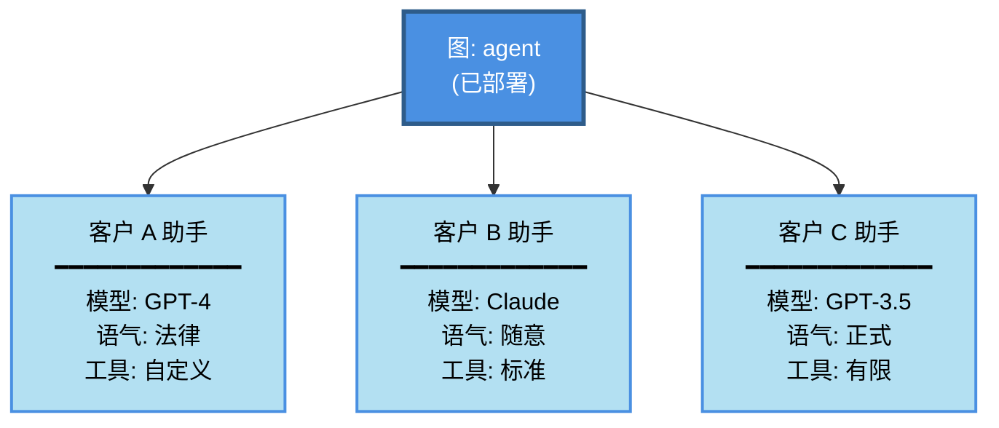
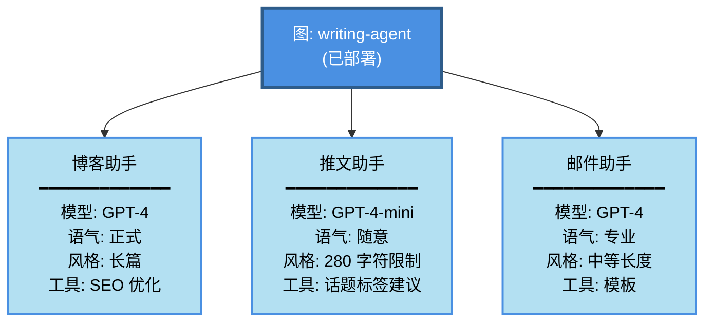
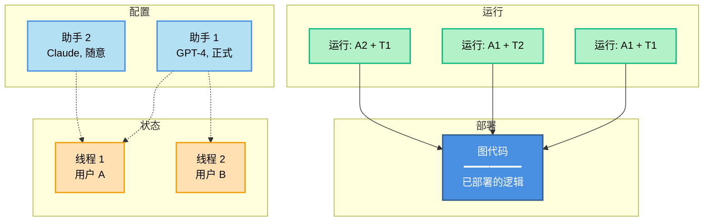

_助手（Assistants）_ 允许您将配置（例如，提示词、LLM 选择、工具）与您图（graph）的核心逻辑分离开来管理。这使得您可以使用**相同的图架构**创建多个**专业化**的版本，并在运行时表现出不同的行为。通过配置的变化（而不是结构性的图修改），每个助手都可以针对不同的 [使用场景](#when-to-use-assistants) 进行优化。

例如，想象一个基于通用图架构构建的通用写作代理。虽然结构保持不变，但不同的写作风格——比如博客文章和推文——需要定制化的配置来优化性能。为了支持这些变化，您可以创建多个助手（例如，一个用于博客，另一个用于推文），它们共享底层的图结构，但在模型选择和系统提示词上存在差异。


Agent Server API 提供了一些端点用于创建和管理助手及其版本。有关更多详细信息，请参阅 [API 参考](/langsmith/server-api-ref)。

<Info>
助手是 [LangSmith 部署](/langsmith/deployments) 的一个概念。它在开源的 LangGraph 库中不可用。
</Info>

## 何时使用助手

当您需要在具有不同配置的情况下部署相同的图架构时，助手是理想的选择。常见的用例包括：

- **用户级别的个性化**
  - 为每个用户定制模型选择、系统提示词或工具可用性。
  - 存储用户偏好并自动应用于每次交互。
  - 允许用户在不同的 AI 个性或专业水平之间进行选择。

- **特定于客户或组织的配置**
  - 为不同的客户或组织维护独立的配置。
  - 在不部署单独基础设施的情况下，为每个客户定制行为。
  - 将配置更改隔离到特定客户。



- **特定于环境的配置**
  - 为开发、测试（staging）和生产环境使用不同的模型或设置。
  - 在推广到生产环境之前，先在测试环境中测试配置更改。
  - 在非生产环境中，可以使用更小的模型来降低成本。

- **A/B 测试和实验**
  - 比较不同的提示词、模型或参数设置。
  - 逐步向用户子集推出配置更改。
  - 衡量不同配置变体之间的性能差异。

- **专业化的任务变体**
  - 创建通用代理的特定领域版本。
  - 针对不同的语言、地区或行业优化配置。
  - 在保持图逻辑一致的同时，改变执行细节。



## 助手如何与部署协同工作

当您使用 LangSmith Deployment 部署一个图时，[Agent Server](/langsmith/agent-server) 会自动创建一个**默认助手**，并将其绑定到该图的默认配置。然后，您可以为同一图创建额外的助手，每个助手都有自己的配置。

如果您的部署在 [`langgraph.json`](/langmsith/application-structure#configuration-file) 中定义了多个图，每个图都会获得自己的默认助手：

```json
{
    "graphs": {
        "graph_id_1": "path_to_graph_id_1",  // 为 graph_id_1 创建默认助手
        "graph_id_2": "path_to_graph_id_2"   // 为 graph_id_2 创建默认助手
    }
}
```

也就是说，可以有多个默认助手——针对您部署中定义的每个图各有一个。

助手具有以下几个关键特性：

- **[通过 API 和 UI 管理](/langsmith/configuration-cloud)**：使用 Agent Server/LangGraph SDK 或 [LangSmith UI](https://smith.langchain.com) 创建、列出、更新、版本化和获取助手。
- **一个图，多个助手**：单个已部署的图可以支持多个助手，每个助手具有不同的配置（例如：提示词、模型、工具）。
- **[配置的版本控制](#versioning)**：每个助手通过版本控制来维护其配置历史。编辑助手会创建一个新版本，您可以提升（promote）或回滚（roll back）到任何版本。
- **无需更改图即可更新配置**：通过助手配置更新提示词、模型选择和其他设置，从而无需修改或重新部署图代码即可快速迭代。

<Note>
调用助手时，您可以在 [`langgraph.json`](/langsmith/application-structure#configuration-file) 中指定：
- **图 ID**（例如：`"agent"`）：使用该图的默认助手
- **助手 ID**（UUID）：使用特定的助手配置

这种灵活性允许您快速使用默认设置进行测试，或精确控制所使用的配置。
</Note>

### 配置（Configuration）

助手基于 LangGraph 开源库中的 [配置](/oss/python/langgraph/graph-api#runtime-context) 概念构建。

虽然配置在开源 LangGraph 库中可用，但助手仅存在于 [LangSmith 部署](/langsmith/deployments) 中，因为它们与您已部署的图紧密耦合。部署后，[Agent Server](/langsmith/agent-server) 会自动为每个图使用其默认配置设置创建一个默认助手。

实际上，一个助手只是具有特定配置的图的**一个实例**。因此，多个助手可以引用同一个图，但包含不同的配置（例如：提示词、模型、工具）。LangSmith Deployment API 提供了多个端点用于创建和管理助手。有关如何创建助手的更多详细信息，请参阅 [API 参考](/langsmith/server-api-ref) 和 [此指南](/langsmith/configuration-cloud)。

### 版本控制（Versioning）

助手支持版本控制，以便跟踪随时间发生的变化。创建助手后，后续的编辑会自动创建新版本。

- 每次更新都会创建一个助手的新版本。
- 您可以将任何版本提升为当前活动版本。
- 回滚到以前的版本就像将其设置为活动版本一样简单。
- 所有版本都可供参考和回滚。

<Warning>
更新助手时，您必须提供**完整的配置负载**。更新端点是从头创建新版本，不会与以前的版本合并。请确保包含所有您想要保留的配置字段。
</Warning>

有关如何管理助手版本的更多详细信息，请参阅 [管理助手指南](/langsmith/configuration-cloud#create-a-new-version-for-your-assistant)。

### 执行（Execution）

**运行（Run）** 是对助手的调用。当您执行一次运行（run）时，您需要指定使用哪个助手（可以通过图 ID 指定默认助手，或通过助手 ID 指定特定配置）。



此图展示了**运行（run）**如何结合一个助手和一个线程来执行图：

- **图 (蓝色)**：包含您的代理逻辑的已部署代码
- **助手 (浅蓝色)**：配置选项（模型、提示词、工具）
- **线程 (橙色)**：用于对话历史的状态容器
- **运行 (绿色)**：将助手 + 线程配对的可执行实例

**组合示例：**
- **运行: A1 + T1**：将助手 1 的配置应用于用户 A 的对话
- **运行: A1 + T2**：同一个助手服务于用户 B（不同的对话）
- **运行: A2 + T1**：将不同的助手应用于用户 A 的对话（配置切换）

在执行运行（run）时：

- 每个运行可以有自己的输入、配置覆盖和元数据。
- 运行可以是无状态的（没有线程）或有状态的（在 [线程](/oss/python/langgraph/persistence#threads) 上执行以持久化对话历史）。
- 多个运行可以使用相同的助手配置。
- 助手的配置会影响底层图的执行方式。

Agent Server API 提供了用于创建和管理运行的多个端点。有关更多详细信息，请参阅 [API 参考](/langsmith/server-api-ref))。

## 视频指南

<iframe
  className="w-full aspect-video rounded-xl"
  src="https://www.youtube.com/embed/fMsQX6pwXkE?si=6Q28l0taGOynO7sU"
  title="YouTube video player"
  frameBorder="0"
  allow="accelerometer; autoplay; clipboard-write; encrypted-media; gyroscope; picture-in-picture"
  allowFullScreen
></iframe>

---

<Callout icon="pen-to-square" iconType="regular">
    [Edit the source of this page on GitHub.](https://github.com/langchain-ai/docs/edit/main/src/langsmith\assistants.mdx)
</Callout>
<Tip icon="terminal" iconType="regular">
    [Connect these docs programmatically](/use-these-docs) to Claude, VSCode, and more via MCP for real-time answers.
</Tip>
