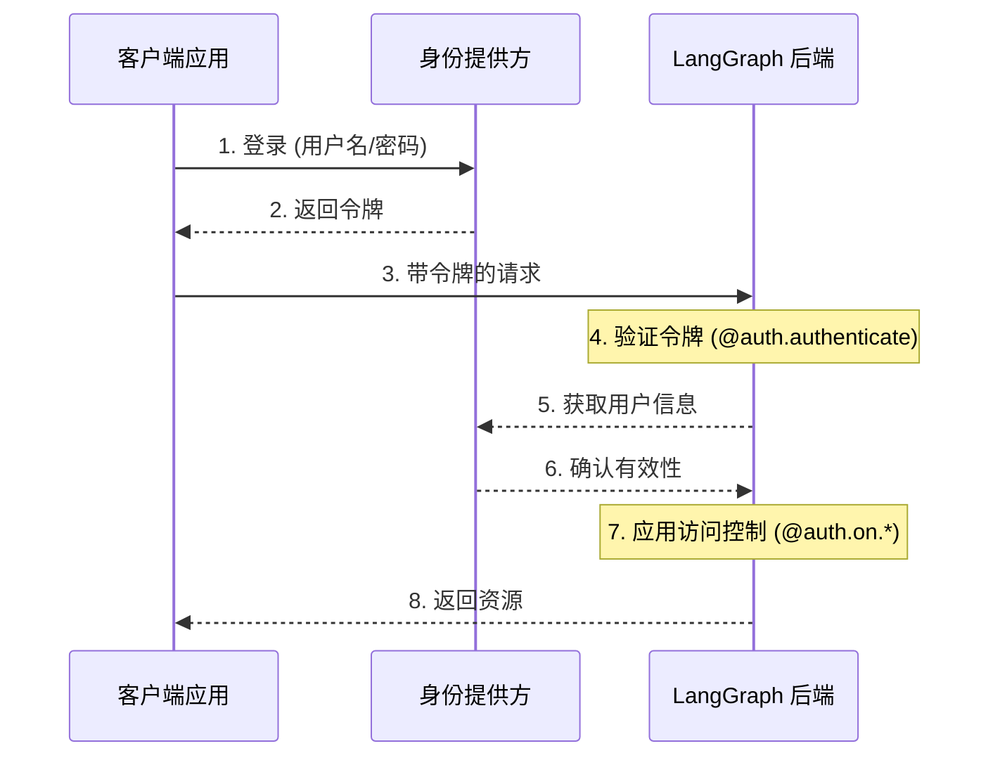
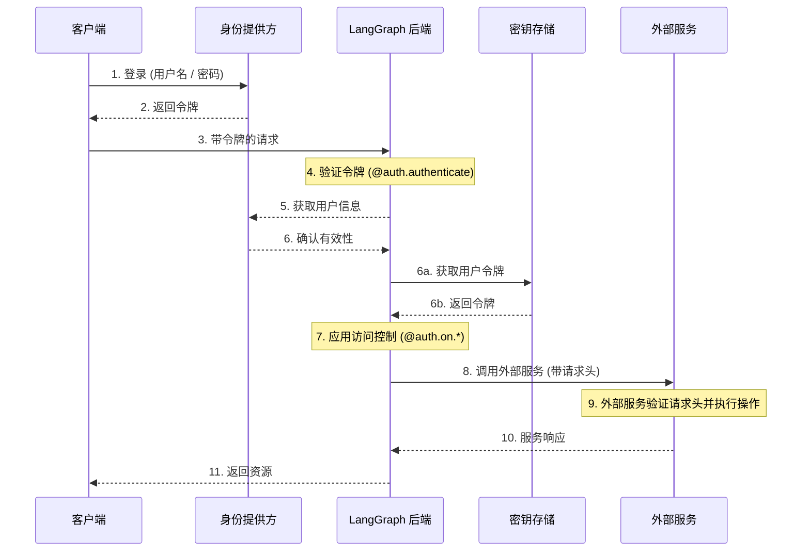

LangSmith 提供了一个灵活的认证和授权系统，可以与大多数身份验证方案集成。

## 核心概念

### 认证 (Authentication) vs 授权 (Authorization)

虽然这两个术语经常互换使用，但它们代表了截然不同的安全概念：

* [**认证 (Authentication)**](#authentication)（简称 "AuthN"）用于验证“你是谁”。这作为中间件对所有请求运行。
* [**授权 (Authorization)**](#authorization)（简称 "AuthZ"）用于确定“你能做什么”。这会根据资源对用户的权限和角色进行验证。

在 LangSmith 中，身份验证由您的 [`@auth.authenticate`](https://reference.langchain.com/python/langsmith/deployment/sdk/#langgraph_sdk.auth.Auth.authenticate) 处理程序处理，而授权由您的 [`@auth.on`](https://reference.langchain.com/python/langsmith/deployment/sdk/#langgraph_sdk.auth.Auth.on) 处理程序处理。

## 默认安全模型

LangSmith 提供不同的安全默认设置：

### LangSmith

* 默认使用 LangSmith API 密钥
* 要求在 `x-api-key` 请求头中提供有效的 API 密钥
* 可以使用您的自定义身份验证处理程序进行定制

<Note>
**自定义身份验证**
LangSmith 支持所有计划的自定义身份验证。
</Note>

### 自托管 (Self-hosted)

* 没有默认身份验证
* 完全灵活，可实现您自己的安全模型
* 您控制身份验证和授权的所有方面

## 系统架构

典型的身份验证设置涉及三个主要组件：

1. **身份提供方 (Authentication Provider) / IdP**
  * 一个专门管理用户身份和凭证的服务
  * 处理用户注册、登录、密码重置等
  * 在身份验证成功后签发令牌（JWT、会话令牌等）
  * 示例：Auth0、Supabase Auth、Okta 或您自己的身份验证服务器
2. **LangGraph 后端 (Resource Server)**（资源服务器）
  * 包含业务逻辑和受保护资源的 LangGraph 应用程序
  * 使用身份提供方验证令牌
  * 根据用户身份和权限强制执行访问控制
  * 不直接存储用户凭证
3. **客户端应用程序 (Client Application)**（前端）
  * Web 应用、移动应用或 API 客户端
  * 收集时效性用户凭证并发送给身份提供方
  * 从身份提供方接收令牌
  * 在发往 LangGraph 后端的请求中包含这些令牌

以下是这些组件的典型交互方式：



LangGraph 中的 [`@auth.authenticate`](https://reference.langchain.com/python/langsmith/deployment/sdk/#langgraph_sdk.auth.Auth.authenticate) 处理程序负责步骤 4-6，而 [`@auth.on`](https://reference.langchain.com/python/langsmith/deployment/sdk/#langgraph_sdk.auth.Auth.on) 处理程序负责实现步骤 7。

## 身份验证 (Authentication)

LangGraph 中的身份验证作为中间件在每次请求上运行。您的 [`@auth.authenticate`](https://reference.langchain.com/python/langsmith/deployment/sdk/#langgraph_sdk.auth.Auth.authenticate) 处理程序会接收请求信息，并且应该：

1. 验证凭证
2. 如果有效，返回包含用户身份和信息的 [用户信息](https://reference.langchain.com/python/langsmith/deployment/sdk/#langgraph_sdk.auth.types.MinimalUserDict)
3. 如果无效，抛出 [HTTP 异常](https://reference.langchain.com/python/langsmith/deployment/sdk/#langgraph_sdk.auth.exceptions.HTTPException) 或 AssertionError

```python
from langgraph_sdk import Auth

auth = Auth()

@auth.authenticate
async def authenticate(headers: dict) -> Auth.types.MinimalUserDict:
    # 验证凭证 (例如 API 密钥、JWT 令牌)
    api_key = headers.get(b"x-api-key")
    if not api_key or not is_valid_key(api_key):
        raise Auth.exceptions.HTTPException(
            status_code=401,
            detail="无效的 API 密钥"
        )

    # 返回用户信息 - 只需要 identity 和 is_authenticated 字段
    # 添加您需要的任何额外字段以供授权使用
    return {
        "identity": "user-123",        # 必需: 唯一的身份标识符
        "is_authenticated": True,      # 可选: 默认假定为 True
        "permissions": ["read", "write"] # 可选: 用于基于权限的授权
        # 如果您想实现其他认证模式，可以添加更多自定义字段
        "role": "admin",
        "org_id": "org-456"

    }
```

返回的用户信息可在以下位置获取：

* 授权处理程序中，通过 [`ctx.user`](https://reference.langchain.com/python/langsmith/deployment/sdk/#langgraph_sdk.auth.types.AuthContext)
* 在您的应用程序中，通过 `config["configuration"]["langgraph_auth_user"]`

<Accordion title="支持的参数">
  [`@auth.authenticate`](https://reference.langchain.com/python/langsmith/deployment/sdk/#langgraph_sdk.auth.Auth.authenticate) 处理程序可以通过名称接受以下任何参数：

  * request (Request): 原生 ASGI 请求对象
  * path (str): 请求路径，例如 `"/threads/abcd-1234-abcd-1234/runs/abcd-1234-abcd-1234/stream"`
  * method (str): HTTP 方法，例如 `"GET"`
  * path_params (dict[str, str]): URL 路径参数，例如 `{"thread_id": "abcd-1234-abcd-1234", "run_id": "abcd-1234-abcd-1234"}`
  * query_params (dict[str, str]): URL 查询参数，例如 `{"stream": "true"}`
  * headers (dict[bytes, bytes]): 请求头
  * authorization (str | None): Authorization 请求头的值（例如 `"Bearer <token>"`）

  在我们许多教程中，为了简洁，我们只展示 "authorization" 参数，但您可以根据需要选择接受更多信息来实现自定义身份验证方案。
</Accordion>

### 智能体身份验证 (Agent authentication)

自定义身份验证允许委托访问。您在 `@auth.authenticate` 中返回的值会被添加到运行上下文中，为智能体提供用户范围的凭证，使其能够代表用户访问资源。



身份验证后，平台会创建一个特殊的配置对象，该对象会传递给您的图表和所有节点（通过可配置上下文）。此对象包含当前用户信息，包括您从 [`@auth.authenticate`](https://reference.langchain.com/python/langsmith/deployment/sdk/#langgraph_sdk.auth.Auth.authenticate) 处理程序返回的任何自定义字段。

要使智能体能够代表用户执行操作，请使用[自定义身份验证中间件](/langsmith/custom-auth)。这将允许智能体与外部系统（如 MCP 服务器、外部数据库，甚至其他智能体）代表用户进行交互。

有关更多信息，请参阅[使用自定义身份验证](/langsmith/custom-auth)指南。

### 使用 MCP 的智能体身份验证

有关如何向 MCP 服务器验证智能体身份的信息，请参阅[MCP 概念指南](/oss/python/langchain/mcp)。

## 授权 (Authorization)

身份验证之后，LangGraph 会调用您的 [`@auth.on`](https://reference.langchain.com/python/langsmith/deployment/sdk/#langgraph_sdk.auth.Auth) 处理程序来控制对特定资源的访问（例如，线程、助手、定时任务）。这些处理程序可以：

1. 通过直接修改 `value["metadata"]` 字典，向资源创建期间保存的元数据中添加元数据。有关每个操作中 `value` 可以采取的类型的列表，请参阅[支持的操作表](#supported-actions)。
2. 通过返回一个[筛选器字典](#filter-operations)，在搜索/列表或读取操作期间筛选资源元数据。
3. 如果拒绝访问，则抛出 HTTP 异常。

如果您只想实现简单的用户范围的访问控制，可以为所有资源和操作使用单个 [`@auth.on`](https://reference.langchain.com/python/langsmith/deployment/sdk/#langgraph_sdk.auth.Auth) 处理程序。如果您希望根据资源和操作有所不同，可以使用[资源特定的处理程序](#resource-specific-handlers)。有关支持访问控制的资源完整列表，请参阅[支持的资源](#supported-resources)部分。

```python
@auth.on
async def add_owner(
    ctx: Auth.types.AuthContext,
    value: dict  # 发送到此访问方法的请求负载
) -> dict:  # 返回一个限制资源访问的筛选器字典
    """授权对线程、运行、定时任务和助手的全部访问。

    此处理程序执行两项操作：
        - 向资源元数据添加一个值（以便它与资源一起持久化，以便可以稍后进行筛选）
        - 返回一个筛选器（以限制对现有资源的访问）

    Args:
        ctx: 包含用户信息、权限、路径和
        value: 发送到端点的请求负载。对于创建操作，它包含资源参数。对于读取操作，它包含正在访问的资源。

    Returns:
        一个 LangGraph 用于限制资源访问的筛选器字典。
        有关支持的运算符，请参阅[筛选操作](#filter-operations)。
    """
    # 创建筛选器，将访问限制给该用户自己的资源
    filters = {"owner": ctx.user.identity}

    # 获取或创建负载中的元数据字典
    # 这是存储资源持久性信息的地方
    metadata = value.setdefault("metadata", {})

    # 添加所有者到元数据 - 如果是创建或更新操作，
    # 此信息将与资源一起保存
    # 这样我们可以在读取操作中按其进行筛选
    metadata.update(filters)

    # 返回用于限制访问的筛选器
    # 这些筛选器应用于 ALL 操作（创建、读取、更新、搜索等）
    # 以确保用户只能访问他们自己的资源
    return filters
```

<a id="resource-specific-handlers"></a>
### 资源特定的处理程序

您可以通过链接资源名称和操作名称与 [`@auth.on`](https://reference.langchain.com/python/langsmith/deployment/sdk/#langgraph_sdk.auth.Auth) 装饰器来注册针对特定资源和操作的处理程序。当发出请求时，匹配该资源和操作的最具体的处理程序将被调用。下面是如何注册针对特定资源和操作的处理程序的示例。对于以下设置：

1. 经过身份验证的用户可以创建线程、读取线程以及在线程上创建运行
2. 只有具有 "assistants:create" 权限的用户才允许创建新的助手
3. 所有其他端点（例如，删除助手、定时任务、存储）对所有用户禁用。

<Tip>
**支持的处理程序**
有关支持的资源和操作的完整列表，请参阅下面的[支持的资源](#supported-resources)部分。
</Tip>

```python
# 通用/全局处理程序会捕获未被更具体处理程序处理的调用
@auth.on
async def reject_unhandled_requests(ctx: Auth.types.AuthContext, value: Any) -> False:
    print(f"对 {ctx.path} 的请求，由 {ctx.user.identity} 发出")
    raise Auth.exceptions.HTTPException(
        status_code=403,
        detail="禁止访问"
    )

# 匹配 "thread" 资源和所有操作 - 创建、读取、更新、删除、搜索
# 由于这比通用的 @auth.on 处理程序**更具体**，因此它将覆盖通用处理程序
# 针对 "threads" 资源的所有操作
@auth.on.threads
async def on_thread(
    ctx: Auth.types.AuthContext,
    value: Auth.types.threads.create.value
):
    # 在正在创建的线程元数据上设置
    # 将确保资源包含 "owner" 字段
    # 然后任何时候用户尝试访问此线程或其内部运行，
    # 我们都可以按所有者进行筛选
    metadata = value.setdefault("metadata", {})
    metadata["owner"] = ctx.user.identity
    return {"owner": ctx.user.identity}


# 线程创建。这将仅匹配线程创建操作
# 由于这比通用的 @auth.on 处理程序和 @auth.on.threads 处理程序**更具体**，
# 它将优先于针对 "threads" 资源的任何 "create" 操作
@auth.on.threads.create
async def on_thread_create(
    ctx: Auth.types.AuthContext,
    value: Auth.types.threads.create.value
):
    # 如果用户没有写入权限，则拒绝
    if "write" not in ctx.permissions:
        raise Auth.exceptions.HTTPException(
            status_code=403,
            detail="用户缺乏所需的权限。"
        )
    # 在正在创建的线程元数据上设置
    # 将确保资源包含 "owner" 字段
    # 然后任何时候用户尝试访问此线程或其内部运行，
    # 我们都可以按所有者进行筛选
    metadata = value.setdefault("metadata", {})
    metadata["owner"] = ctx.user.identity
    return {"owner": ctx.user.identity}

# 读取线程。由于这也比通用的 @auth.on 处理程序和 @auth.on.threads 处理程序更具体，
# 它将优先于 "threads" 资源的任何 "read" 操作
@auth.on.threads.read
async def on_thread_read(
    ctx: Auth.types.AuthContext,
    value: Auth.types.threads.read.value
):
    # 由于我们正在读取（而不是创建）一个线程，
    # 我们不需要设置元数据。我们只需要
    # 返回一个筛选器以确保用户只能看到他们自己的线程
    return {"owner": ctx.user.identity}

# 运行创建、流式传输、更新等。
# 这优先于通用的 @auth.on 处理程序和 @auth.on.threads 处理程序
@auth.on.threads.create_run
async def on_run_create(
    ctx: Auth.types.AuthContext,
    value: Auth.types.threads.create_run.value
):
    metadata = value.setdefault("metadata", {})
    metadata["owner"] = ctx.user.identity
    # 继承线程的访问控制
    return {"owner": ctx.user.identity}

# 助手创建
@auth.on.assistants.create
async def on_assistant_create(
    ctx: Auth.types.AuthContext,
    value: Auth.types.assistants.create.value
):
    if "assistants:create" not in ctx.permissions:
        raise Auth.exceptions.HTTPException(
            status_code=403,
            detail="用户缺乏所需的权限。"
        )
```

请注意，我们在上面的示例中混合使用了全局和特定于资源的全局处理程序。由于每个请求都由最具体的处理程序处理，对 `thread` 的创建请求将匹配 `on_thread_create` 处理程序，但 NOT `reject_unhandled_requests` 处理程序。然而，对线程的 `update` 请求将由全局处理程序处理，因为我们没有针对该资源和操作的更具体的处理程序。

<a id="filter-operations"></a>
### 筛选操作 (Filter operations)

授权处理程序可以返回 `None`、布尔值或筛选器字典。

* `None` 和 `True` 表示“授权访问所有底层资源”
* `False` 表示“拒绝访问所有底层资源（抛出 403 异常）”
* 元数据筛选器字典将限制对资源的访问

筛选器字典是一个字典，其键与资源元数据匹配。它支持三种运算符：

* 默认值是精确匹配的简写，即下文中的“`$eq`”。例如，`{"owner": user_id}` 将只包含元数据中包含 `{"owner": user_id}` 的资源
* `$eq`: 精确匹配（例如 `{"owner": {"$eq": user_id}}`）——这等同于简写 `{"owner": user_id}`
* `$contains`: 列表成员资格（例如 `{"allowed_users": {"$contains": user_id}}`）或列表包含（例如 `{"allowed_users": {"$contains": [user_id_1, user_id_2]}}`）。这里的值必须是列表中的一个元素或列表的子集，分别对应。存储在元数据中的值必须是列表/容器类型。

具有多个键的字典使用逻辑 `AND` 筛选器进行处理。例如，`{"owner": org_id, "allowed_users": {"$contains": user_id}}` 将只匹配元数据中 "owner" 为 `org_id` 且 "allowed_users" 列表中包含 `user_id` 的资源。
有关更多信息，请参阅 [`Auth`](https://reference.langchain.com/python/langsmith/deployment/sdk/#langgraph_sdk.auth.Auth)(Auth) 引用。

## 常见访问模式

以下是一些典型的授权模式：

### 单一所有者资源 (Single-owner resources)

这种常见模式允许您将所有线程、助手、定时任务和运行范围限定为单个用户。这对于常规聊天机器人应用等单用户用例非常有用。

```python
@auth.on
async def owner_only(ctx: Auth.types.AuthContext, value: dict):
    metadata = value.setdefault("metadata", {})
    metadata["owner"] = ctx.user.identity
    return {"owner": ctx.user.identity}
```

### 基于权限的访问 (Permission-based access)

这种模式允许您根据**权限**控制访问。如果您希望某些角色对资源的访问范围更广或更受限制，这非常有用。

```python
# 在您的身份验证处理程序中：
@auth.authenticate
async def authenticate(headers: dict) -> Auth.types.MinimalUserDict:
    ...
    return {
        "identity": "user-123",
        "is_authenticated": True,
        "permissions": ["threads:write", "threads:read"]  # 在 auth 中定义权限
    }

def _default(ctx: Auth.types.AuthContext, value: dict):
    metadata = value.setdefault("metadata", {})
    metadata["owner"] = ctx.user.identity
    return {"owner": ctx.user.identity}

@auth.on.threads.create
async def create_thread(ctx: Auth.types.AuthContext, value: dict):
    if "threads:write" not in ctx.permissions:
        raise Auth.exceptions.HTTPException(
            status_code=403,
            detail="未授权"
        )
    return _default(ctx, value)


@auth.on.threads.read
async def rbac_create(ctx: Auth.types.AuthContext, value: dict):
    if "threads:read" not in ctx.permissions and "threads:write" not in ctx.permissions:
        raise Auth.exceptions.HTTPException(
            status_code=403,
            detail="未授权"
        )
    return _default(ctx, value)
```

## 支持的资源 (Supported resources)

LangGraph 提供三个级别的授权处理程序，从最通用到最具体：

1. **全局处理程序** (`@auth.on`): 匹配所有资源和操作
2. **资源处理程序**（例如 `@auth.on.threads`、`@auth.on.assistants`、`@auth.on.crons`）：匹配特定资源的所有操作
3. **操作处理程序**（例如 `@auth.on.threads.create`、`@auth.on.threads.read`）：匹配特定资源上的特定操作

将使用匹配度最高的处理程序。例如，`@auth.on.threads.create` 优先于 `_on.threads`（用于线程创建）处理程序。如果注册了更具体的处理程序，则更通用的处理程序不会针对该资源和操作被调用。

<Tip>
“类型安全”
每个处理程序都可以在其 `value` 参数下通过 `Auth.types.on.<resource>.<action>.value` 获得类型提示。例如：

```python
@auth.on.threads.create
async def on_thread_create(
ctx: Auth.types.AuthContext,
value: Auth.types.on.threads.create.value  # 线程创建的具体类型
):
...

@auth.on.threads
async def on_threads(
ctx: Auth.types.AuthContext,
value: Auth.types.on.threads.value  # 所有线程操作的联合类型
):
...

@auth.on
async def on_all(
ctx: Auth.types.AuthContext,
value: dict  # 所有可能操作的联合类型
):
...
```

越具体的处理程序提供的类型提示越好，因为它们处理的动作类型更少。
</Tip>

<a id="supported-actions"></a>
#### 支持的操作和类型

以下是所有支持的操作处理程序：

| 资源 | 处理程序 | 描述 | 值类型 |
|---|---|---|---|
| **线程 (Threads)** | `@auth.on.threads.create` | 线程创建 | [`ThreadsCreate`](https://reference.langchain.com/python/langsmith/deployment/sdk/#langgraph_sdk.auth.types.ThreadsCreate) |
| | `@auth.on.threads.read` | 线程检索 | [`ThreadsRead`](https://reference.langchain.com/python/langsmith/deployment/sdk/#langgraph_sdk.auth.types.ThreadsRead) |
| | `@auth.on.threads.update` | 线程更新 | [`ThreadsUpdate`](https://reference.langchain.com/python/langsmith/deployment/sdk/#langgraph_sdk.auth.types.ThreadsUpdate) |
| | `@auth.on.threads.delete` | 线程删除 | [`ThreadsDelete`](https://reference.langchain.com/python/langsmith/deployment/sdk/#langgraph_sdk.auth.types.ThreadsDelete) |
| | `@auth.on.threads.search` | 列出线程 | [`ThreadsSearch`](https://reference.langchain.com/python/langsmith/deployment/sdk/#langgraph_sdk.auth.types.ThreadsSearch) |
| | `@auth.on.threads.create_run` | 创建或更新运行 | [`RunsCreate`](https://reference.langchain.com/python/langsmith/deployment/sdk/#langgraph_sdk.auth.types.RunsCreate) |
| **助手 (Assistants)** | `@auth.on.assistants.create` | 助手创建 | [`AssistantsCreate`](https://reference.langchain.com/python/langsmith/deployment/sdk/#langgraph_sdk.auth.types.AssistantsCreate) |
| | `@auth.on.assistants.read` | 助手检索 | [`AssistantsRead`](https://reference.langchain.com/python/langsmith/deployment/sdk/#langgraph_sdk.auth.types.AssistantsRead) |
| | `@auth.on.assistants.update` | 助手更新 | [`AssistantsUpdate`](https://reference.langchain.com/python/langsmith/deployment/sdk/#langgraph_sdk.auth.types.AssistantsUpdate) |
| | `@auth.on.assistants.delete` | 助手删除 | [`AssistantsDelete`](https://reference.langchain.com/python/langsmith/deployment/sdk/#langgraph_sdk.auth.types.AssistantsDelete) |
| | `@auth.on.assistants.search` | 列出助手 | [`AssistantsSearch`](https://reference.langchain.com/python/langsmith/deployment/sdk/#langgraph_sdk.auth.types.AssistantsSearch) |
| **定时任务 (Crons)** | `@auth.on.crons.create` | 定时任务创建 | [`CronsCreate`](https://reference.langchain.com/python/langsmith/deployment/sdk/#langgraph_sdk.auth.types.CronsCreate) |
| | `@auth.on.crons.read` | 定时任务检索 | [`CronsRead`](https://reference.langchain.com/python/langsmith/deployment/sdk/#langgraph_sdk.auth.types.CronsRead) |
| | `@auth.on.crons.update` | 定时任务更新 | [`CronsUpdate`](https://reference.langchain.com/python/langsmith/deployment/sdk/#langgraph_sdk.auth.types.CronsUpdate) |
| | `@auth.on.crons.delete` | 定时任务删除 | [`CronsDelete`](https://reference.langchain.com/python/langsmith/deployment/sdk/#langgraph_sdk.auth.types.CronsDelete) |
| | `@auth.on.crons.search` | 列出定时任务 | [`CronsSearch`](https://reference.langchain.com/python/langsmith/deployment/sdk/#langgraph_sdk.auth.types.CronsSearch) |

<Note>
"关于运行 (Runs)"

运行的访问控制作用域限定于其父线程。这意味着权限通常从线程继承，反映了数据的对话式数据模型。除创建外，所有运行操作（读取、列出）都由线程的处理程序控制。
有一个专门的 `create_run` 处理程序用于创建新运行，因为它具有更多您可以在处理程序中查看的参数。
</Note>

##后续步骤 (Next steps)

有关实施细节：

* 查阅有关[设置身份验证](/langsmith/set-up-custom-auth)的入门教程
* 查看有关实现[自定义身份验证处理程序](/langsmith/custom-auth)的操作指南

---

<Callout icon="pen-to-square" iconType="regular">
    [Edit the source of this page on GitHub.](https://github.com/langchain-ai/docs/edit/main/src/langsmith\auth.mdx)
</Callout>
<Tip icon="terminal" iconType="regular">
    [Connect these docs programmatically](/use-these-docs) to Claude, VSCode, and more via MCP for real-time answers.
</Tip>
