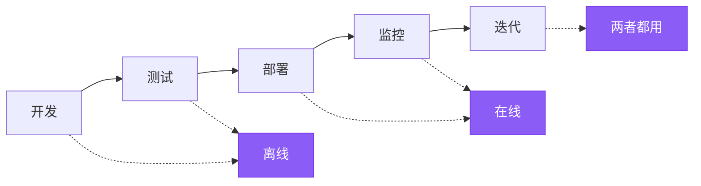

LLM 的输出是非确定性的，这使得响应质量难以评估。评估（Evals）是一种分解“什么是好的”并衡量它的方法。LangSmith 评估提供了一个框架，用于在整个应用程序生命周期中衡量质量，从部署前测试到生产监控。

## 评估什么

在构建评估之前，请确定对您的应用程序什么最重要。将系统分解为关键组件——LLM 调用、检索步骤、工具调用、输出格式化——并为每个组件确定质量标准。

**从手动策划的示例开始。** 为每个关键组件创建 5-10 个“好”的示例。这些示例作为您的“黄金标准”（ground truth），并指导您使用哪种评估方法。例如：
- **RAG 系统**：良好检索（相关文档）和良好答案（准确、完整）的示例。
- **Agent（代理）**：正确工具选择、正确参数格式化或 Agent 所采取的轨迹的示例。
- **Chatbot（聊天机器人）**：有帮助的、符合品牌调性的并能解决用户意图的响应示例。

一旦您通过示例定义了“好”的标准，您就可以衡量系统产生相似质量输出的频率。

## 离线评估与在线评估

LangSmith 支持两种类型的评估，它们在开发工作流程中服务于不同的目的：

### 离线评估（Offline evaluations）

<Icon icon="flask" iconType="solid" /> 将离线评估用于**部署前测试**：
- **基准测试（Benchmarking）**：比较多个版本以找到性能最佳者。
- **回归测试（Regression testing）**：确保新版本不会导致质量下降。
- **单元测试（Unit testing）**：验证单个组件的正确性。
- **回溯测试（Backtesting）**：使用历史数据测试新版本。

离线评估针对的是来自 [_数据集_](#datasets) 的 [_示例_](#examples)—这些是经过策划的测试用例，包含定义“好”的标准参考输出。

### 在线评估（Online evaluations）

<Icon icon="radar" iconType="solid" /> 将在线评估用于**生产监控**：
- **实时监控（Real-time monitoring）**：在实时流量上持续跟踪质量。
- **异常检测（Anomaly detection）**：标记不寻常的模式或边缘情况。
- **生产反馈（Production feedback）**：识别需要添加到离线数据集中的问题。

在线评估针对的是来自 [Tracing](/langsmith/observability-quickstart)（没有参考输出的实际生产跟踪）的 [_运行_](#runs) 和 [_线程_](#threads)。

目标上的这种差异决定了您可以评估的内容：离线评估可以根据预期答案检查正确性，而在线评估则侧重于质量模式、安全性和真实世界的行为。

## 评估生命周期

随着您开发和 [部署应用程序](/langsmith/deployments)，您的评估策略会从部署前测试演变为生产监控。在开发和测试期间，离线评估根据策划的数据集验证功能。部署后，在线评估会监控生产流量上的行为。随着应用程序的成熟，这两种评估类型会在迭代反馈循环中协同工作，以持续提高质量。

### 1. 使用离线评估进行开发

在生产部署之前，使用离线评估来验证功能、对不同方法进行基准测试并建立信心。

按照 [快速入门](/langsmith/evaluation-quickstart) 来运行您的第一次离线评估。

### 2. 使用在线评估进行初始部署

部署后，使用在线评估来监控生产质量、检测意外问题并收集真实世界数据。

了解如何 [为生产监控配置在线评估](/langsmith/online-evaluations)。

### 3. 持续改进

在迭代反馈循环中使用这两种评估类型。在线评估发现的问题会成为离线测试用例，离线评估验证修复情况，在线评估确认生产中的改进。

## 核心评估目标

评估运行在不同的目标上，这取决于它们是离线评估还是在线评估。

### 离线评估的目标

离线评估在数据集和示例上运行。参考输出的存在使得可以比较预期结果和实际结果。

#### 数据集（Datasets）

数据集是用于评估应用程序的**示例集合**。一个示例是一个测试输入与参考输出对。

#### 示例（Examples）

每个示例包括：

- **Inputs（输入）**：一个字典，包含要传递给应用程序的输入变量。
- **Reference outputs（参考输出）**（可选）：一个字典，包含参考输出。这些不会传递给您的应用程序，仅供评估器使用。
- **Metadata（元数据）**（可选）：一个字典，包含可用于创建数据集过滤视图的附加信息。

了解更多关于 [管理数据集](/langsmith/manage-datasets) 的信息。

#### 实验（Experiment）

一个**实验**代表在特定数据集上评估特定应用程序版本的[^1]结果。每个实验捕获数据集中每个示例的输出、评估器分数和执行跟踪。

通常会在给定数据集上运行多个实验，以测试不同的应用程序配置（例如，不同的提示或 LLM）。LangSmith 会显示与数据集相关的所有实验，并支持将 [多个实验并排比较](/langsmith/compare-experiment-results)。

了解 [如何分析实验结果](/langsmith/analyze-an-experiment)。

### 在线评估的目标

在线评估在来自生产流量的运行和线程上运行。由于没有参考输出，评估器专注于实时检测问题、异常和质量下降。

#### 运行（Runs）

**运行**是来自您 [部署的应用程序](/langsmith/deployments) 的单个执行跟踪。每个运行包含：
- **Inputs（输入）**：应用程序收到的实际用户输入。
- **Outputs（输出）**：应用程序实际返回的内容。
- **Intermediate steps（中间步骤）**：所有子运行（工具调用、LLM 调用等）。
- **Metadata（元数据）**：标签、用户反馈、延迟指标等。

与数据集中的示例不同，运行不包含参考输出。在线评估器必须在不知道“正确”答案是什么的情况下评估质量，而是依赖于质量启发式方法、安全检查和无参考评估技术。

了解更多关于 [可观察性概念中的运行和跟踪](/langsmith/observability-concepts#runs)。

#### 线程（Threads）

**线程**是代表多轮对话的相关运行的集合。在线评估器可以在线程级别运行，以评估整个对话，而不是单个回合。这使得可以评估对话级别的属性，例如跨回合的一致性、主题维护以及用户在整个交互过程中的满意度。

## 评估器（Evaluators）

**评估器**是为应用程序性能打分的函数。它们为离线和在线评估提供衡量层，并根据可用数据调整其输入。

您可以使用 LangSmith SDK（[Python](https://docs.smith.langchain.com/reference/python/reference) 和 [TypeScript](https://docs.smith.langchain.com/reference/js)）、通过 [提示游乐场](/langsmith/observability-concepts#prompt-playground) 或配置 [规则](/langsmith/rules) 来在跟踪项目或数据集上自动运行评估器。

### 评估器输入

评估器的输入根据评估类型而有所不同：

**离线评估器**接收：
- [示例 (Example)](#examples)：来自您 [数据集](#datasets) 的示例，包含输入、参考输出和元数据。
- [运行 (Run)](#runs)：通过使用示例输入运行应用程序获得的实际输出和中间步骤。

**在线评估器**接收：
- [运行 (Run)](#runs)：生产跟踪，包含输入、输出和中间步骤（没有可用的参考输出）。

### 评估器输出

评估器返回**反馈（feedback）**，即评估得分。反馈是字典或字典列表。每个字典包含：

- `key`：指标名称。
- `score` | `value`：指标值（数值指标使用 `score`，分类指标使用 `value`）。
- `comment`（可选）：分数的附加理由或解释。

### 评估技术

LangSmith 支持多种评估方法：

- [人工](#human)
- [代码](#code)
- [LLM 充当裁判](#llm-as-judge)
- [成对比较](#pairwise)

#### 人工（Human）

**人工评估**涉及手动审查应用程序输出和执行跟踪。这种方法 [通常是评估的有效起点](https://hamel.dev/blog/posts/evals/#looking-at-your-traces)。LangSmith 提供工具来审查应用程序输出和跟踪（所有中间步骤）。

[注释队列](#annotation-queues) 简化了收集关于应用程序输出的人工反馈的过程。

#### 代码（Code）

**代码评估器**是确定性的、基于规则的函数。它们非常适用于检查，例如确认聊天机器人响应的结构不为空、生成的代码可以编译，或者分类与期望的匹配。

#### LLM 充当裁判（LLM-as-judge）

**LLM 充当裁判评估器**使用 LLM 对应用程序输出进行评分。评分规则和标准通常编码在 LLM 的提示中。这些评估器可以是：

- **无参考（Reference-free）**：检查输出是否包含冒犯性内容或是否遵守特定标准。
- **有参考（Reference-based）**：将输出与参考（例如，检查相对于参考的事实准确性）进行比较。

LLM 充当裁判评估器需要仔细审查分数和进行提示调优。少样本评估器（在评分提示中包含输入、输出和预期等级示例的评估器）通常能提高性能。

了解 [如何定义 LLM 充当裁判评估器](/langsmith/llm-as-judge)。

#### 成对比较（Pairwise）

**成对比较评估器**使用启发式方法（例如，哪个响应更长）、LLM（使用成对提示）或人工审核员来比较两个应用程序版本的输出。

当直接对单个输出评分很困难，但比较两个输出很容易时，成对比较评估非常有用。例如，在摘要任务中，选择两个摘要中信息量更大的一个通常比给单个摘要分配绝对分数更容易。

了解 [如何运行成对比较评估](/langsmith/evaluate-pairwise)。

### 无参考评估 vs. 有参考评估

了解评估器是否需要参考输出来确定何时可以使用它们至关重要。

**无参考评估器**在不与预期输出进行比较的情况下评估质量。这些评估器可用于离线和在线评估：
- **安全检查**：毒性检测、PII 检测、内容政策违规
- **格式验证**：JSON 结构、必需字段、Schema 合规性
- **质量启发式**：响应长度、延迟、特定关键字
- **无参考 LLM 充当裁判**：清晰度、一致性、帮助性、语气

**有参考评估器**需要参考输出，并且仅适用于离线评估：
- **正确性**：与参考答案的语义相似性
- **事实准确性**：与黄金标准的事实核查
- **精确匹配**：具有已知标签的分类任务
- **有参考 LLM 充当裁判**：将输出质量与参考进行比较

在设计评估策略时，无参考评估器在离线测试和在线监控之间提供一致性，而有参考评估器则能够在开发过程中实现更精确的正确性检查。

## 评估类型

LangSmith 支持多种评估方法，适用于开发和部署的不同阶段。了解何时使用每种类型有助于构建全面的评估策略。

离线和在线评估服务于不同的目的：
- **离线评估类型**：使用带有参考输出的策划数据集进行部署前测试。
- **在线评估类型**：在没有参考输出的情况下，监控生产流量上的行为。

了解更多关于 [评估类型以及何时使用每种类型](/langsmith/evaluation-types)。

## 最佳实践

### 构建数据集

有各种策略可以构建数据集：

**手动策划的示例**

这是推荐的起点。创建 10-20 个高质量示例，涵盖常见场景和边缘情况。这些示例定义了应用程序的“好”的标准。

**历史跟踪**

进入生产环境后，将真实跟踪转换为示例。对于高流量应用程序：
- **用户反馈**：添加收到负面反馈的运行进行测试。
- **启发式方法**：识别有趣的运行（例如，延迟长、错误）。
- **LLM 反馈**：使用 LLM 检测值得注意的对话。

**合成数据**

从现有示例中生成更多示例。当从几个高质量的手工制作示例作为模板开始时，效果最佳。

### 数据集组织

**拆分（Splits）**

将数据集划分为子集以进行有针对性的评估。使用拆分进行性能优化（较小的拆分用于快速迭代）和可解释性（单独评估不同类型的输入）。

了解如何 [创建和管理数据集拆分](/langsmith/manage-datasets-in-application#create-and-manage-dataset-splits)。

**版本（Versions）**

当示例发生变化时，LangSmith 会自动创建数据集[版本](/langsmith/manage-datasets#version-a-dataset)。[标记版本](/langsmith/manage-datasets#tag-a-version) 以标记重要里程碑。在 CI 流水线中定位特定版本，以确保数据集更新不会破坏工作流程。

### 人工反馈收集

人工反馈通常提供最有价值的评估，特别是在主观质量维度上。

**注释队列（Annotation queues）**

[注释队列](/langsmith/annotation-queues) 实现了结构化收集人工反馈。标记特定运行以供审查，在简化的界面中收集注释，并将已注释的运行转移到数据集中以供将来评估。

注释队列补充了 [内联注释](/langsmith/annotate-traces-inline)，提供了额外的功能：分组运行、指定标准和配置审阅者权限。

### 评估 vs. 测试

测试和评估是相似但不同的概念。

**评估衡量符合指标的性能。** 指标可能是模糊或主观的，在相对术语中更有用。它们通常将系统彼此进行比较。

**测试断言正确性。** 只有通过所有测试，系统才能部署。

评估指标可以转换为测试。例如，回归测试可以断言新版本在相关指标上的表现必须优于基线版本。在系统运行成本高昂时，将运行测试和评估结合起来以提高效率。

可以使用标准的测试工具（如 [pytest](/langsmith/pytest) 或 [Vitest/Jest](/langsmith/vitest-jest)）来编写评估。

## 快速参考：离线评估 vs. 在线评估

下表总结了离线评估和在线评估之间的关键区别：

| | **离线评估** | **在线评估** |
|---|---|---|
| **运行对象** | 数据集（示例） | 跟踪项目（运行/线程） |
| **数据访问** | 输入、输出、参考输出 | 仅输入、输出 |
| **使用时间** | 部署前，开发期间 | 生产中，部署后 |
| **主要用例** | 基准测试、单元测试、回归测试、回溯测试 | 实时监控、生产反馈、异常检测 |
| **评估时机** | 在策划的测试集上进行批处理 | 在实时流量上进行实时或近实时处理 |
| **设置位置** | 评估标签页（SDK、UI、提示游乐场） | [可观察性标签页](/langsmith/online-evaluations)（自动化规则） |
| **数据要求** | 需要策划数据集 | 不需要数据集，评估实时跟踪 |

[^1]: 请注意：原文的“version”在上下文中有时指应用程序版本，有时指数据集版本。此处保持直译。

---

<Callout icon="pen-to-square" iconType="regular">
    [Edit the source of this page on GitHub.](https://github.com/langchain-ai/docs/edit/main/src/langsmith\evaluation-concepts.mdx)
</Callout>
<Tip icon="terminal" iconType="regular">
    [Connect these docs programmatically](/use-these-docs) to Claude, VSCode, and more via MCP for real-time answers.
</Tip>
