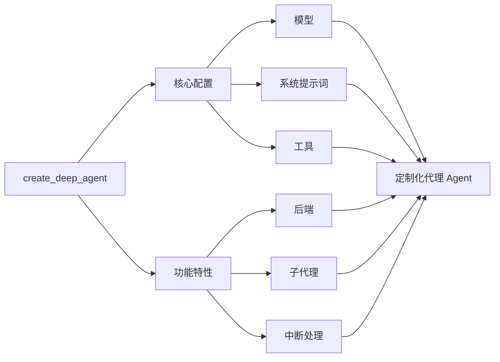

## 模型 (Model)

默认情况下，`deepagents` 使用 [`claude-sonnet-4-5-20250929`](https://platform.claude.com/docs/en/about-claude/models/overview)。您可以通过传入任何受支持的 <Tooltip tip="遵循 `provider:model` 格式的字符串 (例如 openai:gpt-5)" cta="查看映射关系" href="https://reference.langchain.com/python/langchain/models/#langchain.chat_models.init_chat_model(model)">模型标识符字符串</Tooltip> 或 [LangChain 模型对象](/oss/javascript/integrations/chat) 来自定义代理使用的模型。


```typescript
import { ChatAnthropic } from "@langchain/anthropic";
import { ChatOpenAI } from "@langchain/openai";
import { createDeepAgent } from "deepagents";

// 使用 Anthropic
const agent = createDeepAgent({
  model: new ChatAnthropic({
    model: "claude-sonnet-4-20250514",
    temperature: 0,
  }),
});

// 使用 OpenAI
const agent2 = createDeepAgent({
  model: new ChatOpenAI({
    model: "gpt-5",
    temperature: 0,
  }),
});
```


## 系统提示词 (System prompt)

深度代理内置了一个受 Claude Code 系统提示词启发的系统提示词。默认的系统提示词包含了关于如何使用内置的规划工具、文件系统工具和子代理的详细指令。

每一个针对特定用例定制的深度代理都应该包含一个专门针对该用例的自定义系统提示词。


```typescript
import { createDeepAgent } from "deepagents";

const researchInstructions = `You are an expert researcher. Your job is to conduct thorough research, and then write a polished report.`;

const agent = createDeepAgent({
  systemPrompt: researchInstructions,
});
```


## 工具 (Tools)

与工具调用代理一样，深度代理也会获得一组它可以访问的顶层工具。


```typescript
import { tool } from "langchain";
import { TavilySearch } from "@langchain/tavily";
import { createDeepAgent } from "deepagents";
import { z } from "zod";

const internetSearch = tool(
  async ({
    query,
    maxResults = 5,
    topic = "general",
    includeRawContent = false,
  }: {
    query: string;
    maxResults?: number;
    topic?: "general" | "news" | "finance";
    includeRawContent?: boolean;
  }) => {
    const tavilySearch = new TavilySearch({
      maxResults,
      tavilyApiKey: process.env.TAVILY_API_KEY,
      includeRawContent,
      topic,
    });
    return await tavilySearch._call({ query });
  },
  {
    name: "internet_search",
    description: "Run a web search",
    schema: z.object({
      query: z.string().describe("The search query"),
      maxResults: z.number().optional().default(5),
      topic: z
        .enum(["general", "news", "finance"])
        .optional()
        .default("general"),
      includeRawContent: z.boolean().optional().default(false),
    }),
  },
);

const agent = createDeepAgent({
  tools: [internetSearch],
});
```


除了您提供的任何工具之外，深度代理还可以访问一些默认工具：

- `write_todos` – 更新代理的待办事项列表
- `ls` – 列出代理文件系统中的所有文件
- `read_file` – 从代理的文件系统中读取一个文件
- `write_file` – 在代理的文件系统中写入一个新文件
- `edit_file` – 编辑一个现有的文件
- `task` – 启动一个子代理来处理特定任务

---

<Callout icon="pen-to-square" iconType="regular">
    [Edit the source of this page on GitHub.](https://github.com/langchain-ai/docs/edit/main/src/oss\deepagents\customization.mdx)
</Callout>
<Tip icon="terminal" iconType="regular">
    [Connect these docs programmatically](/use-these-docs) to Claude, VSCode, and more via MCP for real-time answers.
</Tip>
