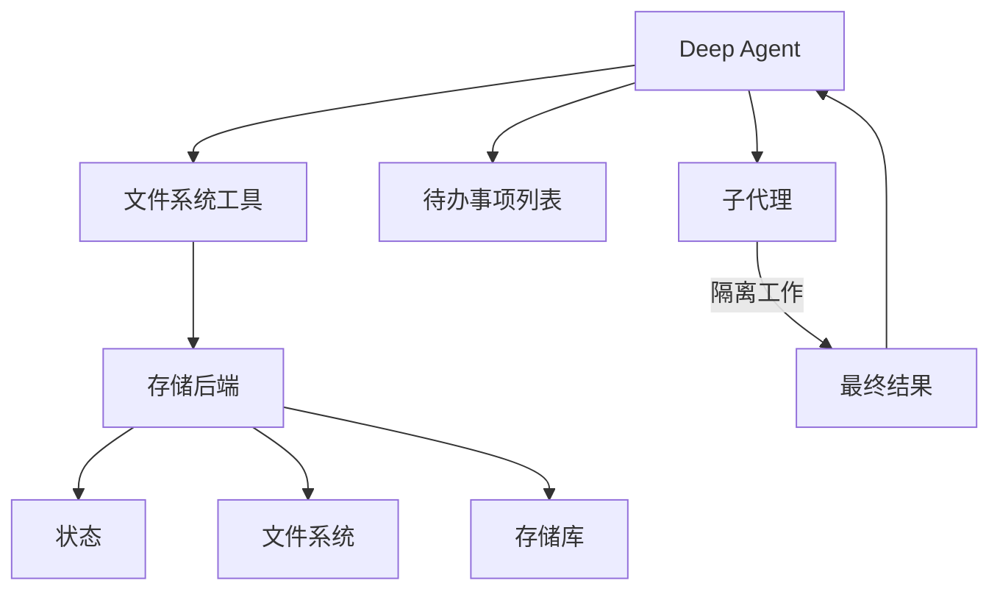

我们将 `deepagents` 视为一个“代理执行器”（Agent Harness）。它拥有与其他代理框架相同的核心工具调用循环，但内置了额外的工具和能力。

此页面列出了构成代理执行器的各个组件。

## 文件系统访问

该执行器提供了六种用于文件系统操作的工具，使文件成为代理环境中“一等公民”的资源：

| 工具 | 描述 |
|---|---|
| `ls` | 列出目录中的文件及其元数据（大小、修改时间） |
| `read_file` | 读取文件内容并显示行号，支持大文件的偏移量/限制读取 |
| `write_file` | 创建新文件 |
| `edit_file` | 在文件中执行精确的字符串替换（支持全局替换模式） |
| `glob` | 查找匹配特定模式的文件（例如：`**/*.py`） |
| `grep` | 使用多种输出模式搜索文件内容（仅文件名、带上下文的内容，或计数） |

## 大工具结果的驱逐机制

当工具调用结果超过令牌阈值时，执行器会自动将这些结果转储（dump）到文件系统中，以防止上下文窗口被占满。

**工作原理：**

- 监控工具调用的结果大小（默认阈值为 20,000 令牌）
- 如果超过阈值，则将结果写入文件而不是直接返回
- 用对该文件的简洁引用来替换原始工具结果
- 如果需要，代理稍后可以读取该文件

## 可插拔的存储后端

执行器通过一个协议抽象了文件系统操作，允许针对不同用例采用不同的存储策略。

**可用后端：**

1. **StateBackend** - 易失性的内存存储
   - 文件存在于代理的状态中（随对话一起检查点保存）
   - 仅在单个线程内持久化，跨线程无效
   - 适用于临时工作文件

2. **FilesystemBackend** - 真实的文件系统访问
   - 从实际磁盘读取/写入
   - 支持虚拟模式（沙箱限制在一个根目录下操作）
   - 与系统工具集成（例如，`grep` 使用 `ripgrep`）
   - 安全特性：路径验证、大小限制、符号链接预防

3. **StoreBackend** - 持久化的跨对话存储
   - 使用 LangGraph 的 `BaseStore` 实现耐用性
   - 按 `assistant_id` 进行命名空间隔离
   - 文件在不同的对话会话间持久存在
   - 适用于长期记忆或知识库

4. **CompositeBackend** - 将不同的路径路由到不同的后端
   - 示例：`/` 路由到 StateBackend，`/memories/` 路由到 StoreBackend
   - 使用最长前缀匹配进行路由
   - 启用混合（Hybrid）存储策略

## 任务委托（子代理）

执行器允许主代理创建临时性的“子代理”来处理隔离的多步骤任务。

**用途：**
- **上下文隔离** - 子代理的工作不会污染主代理的上下文
- **并行执行** - 多个子代理可以并发运行
- **专业化** - 子代理可以拥有不同的工具/配置
- **令牌效率** - 大型子任务的上下文被压缩成单个结果返回

**工作原理：**
- 主代理拥有一个 `task` 工具
- 调用该工具时，会创建一个具有自身独立上下文的全新代理实例
- 子代理自主执行直到完成
- 将一个最终报告返回给主代理
- 子代理是无状态的（它们不能向主代理发送多条消息进行多次往返）

**默认子代理：**
- 默认提供一个“通用型”（general-purpose）子代理
- 默认拥有文件系统工具
- 可以通过附加工具/中间件进行定制

**自定义子代理：**
- 定义具有特定工具的专业化子代理
- 示例：代码审查员 (code-reviewer)、网络研究员 (web-researcher)、测试运行器 (test-runner)
- 通过 `subagents` 参数进行配置

## 对话历史摘要

当令牌使用量变得过高时，执行器会自动压缩旧的对话历史记录。

**配置：**
- 在 170,000 令牌时触发
- 保持最新的 6 条消息完整不变
- 较旧的消息由模型进行摘要（总结）

**用途：**
- 使极长的对话成为可能，而不会达到上下文限制
- 在压缩历史记录的同时保留最近的上下文
- 对代理来说是透明的（表现为特殊的系统消息）

## 悬挂工具调用修复

当工具调用在收到结果之前被中断或取消时，执行器会修复消息历史记录。

**问题所在：**
- 代理请求工具调用：“请运行 X”
- 工具调用被中断（用户取消、发生错误等）
- 代理在 AIMessage 中看到 `tool_call`，但没有对应的 `ToolMessage`
- 这会产生一个无效的消息序列

**解决方案：**
- 检测那些具有 `tool_calls` 但没有对应结果的 AIMessage
- 创建合成的 `ToolMessage` 响应，指示调用已被取消
- 在代理执行之前修复消息历史记录

**用途：**
- 防止代理因不完整的消息链而感到困惑
- 优雅地处理中断和错误
- 保持对话的连贯性

## 待办事项列表跟踪

执行器提供了一个 `write_todos` 工具，代理可以使用它来维护一个结构化的任务列表。

**特性：**
- 跟踪具有状态（待定 `pending`、进行中 `in_progress`、已完成 `completed`）的多个任务
- 任务持久化在代理状态中
- 帮助代理组织复杂的、多步骤的工作
- 对长期运行的任务和规划非常有用

## 人工干预（Human-in-the-Loop, HITL）

执行器在指定的工具调用处暂停代理执行，以允许人工批准或修改操作。

**配置：**
- 将工具名称映射到中断（interrupt）配置
- 示例：`{"edit_file": True}` - 在每次编辑前暂停
- 用户可以提供批准信息或修改工具输入

**用途：**
- 对破坏性操作设置安全门禁
- 在执行昂贵的 API 调用前进行用户验证
- 交互式调试和指导

## 提示缓存（Anthropic 模型）

执行器启用了 Anthropic 的提示缓存功能，以减少重复的令牌处理。

**工作原理：**
- 缓存提示中跨轮次（turns）重复出现的部分
- 显著减少长系统提示的延迟和成本
- 自动对非 Anthropic 模型禁用

**用途：**
- 系统提示（尤其是包含文件系统文档的提示）可能超过 5k 令牌
- 这些内容在每一轮都会重复出现，如果不缓存会造成浪费
- 缓存可以提供约 10 倍的速度提升和成本降低

---

<Callout icon="pen-to-square" iconType="regular">
    [Edit the source of this page on GitHub.](https://github.com/langchain-ai/docs/edit/main/src/oss\deepagents\harness.mdx)
</Callout>
<Tip icon="terminal" iconType="regular">
    [Connect these docs programmatically](/use-these-docs) to Claude, VSCode, and more via MCP for real-time answers.
</Tip>
