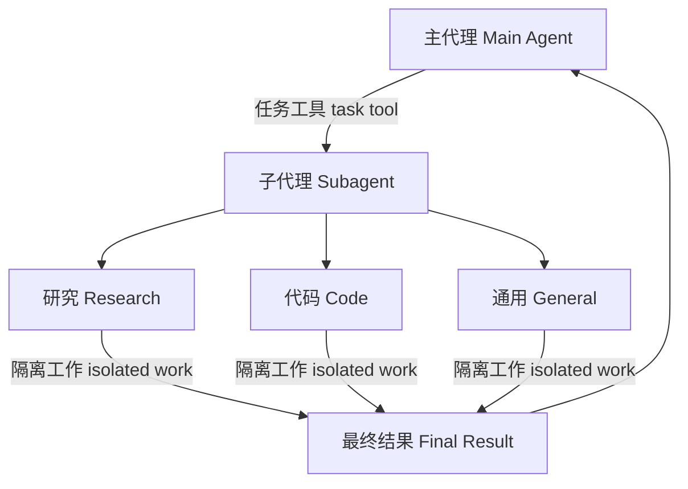

深度代理 (Deep agents) 可以创建子代理 (subagents) 来委托工作。您可以在 `subagents` 参数中指定自定义的子代理。子代理在进行 [上下文隔离](https://www.dbreunig.com/2025/06/26/how-to-fix-your-context.html#context-quarantine)（保持主代理上下文整洁）和提供专门指令方面非常有用。



## 为什么要使用子代理？

子代理解决了 **上下文膨胀问题 (context bloat problem)**。当代理使用具有大输出的工具时（例如网页搜索、文件读取、数据库查询），上下文窗口会很快被中间结果填满。子代理隔离了这些详细工作——主代理只接收最终结果，而不是产生该结果的数十次工具调用。

**何时使用子代理：**
- ✅ 会使主代理上下文冗余的多步骤任务
- ✅ 需要自定义指令或工具的专业领域任务
- ✅ 需要不同模型能力的任务
- ✅ 当您希望主代理专注于高层协调时

**何时不使用子代理：**
- ❌ 简单、单步任务
- ❌ 当您需要维护中间上下文时
- ❌ 当开销大于收益时

## 配置

`subagents` 应为字典列表或 `CompiledSubAgent` 对象的列表。它有两种类型：

### 子代理 (基于字典)

对于大多数用例，将子代理定义为字典：

**必需字段：**
- **name** (`str`): 子代理的唯一标识符。主代理在调用 `task()` 工具时使用此名称。
- **description** (`str`): 该子代理执行什么操作。描述要具体且面向行动。主代理使用此描述来决定何时委派任务。
- **system_prompt** (`str`): 子代理的指令。应包含工具使用指南和输出格式要求。
- **tools** (`List[Callable]`): 子代理可使用的工具。保持此列表最精简，仅包含必需的工具。

**可选字段：**
- **model** (`str | BaseChatModel`): 覆盖主代理的模型。使用格式 `"provider:model-name"`（例如，`"openai:gpt-4o"`）。
- **middleware** (`List[Middleware]`): 用于自定义行为、日志记录或速率限制的附加中间件。
- **interrupt_on** (`Dict[str, bool]`): 为特定工具配置人工干预（human-in-the-loop）。需要检查点 (checkpointer)。

### 编译后的子代理 (CompiledSubAgent)

对于复杂的流程，可以使用预构建的 LangGraph 图：

**字段：**
- **name** (`str`): 唯一标识符
- **description** (`str`): 该子代理执行什么操作
- **runnable** (`Runnable`): 编译后的 LangGraph 图（必须先调用 `.compile()`）

## 使用 SubAgent


```typescript
import { tool } from "langchain";
import { TavilySearch } from "@langchain/tavily";
import { createDeepAgent } from "deepagents";
import { ChatAnthropic } from "@langchain/anthropic";
import { z } from "zod";

const internetSearch = tool(
  async ({
    query,
    maxResults = 5,
    topic = "general",
    includeRawContent = false,
  }: {
    query: string;
    maxResults?: number;
    topic?: "general" | "news" | "finance";
    includeRawContent?: boolean;
  }) => {
    const tavilySearch = new TavilySearch({
      maxResults,
      tavilyApiKey: process.env.TAVILY_API_KEY,
      includeRawContent,
      topic,
    });
    return await tavilySearch._call({ query });
  },
  {
    name: "internet_search",
    description: "运行网络搜索",
    schema: z.object({
      query: z.string().describe("搜索查询"),
      maxResults: z.number().optional().default(5),
      topic: z
        .enum(["general", "news", "finance"])
        .optional()
        .default("general"),
      includeRawContent: z.boolean().optional().default(false),
    }),
  },
);

const researchSubagent = {
  name: "research-agent",
  description: "用于深入研究更复杂的问题",
  systemPrompt: "你是一名出色的研究员",
  tools: [internetSearch],
  model: new ChatAnthropic({model:"claude-sonnet-4-5-20250929"}),  // 可选覆盖，默认为主代理模型
};
const subagents = [researchSubagent];

const agent = createDeepAgent({
  model: new ChatAnthropic({model:"claude-sonnet-4-5-20250929"}),
  subagents: subagents,
});
```


## 使用 CompiledSubAgent

对于更复杂的用例，您可以提供自己的预构建 LangGraph 图作为子代理：


```typescript
import { createDeepAgent, CompiledSubAgent } from "deepagents";
import { createAgent } from "langchain";

// 创建一个自定义的代理图
const customGraph = createAgent({
  model: yourModel,
  tools: specializedTools,
  prompt: "你是一个专门用于数据分析的代理...",
});

// 将其用作自定义子代理
const customSubagent: CompiledSubAgent = {
  name: "data-analyzer",
  description: "专门用于复杂数据分析任务的代理",
  runnable: customGraph,
};

const subagents = [customSubagent];

const agent = createDeepAgent({
  model: "claude-sonnet-4-5-20250929",
  tools: [internetSearch],
  systemPrompt: researchInstructions,
  subagents: subagents,
});
```


## 通用子代理 (The general-purpose subagent)

除了任何用户定义的子代理外，深度代理始终可以访问一个 `general-purpose` 子代理。此子代理：
- 具有与主代理相同的系统提示
- 可以访问所有相同的工具
- 使用相同的模型（除非被覆盖）

### 何时使用它

通用子代理非常适合在没有专门行为的情况下进行上下文隔离。主代理可以将复杂的多步骤任务委托给此子代理，并接收一个简洁的结果，而不会因为中间工具调用而产生上下文膨胀。

<Card title="示例">
    主代理不是进行 10 次网页搜索并将结果填满其上下文，而是将任务委托给通用子代理：`task(name="general-purpose", task="研究量子计算趋势")`。子代理在内部执行所有搜索，仅返回一个摘要。
</Card>

## 最佳实践

### 编写清晰的描述

主代理使用描述来决定调用哪个子代理。要具体：

✅ **好 (Good):** `"分析财务数据并生成带有置信度分数的投资见解"`

❌ **差 (Bad):** `"做一些金融方面的事情"`

### 保持系统提示详细

包含有关如何使用工具和格式化输出的具体指导：


```typescript
const researchSubagent = {
  name: "research-agent",
  description: "使用网络搜索进行深入研究并综合发现",
  systemPrompt: `你是一名彻底的研究员。你的工作是：

  1. 将研究问题分解为可搜索的查询
  2. 使用 internet_search 来查找相关信息
  3. 将发现综合成全面但简洁的摘要
  4. 在提出主张时引用来源

  输出格式：
  - 摘要 (2-3 段)
  - 关键发现 (要点列表)
  - 来源 (附带 URL)

  将响应保持在 500 字以内，以保持上下文整洁。`,
  tools: [internetSearch],
};
```


### 最小化工具集

仅向子代理提供它们需要的工具。这可以提高注意力和安全性：


```typescript
// ✅ 好：集中的工具集
const emailAgent = {
  name: "email-sender",
  tools: [sendEmail, validateEmail],  // 仅与电子邮件相关
};

// ❌ 差：工具太多
const emailAgentBad = {
  name: "email-sender",
  tools: [sendEmail, webSearch, databaseQuery, fileUpload],  // 不集中
};
```


### 按任务选择模型

不同的模型在不同任务上表现出色：


```typescript
const subagents = [
  {
    name: "contract-reviewer",
    description: "审查法律文件和合同",
    systemPrompt: "你是一名专业的法律审查员...",
    tools: [readDocument, analyzeContract],
    model: "claude-sonnet-4-5-20250929",  // 用于长文档的大上下文
  },
  {
    name: "financial-analyst",
    description: "分析财务数据和市场趋势",
    systemPrompt: "你是一名专业的金融分析师...",
    tools: [getStockPrice, analyzeFundamentals],
    model: "gpt-5",  // 更适合数值分析
  },
];
```


### 返回简洁的结果

指导子代理返回摘要，而不是原始数据：


```typescript
const dataAnalyst = {
  systemPrompt: `分析数据并返回：
  1. 关键见解 (3-5 个要点)
  2. 总体置信度分数
  3. 建议的后续操作

  不要包含：
  - 原始数据
  - 中间计算
  - 详细的工具输出

  将响应保持在 300 字以内。`,
};
```


## 常见模式

### 多个专业子代理

为不同领域创建专业子代理：


```typescript
import { createDeepAgent } from "deepagents";

const subagents = [
  {
    name: "data-collector",
    description: "从各种来源收集原始数据",
    systemPrompt: "收集关于该主题的全面数据",
    tools: [webSearch, apiCall, databaseQuery],
  },
  {
    name: "data-analyzer",
    description: "分析收集的数据以提取见解",
    systemPrompt: "分析数据并提取关键见解",
    tools: [statisticalAnalysis],
  },
  {
    name: "report-writer",
    description: "根据分析撰写完善的报告",
    systemPrompt: "根据见解创建专业报告",
    tools: [formatDocument],
  },
];

const agent = createDeepAgent({
  model: "claude-sonnet-4-5-20250929",
  systemPrompt: "你协调数据分析和报告。使用子代理来处理专门任务。",
  subagents: subagents,
});
```


**工作流程：**
1. 主代理创建高层计划
2. 将数据收集委托给 `data-collector`
3. 将结果传递给 `data-analyzer`
4. 将见解发送给 `report-writer`
5. 汇编最终输出

每个子代理都在干净的上下文中工作，只关注其任务本身。

## 故障排除

### 子代理未被调用

**问题**：主代理试图自行完成工作，而不是委托。

**解决方案**：

1. **使描述更具体：**


   ```typescript
   // ✅ 好
   { name: "research-specialist", description: "使用网络搜索对特定主题进行深入研究。在需要多次搜索才能获得详细信息时使用。" }

   // ❌ 差
   { name: "helper", description: "帮忙处理事情" }
   ```


2. **指示主代理进行委托：**


   ```typescript
   const agent = createDeepAgent({
     systemPrompt: `...你的指令...

     重要提示：对于复杂任务，请使用 task() 工具委托给你的子代理。
     这可以保持你的上下文整洁并提高结果质量。`,
     subagents: [...]
   });
   ```


### 上下文仍然膨胀

**问题**：尽管使用了子代理，上下文仍然填满。

**解决方案**：

1. **指示子代理返回简洁的结果：**


   ```typescript
   systemPrompt: `...

   重要提示：仅返回必要的摘要。
   不要包含原始数据、中间搜索结果或详细工具输出。
   您的响应应少于 500 字。`
   ```


2. **使用文件系统存储大型数据：**


   ```typescript
   systemPrompt: `当您收集大量数据时：
   1. 将原始数据保存到 /data/raw_results.txt
   2. 处理和分析数据
   3. 仅返回分析摘要

   这可以保持上下文整洁。`
   ```


### 选择错误的子代理

**问题**：主代理为该任务调用了不合适的子代理。

**解决方案**：在描述中清晰地区分子代理：


```typescript
const subagents = [
  {
    name: "quick-researcher",
    description: "用于需要 1-2 次搜索的简单、快速的研究问题。在需要基本事实或定义时使用。",
  },
  {
    name: "deep-researcher",
    description: "用于复杂、深入的研究，需要多次搜索、综合和分析。用于全面报告。",
  }
];
```

---

<Callout icon="pen-to-square" iconType="regular">
    [Edit the source of this page on GitHub.](https://github.com/langchain-ai/docs/edit/main/src/oss\deepagents\subagents.mdx)
</Callout>
<Tip icon="terminal" iconType="regular">
    [Connect these docs programmatically](/use-these-docs) to Claude, VSCode, and more via MCP for real-time answers.
</Tip>
