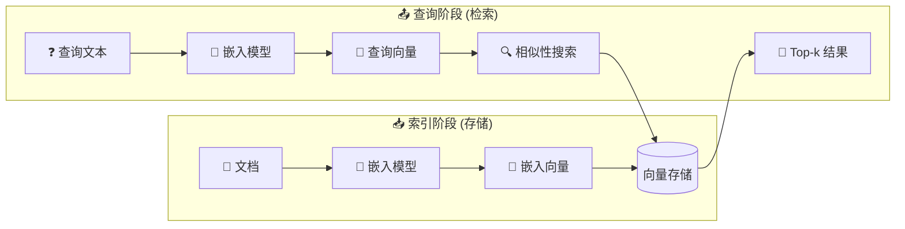

```markdown
---
title: "向量存储"
---

## 概述

[向量存储](/oss/javascript/integrations/vectorstores) 负责存储 [嵌入](/oss/javascript/integrations/text_embedding) (embedding) 后的数据，并执行相似性搜索。



### 接口

LangChain 为向量存储提供了一个统一的接口，允许你执行以下操作：

- `addDocuments` - 将文档添加到存储中。
- `delete` - 通过 ID 移除已存储的文档。
- `similaritySearch` - 查询语义上相似的文档。

这种抽象层允许你在不更改应用程序逻辑的情况下，轻松切换不同的向量存储实现。

### 初始化

LangChain 中的大多数向量存储在初始化时都需要接收一个嵌入模型作为参数。

```typescript
import { OpenAIEmbeddings } from "@langchain/openai";
import { MemoryVectorStore } from "@langchain/classic/vectorstores/memory";

const embeddings = new OpenAIEmbeddings({
  model: "text-embedding-3-small",
});
const vectorStore = new MemoryVectorStore(embeddings);
```

### 添加文档

你可以使用 `addDocuments` 函数将文档添加到向量存储中。

```typescript
import { Document } from "@langchain/core/documents";
const document = new Document({
  pageContent: "Hello world",
});
await vectorStore.addDocuments([document]);
```

### 删除文档

你可以使用 `delete` 函数从向量存储中删除文档。

```typescript
await vectorStore.delete({
  filter: {
    pageContent: "Hello world",
  },
});
```

### 相似性搜索

使用 `similaritySearch` 发起语义查询，它将返回最相似的嵌入文档：

```typescript
const results = await vectorStore.similaritySearch("Hello world", 10);
```


许多向量存储支持如下参数：

* `k` — 要返回的结果数量
* `filter` — 基于元数据（metadata）的条件过滤

### 相似性度量和索引

嵌入相似性可以通过以下方式计算：

* **余弦相似度 (Cosine similarity)**
* **欧氏距离 (Euclidean distance)**
* **点积 (Dot product)**

高效的搜索通常会采用诸如 HNSW (Hierarchical Navigable Small World) 这样的索引方法，尽管具体细节取决于所使用的向量存储。

### 元数据过滤

通过元数据（例如来源、日期）进行过滤可以精炼搜索结果：

```typescript
vectorStore.similaritySearch("query", 2, { source: "tweets" });
```

<important>
基于元数据的过滤支持在不同的实现中有所不同。
请查阅你所选向量存储的文档以获取详细信息。
</important>

## 主要集成

**选择嵌入模型：**

<AccordionGroup>
<Accordion title="OpenAI">

安装依赖项：

<CodeGroup>

```bash npm
npm i @langchain/openai
```
```bash yarn
yarn add @langchain/openai
```
```bash pnpm
pnpm add @langchain/openai
```
</CodeGroup>

添加环境变量：

```bash
OPENAI_API_KEY=your-api-key
```

实例化模型：

```typescript
import { OpenAIEmbeddings } from "@langchain/openai";

const embeddings = new OpenAIEmbeddings({
  model: "text-embedding-3-large"
});
```

</Accordion>
<Accordion title="Azure">

安装依赖项

<CodeGroup>

```bash npm
npm i @langchain/openai
```
```bash yarn
yarn add @langchain/openai
```

```bash pnpm
pnpm add @langchain/openai
```
</CodeGroup>

添加环境变量：

```bash
AZURE_OPENAI_API_INSTANCE_NAME=<YOUR_INSTANCE_NAME>
AZURE_OPENAI_API_KEY=<YOUR_KEY>
AZURE_OPENAI_API_VERSION="2024-02-01"
```

实例化模型：

```typescript
import { AzureOpenAIEmbeddings } from "@langchain/openai";

const embeddings = new AzureOpenAIEmbeddings({
  azureOpenAIApiEmbeddingsDeploymentName: "text-embedding-ada-002"
});
```

</Accordion>

<Accordion title="AWS">

安装依赖项：

<CodeGroup>

```bash npm
npm i @langchain/aws
```

```bash yarn
yarn add @langchain/aws
```

```bash pnpm
pnpm add @langchain/aws
```

</CodeGroup>

添加环境变量：

```bash
BEDROCK_AWS_REGION=your-region
```

实例化模型：

```typescript
import { BedrockEmbeddings } from "@langchain/aws";

const embeddings = new BedrockEmbeddings({
  model: "amazon.titan-embed-text-v1"
});
```

</Accordion>
<Accordion title="Google Gemini">

安装依赖项：

<CodeGroup>
```bash npm
npm i @langchain/google-genai
```

```bash yarn
yarn add @langchain/google-genai
```

```bash pnpm
pnpm add @langchain/google-genai
```
</CodeGroup>

添加环境变量：

```bash
GOOGLE_API_KEY=your-api-key
```

实例化模型：

```typescript
import { GoogleGenerativeAIEmbeddings } from "@langchain/google-genai";

const embeddings = new GoogleGenerativeAIEmbeddings({
  model: "text-embedding-004"
});
```

</Accordion>
<Accordion title="Google Vertex">

安装依赖项：

<CodeGroup>

```bash npm
npm i @langchain/google-vertexai
```

```bash yarn
yarn add @langchain/google-vertexai
```

```bash pnpm
pnpm add @langchain/google-vertexai
```
</CodeGroup>

添加环境变量：

```bash
GOOGLE_APPLICATION_CREDENTIALS=credentials.json
```

实例化模型：

```typescript
import { VertexAIEmbeddings } from "@langchain/google-vertexai";

const embeddings = new VertexAIEmbeddings({
  model: "gemini-embedding-001"
});
```

</Accordion>
<Accordion title="MistralAI">

安装依赖项：

<CodeGroup>
```bash npm
npm i @langchain/mistralai
```

```bash yarn
yarn add @langchain/mistralai
```

```bash pnpm
pnpm add @langchain/mistralai
```
</CodeGroup>

添加环境变量：

```bash
MISTRAL_API_KEY=your-api-key
```

实例化模型：

```typescript
import { MistralAIEmbeddings } from "@langchain/mistralai";

const embeddings = new MistralAIEmbeddings({
  model: "mistral-embed"
});
```

</Accordion>
<Accordion title="Cohere">

安装依赖项：

<CodeGroup>
```bash npm
npm i @langchain/cohere
```

```bash yarn
yarn add @langchain/cohere
```

```bash pnpm
pnpm add @langchain/cohere
```

</CodeGroup>

添加环境变量：

```bash
COHERE_API_KEY=your-api-key
```

实例化模型：

```typescript
import { CohereEmbeddings } from "@langchain/cohere";

const embeddings = new CohereEmbeddings({
  model: "embed-english-v3.0"
});
```

</Accordion>
<Accordion title="Ollama">

安装依赖项：

<CodeGroup>
```bash npm
npm i @langchain/ollama
```

```bash yarn
yarn add @langchain/ollama
```

```bash pnpm
pnpm add @langchain/ollama
```
</CodeGroup>

实例化模型：

```typescript
import { OllamaEmbeddings } from "@langchain/ollama";

const embeddings = new OllamaEmbeddings({
  model: "llama2",
  baseUrl: "http://localhost:11434", // 默认值
});
```

</Accordion>
</AccordionGroup>

**选择向量存储：**

<AccordionGroup>
<Accordion title="Memory">

<CodeGroup>
```bash
npm i langchain
```

```bash yarn
yarn add langchain
```

```bash pnpm
pnpm add langchain
```
</CodeGroup>

```typescript
import { MemoryVectorStore } from "@langchain/classic/vectorstores/memory";

const vectorStore = new MemoryVectorStore(embeddings);
```

</Accordion>
<Accordion title="Chroma">

<CodeGroup>

```bash npm
npm i @langchain/community
```

```bash yarn
yarn add @langchain/community
```

```bash pnpm
pnpm add @langchain/community
```

</CodeGroup>

```typescript
import { Chroma } from "@langchain/community/vectorstores/chroma";

const vectorStore = new Chroma(embeddings, {
  collectionName: "a-test-collection",
});
```

</Accordion>
<Accordion title="FAISS">

<CodeGroup>

```bash npm
npm i @langchain/community
```

```bash yarn
yarn add @langchain/community
```

```bash
pnpm add @langchain/community
```

</CodeGroup>

```typescript
import { FaissStore } from "@langchain/community/vectorstores/faiss";

const vectorStore = new FaissStore(embeddings, {});
```

</Accordion>
<Accordion title="MongoDB">

<CodeGroup>

```bash npm
npm i @langchain/mongodb
```

```bash yarn
yarn add @langchain/mongodb
```

```bash pnpm
pnpm add @langchain/mongodb
```

</CodeGroup>

```typescript
import { MongoDBAtlasVectorSearch } from "@langchain/mongodb"
import { MongoClient } from "mongodb";

const client = new MongoClient(process.env.MONGODB_ATLAS_URI || "");
const collection = client
  .db(process.env.MONGODB_ATLAS_DB_NAME)
  .collection(process.env.MONGODB_ATLAS_COLLECTION_NAME);

const vectorStore = new MongoDBAtlasVectorSearch(embeddings, {
  collection,
  indexName: "vector_index",
  textKey: "text",
  embeddingKey: "embedding",
});
```

</Accordion>
<Accordion title="PGVector">

<CodeGroup>

```bash npm
npm i @langchain/community
```

```bash yarn
yarn add @langchain/community
```

```bash pnpm
pnpm add @langchain/community
```

</CodeGroup>

```typescript
import { PGVectorStore } from "@langchain/community/vectorstores/pgvector";

const vectorStore = await PGVectorStore.initialize(embeddings, {});
```

</Accordion>
<Accordion title="Pinecone">

<CodeGroup>

```bash npm
npm i @langchain/pinecone
```

```bash yarn
yarn add @langchain/pinecone
```

```bash pnpm
pnpm add @langchain/pinecone
```

</CodeGroup>

```typescript
import { PineconeStore } from "@langchain/pinecone";
import { Pinecone as PineconeClient } from "@pinecone-database/pinecone";

const pinecone = new PineconeClient();
const vectorStore = new PineconeStore(embeddings, {
  pineconeIndex,
  maxConcurrency: 5,
});
```

</Accordion>
<Accordion title="Qdrant">

<CodeGroup>
```bash npm
npm i @langchain/qdrant
```

```bash yarn
yarn add @langchain/qdrant
```

```bash pnpm
pnpm add @langchain/qdrant
```

</CodeGroup>

```typescript
import { QdrantVectorStore } from "@langchain/qdrant";

const vectorStore = await QdrantVectorStore.fromExistingCollection(embeddings, {
  url: process.env.QDRANT_URL,
  collectionName: "langchainjs-testing",
});
```

</Accordion>
</AccordionGroup>

LangChain.js 与各种向量存储进行了集成。你可以在下面查看完整的列表：

## 所有向量存储

<Columns cols={3}>
  <Card
    title="AnalyticDB"
    icon="link"
    href="/oss/javascript/integrations/vectorstores/analyticdb"
    arrow="true"
    cta="查看指南"
  />
  <Card
    title="Astra DB"
    icon="link"
    href="/oss/javascript/integrations/vectorstores/astradb"
    arrow="true"
    cta="查看指南"
  />
  <Card
    title="Azion EdgeSQL"
    icon="link"
    href="/oss/javascript/integrations/vectorstores/azion-edgesql"
    arrow="true"
    cta="查看指南"
  />
  <Card
    title="Azure AI Search"
    icon="link"
    href="/oss/javascript/integrations/vectorstores/azure_aisearch"
    arrow="true"
    cta="查看指南"
  />
  <Card
    title="Azure Cosmos DB for MongoDB vCore"
    icon="link"
    href="/oss/javascript/integrations/vectorstores/azure_cosmosdb_mongodb"
    arrow="true"
    cta="查看指南"
  />
  <Card
    title="Azure Cosmos DB for NoSQL"
    icon="link"
    href="/oss/javascript/integrations/vectorstores/azure_cosmosdb_nosql"
    arrow="true"
    cta="查看指南"
  />
  <Card
    title="Cassandra"
    icon="link"
    href="/oss/javascript/integrations/vectorstores/cassandra"
    arrow="true"
    cta="查看指南"
  />
  <Card
    title="Chroma"
    icon="link"
    href="/oss/javascript/integrations/vectorstores/chroma"
    arrow="true"
    cta="查看指南"
  />
  <Card
    title="ClickHouse"
    icon="link"
    href="/oss/javascript/integrations/vectorstores/clickhouse"
    arrow="true"
    cta="查看指南"
  />
  <Card
    title="CloseVector"
    icon="link"
    href="/oss/javascript/integrations/vectorstores/closevector"
    arrow="true"
    cta="查看指南"
  />
  <Card
    title="Cloudflare Vectorize"
    icon="link"
    href="/oss/javascript/integrations/vectorstores/cloudflare_vectorize"
    arrow="true"
    cta="查看指南"
  />
  <Card
    title="Convex"
    icon="link"
    href="/oss/javascript/integrations/vectorstores/convex"
    arrow="true"
    cta="查看指南"
  />
  <Card
    title="Couchbase Query"
    icon="link"
    href="/oss/javascript/integrations/vectorstores/couchbase_query"
    arrow="true"
    cta="查看指南"
  />
  <Card
    title="Couchbase Search"
    icon="link"
    href="/oss/javascript/integrations/vectorstores/couchbase_search"
    arrow="true"
    cta="查看指南"
  />
  <Card
    title="Elasticsearch"
    icon="link"
    href="/oss/javascript/integrations/vectorstores/elasticsearch"
    arrow="true"
    cta="查看指南"
  />
  <Card
    title="Faiss"
    icon="link"
    href="/oss/javascript/integrations/vectorstores/faiss"
    arrow="true"
    cta="查看指南"
  />
  <Card
    title="Google Cloud SQL for PostgreSQL"
    icon="link"
    href="/oss/javascript/integrations/vectorstores/google_cloudsql_pg"
    arrow="true"
    cta="查看指南"
  />
  <Card
    title="Google Vertex AI Matching Engine"
    icon="link"
    href="/oss/javascript/integrations/vectorstores/googlevertexai"
    arrow="true"
    cta="查看指南"
  />
  <Card
    title="SAP HANA Cloud Vector Engine"
    icon="link"
    href="/oss/javascript/integrations/vectorstores/hanavector"
    arrow="true"
    cta="查看指南"
  />
  <Card
    title="HNSWLib"
    icon="link"
    href="/oss/javascript/integrations/vectorstores/hnswlib"
    arrow="true"
    cta="查看指南"
  />
  <Card
    title="LanceDB"
    icon="link"
    href="/oss/javascript/integrations/vectorstores/lancedb"
    arrow="true"
    cta="查看指南"
  />
  <Card
    title="libSQL"
    icon="link"
    href="/oss/javascript/integrations/vectorstores/libsql"
    arrow="true"
    cta="查看指南"
  />
  <Card
    title="MariaDB"
    icon="link"
    href="/oss/javascript/integrations/vectorstores/mariadb"
    arrow="true"
    cta="查看指南"
  />
  <Card
    title="In-memory"
    icon="link"
    href="/oss/javascript/integrations/vectorstores/memory"
    arrow="true"
    cta="查看指南"
  />
  <Card
    title="Milvus"
    icon="link"
    href="/oss/javascript/integrations/vectorstores/milvus"
    arrow="true"
    cta="查看指南"
  />
  <Card
    title="Momento Vector Index (MVI)"
    icon="link"
    href="/oss/javascript/integrations/vectorstores/momento_vector_index"
    arrow="true"
    cta="查看指南"
  />
  <Card
    title="MongoDB Atlas"
    icon="link"
    href="/oss/javascript/integrations/vectorstores/mongodb_atlas"
    arrow="true"
    cta="查看指南"
  />
  <Card
    title="MyScale"
    icon="link"
    href="/oss/javascript/integrations/vectorstores/myscale"
    arrow="true"
    cta="查看指南"
  />
  <Card
    title="Neo4j Vector Index"
    icon="link"
    href="/oss/javascript/integrations/vectorstores/neo4jvector"
    arrow="true"
    cta="查看指南"
  />
  <Card
    title="Neon Postgres"
    icon="link"
    href="/oss/javascript/integrations/vectorstores/neon"
    arrow="true"
    cta="查看指南"
  />
  <Card
    title="OpenSearch"
    icon="link"
    href="/oss/javascript/integrations/vectorstores/opensearch"
    arrow="true"
    cta="查看指南"
  />
  <Card
    title="PGVector"
    icon="link"
    href="/oss/javascript/integrations/vectorstores/pgvector"
    arrow="true"
    cta="查看指南"
  />
  <Card
    title="Pinecone"
    icon="link"
    href="/oss/javascript/integrations/vectorstores/pinecone"
    arrow="true"
    cta="查看指南"
  />
  <Card
    title="Prisma"
    icon="link"
    href="/oss/javascript/integrations/vectorstores/prisma"
    arrow="true"
    cta="查看指南"
  />
  <Card
    title="Qdrant"
    icon="link"
    href="/oss/javascript/integrations/vectorstores/qdrant"
    arrow="true"
    cta="查看指南"
  />
  <Card
    title="Redis"
    icon="link"
    href="/oss/javascript/integrations/vectorstores/redis"
    arrow="true"
    cta="查看指南"
  />
  <Card
    title="Rockset"
    icon="link"
    href="/oss/javascript/integrations/vectorstores/rockset"
    arrow="true"
    cta="查看指南"
  />
  <Card
    title="SingleStore"
    icon="link"
    href="/oss/javascript/integrations/vectorstores/singlestore"
    arrow="true"
    cta="查看指南"
  />
  <Card
    title="Supabase"
    icon="link"
    href="/oss/javascript/integrations/vectorstores/supabase"
    arrow="true"
    cta="查看指南"
  />
  <Card
    title="Tigris"
    icon="link"
    href="/oss/javascript/integrations/vectorstores/tigris"
    arrow="true"
    cta="查看指南"
  />
  <Card
    title="Turbopuffer"
    icon="link"
    href="/oss/javascript/integrations/vectorstores/turbopuffer"
    arrow="true"
    cta="查看指南"
  />
  <Card
    title="TypeORM"
    icon="link"
    href="/oss/javascript/integrations/vectorstores/typeorm"
    arrow="true"
    cta="查看指南"
  />
  <Card
    title="Typesense"
    icon="link"
    href="/oss/javascript/integrations/vectorstores/typesense"
    arrow="true"
    cta="查看指南"
  />
  <Card
    title="Upstash Vector"
    icon="link"
    href="/oss/javascript/integrations/vectorstores/upstash"
    arrow="true"
    cta="查看指南"
  />
  <Card
    title="USearch"
    icon="link"
    href="/oss/javascript/integrations/vectorstores/usearch"
    arrow="true"
    cta="查看指南"
  />
  <Card
    title="Vectara"
    icon="link"
    href="/oss/javascript/integrations/vectorstores/vectara"
    arrow="true"
    cta="查看指南"
  />
  <Card
    title="Vercel Postgres"
    icon="link"
    href="/oss/javascript/integrations/vectorstores/vercel_postgres"
    arrow="true"
    cta="查看指南"
  />
  <Card
    title="Voy"
    icon="link"
    href="/oss/javascript/integrations/vectorstores/voy"
    arrow="true"
    cta="查看指南"
  />
  <Card
    title="Weaviate"
    icon="link"
    href="/oss/javascript/integrations/vectorstores/weaviate"
    arrow="true"
    cta="查看指南"
  />
  <Card
    title="Xata"
    icon="link"
    href="/oss/javascript/integrations/vectorstores/xata"
    arrow="true"
    cta="查看指南"
  />
  <Card
    title="Zep Open Source"
    icon="link"
    href="/oss/javascript/integrations/vectorstores/zep"
    arrow="true"
    cta="查看指南"
  />
  <Card
    title="Zep Cloud"
    icon="link"
    href="/oss/javascript/integrations/vectorstores/zep_cloud"
    arrow="true"
    cta="查看指南"
  />
</Columns>
```

---

<Callout icon="pen-to-square" iconType="regular">
    [Edit the source of this page on GitHub.](https://github.com/langchain-ai/docs/edit/main/src/oss\javascript\integrations\vectorstores\index.mdx)
</Callout>
<Tip icon="terminal" iconType="regular">
    [Connect these docs programmatically](/use-these-docs) to Claude, VSCode, and more via MCP for real-time answers.
</Tip>
