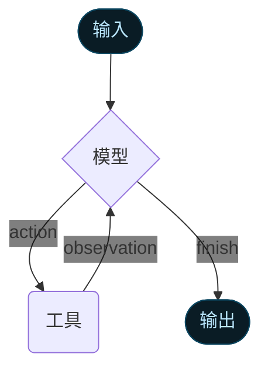

智能体（Agents）将语言模型与 [工具](/oss/javascript/langchain/tools) 相结合，创建出能够对任务进行推理、决定使用哪些工具并迭代地寻求解决方案的系统。


`createAgent()` 提供了一个可用于生产环境的智能体实现。


[LLM 智能体通过循环执行工具来实现目标](https://simonwillison.net/2025/Sep/18/agents/)。智能体将持续运行，直到满足停止条件——即模型输出了最终结果或达到了迭代次数限制。



<Info>


`createAgent()` 使用 [LangGraph](/oss/javascript/langgraph/overview) 构建一个基于**图（graph）**的智能体运行时。图由节点（步骤）和边（连接）组成，这些定义了智能体如何处理信息。智能体在这个图中移动，执行诸如模型节点（调用模型）、工具节点（执行工具）或中间件等节点。


了解更多关于 [图 API](/oss/javascript/langgraph/graph-api) 的信息。

</Info>

## 核心组件

### 模型（Model）

[模型](/oss/javascript/langchain/models) 是智能体的推理引擎。它可以以多种方式指定，支持静态和动态的模型选择。

#### 静态模型（Static model）

静态模型在创建智能体时配置一次，并在整个执行过程中保持不变。这是最常见和最直接的方法。

要使用模型标识符字符串 <Tooltip tip="遵循 `provider:model` 格式的字符串（例如 openai:gpt-5）" cta="查看映射" href="https://reference.langchain.com/python/langchain/models/#langchain.chat_models.init_chat_model(model)">初始化模型</Tooltip>：


```ts wrap
import { createAgent } from "langchain";

const agent = createAgent({
  model: "gpt-5",
  tools: []
});
```


模型标识符字符串使用 `provider:model` 格式（例如 `"openai:gpt-5"`）。您可能需要对模型配置进行更多控制，在这种情况下，您可以使用提供方包直接初始化模型实例：

```ts wrap
import { createAgent } from "langchain";
import { ChatOpenAI } from "@langchain/openai";

const model = new ChatOpenAI({
  model: "gpt-4o",
  temperature: 0.1,
  maxTokens: 1000,
  timeout: 30
});

const agent = createAgent({
  model,
  tools: []
});
```

模型实例为您提供了对配置的完全控制。当您需要设置特定参数（如 `temperature`、`max_tokens`、`timeouts`）或配置 API 密钥、`base_url` 以及其他提供方特定的设置时，请使用它们。请参阅 [API 参考](/oss/javascript/integrations/providers/) 查看您的模型上可用的参数和方法。


#### 动态模型（Dynamic model）

动态模型是根据当前的 <Tooltip tip="智能体的执行环境，包含在智能体执行过程中持久化的不可变配置和上下文数据（例如，用户 ID、会话详情或特定于应用程序的配置）。">运行时</Tooltip>（runtime）中**状态（state）**和上下文进行选择的。<Tooltip tip="流经智能体执行的数据，包括消息、自定义字段以及需要在处理过程中跟踪和可能修改的任何信息（例如，用户偏好或工具使用统计）。">状态</Tooltip> 这使得复杂的路由逻辑和成本优化成为可能。


要使用动态模型，请使用 `wrapModelCall` 创建中间件，以修改请求中的模型：

```ts
import { ChatOpenAI } from "@langchain/openai";
import { createAgent, createMiddleware } from "langchain";

const basicModel = new ChatOpenAI({ model: "gpt-4o-mini" });
const advancedModel = new ChatOpenAI({ model: "gpt-4o" });

const dynamicModelSelection = createMiddleware({
  name: "DynamicModelSelection",
  wrapModelCall: (request, handler) => {
    // 根据对话复杂性选择模型
    const messageCount = request.messages.length;

    return handler({
        ...request,
        model: messageCount > 10 ? advancedModel : basicModel,
    });
  },
});

const agent = createAgent({
  model: "gpt-4o-mini", // 基础模型（在 messageCount ≤ 10 时使用）
  tools: [],
  middleware: [dynamicModelSelection],
});
```

有关中间件和高级模式的更多详细信息，请参阅 [中间件文档](/oss/javascript/langchain/middleware)。


<Tip>
有关模型配置的详细信息，请参阅 [模型](/oss/javascript/langchain/models)。有关动态模型选择模式的详细信息，请参阅 [中间件中的动态模型](/oss/javascript/langchain/middleware#dynamic-model)。
</Tip>

### 工具（Tools）

工具赋予智能体执行操作的能力。智能体通过促进以下功能，超越了仅使用模型的工具绑定：

- 连续的多次工具调用（由单个提示触发）
- 适当情况下的并行工具调用
- 基于先前结果的动态工具选择
- 工具重试逻辑和错误处理
- 跨工具调用的状态持久化

有关更多信息，请参阅 [工具](/oss/javascript/langchain/tools)。

#### 定义工具

将工具列表传递给智能体。


```ts wrap
import * as z from "zod";
import { createAgent, tool } from "langchain";

const search = tool(
  ({ query }) => `Results for: ${query}`,
  {
    name: "search",
    description: "Search for information",
    schema: z.object({
      query: z.string().describe("The query to search for"),
    }),
  }
);

const getWeather = tool(
  ({ location }) => `Weather in ${location}: Sunny, 72°F`,
  {
    name: "get_weather",
    description: "Get weather information for a location",
    schema: z.object({
      location: z.string().describe("The location to get weather for"),
    }),
  }
);

const agent = createAgent({
  model: "gpt-4o",
  tools: [search, getWeather],
});
```


如果提供了空工具列表，智能体将只包含一个没有工具调用能力的 LLM 节点。

#### 工具错误处理


要定制工具错误的//{处理}方式，请在自定义中间件中使用 `wrapToolCall` 钩子：

```ts wrap
import { createAgent, createMiddleware, ToolMessage } from "langchain";

const handleToolErrors = createMiddleware({
  name: "HandleToolErrors",
  wrapToolCall: async (request, handler) => {
    try {
      return await handler(request);
    } catch (error) {
      // 向模型返回自定义错误消息
      return new ToolMessage({
        content: `Tool error: Please check your input and try again. (${error})`,
        tool_call_id: request.toolCall.id!,
      });
    }
  },
});

const agent = createAgent({
  model: "gpt-4o",
  tools: [
    /* ... */
  ],
  middleware: [handleToolErrors],
});
```

当工具失败时，智能体将返回带有自定义错误消息的 [`ToolMessage`](https://reference.langchain.com/javascript/classes/_langchain_core.messages.ToolMessage.html)。


#### ReAct 循环中工具的使用

智能体遵循 ReAct（“推理 + 行动”）模式，在简短的推理步骤和有针对性的工具调用之间交替进行，并将观察结果反馈给后续决策，直到能够提供最终答案为止。

<Accordion title="ReAct 循环示例">
**提示：** 确定当前最受欢迎的无线耳机并验证其可用性。

```
================================ 人类消息 =================================

查找目前最受欢迎的无线耳机并检查库存情况
```

* **推理**：“受欢迎程度是与时间相关的，我需要使用提供的搜索工具。”
* **行动**：调用 `search_products("wireless headphones")`

```
================================= AI 消息 =================================
工具调用:
  search_products (call_abc123)
 调用 ID: call_abc123
  参数:
    query: wireless headphones
```
```
================================= 工具消息 =================================

找到 5 个匹配 "wireless headphones" 的产品。前 5 个结果：WH-1000XM5, ...
```

* **推理**：“我需要确认排名第一的产品的可用性，然后才能回答。”
* **行动**：调用 `check_inventory("WH-1000XM5")`

```
================================= AI 消息 =================================
工具调用:
  check_inventory (call_def456)
 调用 ID: call_def456
  参数:
    product_id: WH-1000XM5
```
```
================================= 工具消息 =================================

产品 WH-1000XM5：库存 10 件
```

* **推理**：“我已经获得了最受欢迎的型号及其库存状态。现在我可以回答用户的问题了。”
* **行动**：产生最终答案

```
================================= AI 消息 =================================

我找到了无线耳机（型号 WH-1000XM5），库存有 10 件……
```
</Accordion>

<Tip>
要了解更多关于工具的信息，请参阅 [工具](/oss/javascript/langchain/tools)。
</Tip>

### 系统提示（System prompt）


您可以通过提供一个提示来塑造智能体处理任务的方式。`systemPrompt` 参数可以作为字符串提供：


```ts wrap
const agent = createAgent({
  model,
  tools,
  systemPrompt: "You are a helpful assistant. Be concise and accurate.",
});
```


当未提供 `systemPrompt` 时，智能体将直接从消息中推断其任务。

`systemPrompt` 参数接受 `string` 或 `SystemMessage`。使用 `SystemMessage` 可以让您更好地控制提示结构，这对于提供方特定的功能（如[Anthropic 的提示缓存](/oss/javascript/integrations/chat/anthropic#prompt-caching)）非常有用：

```ts wrap
import { createAgent } from "langchain";
import { SystemMessage, HumanMessage } from "@langchain/core/messages";

const literaryAgent = createAgent({
  model: "anthropic:claude-sonnet-4-5",
  systemPrompt: new SystemMessage({
    content: [
      {
        type: "text",
        text: "You are an AI assistant tasked with analyzing literary works.",
      },
      {
        type: "text",
        text: "<the entire contents of 'Pride and Prejudice'>",
        cache_control: { type: "ephemeral" }
      }
    ]
  })
});

const result = await literaryAgent.invoke({
  messages: [new HumanMessage("Analyze the major themes in 'Pride and Prejudice'.")]
});
```

带有 `{ type: "ephemeral" }` 的 `cache_control` 字段指示 Anthropic 缓存该内容块，从而减少使用相同系统提示的重复请求的延迟和成本。


#### 动态系统提示（Dynamic system prompt）

对于需要根据运行时上下文或智能体状态修改系统提示的更高级用例，您可以使用 [中间件](/oss/javascript/langchain/middleware)。


```typescript wrap
import * as z from "zod";
import { createAgent, dynamicSystemPromptMiddleware } from "langchain";

const contextSchema = z.object({
  userRole: z.enum(["expert", "beginner"]),
});

const agent = createAgent({
  model: "gpt-4o",
  tools: [/* ... */],
  contextSchema,
  middleware: [
    dynamicSystemPromptMiddleware<z.infer<typeof contextSchema>>((state, runtime) => {
      const userRole = runtime.context.userRole || "user";
      const basePrompt = "You are a helpful assistant.";

      if (userRole === "expert") {
        return `${basePrompt} Provide detailed technical responses.`;
      } else if (userRole === "beginner") {
        return `${basePrompt} Explain concepts simply and avoid jargon.`;
      }
      return basePrompt;
    }),
  ],
});

// 系统提示将根据上下文动态设置
const result = await agent.invoke(
  { messages: [{ role: "user", content: "Explain machine learning" }] },
  { context: { userRole: "expert" } }
);
```


<Tip>
有关消息类型和格式的更多详细信息，请参阅 [消息](/oss/javascript/langchain/messages)。有关全面的中间件文档，请参阅 [中间件](/oss/javascript/langchain/middleware)。
</Tip>

## 调用（Invocation）

您可以通过向其 [`State`](/oss/javascript/langgraph/graph-api#state) 传递更新来调用智能体。所有智能体都在其状态中包含一个 [消息序列](/oss/javascript/langgraph/use-graph-api#messagesstate)；要调用智能体，请传递一条新消息：


```typescript
await agent.invoke({
  messages: [{ role: "user", content: "What's the weather in San Francisco?" }],
})
```


有关从智能体流式传输步骤和/或 token，请参阅 [流式传输](/oss/javascript/langchain/streaming) 指南。

否则，智能体遵循 LangGraph [图 API](/oss/javascript/langgraph/use-graph-api)，并支持所有相关的底层方法，如 `stream` 和 `invoke`。

## 高级概念

### 结构化输出（Structured output）


在某些情况下，您可能希望智能体以特定的格式返回输出。LangChain 使用 `responseFormat` 参数提供了一种简单、通用的实现方式。

```ts wrap
import * as z from "zod";
import { createAgent } from "langchain";

const ContactInfo = z.object({
  name: z.string(),
  email: z.string(),
  phone: z.string(),
});

const agent = createAgent({
  model: "gpt-4o",
  responseFormat: ContactInfo,
});

const result = await agent.invoke({
  messages: [
    {
      role: "user",
      content: "Extract contact info from: John Doe, john@example.com, (555) 123-4567",
    },
  ],
});

console.log(result.structuredResponse);
// {
//   name: 'John Doe',
//   email: 'john@example.com',
//   phone: '(555) 123-4567'
// }
```

<Tip>
    要了解结构化输出，请参阅 [结构化输出](/oss/javascript/langchain/structured-output)。
</Tip>

### 内存（Memory）

智能体通过消息状态自动维护对话历史。您还可以配置智能体以使用自定义状态 Schema 来在对话中记住额外的信息。

存储在状态中的信息可被视为智能体的[短期记忆](/oss/javascript/langchain/short-term-memory)：


```ts wrap
import * as z from "zod";
import { MessagesZodState } from "@langchain/langgraph";
import { createAgent } from "langchain";
import { type BaseMessage } from "@langchain/core/messages";

const customAgentState = z.object({
  messages: MessagesZodState.shape.messages,
  userPreferences: z.record(z.string(), z.string()),
});

const CustomAgentState = createAgent({
  model: "gpt-4o",
  tools: [],
  stateSchema: customAgentState,
});
```


<Tip>
    要了解有关内存的更多信息，请参阅 [内存](/oss/javascript/concepts/memory)。有关如何实现跨会话持久化的长期记忆的信息，请参阅 [长期记忆](/oss/javascript/langchain/long-term-memory)。
</Tip>

### 流式传输（Streaming）

我们已经看到了如何使用 `invoke` 调用智能体以获得最终响应。如果智能体执行多个步骤，这可能需要一些时间。为了显示中间进度，我们可以像发生的那样流式传输消息。


```ts
const stream = await agent.stream(
  {
    messages: [{
      role: "user",
      content: "Search for AI news and summarize the findings"
    }],
  },
  { streamMode: "values" }
);

for await (const chunk of stream) {
  // 每个 chunk 包含该点的完整状态
  const latestMessage = chunk.messages.at(-1);
  if (latestMessage?.content) {
    console.log(`Agent: ${latestMessage.content}`);
  } else if (latestMessage?.tool_calls) {
    const toolCallNames = latestMessage.tool_calls.map((tc) => tc.name);
    console.log(`Calling tools: ${toolCallNames.join(", ")}`);
  }
}
```


<Tip>
有关流式传输的更多详细信息，请参阅 [流式传输](/oss/javascript/langchain/streaming)。
</Tip>

### 中间件（Middleware）

[中间件](/oss/javascript/langchain/middleware) 提供了强大的可扩展性，用于在执行的不同阶段定制智能体行为。您可以使用中间件来：

- 在调用模型之前处理状态（例如消息修剪、上下文注入）
- 修改或验证模型的响应（例如护栏、内容过滤）
- 使用自定义逻辑处理工具执行错误
- 基于状态或上下文实现动态模型选择
- 添加自定义日志记录、监控或分析

中间件无缝集成到智能体的执行中，允许您拦截和修改数据流的关键点，而无需更改核心智能体逻辑。


<Tip>
有关包括 `beforeModel`、`afterModel` 和 `wrapToolCall` 等钩子的全面中间件文档，请参阅 [中间件](/oss/javascript/langchain/middleware)。
</Tip>

---

<Callout icon="pen-to-square" iconType="regular">
    [Edit the source of this page on GitHub.](https://github.com/langchain-ai/docs/edit/main/src/oss\langchain\agents.mdx)
</Callout>
<Tip icon="terminal" iconType="regular">
    [Connect these docs programmatically](/use-these-docs) to Claude, VSCode, and more via MCP for real-time answers.
</Tip>
