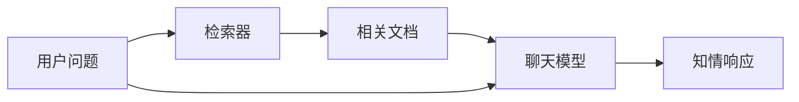
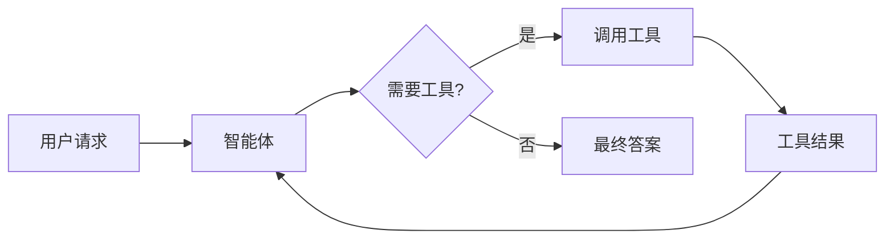
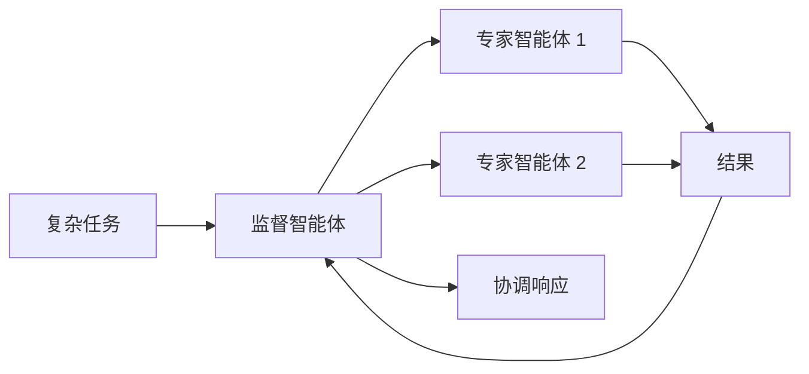

LangChain 的强大之处在于其组件如何协同工作，以创建复杂的 AI 应用。本页面提供了展示不同组件之间关系的图表。

## 核心组件生态系统

下面的图表展示了 LangChain 的主要组件如何连接以构成完整的 AI 应用：

```mermaid
graph TD
    %% Input processing
    subgraph "📥 输入处理"
        A[文本输入] --> B[文档加载器]
        B --> C[文本分割器]
        C --> D[文档 (Documents)]
    end

    %% Embedding & storage
    subgraph "🔢 嵌入与存储"
        D --> E[嵌入模型]
        E --> F[向量 (Vectors)]
        F --> G[(向量存储)]
    end

    %% Retrieval
    subgraph "🔍 检索"
        H[用户查询] --> I[嵌入模型]
        I --> J[查询向量]
        J --> K[检索器 (Retrievers)]
        K --> G
        G --> L[相关上下文]
    end

    %% Generation
    subgraph "🤖 生成"
        M[聊天模型] --> N[工具 (Tools)]
        N --> O[工具结果]
        O --> M
        L --> M
        M --> P[AI 响应]
    end

    %% Orchestration
    subgraph "🎯 编排 (Orchestration)"
        Q[智能体 (Agents)] --> M
        Q --> N
        Q --> K
        Q --> R[记忆 (Memory)]
    end
```

### 组件如何连接

每个组件层都建立在前一层的基础上：

1. **输入处理** – 将原始数据转换为结构化的文档。
2. **嵌入与存储** – 将文本转换为可搜索的向量表示。
3. **检索** – 根据用户的查询查找相关信息。
4. **生成** – 使用 AI 模型创建响应，可以选择配合工具。
5. **编排** – 通过智能体（Agents）和记忆系统协调所有操作。

## 组件类别

LangChain 将组件组织成以下主要类别：

| 类别 | 目的 | 关键组件 | 用例 |
|----------|---------|---------------|-----------|
| **[Models](/oss/javascript/langchain/models)** | AI 推理和生成 | 聊天模型、LLM、嵌入模型 | 文本生成、推理、语义理解 |
| **[Tools](/oss/javascript/langchain/tools)** | 外部能力 | API、数据库等 | 网页搜索、数据访问、计算 |
| **[Agents](/oss/javascript/langchain/agents)** | 编排与推理 | ReAct 智能体、工具调用智能体 | 非确定性工作流、决策制定 |
| **[Memory](/oss/javascript/langchain/short-term-memory)** | 上下文保持 | 消息历史、自定义状态 | 对话、有状态的交互 |
| **[Retrievers](/oss/javascript/integrations/retrievers)** | 信息访问 | 向量检索器、网页检索器 | RAG（检索增强生成）、知识库搜索 |
| **[Document processing](/oss/javascript/integrations/document_loaders)** | 数据摄取 | 加载器、分割器、转换器 | PDF 处理、网络爬取 |
| **[Vector Stores](/oss/javascript/integrations/vectorstores)** | 语义搜索 | Chroma、Pinecone、FAISS | 相似性搜索、嵌入存储 |

## 常见模式

### RAG（检索增强生成）


### 带工具的智能体（Agent with tools）


### 多智能体系统


## 了解更多

现在您已经了解了组件之间的相互关系，可以探索特定的领域：

- [构建您的第一个 RAG 系统](/oss/javascript/langchain/knowledge-base)
- [创建智能体](/oss/javascript/langchain/agents)
- [使用工具](/oss/javascript/langchain/tools)
- [设置记忆](/oss/javascript/langchain/short-term-memory)
- [浏览集成项](/oss/javascript/integrations/providers/overview)

---

<Callout icon="pen-to-square" iconType="regular">
    [Edit the source of this page on GitHub.](https://github.com/langchain-ai/docs/edit/main/src/oss\langchain\component-architecture.mdx)
</Callout>
<Tip icon="terminal" iconType="regular">
    [Connect these docs programmatically](/use-these-docs) to Claude, VSCode, and more via MCP for real-time answers.
</Tip>
