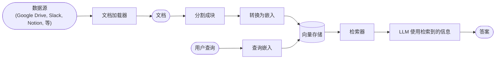
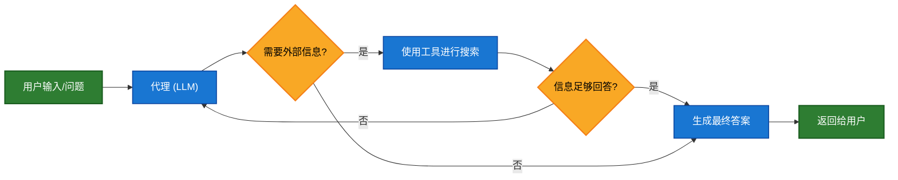
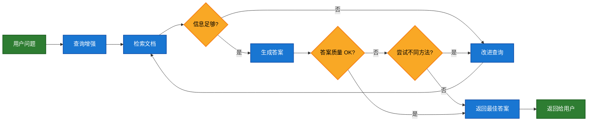

大型语言模型（LLMs）功能强大，但它们存在两个主要的局限性：

* **有限的上下文** — 它们无法一次性摄取整个语料库。
* **静态知识** — 它们的训练数据在某个时间点被固化了。

检索（Retrieval）通过在查询时间获取相关的外部知识来解决这些问题。这是**检索增强生成（Retrieval-Augmented Generation, RAG）**的基础：使用特定上下文的信息来增强 LLM 的回答能力。

## 构建知识库

**知识库（knowledge base）**是在检索过程中使用的文档或结构化数据的存储库。

如果您需要自定义知识库，可以使用 LangChain 的文档加载器（document loaders）和向量存储（vector stores）从您自己的数据中构建知识库。

<Note>
    如果您已经拥有知识库（例如 SQL 数据库、CRM 或内部文档系统），则**不**需要重建它。您可以：
    - 在 Agentic RAG 中将其连接为代理的**工具（tool）**。
    - 查询它，并将检索到的内容作为上下文提供给 LLM [（2 步 RAG）](#2-steprag)。
</Note>

请参阅以下教程，以了解如何构建可搜索的知识库和最小化的 RAG 工作流程：

<Card
    title="教程：语义搜索"
    icon="database"
    href="/oss/javascript/langchain/knowledge-base"
    arrow cta="了解更多"
>
    学习如何使用 LangChain 的文档加载器、嵌入（embeddings）和向量存储，从您自己的数据中创建可搜索的知识库。
    在本教程中，您将围绕一个 PDF 构建一个搜索引擎，使其能够检索与查询相关的段落。您还将在该引擎之上实现一个最小化的 RAG 工作流程，以了解如何将外部知识集成到 LLM 推理中。
</Card>

### 从检索到 RAG

检索允许 LLM 在运行时访问相关上下文。但大多数实际应用更进一步：它们将**检索与生成相结合**，以产生有事实依据、了解上下文的答案。

这是**检索增强生成（RAG）**背后的核心思想。检索管道成为一个更广泛系统的基础，该系统结合了搜索和生成。

### 检索流程

典型的检索工作流程如下所示：



每个组件都是模块化的：您可以替换加载器、分割器、嵌入或向量存储，而无需重写应用程序的逻辑。

### 构建模块

<Columns cols={2}>
    <Card
        title="文档加载器"
        icon="file-import"
        href="/oss/javascript/integrations/document_loaders"
        arrow cta="了解更多"
    >
        从外部源（如 Google Drive、Slack、Notion 等）中摄取数据，并返回标准化的 [`Document`](https://reference.langchain.com/javascript/classes/_langchain_core.documents.Document.html) 对象。
    </Card>


    <Card
        title="嵌入模型"
        icon="diagram-project"
        href="/oss/javascript/integrations/text_embedding"
        arrow
        cta="了解更多"
    >
        嵌入模型将文本转换为数字向量，使得意义相似的文本在该向量空间中彼此靠近。
    </Card>

    <Card
        title="向量存储"
        icon="database"
        href="/oss/javascript/integrations/vectorstores/"
        arrow
        cta="了解更多"
    >
        专门用于存储和搜索嵌入的数据库。
    </Card>

    <Card
        title="检索器"
        icon="binoculars"
        href="/oss/javascript/integrations/retrievers/"
        arrow
        cta="了解更多"
    >
        检索器是一种接口，它根据非结构化查询返回文档。
    </Card>
</Columns>

## RAG 架构

RAG 可以根据系统的需求以多种方式实现。我们在下面各节中概述每种类型。

| 架构 | 描述 | 控制力 | 灵活性 | 延迟 | 示例用例 |
|-------------------------|----------------------------------------------------------------------------|-----------|-------------|----------------|----------------------------------------------------|
| **2 步 RAG**          | 检索总是在生成之前发生。简单且可预测 | ✅ 高    | ❌ 低       | ⚡ 快         | 常见问题解答、文档机器人 |
| **Agentic RAG**         | 由 LLM 驱动的代理在推理过程中决定*何时*以及*如何*检索 | ❌ 低     | ✅ 高      | ⏳ 可变     | 具有访问多个工具的研究助理 |
| **混合（Hybrid）**              | 结合了两种方法的特点，并带有验证步骤 | ⚖️ 中等 | ⚖️ 中等   | ⏳ 可变     | 带有质量验证的特定领域问答 |

<Info>
**延迟（Latency）**: 延迟通常在 **2 步 RAG** 中更**可预测**，因为已知的 LLM 调用最大次数被限制住了。这种可预测性假设 LLM 推理时间是主要因素。然而，实际延迟也可能受到检索步骤性能的影响——例如 API 响应时间、网络延迟或数据库查询——这些可能会根据所使用的工具和基础设施而变化。
</Info>

### 2 步 RAG

在 **2 步 RAG** 中，检索步骤总是在生成步骤之前执行。这种架构简单且可预测，适用于许多应用场景，在这些场景中，检索相关文档是生成答案的明确先决条件。


<Card
    title="教程：检索增强生成 (RAG)"
    icon="robot"
    href="/oss/javascript/langchain/rag#rag-chains"
    arrow cta="了解更多"
>
    了解如何构建一个问答聊天机器人，该机器人可以根据您的数据使用检索增强生成来回答问题。
    本教程介绍了两种方法：
    * 一个 **RAG 代理**，它使用灵活的工具运行搜索——非常适合通用用途。
    * 一个 **2 步 RAG** 链，每个查询只需要一次 LLM 调用——对于更简单的任务来说快速而高效。
</Card>

### Agentic RAG

**代理检索增强生成（Agentic RAG）**结合了检索增强生成和基于代理（agent-based）推理的优势。与在回答前检索文档不同，由 LLM 驱动的代理会逐步推理，并在交互过程中决定**何时**以及**如何**检索信息。

<Tip>
代理启用 RAG 行为所需要的唯一一件事是访问一个或多个可以获取外部知识的**工具**——例如文档加载器、Web API 或数据库查询。
</Tip>




```typescript
import { tool, createAgent } from "langchain";

const fetchUrl = tool(
    (url: string) => {
        return `从 ${url} 获取的内容`;
    },
    { name: "fetch_url", description: "从 URL 获取文本内容" }
);

const agent = createAgent({
    model: "claude-sonnet-4-0",
    tools: [fetchUrl],
    systemPrompt,
});
```


<Expandable title="扩展示例：用于 LangGraph 的 llms.txt 的 Agentic RAG">

该示例实现了一个**代理 RAG 系统**，以帮助用户查询 LangGraph 文档。该代理首先加载 [llms.txt](https://llmstxt.org/)（其中列出了可用的文档 URL），然后可以根据用户的请求动态使用 `fetch_documentation` 工具来检索和处理相关内容。


```typescript
import { tool, createAgent, HumanMessage } from "langchain";
import * as z from "zod";

const ALLOWED_DOMAINS = ["https://langchain-ai.github.io/"];
const LLMS_TXT = "https://langchain-ai.github.io/langgraph/llms.txt";

const fetchDocumentation = tool(
  async (input) => {  // [!code highlight]
    if (!ALLOWED_DOMAINS.some((domain) => input.url.startsWith(domain))) {
      return `错误：URL 不允许。 必须以：${ALLOWED_DOMAINS.join(", ")} 开头`;
    }
    const response = await fetch(input.url);
    if (!response.ok) {
      throw new Error(`HTTP 错误！状态码：${response.status}`);
    }
    return response.text();
  },
  {
    name: "fetch_documentation",
    description: "获取并转换来自 URL 的文档",
    schema: z.object({
      url: z.string().describe("要获取的文档的 URL"),
    }),
  }
);

const llmsTxtResponse = await fetch(LLMS_TXT);
const llmsTxtContent = await llmsTxtResponse.text();

const systemPrompt = `
您是一位专业的 TypeScript 开发者和技术助理。
您的主要职责是帮助用户解决有关 LangGraph 及相关工具的问题。

说明：

1. 如果用户提出的问题不确定——或者很可能涉及 API 使用、
   行为或配置——则**必须**使用 \`fetch_documentation\` 工具来查阅相关文档。
2. 引用文档时，请清晰总结并包含相关内容上下文。
3. 不得使用允许域之外的任何 URL。
4. 如果文档获取失败，请告知用户并根据您最好的专家理解继续。

您可以从以下批准的来源访问官方文档：

${llmsTxtContent}

您**必须**查阅文档以获取最新的文档，
才能回答用户关于 LangGraph 的问题。

您的答案应清晰、简洁且技术准确。
`;

const tools = [fetchDocumentation];

const agent = createAgent({
  model: "claude-sonnet-4-0"
  tools,  // [!code highlight]
  systemPrompt,  // [!code highlight]
  name: "Agentic RAG",
});

const response = await agent.invoke({
  messages: [
    new HumanMessage(
      "编写一个简短的示例，说明如何使用预构建的 create react agent 来实现一个 langgraph 代理。该代理应该能够查找股票价格信息。"
    ),
  ],
});

console.log(response.messages.at(-1)?.content);
```

</Expandable>

<Card
    title="教程：检索增强生成 (RAG)"
    icon="robot"
    href="/oss/javascript/langchain/rag"
    arrow cta="了解更多"
>
    了解如何构建一个问答聊天机器人，该机器人可以根据您的数据使用检索增强生成来回答问题。
    本教程介绍了两种方法：
    * 一个 **RAG 代理**，它使用灵活的工具运行搜索——非常适合通用用途。
    * 一个 **2 步 RAG** 链，每个查询只需要一次 LLM 调用——对于更简单的任务来说快速而高效。
</Card>

### 混合 RAG

混合 RAG 结合了 2 步 RAG 和 Agentic RAG 的特点。它引入了中间步骤，例如查询预处理、检索验证和后生成检查。这些系统在保持对执行的控制的同时，提供了比固定管道更多的灵活性。

典型的组件包括：

* **查询增强（Query enhancement）**: 修改输入问题以提高检索质量。这可以包括重写不明确的查询、生成多个查询变体或使用附加上下文扩展查询。
* **检索验证（Retrieval validation）**: 评估检索到的文档是否相关且足够。如果不相关，系统可能会改进查询并再次检索。
* **答案验证（Answer validation）**: 检查生成答案的准确性、完整性以及是否与源内容一致。如果需要，系统可以重新生成或修改答案。

该架构通常支持这些步骤之间的多次迭代：



这种架构适用于：

* 存在模糊或未指定查询的应用程序
* 需要验证或质量控制步骤的系统
* 涉及多个来源或迭代改进的工作流程

<Card
    title="教程：带有自我修正的 Agentic RAG"
    icon="robot"
    href="/oss/javascript/langgraph/agentic-rag"
    arrow cta="了解更多"
>
    一个 **Hybrid RAG** 的示例，它将代理推理与检索和自我修正相结合。
</Card>

---

<Callout icon="pen-to-square" iconType="regular">
    [Edit the source of this page on GitHub.](https://github.com/langchain-ai/docs/edit/main/src/oss\langchain\retrieval.mdx)
</Callout>
<Tip icon="terminal" iconType="regular">
    [Connect these docs programmatically](/use-these-docs) to Claude, VSCode, and more via MCP for real-time answers.
</Tip>
