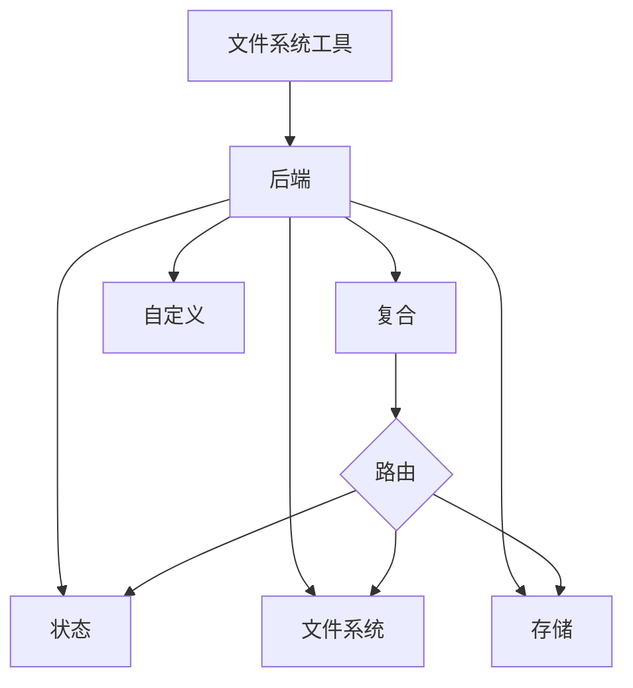

深度代理通过 `ls`、`read_file`、`write_file`、`edit_file`、`glob` 和 `grep` 等工具，向代理暴露一个文件系统界面。这些工具通过一个可插拔的后端（Backend）来操作。



本页面将解释如何 [选择一个后端](#specify-a-backend)，[将不同路径路由到不同后端](#route-to-different-backends)，[实现您自己的虚拟文件系统](#use-a-virtual-filesystem)（例如 S3 或 Postgres），[添加策略钩子](#add-policy-hooks)，以及 [遵循后端协议](#protocol-reference)。

## 快速开始

以下是您可以快速用于深度代理的一些预构建文件系统后端：

| 内置后端 | 描述 |
|---|---|
| [默认](#statebackend-ephemeral) | `agent = create_deep_agent()` <br></br> 内存中暂存（Ephemeral in state）。代理的默认文件系统后端存储在 `langgraph` 状态中。请注意，此文件系统仅在**单个线程内**保持有效。 |
| [本地文件系统持久化](#filesystembackend-local-disk) | `agent = create_deep_agent(backend=FilesystemBackend(root_dir="/Users/nh/Desktop/"))` <br></br> 这为深度代理提供了对其本地机器文件系统的访问权限。您可以指定代理可以访问的根目录。请注意，任何提供的 `root_dir` 都必须是绝对路径。 |
| [持久化存储（LangGraph Store）](#storebackend-langgraph-store) | `agent = create_deep_agent(backend=lambda rt: StoreBackend(rt))` <br></br> 这使代理能够访问**跨线程持久化**的长期存储。这非常适合存储在多次执行中对代理适用的长期记忆或指令。 |
| [复合（Composite）](#compositebackend-router) | 默认是内存暂存，`/memories/` 是持久化的。Composite 后端具有最大的灵活性。您可以指定文件系统中的不同路由指向不同的后端。有关可立即粘贴的示例，请参阅下面的 Composite 路由。 |


## 内置后端

### StateBackend (内存暂存)

```python
# 默认情况下，我们提供一个 StateBackend
agent = create_deep_agent()

# 在底层实现中，它看起来像这样
from deepagents.backends import StateBackend

agent = create_deep_agent(
    backend=(lambda rt: StateBackend(rt))   # 注意工具通过 runtime.state 访问 State
)
```


**工作原理：**
- 将文件存储在当前线程的 LangGraph Agent 状态中。
- 通过检查点（Checkpoints）在同一线程中的多次代理轮次中保持持久化。

**最适合：**
- 作为代理的草稿板（scratch pad），用于写入中间结果。
- 自动清除大型工具输出，代理随后可以分塊读取。

### FilesystemBackend (本地磁盘)

```python
from deepagents.backends import FilesystemBackend

agent = create_deep_agent(
    backend=FilesystemBackend(root_dir=".", virtual_mode=True)
)
```


**工作原理：**
- 在可配置的 `root_dir` 下读/写真实文件。
- 您可以选择设置 `virtual_mode=True` 以在 `root_dir` 下对路径进行沙箱化和标准化处理。
- 使用安全的路径解析，尽可能阻止不安全的符号链接遍历，可以使用 `ripgrep` 实现快速的 `grep`。

**最适合：**
- 机器上的本地项目
- CI 沙箱
- 挂载的持久化卷

### StoreBackend (LangGraph 存储)

```python
from langgraph.store.memory import InMemoryStore
from deepagents.backends import StoreBackend

agent = create_deep_agent(
    backend=(lambda rt: StoreBackend(rt)),   # 注意工具通过 runtime.store 访问 Store
    store=InMemoryStore()
)
```


**工作原理：**
- 将文件存储在运行时提供的 LangGraph `BaseStore` 中，从而实现跨线程的持久化存储。

**最适合：**
- 当您已经使用配置好的 LangGraph 存储（例如，`BaseStore` 后面的 Redis、Postgres 或云实现）运行时。
- 当您通过 LangSmith Deployments 部署代理时（会自动为您的代理配置一个存储）。


### CompositeBackend (路由)

```python
from deepagents import create_deep_agent
from deepagents.backends import CompositeBackend, StateBackend, StoreBackend
from langgraph.store.memory import InMemoryStore

composite_backend = lambda rt: CompositeBackend(
    default=StateBackend(rt),
    routes={
        "/memories/": StoreBackend(rt),
    }
)

agent = create_deep_agent(
    backend=composite_backend,
    store=InMemoryStore()  # 传递给 create_deep_agent，而不是后端
)
```


**工作原理：**
- 根据路径前缀将文件操作路由到不同的后端。
- 在列表和搜索结果中保留原始路径前缀。

**最适合：**
- 当您希望为代理提供内存暂存和跨线程存储时，CompositeBackend 允许您提供 StateBackend 和 StoreBackend。
- 当您有多个信息源希望作为单个文件系统的一部分提供给代理时。
    - 例如：在 `/memories/` 下以一种方式存储长期记忆（使用 Store），并且您也有可通过 `/docs/` 访问的文档（使用自定义后端）。

## 选择一个后端

- 通过 `create_deep_agent(backend=...)` 传递一个后端。文件系统中间件将对所有工具使用它。
- 您可以传递：
  - 一个实现 `BackendProtocol` 的实例（例如 `FilesystemBackend(root_dir=".")`），或
  - 一个工厂函数（`BackendFactory = Callable[[ToolRuntime], BackendProtocol]`），适用于需要运行时上下文的后端（如 `StateBackend` 或 `StoreBackend`）。
- 如果省略，默认值为 `lambda rt: StateBackend(rt)`。


## 路由到不同的后端

将命名空间的部分路由到不同的后端。通常用于持久化 `/memories/*` 并保持所有其他内容为内存暂存。

```python
from deepagents import create_deep_agent
from deepagents.backends import CompositeBackend, StateBackend, FilesystemBackend

composite_backend = lambda rt: CompositeBackend(
    default=StateBackend(rt),
    routes={
        "/memories/": FilesystemBackend(root_dir="/deepagents/myagent", virtual_mode=True),
    },
)

agent = create_deep_agent(backend=composite_backend)
```


行为：
- `/workspace/plan.md` → StateBackend（内存暂存）
- `/memories/agent.md` → 位于 `/deepagents/myagent` 下的 FilesystemBackend
- `ls`、`glob`、`grep` 聚合结果并显示原始路径前缀。

注意：
- 较长的前缀优先（例如，路由 `"/memories/projects/"` 可以覆盖 `"/memories/"`）。
- 对于 StoreBackend 路由，请确保代理运行时提供了存储（即 `runtime.store`）。

## 使用虚拟文件系统

构建自定义后端，将远程或数据库文件系统（例如 S3 或 Postgres）投影到工具命名空间中。

设计指南：

- 路径是绝对路径（`/x/y.txt`）。确定如何将它们映射到存储密钥/行。
- 高效实现 `ls_info` 和 `glob_info`（在服务器端可用列表时，否则进行本地过滤）。
- 对于文件不存在或正则表达式无效的情况，返回用户可读的错误字符串。
- 对于外部持久化，在结果中将 `files_update` 设置为 `None`；只有内存暂存后端才应返回 `files_update` 字典。

S3 风格大纲：

```python
from deepagents.backends.protocol import BackendProtocol, WriteResult, EditResult
from deepagents.backends.utils import FileInfo, GrepMatch

class S3Backend(BackendProtocol):
    def __init__(self, bucket: str, prefix: str = ""):
        self.bucket = bucket
        self.prefix = prefix.rstrip("/")

    def _key(self, path: str) -> str:
        return f"{self.prefix}{path}"

    def ls_info(self, path: str) -> list[FileInfo]:
        # 在 _key(path) 下列出对象；构建 FileInfo 条目 (path, size, modified_at)
        ...

    def read(self, file_path: str, offset: int = 0, limit: int = 2000) -> str:
        # 获取对象；返回编号内容或错误字符串
        ...

    def grep_raw(self, pattern: str, path: str | None = None, glob: str | None = None) -> list[GrepMatch] | str:
        # 可选地在服务器端过滤；否则列出并扫描内容
        ...

    def glob_info(self, pattern: str, path: str = "/") -> list[FileInfo]:
        # 相对于 path 在键上应用 glob
        ...

    def write(self, file_path: str, content: str) -> WriteResult:
        # 强制执行仅创建语义；返回 WriteResult(path=file_path, files_update=None)
        ...

    def edit(self, file_path: str, old_string: str, new_string: str, replace_all: bool = False) -> EditResult:
        # 读取 → 替换 (遵守唯一性 vs replace_all) → 写入 → 返回出现次数
        ...
```


Postgres 风格大纲：

- 表 `files(path text primary key, content text, created_at timestamptz, modified_at timestamptz)`
- 将工具操作映射到 SQL：
  - `ls_info` 使用 `WHERE path LIKE $1 || '%'`
  - `glob_info` 在 SQL 中过滤或获取后在 Python 中应用 glob
  - `grep_raw` 可通过扩展名或最后修改时间获取候选行，然后扫描内容

## 添加策略钩子

通过子类化或包装后端来强制执行企业规则。

阻止在选定前缀下写入/编辑（子类化）：

```python
from deepagents.backends.filesystem import FilesystemBackend
from deepagents.backends.protocol import WriteResult, EditResult

class GuardedBackend(FilesystemBackend):
    def __init__(self, *, deny_prefixes: list[str], **kwargs):
        super().__init__(**kwargs)
        self.deny_prefixes = [p if p.endswith("/") else p + "/" for p in deny_prefixes]

    def write(self, file_path: str, content: str) -> WriteResult:
        if any(file_path.startswith(p) for p in self.deny_prefixes):
            return WriteResult(error=f"Writes are not allowed under {file_path}")
        return super().write(file_path, content)

    def edit(self, file_path: str, old_string: str, new_string: str, replace_all: bool = False) -> EditResult:
        if any(file_path.startswith(p) for p in self.deny_prefixes):
            return EditResult(error=f"Edits are not allowed under {file_path}")
        return super().edit(file_path, old_string, new_string, replace_all)
```


通用包装器（适用于任何后端）：

```python
from deepagents.backends.protocol import BackendProtocol, WriteResult, EditResult
from deepagents.backends.utils import FileInfo, GrepMatch

class PolicyWrapper(BackendProtocol):
    def __init__(self, inner: BackendProtocol, deny_prefixes: list[str] | None = None):
        self.inner = inner
        self.deny_prefixes = [p if p.endswith("/") else p + "/" for p in (deny_prefixes or [])]

    def _deny(self, path: str) -> bool:
        return any(path.startswith(p) for p in self.deny_prefixes)

    def ls_info(self, path: str) -> list[FileInfo]:
        return self.inner.ls_info(path)
    def read(self, file_path: str, offset: int = 0, limit: int = 2000) -> str:
        return self.inner.read(file_path, offset=offset, limit=limit)
    def grep_raw(self, pattern: str, path: str | None = None, glob: str | None = None) -> list[GrepMatch] | str:
        return self.inner.grep_raw(pattern, path, glob)
    def glob_info(self, pattern: str, path: str = "/") -> list[FileInfo]:
        return self.inner.glob_info(pattern, path)
    def write(self, file_path: str, content: str) -> WriteResult:
        if self._deny(file_path):
            return WriteResult(error=f"Writes are not allowed under {file_path}")
        return self.inner.write(file_path, content)
    def edit(self, file_path: str, old_string: str, new_string: str, replace_all: bool = False) -> EditResult:
        if self._deny(file_path):
            return EditResult(error=f"Edits are not allowed under {file_path}")
        return self.inner.edit(file_path, old_string, new_string, replace_all)
```


## 协议参考

后端必须实现 `BackendProtocol`。

必需的端点：
- `ls_info(path: str) -> list[FileInfo]`
  - 返回包含至少 `path` 的条目。在可用时包含 `is_dir`、`size`、`modified_at`。按 `path` 排序以确保输出确定性。
- `read(file_path: str, offset: int = 0, limit: int = 2000) -> str`
  - 返回编号内容。文件未找到时，返回 `"Error: File '/x' not found"`。
- `grep_raw(pattern: str, path: Optional[str] = None, glob: Optional[str] = None) -> list[GrepMatch] | str`
  - 返回结构化的匹配项。对于无效的正则表达式，返回一个字符串，如 `"Invalid regex pattern: ..."`（不要抛出异常）。
- `glob_info(pattern: str, path: str = "/") -> list[FileInfo]`
  - 返回匹配的文件作为 `FileInfo` 条目（如果没有匹配，则为空列表）。
- `write(file_path: str, content: str) -> WriteResult`
  - 仅创建。冲突时，返回 `WriteResult(error=...)`。成功时，设置 `path`；对于状态后端设置 `files_update={...}`；外部后端应使用 `files_update=None`。
- `edit(file_path: str, old_string: str, new_string: str, replace_all: bool = False) -> EditResult`
  - 除非 `replace_all=True`，否则强制执行 `old_string` 的唯一性。如果未找到，则返回错误。成功时包含 `occurrences`。

支持的类型：
- `WriteResult(error, path, files_update)`
- `EditResult(error, path, files_update, occurrences)`
- `FileInfo` 包含字段：`path`（必需），可选地 `is_dir`、`size`、`modified_at`。
- `GrepMatch` 包含字段：`path`、`line`、`text`。

---

<Callout icon="pen-to-square" iconType="regular">
    [Edit the source of this page on GitHub.](https://github.com/langchain-ai/docs/edit/main/src/oss\deepagents\backends.mdx)
</Callout>
<Tip icon="terminal" iconType="regular">
    [Connect these docs programmatically](/use-these-docs) to Claude, VSCode, and more via MCP for real-time answers.
</Tip>
