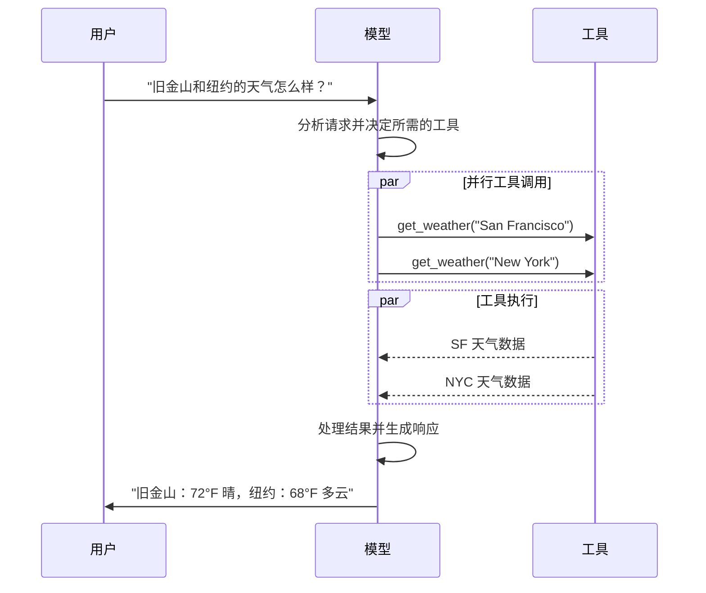

```mdx
---
title: 模型
---

import ChatModelTabsPy from '/snippets/chat-model-tabs.mdx';
import ChatModelTabsJS from '/snippets/chat-model-tabs-js.mdx';

[大型语言模型 (LLMs)](https://en.wikipedia.org/wiki/Large_language_model) 是强大的 AI 工具，它们能够像人类一样理解和生成文本。它们的用途非常广泛，可以用来撰写内容、翻译语言、总结信息以及回答问题，而无需针对每项任务进行专门的训练。

除了文本生成之外，许多模型还支持以下功能：

* <Icon icon="hammer" size={16} /> [工具调用 (Tool calling)](#tool-calling) - 调用外部工具（如数据库查询或 API 调用），并在其响应中使用结果。
* <Icon icon="shapes" size={16} /> [结构化输出 (Structured output)](#structured-output) - 模型的响应被限制为遵循定义的格式。
* <Icon icon="image" size={16} /> [多模态 (Multimodality)](#multimodal) - 处理并返回文本以外的数据，例如图像、音频和视频。
* <Icon icon="brain" size={16} /> [推理 (Reasoning)](#reasoning) - 模型执行多步推理以得出结论。

模型是 [代理 (agents)](/oss/python/langchain/agents) 的推理引擎。它们驱动代理的决策过程，决定调用哪些工具、如何解释结果以及何时提供最终答案。

您选择的模型的质量和能力直接影响您代理的基线可靠性和性能。不同的模型在不同任务上表现出色——有些更擅长遵循复杂指令，有些更擅长结构化推理，还有一些支持更大的上下文窗口以处理更多信息。

LangChain 的标准模型接口为您提供了访问许多不同提供商集成的能力，这使得您可以轻松试验和切换模型，以找到最适合您用例的模型。

<Info>
    有关特定于提供商的集成信息和功能，请参阅提供商的 [聊天模型页面](/oss/python/integrations/chat)。
</Info>

## 基本用法

模型可用于两种方式：

1. **配合代理使用** - 在创建 [代理](/oss/python/langchain/agents#model) 时可以动态指定模型。
2. **独立使用** - 模型可以直接被调用（在代理循环之外），用于文本生成、分类或提取等任务，而无需代理框架。

相同的模型接口在这两种情况下都有效，这为您提供了灵活性，可以从简单的任务开始，根据需要扩展到更复杂的基于代理的工作流。

### 初始化模型

在 LangChain 中使用独立模型的最简单方法是使用 [`init_chat_model`](https://reference.langchain.com/python/langchain/models/#langchain.chat_models.init_chat_model) 从您选择的 [聊天模型提供商](/oss/python/integrations/chat) 初始化一个模型（示例如下）：

<ChatModelTabsPy />
```python
response = model.invoke("为什么鹦鹉会说话？")
```

有关更多详细信息，请参阅 [`init_chat_model`](https://reference.langchain.com/python/langchain/models/#langchain.chat_models.init_chat_model)，包括如何传递模型[参数](#parameters)的信息。


### 关键方法

<Card title="调用 (Invoke)" href="#invoke" icon="paper-plane" arrow="true" horizontal>
    模型接收消息作为输入，并在生成完整响应后输出消息。
</Card>
<Card title="流式传输 (Stream)" href="#stream" icon="tower-broadcast" arrow="true" horizontal>
    调用模型，但实时流式传输生成过程中的输出。
</Card>
<Card title="批量处理 (Batch)" href="#batch" icon="grip" arrow="true" horizontal>
    将多个请求以批处理方式发送给模型，以实现更高效的处理。
</Card>

<Info>
    除了聊天模型之外，LangChain 还为其他相邻技术提供了支持，例如嵌入模型和向量存储。有关详细信息，请参阅[集成页面](/oss/python/integrations/providers/overview)。
</Info>

## 参数

聊天模型接受可用于配置其行为的参数。支持的参数集因模型和提供商而异，但标准参数包括：

<ParamField body="model" type="string" required>
   要与提供商一起使用的特定模型的名称或标识符。您也可以使用 `'{model_provider}:{model}'` 格式在一个参数中指定模型及其提供商，例如 `'openai:o1'`。
</ParamField>

<ParamField body="api_key" type="string">
    向模型提供商进行身份验证所需的密钥。通常在您注册以访问模型时颁发。通常通过设置一个 <Tooltip tip="一个在程序外部设置其值的变量，通常通过操作系统或微服务内置的功能实现。">环境变量</Tooltip> 来访问。
</ParamField>


<ParamField body="temperature" type="number">
    控制模型输出的随机性。较高的数值使响应更具创造性；较低的数值使其更具确定性。
</ParamField>

<ParamField body="max_tokens" type="number">
    限制响应中 <Tooltip tip="模型读取和生成的最小单位。提供商的定义可能不同，但总的来说，它们可以代表一个完整的单词或单词的一部分。">token</Tooltip> 的总数，从而有效地控制输出的长度。
</ParamField>


<ParamField body="timeout" type="number">
    等待模型响应的最大时间（以秒为单位），超过此时间将取消请求。
</ParamField>

<ParamField body="max_retries" type="number">
    系统在因网络超时或速率限制等问题导致请求失败时，将尝试重新发送请求的最大次数。
</ParamField>


使用 [`init_chat_model`](https://reference.langchain.com/python/langchain/models/#langchain.chat_models.init_chat_model) 时，将这些参数作为内联的 <Tooltip tip="任意关键字参数" cta="了解更多" href="https://www.w3schools.com/python/python_args_kwargs.asp">`**kwargs`</Tooltip> 传递：

```python 使用模型参数初始化
model = init_chat_model(
    "claude-sonnet-4-5-20250929",
    # 传递给模型的 Kwargs：
    temperature=0.7,
    timeout=30,
    max_tokens=1000,
)
```


<Info>
    每个聊天模型集成可能包含用于控制特定于提供商的功能的附加参数。

    例如，[ChatOpenAI](https://reference.langchain.com/python/integrations/langchain_openai/ChatOpenAI)(/oss/integrations/chat/openai) 具有 `use_responses_api` 参数，用于确定是使用 OpenAI 响应 API 还是完成 API。

    要查找给定聊天模型支持的所有参数，请前往 [聊天模型集成页面](/oss/python/integrations/chat)。
</Info>

---

## 调用 (Invocation)

必须调用聊天模型才能生成输出。有三种主要的调用方法，每种方法都适用于不同的用例。

### 调用 (Invoke)

调用模型最直接的方法是使用 [`invoke()`](https://reference.langchain.com/python/langchain_core/language_models/#langchain_core.language_models.chat_models.BaseChatModel.invoke)，并传入单个消息或消息列表。

```python 单条消息
response = model.invoke("为什么鹦鹉有彩色羽毛？")
print(response)
```


可以向聊天模型提供消息列表，以表示对话历史记录。每条消息都有一个角色，模型使用该角色来指示谁发送了该消息。

有关角色的更多详细信息、类型和内容，请参阅 [消息](/oss/python/langchain/messages) 指南。

```python 字典格式
conversation = [
    {"role": "system", "content": "你是一个乐于助人的助手，可以将英语翻译成法语。"},
    {"role": "user", "content": "翻译：我喜欢编程。"},
    {"role": "assistant", "content": "J'adore la programmation."},
    {"role": "user", "content": "翻译：我喜欢构建应用程序。"}
]

response = model.invoke(conversation)
print(response)  # AIMessage("J'adore créer des applications.")
```
```python 消息对象格式
from langchain.messages import HumanMessage, AIMessage, SystemMessage

conversation = [
    SystemMessage("你是一个乐于助人的助手，可以将英语翻译成法语。"),
    HumanMessage("翻译：我喜欢编程。"),
    AIMessage("J'adore la programmation."),
    HumanMessage("翻译：我喜欢构建应用程序。")
]

response = model.invoke(conversation)
print(response)  # AIMessage("J'adore créer des applications.")
```


<Info>
    如果调用的返回类型是字符串 (string)，请确保您使用的是聊天模型而不是 LLM。旧式的文本补全 LLM 直接返回字符串。LangChain 的聊天模型以 "Chat" 开头，例如 [`ChatOpenAI`](https://reference.langchain.com/python/integrations/langchain_openai/ChatOpenAI)(/oss/integrations/chat/openai)。
</Info>

### 流式传输 (Stream)

大多数模型可以在生成输出内容时对其进行流式传输。通过渐进式显示输出，流式传输可以显著改善用户体验，特别是对于较长的响应。

调用 [`stream()`](https://reference.langchain.com/python/langchain_core/language_models/#langchain_core.language_models.chat_models.BaseChatModel.stream) 会返回一个 <Tooltip tip="一个对象，可以逐步按顺序访问集合中的每个项目。">迭代器 (iterator)</Tooltip>，它会在生成输出块时产生这些块。您可以使用循环实时处理每个块：

<CodeGroup>
    ```python 基本文本流式传输
    for chunk in model.stream("为什么鹦鹉有彩色羽毛？"):
        print(chunk.text, end="|", flush=True)
    ```

    ```python 流式传输工具调用、推理和其他内容
    for chunk in model.stream("天空是什么颜色的？"):
        for block in chunk.content_blocks:
            if block["type"] == "reasoning" and (reasoning := block.get("reasoning")):
                print(f"推理: {reasoning}")
            elif block["type"] == "tool_call_chunk":
                print(f"工具调用块: {block}")
            elif block["type"] == "text":
                print(block["text"])
            else:
                ...
    ```
</CodeGroup>


与 [`invoke()`](#invoke)（它在模型完成生成其完整响应后返回单个 [`AIMessage`](https://reference.langchain.com/python/langchain/messages/#langchain.messages.AIMessage)）不同，`stream()` 返回多个 [`AIMessageChunk`](https://reference.langchain.com/python/langchain/messages/#langchain.messages.AIMessageChunk) 对象，每个对象包含输出文本的一部分。重要的是，流中的每个块都旨在通过累加组成一个完整的消息：

```python 构造一个 AIMessage
full = None  # None | AIMessageChunk
for chunk in model.stream("天空是什么颜色的？"):
    full = chunk if full is None else full + chunk
    print(full.text)

# The
# The sky
# The sky is
# The sky is typically
# The sky is typically blue
# ...

print(full.content_blocks)
# [{"type": "text", "text": "The sky is typically blue..."}]
```


结果消息可以像使用 [`invoke()`](#invoke) 生成的消息一样处理——例如，它可以被聚合到消息历史记录中，并作为对话上下文传递回模型。

<Warning>
    流式传输仅在程序的所有步骤都知道如何处理块流时才有效。例如，一个不是流式传输兼容的应用程序，可能需要在处理之前将整个输出存储在内存中。
</Warning>

<Accordion title="高级流式传输主题">
    <Accordion title="流式传输事件">
        LangChain 聊天模型还可以使用 `astream_events()` 流式传输语义事件。

        这简化了基于事件类型和其他元数据的过滤，并在后台聚合完整的消息。示例如下。

        ```python
        async for event in model.astream_events("Hello"):

            if event["event"] == "on_chat_model_start":
                print(f"输入: {event['data']['input']}")

            elif event["event"] == "on_chat_model_stream":
                print(f"Token: {event['data']['chunk'].text}")

            elif event["event"] == "on_chat_model_end":
                print(f"完整消息: {event['data']['output'].text}")

            else:
                pass
        ```
        ```txt
        输入: Hello
        Token: Hi
        Token:  there
        Token: !
        Token:  How
        Token:  can
        Token:  I
        ...
        完整消息: Hi there! How can I help today?
        ```

        <Tip>
            有关事件类型和其他详细信息，请参阅 [`astream_events()`](https://reference.langchain.com/python/langchain_core/language_models/#langchain_core.language_models.chat_models.BaseChatModel.astream_events) 参考。
        </Tip>


    </Accordion>
    <Accordion title="“自动流式传输”聊天模型">
        LangChain 通过在某些情况下自动启用流式传输模式来简化聊天模型的流式传输，即使您没有明确调用流式传输方法也是如此。当您使用非流式传输的 invoke 方法但仍希望流式传输整个应用程序（包括聊天模型的中间结果）时，这尤其有用。

        例如，在 [LangGraph 代理](/oss/python/langchain/agents)中，您可以在节点内调用 `model.invoke()`，但在流式传输模式运行时，LangChain 会自动委托给流式传输。

        #### 工作原理

        当您 `invoke()` 聊天模型时，如果 LangChain 检测到您正在尝试流式传输整个应用程序，它将自动切换到内部流式传输模式。就使用 invoke 的代码而言，调用结果与以往相同；但是，在聊天模型流式传输期间，LangChain 会负责调用 LangChain 回调系统中的 [`on_llm_new_token`](https://reference.langchain.com/python/langchain_core/callbacks/#langchain_core.callbacks.base.AsyncCallbackHandler.on_llm_new_token) 事件。

        回调事件允许 LangGraph 的 `stream()` 和 `astream_events()` 实时显示聊天模型的输出。


    </Accordion>
</Accordion>

### 批量处理 (Batch)

对模型集合的独立请求进行批量处理可以显著提高性能并降低成本，因为处理可以并行进行：

```python 批量处理
responses = model.batch([
    "为什么鹦鹉有彩色羽毛？",
    "飞机是如何飞行的？",
    "什么是量子计算？"
])
for response in responses:
    print(response)
```

<Note>
    本节介绍了一个聊天模型方法 [`batch()`](https://reference.langchain.com/python/langchain_core/language_models/#langchain_core.language_models.chat_models.BaseChatModel.batch)，它在客户端并行化模型调用。

    它与推理提供商支持的批处理 API（例如 [OpenAI](https://platform.openai.com/docs/guides/batch) 或 [Anthropic](https://platform.claude.com/docs/en/build-with-claude/batch-processing#message-batches-api)）**不同**。
</Note>

默认情况下，[batch()](https://reference.langchain.com/python/langchain_core/language_models/#langchain_core.language_models.chat_models.BaseChatModel.batch) 只返回整个批处理的最终输出。如果您希望在每个输入完成生成时收到其输出，则可以使用 [`batch_as_completed()`](https://reference.langchain.com/python/langchain_core/language_models/#langchain_core.language_models.chat_models.BaseChatModel.batch_as_completed) 来流式传输结果：

```python 完成后生成批处理响应
for response in model.batch_as_completed([
    "为什么鹦鹉有彩色羽毛？",
    "飞机是如何飞行的？",
    "什么是量子计算？"
]):
    print(response)
```
<Note>
    在使用 [`batch_as_completed()`](https://reference.langchain.com/python/langchain_core/language_models/#langchain_core.language_models.chat_models.BaseChatModel.batch_as_completed) 时，结果可能会乱序到达。每个结果都包含输入索引，以便于匹配和重建原始顺序。
</Note>

<Tip>
    当使用 [`batch()`](https://reference.langchain.com/python/langchain_core/language_models/#langchain_core.language_models.chat_models.BaseChatModel.batch) 或 [`batch_as_completed()`](https://reference.langchain.com/python/langchain_core/language_models/#langchain_core.language_models.chat_models.BaseChatModel.batch_as_completed) 处理大量输入时，您可能希望控制并行调用的最大数量。这可以通过在 [`RunnableConfig`](https://reference.langchain.com/python/langchain_core/runnables/#langchain_core.runnables.RunnableConfig) 字典中设置 [`max_concurrency`](https://reference.langchain.com/python/langchain_core/runnables/#langchain_core.runnables.RunnableConfig.max_concurrency) 属性来完成。

    ```python 带有最大并发数的批量处理
    model.batch(
        list_of_inputs,
        config={
            'max_concurrency': 5,  # 限制为 5 个并行调用
        }
    )
    ```

    有关支持的属性的完整列表，请参阅 [`RunnableConfig`](https://reference.langchain.com/python/langchain_core/runnables/#langchain_core.runnables.RunnableConfig) 参考。
</Tip>

有关批量处理的更多详细信息，请参阅 [参考资料](https://reference.langchain.com/python/langchain_core/language_models/#langchain_core.language_models.chat_models.BaseChatModel.batch)。


---

## 工具调用 (Tool calling)

模型可以请求调用执行任务的工具，例如从数据库中获取数据、搜索网络或运行代码。工具是以下两者的配对：

1. 模式（Schema），包括工具的名称、描述和/或参数定义（通常是 JSON 模式）。
2. 要执行的函数或 <Tooltip tip="一个可以挂起执行并在稍后恢复执行的方法">协程</Tooltip>。

<Note>
    您可能会听到“函数调用 (function calling)”这个术语。我们将其与“工具调用 (tool calling)”交替使用。
</Note>

以下是用户和模型之间基本的工具调用流程：




要使您定义的工具可供模型使用，您必须使用 [`bind_tools`](https://reference.langchain.com/python/langchain_core/language_models/#langchain_core.language_models.chat_models.BaseChatModel.bind_tools) 将它们绑定起来。在后续的调用中，模型可以根据需要选择调用任何已绑定的工具。


一些模型提供商提供可通过模型或调用参数启用的[内置工具](https://models.dev/)（例如，Web 搜索和代码解释器），例如使用 [`ChatOpenAI`](/oss/python/integrations/chat/openai) 或 [`ChatAnthropic`](/oss/python/integrations/chat/anthropic)。请查看相应的[提供商参考](/oss/python/integrations/providers/overview)以了解详细信息。

<Tip>
    有关创建工具的详细信息和其他选项，请参阅[工具](/oss/python/langchain/tools)指南。
</Tip>

```python 绑定用户工具
from langchain.tools import tool

@tool
def get_weather(location: str) -> str:
    """获取某地的天气。"""
    return f"It's sunny in {location}."


model_with_tools = model.bind_tools([get_weather])  # [!code highlight]

response = model_with_tools.invoke("波士顿天气怎么样？")
for tool_call in response.tool_calls:
    # 查看模型执行的工具调用
    print(f"工具: {tool_call['name']}")
    print(f"参数: {tool_call['args']}")
```


当绑定用户定义的工具时，模型的响应包括执行工具的**请求**。当独立使用模型时（不使用 [代理](/oss/python/langchain/agents)），您需要负责执行请求的工具并将结果返回给模型，以供后续推理使用。当使用 [代理](/oss/python/langchain/agents) 时，代理循环会为您处理工具执行循环。

下面展示了一些使用工具调用的常见方法。

<AccordionGroup>
    <Accordion title="工具执行循环" icon="arrow-rotate-right">
        当模型返回工具调用时，您需要执行这些工具并将结果传回模型。这会创建一个对话循环，模型可以在其中使用工具结果生成其最终响应。LangChain 包含 [代理](/oss/python/langchain/agents) 抽象，可以为您处理这种编排。

        这是一个执行此操作的简单示例：

        ```python 工具执行循环
        # 将（可能多个）工具绑定到模型
        model_with_tools = model.bind_tools([get_weather])

        # 步骤 1: 模型生成工具调用
        messages = [{"role": "user", "content": "波士顿天气怎么样？"}]
        ai_msg = model_with_tools.invoke(messages)
        messages.append(ai_msg)

        # 步骤 2: 执行工具并收集结果
        for tool_call in ai_msg.tool_calls:
            # 使用生成的参数执行工具
            tool_result = get_weather.invoke(tool_call)
            messages.append(tool_result)

        # 步骤 3: 将结果传回模型以获得最终响应
        final_response = model_with_tools.invoke(messages)
        print(final_response.text)
        # "The current weather in Boston is 72°F and sunny."
        ```


        每个由工具返回的 [`ToolMessage`](https://reference.langchain.com/python/langchain/messages/#langchain.messages.ToolMessage) 都包含一个与原始工具调用匹配的 `tool_call_id`，有助于模型将结果与请求相关联。
    </Accordion>
    <Accordion title="强制工具调用" icon="asterisk">
        默认情况下，模型可以自由地根据用户的输入选择使用哪些绑定的工具。但是，您可能希望强制选择一个工具，确保模型使用特定的工具或**任意**给定列表中的**任何**工具：

        <CodeGroup>
            ```python 强制使用任何工具
            model_with_tools = model.bind_tools([tool_1], tool_choice="any")
            ```
            ```python 强制使用特定工具
            model_with_tools = model.bind_tools([tool_1], tool_choice="tool_1")
            ```
        </CodeGroup>


    </Accordion>
    <Accordion title="并行工具调用" icon="layer-group">
        许多模型支持在适当的时候并行调用多个工具。这允许模型同时从不同来源收集信息。

        ```python 并行工具调用
        model_with_tools = model.bind_tools([get_weather])

        response = model_with_tools.invoke(
            "波士顿和东京的天气怎么样？"
        )


        # 模型可能会生成多个工具调用
        print(response.tool_calls)
        # [
        #   {'name': 'get_weather', 'args': {'location': 'Boston'}, 'id': 'call_1'},
        #   {'name': 'get_weather', 'args': {'location': 'Tokyo'}, 'id': 'call_2'},
        # ]


        # 执行所有工具（可以与异步并行执行）
        results = []
        for tool_call in response.tool_calls:
            if tool_call['name'] == 'get_weather':
                result = get_weather.invoke(tool_call)
            ...
            results.append(result)
        ```


        模型会根据请求操作的独立性智能地确定何时并行执行是合适的。

        <Tip>
        大多数支持工具调用的模型默认启用并行工具调用。一些（包括 [OpenAI](/oss/python/integrations/chat/openai) 和 [Anthropic](/oss/python/integrations/chat/anthropic)）允许您禁用此功能。要禁用，请设置 `parallel_tool_calls=False`：
        ```python
        model.bind_tools([get_weather], parallel_tool_calls=False)
        ```
        </Tip>
    </Accordion>
    <Accordion title="流式传输工具调用" icon="rss">
        在流式传输响应时，工具调用是通过 [`ToolCallChunk`](https://reference.langchain.com/python/langchain/messages/#langchain.messages.ToolCallChunk) 逐步构建的。这使得您可以在工具调用生成时看到它们，而无需等待完整响应。

        ```python 流式传输工具调用
        for chunk in model_with_tools.stream(
            "波士顿和东京的天气怎么样？"
        ):
            # 工具调用块会逐步到达
            for tool_chunk in chunk.tool_call_chunks:
                if name := tool_chunk.get("name"):
                    print(f"工具: {name}")
                if id_ := tool_chunk.get("id"):
                    print(f"ID: {id_}")
                if args := tool_chunk.get("args"):
                    print(f"参数: {args}")

        # 输出:
        # 工具: get_weather
        # ID: call_SvMlU1TVIZugrFLckFE2ceRE
        # 参数: {"lo
        # 参数: catio
        # 参数: n": "B
        # 参数: osto
        # 参数: n"}
        # 工具: get_weather
        # ID: call_QMZdy6qInx13oWKE7KhuhOLR
        # 参数: {"lo
        # 参数: catio
        # 参数: n": "T
        # 参数: okyo
        # 参数: "}
        ```

        您可以累加块来构建完整的工具调用：

        ```python 累加工具调用
        gathered = None
        for chunk in model_with_tools.stream("波士顿天气怎么样？"):
            gathered = chunk if gathered is None else gathered + chunk
            print(gathered.tool_calls)
        ```


    </Accordion>
</AccordionGroup>

---

## 结构化输出 (Structured output)

可以要求模型以与给定模式匹配的格式提供响应。这在确保输出易于解析和在后续处理中使用时非常有用。LangChain 支持多种模式类型和强制结构化输出的方法。

<Tabs>
    <Tab title="Pydantic">
        [Pydantic 模型](https://docs.pydantic.dev/latest/concepts/models/#basic-model-usage) 提供最丰富的功能集，包括字段验证、描述和嵌套结构。

        ```python
        from pydantic import BaseModel, Field

        class Movie(BaseModel):
            """一部带有详细信息的电影。"""
            title: str = Field(..., description="电影的标题")
            year: int = Field(..., description="电影上映的年份")
            director: str = Field(..., description="电影的导演")
            rating: float = Field(..., description="电影的评分（满分 10 分）")

        model_with_structure = model.with_structured_output(Movie)
        response = model_with_structure.invoke("提供关于电影《盗梦空间》的详细信息")
        print(response)  # Movie(title="Inception", year=2010, director="Christopher Nolan", rating=8.8)
        ```
    </Tab>
    <Tab title="TypedDict">
        `TypedDict` 使用 Python 的内置类型提供了一个更简单的替代方案，当您不需要运行时验证时，它是理想的选择。

        ```python
        from typing_extensions import TypedDict, Annotated

        class MovieDict(TypedDict):
            """一部带有详细信息的电影。"""
            title: Annotated[str, ..., "电影的标题"]
            year: Annotated[int, ..., "电影上映的年份"]
            director: Annotated[str, ..., "电影的导演"]
            rating: Annotated[float, ..., "电影的评分（满分 10 分）"]

        model_with_structure = model.with_structured_output(MovieDict)
        response = model_with_structure.invoke("提供关于电影《盗梦空间》的详细信息")
        print(response)  # {'title': 'Inception', 'year': 2010, 'director': 'Christopher Nolan', 'rating': 8.8}
        ```
    </Tab>
    <Tab title="JSON Schema">
        为了实现最大的控制或互操作性，您可以提供原始 JSON Schema。

        ```python
        import json

        json_schema = {
            "title": "Movie",
            "description": "一部带有详细信息的电影",
            "type": "object",
            "properties": {
                "title": {
                    "type": "string",
                    "description": "电影的标题"
                },
                "year": {
                    "type": "integer",
                    "description": "电影上映的年份"
                },
                "director": {
                    "type": "string",
                    "description": "电影的导演"
                },
                "rating": {
                    "type": "number",
                    "description": "电影的评分（满分 10 分）"
                }
            },
            "required": ["title", "year", "director", "rating"]
        }

        model_with_structure = model.with_structured_output(
            json_schema,
            method="json_schema",
        )
        response = model_with_structure.invoke("提供关于电影《盗梦空间》的详细信息")
        print(response)  # {'title': 'Inception', 'year': 2010, ...}
        ```
    </Tab>
</Tabs>


<Note>
    **结构化输出的关键考虑因素：**

    - **`method` 参数**：一些提供商支持不同的方法（`'json_schema'`、`'function_calling'`、`'json_mode'`）
        - `'json_schema'` 通常指的是提供商提供的专用结构化输出功能
        - `'function_calling'` 通过强制按照给定模式进行[工具调用](#tool-calling)来推导出结构化输出
        - `'json_mode'` 是 `'json_schema'` 的前身，一些提供商提供此功能——它生成有效的 json，但必须在提示中描述模式。
    - **`include_raw=True`**：使用 `include_raw=True` 可以同时获取解析后的输出和原始 AI 消息。
    - **验证**：Pydantic 模型提供自动验证，而 `TypedDict` 和 JSON Schema 需要手动验证。
</Note>


<Accordion title="示例：解析结构旁边的消息输出">

返回原始 [`AIMessage`](https://reference.langchain.com/python/langchain/messages/#langchain.messages.AIMessage) 对象以及解析后的表示形式，以便访问响应元数据（例如[令牌计数](#token-usage)），这可能很有用。要执行此操作，请在调用 [`with_structured_output`](https://reference.langchain.com/python/langchain_core/language_models/#langchain_core.language_models.chat_models.BaseChatModel.with_structured_output) 时设置 [`include_raw=True`](https://reference.langchain.com/python/langchain_core/language_models/#langchain_core.language_models.chat_models.BaseChatModel.with_structured_output(include_raw))：

    ```python
    from pydantic import BaseModel, Field

    class Movie(BaseModel):
        """一部带有详细信息的电影。"""
        title: str = Field(..., description="电影的标题")
        year: int = Field(..., description="电影上映的年份")
        director: str = Field(..., description="电影的导演")
        rating: float = Field(..., description="电影的评分（满分 10 分）")

    model_with_structure = model.with_structured_output(Movie, include_raw=True)  # [!code highlight]
    response = model_with_structure.invoke("提供关于电影《盗梦空间》的详细信息")
    response
    # {
    #     "raw": AIMessage(...),
    #     "parsed": Movie(title=..., year=..., ...),
    #     "parsing_error": None,
    # }
    ```


</Accordion>
<Accordion title="示例：嵌套结构">
    模式可以嵌套：
    <CodeGroup>
        ```python Pydantic BaseModel
        from pydantic import BaseModel, Field

        class Actor(BaseModel):
            name: str
            role: str

        class MovieDetails(BaseModel):
            title: str
            year: int
            cast: list[Actor]
            genres: list[str]
            budget: float | None = Field(None, description="预算（百万美元）")

        model_with_structure = model.with_structured_output(MovieDetails)
        ```

        ```python TypedDict
        from typing_extensions import Annotated, TypedDict

        class Actor(TypedDict):
            name: str
            role: str

        class MovieDetails(TypedDict):
            title: str
            year: int
            cast: list[Actor]
            genres: list[str]
            budget: Annotated[float | None, ..., "预算（百万美元）"]

        model_with_structure = model.with_structured_output(MovieDetails)
        ```
    </CodeGroup>


</Accordion>

---

## 支持的模型

LangChain 支持所有主要的模型提供商，包括 OpenAI、Anthropic、Google、Azure、AWS Bedrock 等。每个提供商都提供具有不同能力的各种模型。有关 LangChain 中支持的模型完整列表，请参阅[集成页面](/oss/python/integrations/providers/overview)。

---

## 高级主题

### 模型配置 (Model profiles)

<Warning> 这是一个 Beta 功能。模型配置的格式可能会发生变化。 </Warning>

<Info> 模型配置需要 `langchain>=1.1`。 </Info>

LangChain 聊天模型可以通过 `.profile` 属性公开一个支持的功能和能力字典：

```python
model.profile
# {
#   "max_input_tokens": 400000,
#   "image_inputs": True,
#   "reasoning_output": True,
#   "tool_calling": True,
#   ...
# }
```

有关完整字段集，请参阅 [API 参考](https://reference.langchain.com/python/langchain_core/language_models/#langchain_core.language_models.BaseChatModel.profile)。

大部分模型配置数据由 [models.dev](https://github.com/sst/models.dev) 项目提供支持，这是一个提供模型能力数据的开源项目。这些数据会增加 LangChain 专用于与 LangChain 配合使用的附加字段。这些增强功能与上游项目保持一致。

模型配置数据允许应用程序动态地处理模型能力。例如：

1. [摘要中间件](/oss/python/langchain/middleware/built-in#summarization) 可以根据模型的上下文窗口大小触发摘要。
2. `create_agent` 中的[结构化输出](/oss/python/langchain/structured-output)策略可以自动推断（例如，通过检查对原生结构化输出功能的支持）。
3. 可以根据支持的[模态 (modalities)](#multimodal)和最大输入令牌限制模型输入。

<Accordion title="更新或覆盖配置数据">
    如果模型配置数据缺失、过时或不正确，可以对其进行更改。

    **选项 1（快速修复）**

    您可以使用任何有效的配置实例化一个聊天模型：

    ```python
    custom_profile = {
        "max_input_tokens": 100_000,
        "tool_calling": True,
        "structured_output": True,
        # ...
    }
    model = init_chat_model("...", profile=custom_profile)
    ```

    `profile` 也是一个常规的 `dict`，可以就地更新。如果模型实例被共享，请考虑使用 `model_copy` 以避免修改共享状态。

    ```python
    new_profile = model.profile | {"key": "value"}
    model.model_copy(update={"profile": new_profile})
    ```

    **选项 2（向上游修复数据）**

    数据的原主要来源是 [models.dev](https://models.dev) 项目。这些数据与 LangChain [集成包](/oss/python/integrations/providers/overview)中的附加字段和覆盖项合并，并随这些包一起发布。

    模型配置数据可以通过以下过程进行更新：

    1. (如果需要) 通过向其 [GitHub 上的存储库](https://github.com/sst/models.dev) 提交拉取请求，在 [models.dev](https://models.dev/) 更新源数据。
    2. (如果需要) 通过向 LangChain [集成包](/oss/python/integrations/providers/overview) 提交拉取请求，在 `langchain_<package>/data/profile_augmentations.toml` 中更新附加字段和覆盖项。
    3. 使用 [`langchain-model-profiles`](https://pypi.org/project/langchain-model-profiles/) CLI 工具从 [models.dev](https://models.dev/) 拉取最新数据，合并增强内容并更新配置数据：

    ```bash
    pip install langchain-model-profiles
    ```

    ```bash
    langchain-profiles refresh --provider <provider> --data-dir <data_dir>
    ```

    此命令：
    - 从 models.dev 下载 `<provider>` 的最新数据
    - 合并 `<data_dir>` 中 `profile_augmentations.toml` 的增强内容
    - 将合并后的配置写入 `<data_dir>` 中的 `profiles.py`

    例如：从 [LangChain 单体仓库](https://github.com/langchain-ai/langchain) 中的 [`libs/partners/anthropic`](https://github.com/langchain-ai/langchain/tree/master/libs/partners/anthropic)：

    ```bash
    uv run --with langchain-model-profiles --provider anthropic --data-dir langchain_anthropic/data
    ```
</Accordion>


### 多模态 (Multimodal)

某些模型可以处理并返回非文本数据，例如图像、音频和视频。您可以通过提供[内容块](/oss/python/langchain/messages#message-content)将非文本数据传递给模型。

<Tip>
    所有具有底层多模态功能的 LangChain 聊天模型均支持：

    1. 跨提供商标准的格式数据（参见[我们的消息指南](/oss/python/langchain/messages)）
    2. OpenAI [聊天完成](https://platform.openai.com/docs/api-reference/chat) 格式
    3. 任何特定于该提供商的本机格式（例如，Anthropic 模型接受 Anthropic 原生格式）
</Tip>

有关详细信息，请参阅消息指南的[多模态部分](/oss/python/langchain/messages#multimodal)。

<Tooltip tip="并非所有 LLM 都是平等的！" cta="查看参考" href="https://models.dev/">一些模型</Tooltip> 可以作为响应的一部分返回多模态数据。如果被调用执行此操作，则结果的 [`AIMessage`](https://reference.langchain.com/python/langchain/messages/#langchain.messages.AIMessage) 将包含带有多种模态类型的容错内容块。

```python 多模态输出
response = model.invoke("创建一只猫的图片")
print(response.content_blocks)
# [
#     {"type": "text", "text": "这是一张猫的图片"},
#     {"type": "image", "base64": "...", "mime_type": "image/jpeg"},
# ]
```


有关特定提供商的详细信息，请参阅[集成页面](/oss/python/integrations/providers/overview)。

### 推理 (Reasoning)

许多模型都能够执行多步推理以得出结论。这涉及将复杂问题分解成更小、更易于管理的步骤。

**如果底层模型支持，**您可以将此推理过程暴露出来，以便更好地了解模型如何得出最终答案。

<CodeGroup>
    ```python 流式传输推理输出
    for chunk in model.stream("为什么鹦鹉有彩色羽毛？"):
        reasoning_steps = [r for r in chunk.content_blocks if r["type"] == "reasoning"]
        print(reasoning_steps if reasoning_steps else chunk.text)
    ```

    ```python 完成的推理输出
    response = model.invoke("为什么鹦鹉有彩色羽毛？")
    reasoning_steps = [b for b in response.content_blocks if b["type"] == "reasoning"]
    print(" ".join(step["reasoning"] for step in reasoning_steps))
    ```
</CodeGroup>


根据模型，有时可以指定它应投入的推理程度。同样，您可以要求模型完全关闭推理。这可能采取分类“层级”的推理形式（例如，`'low'` 或 `'high'`）或整数令牌预算。

有关详细信息，请参阅[集成页面](/oss/python/integrations/providers/overview)或相应聊天模型的[参考资料](https://reference.langchain.com/python/integrations/)。


###  লজ্জ模型 (Local models)

LangChain 支持在您自己的硬件上本地运行模型。如果数据隐私至关重要、您想调用自定义模型或想避免使用基于云的模型所产生的成本，则此方法很有用。

[Ollama](/oss/python/integrations/chat/ollama) 是运行本地模型的最简单方法之一。请在[集成页面](/oss/python/integrations/providers/overview)上查看本地集成的完整列表。

### 提示缓存 (Prompt caching)

许多提供商提供提示缓存功能，以减少重复处理相同令牌的延迟和成本。这些功能可以是**隐式的**或**显式的**：

- **隐式提示缓存：** 如果请求命中缓存，提供商将自动传递成本节省。示例：[OpenAI](/oss/python/integrations/chat/openai) 和 [Gemini](/oss/python/integrations/chat/google_generative_ai)。
- **显式缓存：** 提供商允许您手动指示缓存点，以实现更大的控制或保证成本节省。示例：
    - [`ChatOpenAI`](https://reference.langchain.com/python/integrations/langchain_openai/ChatOpenAI)（通过 `prompt_cache_key`）
    - Anthropic 的 [`AnthropicPromptCachingMiddleware`](/oss/python/integrations/chat/anthropic#prompt-caching)
    - [Gemini](https://python.langchain.com/api_reference/google_genai/chat_models/langchain_google_genai.chat_models.ChatGoogleGenerativeAI.html)。
    - [AWS Bedrock](/oss/python/integrations/chat/bedrock#prompt-caching)

<Warning>
    提示缓存通常仅在达到最小输入令牌阈值以上时才会启用。有关详细信息，请参阅[提供商页面](/oss/python/integrations/chat)。
</Warning>

缓存使用情况将反映在模型响应的[使用元数据](/oss/python/langchain/messages#token-usage)中。

### 服务器端工具使用

一些提供商支持服务器端[工具调用](#tool-calling)循环：模型可以在单个对话轮次中与 Web 搜索、代码解释器和其他工具进行交互并分析结果。

如果模型调用了服务器端工具，响应消息的内容将包含代表工具调用和结果的内容。访问响应的[内容块](/oss/python/langchain/messages#standard-content-blocks)将以提供商无关的格式返回服务器端工具调用和结果：

```python 使用服务器端工具调用的方式
from langchain.chat_models import init_chat_model

model = init_chat_model("gpt-4.1-mini")

tool = {"type": "web_search"}
model_with_tools = model.bind_tools([tool])

response = model_with_tools.invoke("今天有什么积极的新闻故事吗？")
response.content_blocks
```
```python 结果可展开
[
    {
        "type": "server_tool_call",
        "name": "web_search",
        "args": {
            "query": "positive news stories today",
            "type": "search"
        },
        "id": "ws_abc123"
    },
    {
        "type": "server_tool_result",
        "tool_call_id": "ws_abc123",
        "status": "success"
    },
    {
        "type": "text",
        "text": "Here are some positive news stories from today...",
        "annotations": [
            {
                "end_index": 410,
                "start_index": 337,
                "title": "article title",
                "type": "citation",
                "url": "..."
            }
        ]
    }
]
```


这代表了单个对话轮次；不需要像客户端[工具调用](#tool-calling)中那样将相关的 [ToolMessage](/oss/python/langchain/messages#tool-message) 对象作为输入传递。

有关可用工具和使用详情，请参阅您特定提供商的[集成页面](/oss/python/integrations/chat)。

### 速率限制 (Rate limiting)

许多聊天模型提供商对在给定时间段内可以发出的调用次数施加限制。如果您达到速率限制，通常会从提供商那里收到速率限制错误响应，并且需要等待才能发出更多请求。

为了帮助管理速率限制，聊天模型集成接受 `rate_limiter` 参数，该参数可以在初始化期间提供，以控制请求发出的速率。

<Accordion title="初始化和使用速率限制器" icon="gauge-high">
    LangChain 内置了（可选的）[InMemoryRateLimiter](https://reference.langchain.com/python/langchain_core/rate_limiters/#langchain_core.rate_limiters.InMemoryRateLimiter)。此限制器是线程安全的，可以由同一进程中的多个线程共享。

    ```python 定义一个速率限制器
    from langchain_core.rate_limiters import InMemoryRateLimiter

    rate_limiter = InMemoryRateLimiter(
        requests_per_second=0.1,  # 每 10 秒 1 个请求
        check_every_n_seconds=0.1,  # 每 100 毫秒检查一次是否允许发出请求
        max_bucket_size=10,  # 控制最大突发大小。
    )

    model = init_chat_model(
        model="gpt-5",
        model_provider="openai",
        rate_limiter=rate_limiter  # [!code highlight]
    )
    ```

    <Warning>
        提供的速率限制器只能限制每单位时间的请求数量。如果还需要根据请求大小进行限制，它将无济于事。
    </Warning>
</Accordion>


### 基础 URL 或代理 (Base URL or proxy)

对于许多聊天模型集成，您可以配置 API 请求的基础 URL，这允许您使用具有 OpenAI 兼容 API 的模型提供商或使用代理服务器。

<Accordion title="基础 URL" icon="link">
    许多模型提供商提供 OpenAI 兼容的 API（例如，[Together AI](https://www.together.ai/)、[vLLM](https://github.com/vllm-project/vllm)）。您可以通过指定适当的 `base_url` 参数，使用这些提供商的 [`init_chat_model`](https://reference.langchain.com/python/langchain/models/#langchain.chat_models.init_chat_model)：

    ```python
    model = init_chat_model(
        model="MODEL_NAME",
        model_provider="openai",
        base_url="BASE_URL",
        api_key="YOUR_API_KEY",
    )
    ```


    <Note>
        在使用直接聊天模型类实例化时，参数名称可能因提供商而异。请查看相应的[参考资料](/oss/python/integrations/providers/overview)了解详细信息。
    </Note>
</Accordion>

<Accordion title="代理配置" icon="shield">
    对于需要 HTTP 代理的部署，一些模型集成支持代理配置：

    ```python
    from langchain_openai import ChatOpenAI

    model = ChatOpenAI(
        model="gpt-4o",
        openai_proxy="http://proxy.example.com:8080"
    )
    ```

<Note>
    代理支持因集成而异。请查看特定模型提供商的[参考资料](/oss/python/integrations/providers/overview)以了解代理配置选项。
</Note>

</Accordion>


### 日志概率 (Log probabilities)

可以通过在初始化模型时设置 `logprobs` 参数，将某些模型配置为返回令牌级别的日志概率，表示给定令牌的可能性：

```python
model = init_chat_model(
    model="gpt-4o",
    model_provider="openai"
).bind(logprobs=True)

response = model.invoke("为什么鹦鹉会说话？")
print(response.response_metadata["logprobs"])
```


### 令牌使用情况 (Token usage)

可以在应用程序中跨模型跟踪聚合令牌计数，方法是使用回调或上下文管理器，如下所示：

<Tabs>
    <Tab title="回调处理程序">
        ```python
        from langchain.chat_models import init_chat_model
        from langchain_core.callbacks import UsageMetadataCallbackHandler

        model_1 = init_chat_model(model="gpt-4o-mini")
        model_2 = init_chat_model(model="claude-haiku-4-5-20251001")

        callback = UsageMetadataCallbackHandler()
        result_1 = model_1.invoke("Hello", config={"callbacks": [callback]})
        result_2 = model_2.invoke("Hello", config={"callbacks": [callback]})
        callback.usage_metadata
        ```
        ```python
        {
            'gpt-4o-mini-2024-07-18': {
                'input_tokens': 8,
                'output_tokens': 10,
                'total_tokens': 18,
                'input_token_details': {'audio': 0, 'cache_read': 0},
                'output_token_details': {'audio': 0, 'reasoning': 0}
            },
            'claude-haiku-4-5-20251001': {
                'input_tokens': 8,
                'output_tokens': 21,
                'total_tokens': 29,
                'input_token_details': {'cache_read': 0, 'cache_creation': 0}
            }
        }
        ```
    </Tab>
    <Tab title="上下文管理器">
        ```python
        from langchain.chat_models import init_chat_model
        from langchain_core.callbacks import get_usage_metadata_callback

        model_1 = init_chat_model(model="gpt-4o-mini")
        model_2 = init_chat_model(model="claude-haiku-4-5-20251001")

        with get_usage_metadata_callback() as cb:
            model_1.invoke("Hello")
            model_2.invoke("Hello")
            print(cb.usage_metadata)
        ```
        ```python
        {
            'gpt-4o-mini-2024-07-18': {
                'input_tokens': 8,
                'output_tokens': 10,
                'total_tokens': 18,
                'input_token_details': {'audio': 0, 'cache_read': 0},
                'output_token_details': {'audio': 0, 'reasoning': 0}
            },
            'claude-haiku-4-5-20251001': {
                'input_tokens': 8,
                'output_tokens': 21,
                'total_tokens': 29,
                'input_token_details': {'cache_read': 0, 'cache_creation': 0}
            }
        }
        ```
    </Tab>
</Tabs>
:::

### 调用配置 (Invocation config)

在调用模型时，您可以通过 `config` 参数并使用 [`RunnableConfig`](https://reference.langchain.com/python/langchain_core/runnables/#langchain_core.runnables.RunnableConfig) 字典来传递附加配置。这提供了对执行行为、回调和元数据跟踪的运行时控制。


常见配置选项包括：

```python 带配置的调用
response = model.invoke(
    "给我讲个笑话",
    config={
        "run_name": "joke_generation",      # 此调用的自定义名称
        "tags": ["humor", "demo"],          # 用于分类的标签
        "metadata": {"user_id": "123"},     # 自定义元数据
        "callbacks": [my_callback_handler], # 回调处理程序
    }
)
```


当以下情况时，这些配置值特别有用：
- 使用 [LangSmith](https://docs.smith.langchain.com/) 跟踪进行调试
- 实现自定义日志记录或监控
- 控制生产中的资源使用情况
- 跨复杂管道跟踪调用

<Accordion title="关键配置属性">
    <ParamField body="run_name" type="string">
        标识此特定调用在日志和跟踪中的位置。不会被子调用继承。
    </ParamField>

    <ParamField body="tags" type="string[]">
        继承到所有子调用的标签，用于在调试工具中进行过滤和组织。
    </ParamField>

    <ParamField body="metadata" type="object">
        用于跟踪附加上下文的自定义键值对，继承到所有子调用。
    </ParamField>

    <ParamField body="max_concurrency" type="number">
        在使用 [`batch()`](https://reference.langchain.com/python/langchain_core/language_models/#langchain_core.language_models.chat_models.BaseChatModel.batch) 或 [`batch_as_completed()`](https://reference.langchain.com/python/langchain_core/language_models/#langchain_core.language_models.chat_models.BaseChatModel.batch_as_completed) 时，控制并行调用的最大数量。
    </ParamField>

    <ParamField body="callbacks" type="array">
        用于在执行期间监控和响应事件的处理程序。
    </ParamField>

    <ParamField body="recursion_limit" type="number">
        链的最大递归深度，以防止复杂管道中出现无限循环。
    </ParamField>
</Accordion>


<Tip>
    有关所有支持的属性，请参阅完整的 [`RunnableConfig`](https://reference.langchain.com/python/langchain_core/runnables/#langchain_core.runnables.RunnableConfig) 参考。
</Tip>

### 可配置的模型 (Configurable models)

您还可以通过指定 [`configurable_fields`](https://reference.langchain.com/python/langchain_core/language_models/#langchain_core.language_models.chat_models.BaseChatModel.configurable_fields) 来创建运行时可配置的模型。如果您不指定模型值，则默认情况下 `'model'` 和 `'model_provider'` 将是可配置的。

```python
from langchain.chat_models import init_chat_model

configurable_model = init_chat_model(temperature=0)

configurable_model.invoke(
    "你叫什么名字",
    config={"configurable": {"model": "gpt-5-nano"}},  # 使用 GPT-5-Nano 运行
)
configurable_model.invoke(
    "你叫什么名字",
    config={"configurable": {"model": "claude-sonnet-4-5-20250929"}},  # 使用 Claude 运行
)
```

<Accordion title="带有默认值的可配置模型">
    我们可以创建具有默认模型值、指定哪些参数可配置以及为可配置参数添加前缀的可配置模型：

    ```python
    first_model = init_chat_model(
            model="gpt-4.1-mini",
            temperature=0,
            configurable_fields=("model", "model_provider", "temperature", "max_tokens"),
            config_prefix="first",  # 当链中有多个模型时有用
    )

    first_model.invoke("你叫什么名字")
    ```

    ```python
    first_model.invoke(
        "你叫什么名字",
        config={
            "configurable": {
                "first_model": "claude-sonnet-4-5-20250929",
                "first_temperature": 0.5,
                "first_max_tokens": 100,
            }
        },
    )
    ```

    有关 `configurable_fields` 和 `config_prefix` 的更多详细信息，请参阅 [`init_chat_model`](https://reference.langchain.com/python/langchain/models/#langchain.chat_models.init_chat_model) 参考。
</Accordion>

<Accordion title="声明式使用可配置的模型">
    我们可以对可配置模型调用声明性操作，例如 `bind_tools`、`with_structured_output`、`with_configurable` 等，并以与对常规实例化的聊天模型对象相同的方式链接可配置模型。

    ```python
    from pydantic import BaseModel, Field


    class GetWeather(BaseModel):
        """获取给定地点的当前天气"""

            location: str = Field(..., description="城市和州，例如 San Francisco, CA")


    class GetPopulation(BaseModel):
        """获取给定地点当前的人口"""

            location: str = Field(..., description="城市和州，例如 San Francisco, CA")


    model = init_chat_model(temperature=0)
    model_with_tools = model.bind_tools([GetWeather, GetPopulation])

    model_with_tools.invoke(
        "2024 年洛杉矶和纽约哪个更大", config={"configurable": {"model": "gpt-4.1-mini"}}
    ).tool_calls
    ```
    ```
    [
        {
            'name': 'GetPopulation',
            'args': {'location': 'Los Angeles, CA'},
            'id': 'call_Ga9m8FAArIyEjItHmztPYA22',
            'type': 'tool_call'
        },
        {
            'name': 'GetPopulation',
            'args': {'location': 'New York, NY'},
            'id': 'call_jh2dEvBaAHRaw5JUDthOs7rt',
            'type': 'tool_call'
        }
    ]
    ```
    ```python
    model_with_tools.invoke(
        "2024 年洛杉矶和纽约哪个更大",
        config={"configurable": {"model": "claude-sonnet-4-5-20250929"}},
    ).tool_calls
    ```
    ```
    [
        {
            'name': 'GetPopulation',
            'args': {'location': 'Los Angeles, CA'},
            'id': 'toolu_01JMufPf4F4t2zLj7miFeqXp',
            'type': 'tool_call'
        },
        {
            'name': 'GetPopulation',
            'args': {'location': 'New York City, NY'},
            'id': 'toolu_01RQBHcE8kEEbYTuuS8WqY1u',
            'type': 'tool_call'
        }
    ]
    ```
</Accordion>

```

---

<Callout icon="pen-to-square" iconType="regular">
    [Edit the source of this page on GitHub.](https://github.com/langchain-ai/docs/edit/main/src/oss\langchain\models.mdx)
</Callout>
<Tip icon="terminal" iconType="regular">
    [Connect these docs programmatically](/use-these-docs) to Claude, VSCode, and more via MCP for real-time answers.
</Tip>
