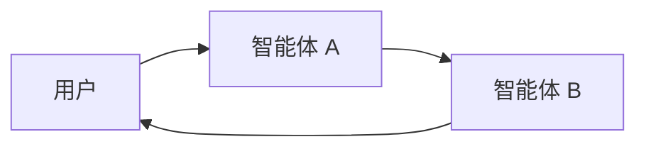

**多智能体系统 (Multi-agent systems)** 将一个复杂的应用程序分解为多个专业化的智能体，它们协同工作以解决问题。**多智能体架构 (multi-agent architectures)** 允许您将更小、更专注的智能体组合成一个协调的工作流程，而不是依赖单个智能体来处理每一步。

当出现以下情况时，多智能体系统非常有用：

* 单个智能体拥有的工具太多，难以决定该使用哪一个。
* 上下文或记忆增长过大，单个智能体难以有效跟踪。
* 任务需要**专业化**（例如，需要规划师、研究员、数学专家）。

## 多智能体模式

| 模式 | 工作原理 | 控制流 | 示例用例 |
| :--- | :--- | :--- | :--- |
| [**工具调用 (Tool Calling)**](#tool-calling) | 一个**主管 (supervisor)** 智能体将其他智能体作为 *工具* 来调用。这些“工具”智能体不直接与用户交谈——它们只执行任务并返回结果。 | 集中式：所有路由都通过调用智能体。 | 任务编排，结构化工作流程。 |
| [**交接 (Handoffs)**](#handoffs) | 当前智能体决定**转移控制权**给另一个智能体。活动的智能体发生变更，用户可以继续直接与新智能体交互。 | 分布式：智能体之间可以更改活动对象。 | 多领域对话，专家接管。 |

<Card
    title="教程：构建一个主管智能体"
    icon="sitemap"
    href="/oss/python/langchain/supervisor"
    arrow cta="了解更多"
>
    了解如何使用主管模式构建个人助理，其中中央主管智能体协调专门的工作智能体。
    本教程演示了：
    * 为不同领域（日历和电子邮件）创建专门的子智能体
    * 将子智能体包装为工具以实现集中式编排
    * 为敏感操作添加人工干预审核
</Card>


## 选择模式

| 问题 | 工具调用 | 交接 |
| :--- | :--- | :--- |
| 需要对工作流程进行集中控制吗？ | ✅ 是 | ❌ 否 |
| 希望智能体直接与用户交互吗？ | ❌ 否 | ✅ 是 |
| 专家之间需要复杂的人机对话吗？ | ❌ 有限 | ✅ 强 |

<Tip>
    您可以混合使用这两种模式——使用 **交接 (handoffs)** 进行智能体切换，并让每个智能体**调用子智能体作为工具**来执行专业化任务。
</Tip>

## 自定义智能体上下文

多智能体设计的核心是**上下文工程 (context engineering)**——决定每个智能体能看到哪些信息。LangChain 提供了精细的控制，包括：

* 传递给每个智能体的对话或状态的哪些部分。
* 为子智能体量身定制的专用提示词。
* 中间推理的包含/排除。
* 为每个智能体定制输入/输出格式。

系统的质量**在很大程度上取决于**上下文工程。目标是确保每个智能体都能访问其执行任务所需的正确数据，无论是作为工具执行还是作为活动智能体。

## 工具调用

在**工具调用 (Tool calling)** 中，一个智能体（“**控制器**”）将其他智能体视为需要在需要时调用的*工具*。控制器管理编排，而工具智能体执行特定任务并返回结果。

流程：

1. **控制器**接收输入并决定调用哪个工具（子智能体）。
2. **工具智能体**根据控制器的指令运行其任务。
3. **工具智能体**将结果返回给控制器。
4. **控制器**决定下一步操作或完成任务。


```mermaid
graph LR
    A[用户] --> B[控制器智能体]
    B --> C[工具智能体 1]
    B --> D[工具智能体 2]
    C --> B
    D --> B
    B --> E[用户响应]
````

<Tip>
    用作工具的智能体通常**不期望**与用户继续对话。
    它们的作用是执行任务并将结果返回给控制器智能体。
    如果您需要子智能体能够与用户对话，请改用**交接 (handoffs)**。
</Tip>

### 实现

下面是一个最小示例，其中主智能体通过工具定义访问单个子智能体：

```python
from langchain.tools import tool
from langchain.agents import create_agent


subagent1 = create_agent(model="...", tools=[...])

@tool(
    "subagent1_name",
    description="subagent1_description"
)
def call_subagent1(query: str):
    result = subagent1.invoke({
        "messages": [{"role": "user", "content": query}]
    })
    return result["messages"][-1].content

agent = create_agent(model="...", tools=[call_subagent1])
```


在此模式中：
1. 当主智能体决定任务与子智能体的描述匹配时，它会调用 `call_subagent1`。
2. 子智能体独立运行并返回其结果。
3. 主智能体接收结果并继续编排。

### 在哪里自定义

有几个地方可以控制主智能体与其子智能体之间传递上下文的方式：

1. **子智能体名称** (`"subagent1_name"`): 这是主智能体引用子智能体的方式。因为它会影响提示词，所以应仔细选择。
2. **子智能体描述** (`"subagent1_description"`): 这是主智能体“知道的”关于子智能体的信息。它直接影响主智能体决定何时调用它的方式。
3. **传递给子智能体的输入**: 您可以自定义此输入，以更好地塑造子智能体解释任务的方式。在上面的示例中，我们将智能体生成的 `query` 直接传递过去。
4. **从子智能体返回的输出**: 这是返回给主智能体的**响应**。您可以调整返回的内容来控制主智能体如何解释结果。在上面的示例中，我们返回最终的消息文本，但您也可以返回额外的状态或元数据。

### 控制传递给子智能体的输入

控制主智能体传递给子智能体的输入有两个主要控制点：

* **修改提示词 (Modify the prompt)** – 调整主智能体的提示词或工具元数据（即子智能体的名称和描述），以更好地指导何时以及如何调用子智能体。
* **上下文注入 (Context injection)** – 通过调整工具调用，从智能体的状态中拉取输入，从而添加静态提示词中不方便捕获的输入（例如，完整的消息历史记录、先前的结果、任务元数据）。

```python
from langchain.agents import AgentState
from langchain.tools import tool, ToolRuntime

class CustomState(AgentState):
    example_state_key: str

@tool(
    "subagent1_name",
    description="subagent1_description"
)
def call_subagent1(query: str, runtime: ToolRuntime[None, CustomState]):
    # 应用任何所需的逻辑来转换消息，使其成为合适的输入
    subagent_input = some_logic(query, runtime.state["messages"])
    result = subagent1.invoke({
        "messages": subagent_input,
        # 如果需要，您也可以在此处传递其他状态键。
        # 确保在主智能体和子智能体的状态 schema 中定义了这些键。
        "example_state_key": runtime.state["example_state_key"]
    })
    return result["messages"][-1].content
```


### 控制来自子智能体的输出

塑造主智能体从子智能体接收回的内容的两种常见策略：

* **修改提示词 (Modify the prompt)** – 优化子智能体的提示词，以确切指定应该返回什么。
  * 当输出不完整、过于冗长或缺少关键细节时非常有用。
  * 一种常见的失败模式是子智能体执行了工具调用或推理，但**没有将结果包含**在其最终消息中。需要提醒它，控制器（和用户）只能看到最终输出，因此所有相关信息都必须包含在其中。
* **自定义输出格式化 (Custom output formatting)** – 在将子智能体的响应交还给主智能体之前，对其进行调整或丰富。
  * 示例：除了最终文本外，还将特定的状态键传递回主智能体。
  * 这需要在代码中将结果包装在 [`Command`](https://reference.langchain.com/python/langgraph/types/#langgraph.types.Command)（或等效结构）中，以便可以将自定义状态与子智能体的响应合并。

```python
from typing import Annotated
from langchain.agents import AgentState
from langchain.tools import InjectedToolCallId
from langgraph.types import Command


@tool(
    "subagent1_name",
    description="subagent1_description"
)
# 我们需要将 `tool_call_id` 传递给子智能体，以便它可以使用它来响应工具调用结果
def call_subagent1(
    query: str,
    tool_call_id: Annotated[str, InjectedToolCallId],
# 您需要返回一个 `Command` 对象，以包含比最终工具调用更多的内容
) -> Command:
    result = subagent1.invoke({
        "messages": [{"role": "user", "content": query}]
    })
    return Command(update={
        # 这是我们传递回去的示例状态键
        "example_state_key": result["example_state_key"],
        "messages": [
            ToolMessage(
                content=result["messages"][-1].content,
                # 我们需要包含 tool_call_id，以便它与正确的工具调用匹配
                tool_call_id=tool_call_id
            )
        ]
    })
```


## 交接 (Handoffs)

在**交接 (handoffs)** 模式中，智能体可以直接将控制权传递给另一个智能体。“活动”智能体发生变化，用户与当前拥有控制权的智能体进行交互。

流程：

1. **当前智能体**决定需要另一个智能体的帮助。
2. 它将控制权（和状态）**传递给下一个智能体**。
3. **新智能体**直接与用户交互，直到它决定再次交接或完成任务。




### 实现（即将推出）

---

<Callout icon="pen-to-square" iconType="regular">
    [Edit the source of this page on GitHub.](https://github.com/langchain-ai/docs/edit/main/src/oss\langchain\multi-agent.mdx)
</Callout>
<Tip icon="terminal" iconType="regular">
    [Connect these docs programmatically](/use-these-docs) to Claude, VSCode, and more via MCP for real-time answers.
</Tip>
