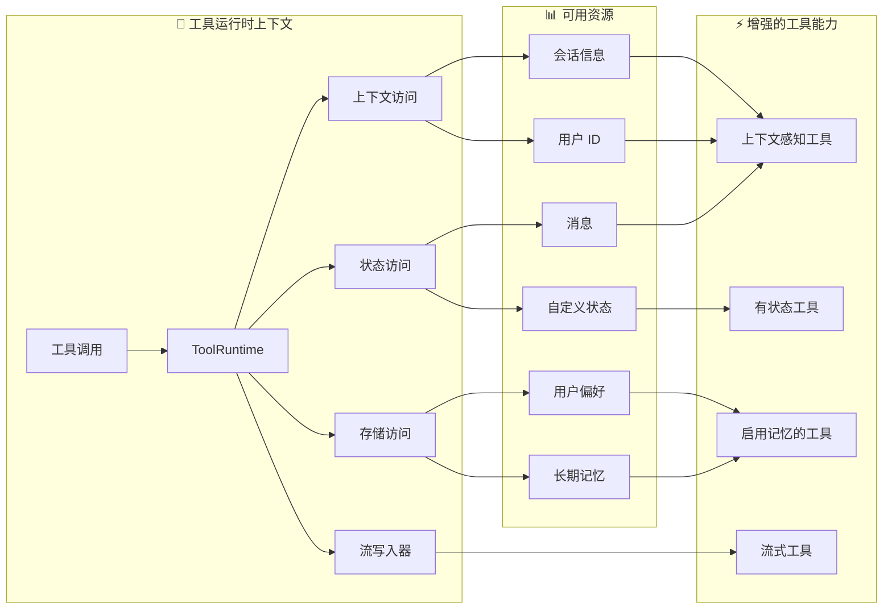

```markdown
---
title: 工具
---

许多 AI 应用通过自然语言与用户交互。然而，某些用例要求模型使用结构化输入直接与外部系统（如 API、数据库或文件系统）进行交互。

工具是 [智能体 (agents)](/oss/python/langchain/agents) 调用的组件，用于执行操作。它们通过允许模型通过明确定义的输入和输出来与世界进行交互，从而扩展了模型的 [能力](/oss/python/langchain/agents)。

工具封装了一个可调用的函数及其输入 schema（模式）。这些工具可以传递给兼容的 [聊天模型](/oss/python/langchain/models)，使模型能够决定是否调用工具以及使用哪些参数。在这些场景中，工具调用允许模型生成符合指定输入模式的请求。

<Note>
**服务端工具使用**

一些聊天模型（例如 [OpenAI](/oss/python/integrations/chat/openai)、[Anthropic](/oss/python/integrations/chat/anthropic) 和 [Gemini](/oss/python/integrations/chat/google_generative_ai)）具有在服务端执行的[内置工具](/oss/python/langchain/models#server-side-tool-use)，例如网络搜索和代码解释器。请参阅[提供商概览](/oss/python/integrations/providers/overview)，了解如何使用特定聊天模型访问这些工具。
</Note>

## 创建工具

### 基础工具定义

创建工具最简单的方法是使用 `@tool` 装饰器。默认情况下，函数的 docstring（文档字符串）将成为工具的描述，以帮助模型理解何时使用它：

```python
from langchain.tools import tool

@tool
def search_database(query: str, limit: int = 10) -> str:
    """搜索客户数据库中与查询匹配的记录。

    Args:
        query: 要查找的搜索词
        limit: 要返回的最大结果数
    """
    return f"为 '{query}' 找到了 {limit} 个结果"
```

类型提示是**必需的**，因为它们定义了工具的输入 schema。文档字符串应该具有信息性且简洁，以帮助模型理解工具的目的。


### 自定义工具属性

#### 自定义工具名称

默认情况下，工具名称取自函数名称。当您需要一个更具描述性的名称时，可以覆盖它：

```python
@tool("web_search")  # 自定义名称
def search(query: str) -> str:
    """在网上搜索信息。"""
    return f"搜索结果: {query}"

print(search.name)  # web_search
```

#### 自定义工具描述

覆盖自动生成的工具描述，以提供模型更清晰的指导：

```python
@tool("calculator", description="Performs arithmetic calculations. Use this for any math problems.")
def calc(expression: str) -> str:
    """评估数学表达式。"""
    return str(eval(expression))
```

### 高级 Schema 定义

使用 Pydantic 模型或 JSON Schema 定义复杂的输入：

<CodeGroup>
    ```python Pydantic model
    from pydantic import BaseModel, Field
    from typing import Literal

    class WeatherInput(BaseModel):
        """天气查询的输入模型。"""
        location: str = Field(description="城市名称或坐标")
        units: Literal["celsius", "fahrenheit"] = Field(
            default="celsius",
            description="温度单位偏好"
        )
        include_forecast: bool = Field(
            default=False,
            description="是否包含 5 天预报"
        )

    @tool(args_schema=WeatherInput)
    def get_weather(location: str, units: str = "celsius", include_forecast: bool = False) -> str:
        """获取当前天气和可选预报。"""
        temp = 22 if units == "celsius" else 72
        result = f"当前 {location} 天气: {temp} 度 {units[0].upper()}"
        if include_forecast:
            result += "\n未来 5 天: 晴朗"
        return result
    ```

    ```python JSON Schema
    weather_schema = {
        "type": "object",
        "properties": {
            "location": {"type": "string"},
            "units": {"type": "string"},
            "include_forecast": {"type": "boolean"}
        },
        "required": ["location", "units", "include_forecast"]
    }

    @tool(args_schema=weather_schema)
    def get_weather(location: str, units: str = "celsius", include_forecast: bool = False) -> str:
        """获取当前天气和可选预报。"""
        temp = 22 if units == "celsius" else 72
        result = f"当前 {location} 天气: {temp} 度 {units[0].upper()}"
        if include_forecast:
            result += "\n未来 5 天: 晴朗"
        return result
    ```
</CodeGroup>

### 保留的参数名称

以下参数名称被保留，不能用作工具参数。使用这些名称将导致运行时错误。

| 参数名称 | 用途 |
|----------------|---------|
| `config` | 保留用于在内部向工具传递 `RunnableConfig` |
| `runtime` | 保留用于 `ToolRuntime` 参数（访问状态、上下文、存储） |

要访问运行时信息，请使用 `ToolRuntime` 参数，而不是命名自己的参数为 `config` 或 `runtime`。


## 访问上下文

<Info>
**重要原因**: 当工具可以访问智能体状态、运行时上下文和长期记忆时，它们才最为强大。这使得工具能够做出上下文感知的决策、个性化响应，并在对话中保持信息。

运行时上下文提供了一种在运行时将依赖项（如数据库连接、用户 ID 或配置）注入工具的方法，使它们更易于测试和重用。


</Info>

工具可以通过 `ToolRuntime` 参数访问运行时信息，它提供：

- **State (状态)** - 贯穿执行流程的可变数据（例如：消息、计数器、自定义字段）
- **Context (上下文)** - 不可变的配置，如用户 ID、会话详情或应用特定配置
- **Store (存储)** - 跨对话的持久化长期记忆
- **Stream Writer (流写入器)** - 当工具执行时，流式传输自定义更新
- **Config (配置)** - 执行的 `RunnableConfig`
- **Tool Call ID (工具调用 ID)** - 当前工具调用的 ID



### `ToolRuntime`

使用 `ToolRuntime` 在单个参数中访问所有运行时信息。只需在工具签名中添加 `runtime: ToolRuntime`，它就会自动注入，而不会暴露给 LLM。

<Info>
**`ToolRuntime`**: 一个统一的参数，为工具提供对状态、上下文、存储、流式传输、配置和工具调用 ID 的访问。它取代了使用单独的 `@InjectedState`、`@InjectedStore`、`@get_runtime` 和 `@InjectedToolCallId` 注释的旧模式。

运行时会自动将这些功能提供给您的工具函数，而无需您显式传递它们或使用全局状态。
</Info>

**访问状态：**

工具可以使用 `ToolRuntime` 访问当前的图状态：

```python
from langchain.tools import tool, ToolRuntime

# 访问当前的对话状态
@tool
def summarize_conversation(
    runtime: ToolRuntime
) -> str:
    """总结到目前为止的对话。"""
    messages = runtime.state["messages"]

    human_msgs = sum(1 for m in messages if m.__class__.__name__ == "HumanMessage")
    ai_msgs = sum(1 for m in messages if m.__class__.__name__ == "AIMessage")
    tool_msgs = sum(1 for m in messages if m.__class__.__name__ == "ToolMessage")

    return f"对话中有 {human_msgs} 条用户消息，{ai_msgs} 条 AI 回复，以及 {tool_msgs} 个工具结果"

# 访问自定义状态字段
@tool
def get_user_preference(
    pref_name: str,
    runtime: ToolRuntime  # 模型看不到 ToolRuntime 参数
) -> str:
    """获取一个用户偏好值。"""
    preferences = runtime.state.get("user_preferences", {})
    return preferences.get(pref_name, "未设置")
```

<Warning>
`runtime` 参数对模型是隐藏的。以上述示例为例，模型只会在工具 schema 中看到 `pref_name` —— `runtime` **不会**包含在请求中。
</Warning>

**更新状态：**

使用 `@Command` 来更新智能体的状态或控制图的执行流程：

```python
from langgraph.types import Command
from langchain.messages import RemoveMessage
from langgraph.graph.message import REMOVE_ALL_MESSAGES
from langchain.tools import tool, ToolRuntime

# 通过删除所有消息来更新对话历史
@tool
def clear_conversation() -> Command:
    """清除对话历史记录。"""

    return Command(
        update={
            "messages": [RemoveMessage(id=REMOVE_ALL_MESSAGES)],
        }
    )

# 更新智能体状态中的 user_name
@tool
def update_user_name(
    new_name: str,
    runtime: ToolRuntime
) -> Command:
    """更新用户的名称。"""
    return Command(update={"user_name": new_name})
```


#### Context（上下文）

通过 `runtime.context` 访问不可变的配置和上下文数据，例如用户 ID、会话详情或应用特定配置。

工具可以通过 `ToolRuntime` 访问运行时上下文：

```python
from dataclasses import dataclass
from langchain_openai import ChatOpenAI
from langchain.agents import create_agent
from langchain.tools import tool, ToolRuntime


USER_DATABASE = {
    "user123": {
        "name": "Alice Johnson",
        "account_type": "Premium",
        "balance": 5000,
        "email": "alice@example.com"
    },
    "user456": {
        "name": "Bob Smith",
        "account_type": "Standard",
        "balance": 1200,
        "email": "bob@example.com"
    }
}

@dataclass
class UserContext:
    user_id: str

@tool
def get_account_info(runtime: ToolRuntime[UserContext]) -> str:
    """获取当前用户的账户信息。"""
    user_id = runtime.context.user_id

    if user_id in USER_DATABASE:
        user = USER_DATABASE[user_id]
        return f"账户持有人: {user['name']}\n类型: {user['account_type']}\n余额: ${user['balance']}"
    return "未找到用户"

model = ChatOpenAI(model="gpt-4o")
agent = create_agent(
    model,
    tools=[get_account_info],
    context_schema=UserContext,
    system_prompt="您是一个财务助手。"
)

result = agent.invoke(
    {"messages": [{"role": "user", "content": "我的当前余额是多少？"}]},
    context=UserContext(user_id="user123")
)
```


#### Memory（存储）

使用存储访问跨对话的持久化数据。通过 `runtime.store` 访问存储，它允许您保存和检索特定于用户或应用的数据。

工具可以通过 `ToolRuntime` 访问和更新存储：

```python expandable
from typing import Any
from langgraph.store.memory import InMemoryStore
from langchain.agents import create_agent
from langchain.tools import tool, ToolRuntime


# 访问内存
@tool
def get_user_info(user_id: str, runtime: ToolRuntime) -> str:
    """查找用户信息。"""
    store = runtime.store
    user_info = store.get(("users",), user_id)
    return str(user_info.value) if user_info else "未知用户"

# 更新内存
@tool
def save_user_info(user_id: str, user_info: dict[str, Any], runtime: ToolRuntime) -> str:
    """保存用户信息。"""
    store = runtime.store
    store.put(("users",), user_id, user_info)
    return "成功保存用户信息。"

store = InMemoryStore()
agent = create_agent(
    model,
    tools=[get_user_info, save_user_info],
    store=store
)

# 第一次会话：保存用户信息
agent.invoke({
    "messages": [{"role": "user", "content": "保存以下用户信息: userid: abc123, name: Foo, age: 25, email: foo@langchain.dev"}]
})

# 第二次会话：获取用户信息
agent.invoke({
    "messages": [{"role": "user", "content": "获取 ID 为 'abc123' 的用户信息"}]
})
# 这是 ID 为 "abc123" 的用户的信息：
# - 姓名: Foo
# - 年龄: 25
# - 电子邮件: foo@langchain.dev
```


#### Stream Writer（流写入器）

使用 `runtime.stream_writer` 在工具执行时流式传输自定义更新。这有助于向用户提供有关工具正在做什么的实时反馈。

```python
from langchain.tools import tool, ToolRuntime

@tool
def get_weather(city: str, runtime: ToolRuntime) -> str:
    """获取给定城市的天气。"""
    writer = runtime.stream_writer

    # 在工具执行时流式传输自定义更新
    writer(f"正在查找 {city} 的数据")
    writer(f"已获取 {city} 的数据")

    return f"{city} 永远是晴天！"
```

<Note>
如果您在工具中使用 `runtime.stream_writer`，则必须在 LangGraph 执行上下文内调用该工具。有关更多详细信息，请参阅[流式传输](/oss/python/langchain/streaming)。
</Note>


```

---

<Callout icon="pen-to-square" iconType="regular">
    [Edit the source of this page on GitHub.](https://github.com/langchain-ai/docs/edit/main/src/oss\langchain\tools.mdx)
</Callout>
<Tip icon="terminal" iconType="regular">
    [Connect these docs programmatically](/use-these-docs) to Claude, VSCode, and more via MCP for real-time answers.
</Tip>
