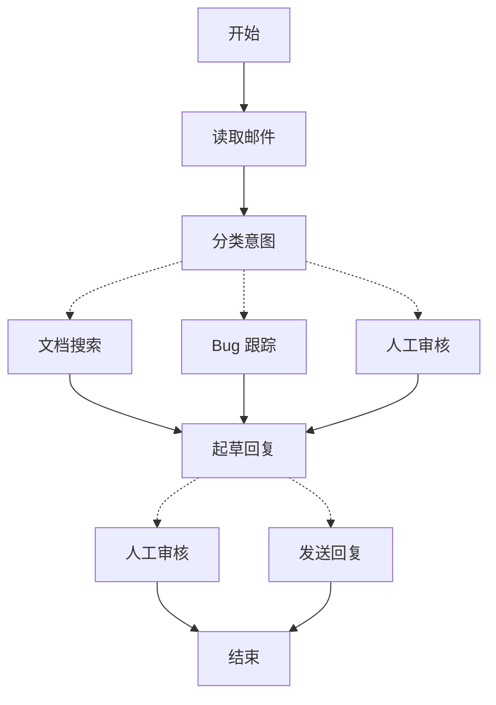

当你使用 LangGraph 构建智能体时，你首先需要将其分解为称为**节点 (nodes)** 的离散步骤。然后，你需要描述每个节点之间的不同决策和**转换 (transitions)**。最后，你通过一个共享的**状态 (state)** 将这些节点连接起来，状态是每个节点都可以读取和写入的。

在本指南中，我们将引导你构建一个客户支持邮件智能体的思路过程。

## 从你要自动化的流程开始

想象一下，你需要构建一个处理客户支持邮件的人工智能智能体。你的产品团队为你设定了以下要求：

```txt
该智能体应该：

- 读取传入的客户邮件
- 根据紧急程度和主题对邮件进行分类
- 搜索相关文档以回答问题
- 起草适当的回复
- 将复杂问题升级给人工坐席
- 适时安排后续跟进

需要处理的示例场景：

1. 简单的产品问题：“我如何重置我的密码？”
2. Bug 报告：“当我选择 PDF 格式时，导出功能崩溃了”
3. 紧急的账单问题：“我的订阅被重复收费了！”
4. 功能请求：“可以在移动应用中添加深色模式吗？”
5. 复杂的技朮问题：“我们的 API 集成间歇性地出现 504 错误”
```

要使用 LangGraph 实现一个智能体，你通常会遵循相同的五个步骤。

## 步骤 1：将工作流程映射为离散步骤

首先确定流程中的独立步骤。每个步骤将成为一个**节点**（一个执行特定任务的函数）。然后，勾勒出这些步骤如何相互连接。



这个图中的箭头显示了**可能的路径**，但实际沿着哪条路径前进的决策发生在每个节点**内部**。

现在我们已经确定了工作流程中的组件，让我们了解每个节点需要做什么：

- `读取邮件 (Read Email)`：提取和解析邮件内容
- `分类意图 (Classify Intent)`：使用 LLM (大语言模型) 对紧急程度和主题进行分类，然后路由到适当的操作
- `文档搜索 (Doc Search)`：查询你的知识库以获取相关信息
- `Bug 跟踪 (Bug Track)`：在跟踪系统中创建或更新问题
- `起草回复 (Draft Reply)`：生成适当的回复
- `人工审核 (Human Review)`：升级给人工坐席进行批准或处理
- `发送回复 (Send Reply)`：分发邮件回复

<Tip>
注意，有些节点会做出关于下一步去向的决定（例如 `Classify Intent`, `Draft Reply`, `Human Review`），而有些节点总是按顺序进行到下一步（例如 `Read Email` 总是导向 `Classify Intent`，`Doc Search` 总是导向 `Draft Reply`）。
</Tip>

## 步骤 2：确定每一步需要做什么

对于图中的每个节点，确定它代表哪种类型的操作，以及它需要什么上下文才能正常工作。

<CardGroup cols={2}>
    <Card title="LLM 步骤" icon="brain" href="#llm-steps">
        当需要理解、分析、生成文本或做出推理决策时使用。
    </Card>
    <Card title="数据步骤" icon="database" href="#data-steps">
        当需要从外部源检索信息时使用。
    </Card>
    <Card title="动作步骤" icon="bolt" href="#action-steps">
        当需要执行外部操作时使用。
    </Card>
    <Card title="用户输入步骤" icon="user" href="#user-input-steps">
        当需要人工干预时使用。
    </Card>
</CardGroup>

### LLM 步骤

当某个步骤需要理解、分析、生成文本或做出推理决策时：

<AccordionGroup>
    <Accordion title="意图分类">
        - 静态上下文（提示词）：分类类别、紧急程度定义、响应格式
        - 动态上下文（来自状态）：邮件内容、发件人信息
        - 期望结果：决定路由的结构化分类
    </Accordion>

    <Accordion title="起草回复">
        - 静态上下文（提示词）：语气指南、公司政策、响应模板
        - 动态上下文（来自状态）：分类结果、搜索结果、客户历史记录
        - 期望结果：准备好供审核的专业邮件回复
    </Accordion>
</AccordionGroup>

### 数据步骤

当某个步骤需要从外部源检索信息时：

<AccordionGroup>
    <Accordion title="文档搜索">
        - 参数：根据意图和主题构建的查询
        - 重试策略：是，使用指数退避 (exponential backoff) 来处理瞬时故障
        - 缓存：可能会缓存常见查询以减少 API 调用
    </Accordion>

    <Accordion title="客户历史记录查找">
        - 参数：来自状态的客户电子邮件或 ID
        - 重试策略：是，但如果信息不可用则回退到基本信息
        - 缓存：是，设置生存时间 (time-to-live) 以平衡新鲜度和性能
    </Accordion>
</AccordionGroup>

### 动作步骤

当某个步骤需要执行外部操作时：

<AccordionGroup>
    <Accordion title="发送回复">
        - 何时执行节点：批准后（人工或自动）
        - 重试策略：是，使用指数退避来处理网络问题
        - 不应缓存：每次发送都是一个唯一动作
    </Accordion>

    <Accordion title="Bug 跟踪">
        - 何时执行节点：当意图为“bug”时始终执行
        - 重试策略：是，不丢失 Bug 报告至关重要
        - 返回值：要包含在回复中的 Ticket ID
    </Accordion>
</AccordionGroup>

### 用户输入步骤

当某个步骤需要人工干预时：

<AccordionGroup>
    <Accordion title="人工审核节点">
        - 决策上下文：原始邮件、起草的回复、紧急程度、分类
        - 期望的输入格式：批准布尔值以及可选的编辑后的回复
        - 何时触发：高紧急程度、复杂问题或质量担忧
    </Accordion>
</AccordionGroup>

## 步骤 3：设计你的状态

状态是智能体所有节点共享的**内存**，可以访问。把它想象成智能体在处理流程时用来跟踪它所学到和决定的所有内容的笔记本。

### 哪些数据应该放入状态？

针对每块数据，问自己这些问题：

<CardGroup cols={2}>
    <Card title="包含在状态中" icon="check">
        它需要在步骤间保持持久吗？如果是，则放入状态中。
    </Card>

    <Card title="不存储" icon="code">
        可以从其他数据推导出来吗？如果是，则在需要时计算它，而不是存储在状态中。
    </Card>
</CardGroup>

对于我们的邮件智能体，我们需要跟踪：

- 原始邮件和发件人信息（以后无法重建）
- 分类结果（后续多个节点需要）
- 搜索结果和客户数据（重新获取成本高）
- 起草的回复（需要通过审核环节）
- 执行元数据（用于调试和恢复）

### 保持状态原始，按需格式化提示词

<Tip>
    一个关键原则：你的状态应存储**原始数据**，而不是格式化的文本。在节点中需要时才格式化提示词。
</Tip>

这种分离意味着：

- 不同的节点可以以不同的方式格式化相同的数据以满足其需求
- 可以在不修改状态架构的情况下更改提示词模板
- 调试更清晰——你可以确切地看到每个节点接收到了什么数据
- 你的智能体可以在不破坏现有状态的情况下演进

让我们定义我们的状态：

```python
from typing import TypedDict, Literal

# 定义邮件分类的结构
class EmailClassification(TypedDict):
    intent: Literal["question", "bug", "billing", "feature", "complex"]
    urgency: Literal["low", "medium", "high", "critical"]
    topic: str
    summary: str

class EmailAgentState(TypedDict):
    # 原始邮件数据
    email_content: str
    sender_email: str
    email_id: str

    # 分类结果
    classification: EmailClassification | None

    # 原始搜索/API 结果
    search_results: list[str] | None  # 原始文档块列表
    customer_history: dict | None  # 来自 CRM 的原始客户数据

    # 生成的内容
    draft_response: str | None
    messages: list[str] | None
```


请注意，状态只包含原始数据——没有提示词模板，没有格式化的字符串，没有指令。分类输出作为单个字典存储，直接来自 LLM。

## 步骤 4：构建你的节点

现在我们将每个步骤实现为一个函数。LangGraph 中的一个节点就是一个 Python 函数，它接收当前状态并返回对它的更新。


### 适当地处理错误

不同的错误需要不同的处理策略：

| 错误类型 | 由谁修复 | 策略 | 何时使用 |
|------------|--------------|----------|-------------|
| 瞬时错误（网络问题、速率限制） | 系统（自动） | 重试策略 | 通常在重试后解决的临时故障 |
| LLM 可恢复错误（工具失败、解析问题） | LLM | 存储错误于状态并循环回去 | LLM 可以看到错误并调整其方法 |
| 用户可修复错误（缺少信息、指令不明确） | 人工 | 使用 `interrupt()` 暂停 | 需要用户输入才能继续 |
| 意外错误 | 开发者 | 允许它们冒泡 | 需要调试的未知问题 |

<Tabs>
    <Tab title="瞬时错误" icon="rotate">
        为自动重试网络问题和速率限制添加重试策略：

    ```python
    from langgraph.types import RetryPolicy

    workflow.add_node(
        "search_documentation",
        search_documentation,
        retry_policy=RetryPolicy(max_attempts=3, initial_interval=1.0)
    )
    ```


    </Tab>

    <Tab title="LLM 可恢复错误" icon="brain">
        将错误存储在状态中并循环回去，以便 LLM 可以看到哪里出了问题并重试：

    ```python
    from langgraph.types import Command


    def execute_tool(state: State) -> Command[Literal["agent", "execute_tool"]]:
        try:
            result = run_tool(state['tool_call'])
            return Command(update={"tool_result": result}, goto="agent")
        except ToolError as e:
            # 让 LLM 看到哪里出了问题并重试
            return Command(
                update={"tool_result": f"Tool error: {str(e)}"},
                goto="agent"
            )
    ```


    </Tab>

    <Tab title="用户可修复错误" icon="user">
        在需要时暂停并收集用户信息（如帐户 ID、订单号或澄清信息）：

    ```python
    from langgraph.types import Command


    def lookup_customer_history(state: State) -> Command[Literal["draft_response"]]:
        if not state.get('customer_id'):
            user_input = interrupt({
                "message": "需要客户 ID",
                "request": "请提供客户的账户 ID 以查找其订阅历史记录"
            })
            return Command(
                update={"customer_id": user_input['customer_id']},
                goto="lookup_customer_history"
            )
        # 现在继续查找
        customer_data = fetch_customer_history(state['customer_id'])
        return Command(update={"customer_history": customer_data}, goto="draft_response")
    ```


    </Tab>

    <Tab title="意外错误" icon="triangle-exclamation">
        允许它们冒泡以进行调试。不要捕获你无法处理的错误：

    ```python
    def send_reply(state: EmailAgentState):
        try:
            email_service.send(state["draft_response"])
        except Exception:
            raise  # 显式抛出意外错误
    ```


    </Tab>
</Tabs>


### 实现我们的邮件智能体节点

我们将每个节点实现为一个简单的函数。请记住：节点接收状态，执行工作，并返回更新。

<AccordionGroup>
    <Accordion title="读取和分类节点" icon="brain">

    ```python
    from typing import Literal
    from langgraph.graph import StateGraph, START, END
    from langgraph.types import interrupt, Command, RetryPolicy
    from langchain_openai import ChatOpenAI
    from langchain.messages import HumanMessage

    llm = ChatOpenAI(model="gpt-4")

    def read_email(state: EmailAgentState) -> dict:
        """提取和解析邮件内容"""
        # 在生产环境中，这会连接到你的邮件服务
        return {
            "messages": [HumanMessage(content=f"正在处理邮件: {state['email_content']}")]
        }

    def classify_intent(state: EmailAgentState) -> Command[Literal["search_documentation", "human_review", "draft_response", "bug_tracking"]]:
        """使用 LLM 对邮件意图和紧急程度进行分类，然后相应地路由"""

        # 创建返回 EmailClassification 字典的结构化 LLM
        structured_llm = llm.with_structured_output(EmailClassification)

        # 按需格式化提示词，不存储在状态中
        classification_prompt = f"""
        分析这封客户邮件并进行分类：

        邮件: {state['email_content']}
        发件人: {state['sender_email']}

        提供包括意图、紧急程度、主题和摘要的分类信息。
        """

        # 直接获取结构化响应（字典格式）
        classification = structured_llm.invoke(classification_prompt)

        # 根据分类确定下一个节点
        if classification['intent'] == 'billing' or classification['urgency'] == 'critical':
            goto = "human_review"
        elif classification['intent'] in ['question', 'feature']:
            goto = "search_documentation"
        elif classification['intent'] == 'bug':
            goto = "bug_tracking"
        else:
            goto = "draft_response"

        # 将分类作为一个字典存储在状态中
        return Command(
            update={"classification": classification},
            goto=goto
        )
    ```


    </Accordion>

    <Accordion title="搜索和跟踪节点" icon="database">

    ```python
    def search_documentation(state: EmailAgentState) -> Command[Literal["draft_response"]]:
        """搜索知识库以获取相关信息"""

        # 从分类构建搜索查询
        classification = state.get('classification', {})
        query = f"{classification.get('intent', '')} {classification.get('topic', '')}"

        try:
            # 在此处实现你的搜索逻辑
            # 存储原始搜索结果，而不是格式化文本
            search_results = [
                "通过“设置 > 安全 > 更改密码”重置密码",
                "密码必须至少包含 12 个字符",
                "包含大写字母、小写字母、数字和符号"
            ]
        except SearchAPIError as e:
            # 对于可恢复的搜索错误，存储错误并继续
            search_results = [f"搜索暂时不可用: {str(e)}"]

        return Command(
            update={"search_results": search_results},  # 存储原始结果或错误
            goto="draft_response"
        )

    def bug_tracking(state: EmailAgentState) -> Command[Literal["draft_response"]]:
        """在 Bug 跟踪系统中创建或更新工单"""

        # 在你的 Bug 跟踪系统中创建工单
        ticket_id = "BUG-12345"  # 将通过 API 创建

        return Command(
            update={
                "search_results": [f"已创建 Bug 工单 {ticket_id}"],
                "current_step": "bug_tracked"
            },
            goto="draft_response"
        )
    ```


    </Accordion>

    <Accordion title="响应节点" icon="pen-to-square">

    ```python
    def draft_response(state: EmailAgentState) -> Command[Literal["human_review", "send_reply"]]:
        """使用上下文生成回复并根据质量路由"""

        classification = state.get('classification', {})

        # 按需从原始状态数据格式化上下文
        context_sections = []

        if state.get('search_results'):
            # 格式化搜索结果以供提示词使用
            formatted_docs = "\n".join([f"- {doc}" for doc in state['search_results']])
            context_sections.append(f"相关文档:\n{formatted_docs}")

        if state.get('customer_history'):
            # 格式化客户数据以供提示词使用
            context_sections.append(f"客户等级: {state['customer_history'].get('tier', 'standard')}")

        # 构建包含格式化上下文的提示词
        draft_prompt = f"""
        起草对该客户邮件的回复：
        {state['email_content']}

        邮件意图: {classification.get('intent', 'unknown')}
        紧急程度: {classification.get('urgency', 'medium')}

        {chr(10).join(context_sections)}

        指南：
        - 保持专业和乐于助人
        - 解决他们的具体疑虑
        - 在相关时使用提供的文档
        """

        response = llm.invoke(draft_prompt)

        # 根据紧急程度和意图确定是否需要人工审核
        needs_review = (
            classification.get('urgency') in ['high', 'critical'] or
            classification.get('intent') == 'complex'
        )

        # 路由到适当的下一个节点
        goto = "human_review" if needs_review else "send_reply"

        return Command(
            update={"draft_response": response.content},  # 只存储原始回复
            goto=goto
        )

    def human_review(state: EmailAgentState) -> Command[Literal["send_reply", END]]:
        """使用 interrupt() 暂停以供人工审核，并根据决策路由"""

        classification = state.get('classification', {})

        # interrupt() 必须放在第一位——它之前的任何代码在恢复时都会重新运行
        human_decision = interrupt({
            "email_id": state.get('email_id',''),
            "original_email": state.get('email_content',''),
            "draft_response": state.get('draft_response',''),
            "urgency": classification.get('urgency'),
            "intent": classification.get('intent'),
            "action": "请审核并批准/编辑此回复"
        })

        # 现在处理人工决策
        if human_decision.get("approved"):
            return Command(
                update={"draft_response": human_decision.get("edited_response", state.get('draft_response',''))},
                goto="send_reply"
            )
        else:
            # 拒绝意味着人工将直接处理
            return Command(update={}, goto=END)

    def send_reply(state: EmailAgentState) -> dict:
        """发送邮件回复"""
        # 与邮件服务集成
        print(f"正在发送回复: {state['draft_response'][:100]}...")
        return {}
    ```


    </Accordion>
</AccordionGroup>

## 步骤 5：将它们连接起来

现在我们将节点连接成一个工作的图。由于我们的节点处理自己的路由决策，我们只需要很少的必要边（连接）。

为了使用 `interrupt()` 实现[人工干预](/oss/python/langgraph/interrupts)，我们需要使用[检查点 (checkpointer)](/oss/python/langgraph/persistence) 来编译，以便在运行过程中保存状态：

<Accordion title="图编译代码" icon="diagram-project" defaultOpen={true}>

```python
from langgraph.checkpoint.memory import MemorySaver
from langgraph.types import RetryPolicy

# 创建图
workflow = StateGraph(EmailAgentState)

# 添加节点并进行适当的错误处理
workflow.add_node("read_email", read_email)
workflow.add_node("classify_intent", classify_intent)

# 为可能出现瞬时故障的节点添加重试策略
workflow.add_node(
    "search_documentation",
    search_documentation,
    retry_policy=RetryPolicy(max_attempts=3)
)
workflow.add_node("bug_tracking", bug_tracking)
workflow.add_node("draft_response", draft_response)
workflow.add_node("human_review", human_review)
workflow.add_node("send_reply", send_reply)

# 只添加必要的边
workflow.add_edge(START, "read_email")
workflow.add_edge("read_email", "classify_intent")
workflow.add_edge("send_reply", END)

# 使用检查点进行编译以实现持久性，如果使用 Local_Server --> 请在不使用检查点的情况下编译它
memory = MemorySaver()
app = workflow.compile(checkpointer=memory)
```


</Accordion>

图结构是最小化的，因为路由发生在节点内部，通过 [`Command`](https://reference.langchain.com/python/langgraph/types/#langgraph.types.Command) 对象。每个节点使用“node1”、“node2”之类的类型提示来声明它可以去往哪里，使流程明确且可追溯。


### 试运行你的智能体

让我们用一个需要**人工审核**的紧急账单问题来运行我们的智能体：

<Accordion title="测试智能体" icon="flask">

```python
# 用一个紧急的账单问题进行测试
initial_state = {
    "email_content": "I was charged twice for my subscription! This is urgent!",
    "sender_email": "customer@example.com",
    "email_id": "email_123",
    "messages": []
}

# 使用 thread_id 运行以实现持久性
config = {"configurable": {"thread_id": "customer_123"}}
result = app.invoke(initial_state, config)
# 图将在 human_review 处暂停
print(f"准备审核的草稿: {result['draft_response'][:100]}...")

# 准备好后，提供人工输入以恢复
from langgraph.types import Command

human_response = Command(
    resume={
        "approved": True,
        "edited_response": "我们对重复收费深表歉意。我已立即启动退款..."
    }
)

# 恢复执行
final_result = app.invoke(human_response, config)
print(f"邮件发送成功!")
```


</Accordion>

当它遇到 `interrupt()` 时，图会暂停，将所有内容保存到检查点，然后等待。它可以在几天后恢复，从上次暂停的确切位置继续执行。`thread_id` 确保了该对话的所有状态都一起被保留。

## 总结和后续步骤

### 关键洞察

构建这个邮件智能体向我们展示了 LangGraph 的思维方式：

<CardGroup cols={2}>
    <Card title="分解为离散步骤" icon="sitemap" href="#step-1-map-out-your-workflow-as-discrete-steps">
        每个节点都做好一件事。这种分解使得能够流式传输进度更新、进行持久化执行（可以暂停和恢复）以及清晰调试（因为你可以在步骤之间检查状态）。
    </Card>

    <Card title="状态是共享内存" icon="database" href="#step-3-design-your-state">
        存储原始数据，而不是格式化文本。这使得不同的节点可以用不同的方式使用相同的信息。
    </Card>

    <Card title="节点是函数" icon="code" href="#step-4-build-your-nodes">
        它们接收状态，执行工作，并返回更新。当它们需要做出路由决策时，它们会指定状态更新和下一个目的地。
    </Card>

    <Card title="错误是流程的一部分" icon="triangle-exclamation" href="#handle-errors-appropriately">
        瞬时故障可以重试，LLM 可恢复错误会带上上下文循环回去，用户可修复的问题会暂停以等待输入，而意外错误则会冒泡出来供调试。
    </Card>

    <Card title="人工输入是首要公民" icon="user" href="/oss/python/langgraph/interrupts">
        `interrupt()` 函数可以无限期地暂停执行，保存所有状态，并在提供输入时从中断的确切位置恢复。当与其他操作组合在一个节点中时，它必须放在首先。
    </Card>

    <Card title="图结构自然涌现" icon="diagram-project" href="#step-5-wire-it-together">
        你定义了必要的连接，而你的节点处理自己的路由逻辑。这使得控制流明确且可追溯——你总是可以通过查看当前节点来理解你的智能体下一步将做什么。
    </Card>
</CardGroup>

### 高级考虑

<Accordion title="节点粒度权衡" icon="sliders">
<Info>
本节探讨了节点粒度设计中的权衡。大多数应用可以跳过此部分，并使用上述模式。
</Info>

你可能会想：为什么不把 `Read Email` 和 `Classify Intent` 合并到一个节点中呢？

或者为什么要将文档搜索与起草回复分开？

答案涉及**弹性**和**可观察性**之间的权衡。

**弹性考虑：** LangGraph 的[持久化执行](/oss/python/langgraph/durable-execution)在节点边界创建检查点。当工作流从中断或故障中恢复时，它会从停止执行的节点的开头开始。更小的节点意味着更频繁的检查点，这意味着如果出现问题，需要重复的工作更少。如果你将多个操作合并到一个大型节点中，接近末尾的故障将意味着需要重新执行该节点的所有内容。

我们为邮件智能体选择这种分解的原因：

- **外部服务隔离：** `Doc Search` 和 `Bug Track` 是独立的节点，因为它们调用外部 API。如果搜索服务变慢或失败，我们希望将该问题与其他操作隔离。我们可以向这些特定节点添加重试策略，而不影响其他节点。

- **中间可见性：** 将 `Classify Intent` 作为一个单独的节点，可以让我们在采取行动之前检查 LLM 的决定。这对于调试和监控非常有价值——你可以确切地看到智能体何时以及为何路由到人工审核。

- **不同的故障模式：** LLM 调用、数据库查找和电子邮件发送都有不同的重试策略。单独的节点允许你独立配置这些策略。

- **可重用性和测试：** 更小的节点更容易单独测试，并在其他工作流中重复使用。

另一种有效的方法是：你可以将 `Read Email` 和 `Classify Intent` 合并为一个节点。你将失去在分类前检查原始邮件的能力，并且在改节点的任何故障时都需要重新执行这两项操作。对于大多数应用来说，单独节点的**可观察性**和**调试**优势使得这种权衡是值得的。

应用级考量：关于步骤 2 中缓存的讨论（是否缓存搜索结果）是应用级的决策，而不是 LangGraph 框架的特性。你根据自己的具体要求在节点函数内部实现缓存——LangGraph 不对此做出规定。

性能考量：更多的节点并不意味着执行更慢。LangGraph 默认在后台写入检查点（[异步持久化模式](/oss/python/langgraph/durable-execution#durability-modes)），因此你的图在等待检查点完成时不会停止运行。这意味着你可以获得频繁的检查点，而对性能影响极小。如果你需要，可以调整此行为——使用 `“exit”` 模式仅在完成后进行检查点，或使用 `“sync”` 模式阻止执行直到每个检查点被写入。
</Accordion>

### 从哪里继续

以上是关于如何使用 LangGraph 思考构建智能体的介绍。你可以从以下方面扩展此基础知识：

<CardGroup cols={2}>
    <Card title="人工干预模式" icon="user-check" href="/oss/python/langgraph/interrupts">
        了解如何在执行前添加工具批准、批量批准和其他模式
    </Card>

    <Card title="子图" icon="diagram-nested" href="/oss/python/langgraph/use-subgraphs">
        为复杂的、多步骤的操作创建子图
    </Card>

    <Card title="流式传输" icon="tower-broadcast" href="/oss/python/langgraph/streaming">
        添加流式传输以向用户显示实时进度
    </Card>

    <Card title="可观测性" icon="chart-line" href="/oss/python/langgraph/observability">
        使用 LangSmith 添加可观测性以进行调试和监控
    </Card>

    <Card title="工具集成" icon="wrench" href="/oss/python/langchain/tools">
        集成更多工具用于网页搜索、数据库查询和 API 调用
    </Card>

    <Card title="重试逻辑" icon="rotate" href="/oss/python/langgraph/use-graph-api#add-retry-policies">
        为失败的操作实现带指数退避的重试逻辑
    </Card>
</CardGroup>

---

<Callout icon="pen-to-square" iconType="regular">
    [Edit the source of this page on GitHub.](https://github.com/langchain-ai/docs/edit/main/src/oss\langgraph\thinking-in-langgraph.mdx)
</Callout>
<Tip icon="terminal" iconType="regular">
    [Connect these docs programmatically](/use-these-docs) to Claude, VSCode, and more via MCP for real-time answers.
</Tip>
