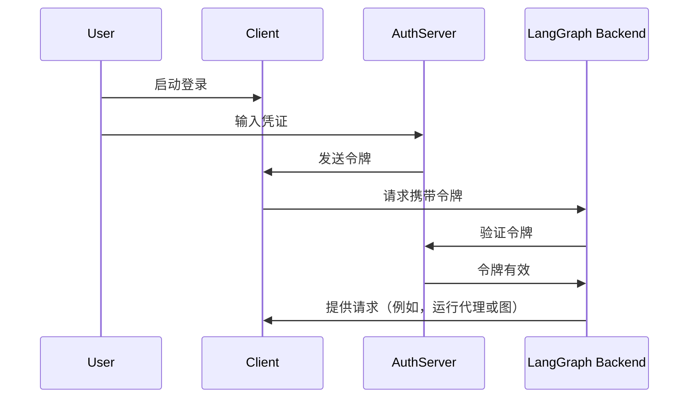

在[上一个教程](/langsmith/resource-auth)中，您为用户添加了资源授权，以实现私有会话。然而，您仍然在使用硬编码的令牌进行身份验证，这样是不安全的。现在，您将使用 [OAuth2](/langsmith/deployment-quickstart) 协议替换这些令牌，转而使用真实的客户端账户。

您将保留相同的 @[`Auth`][Auth] 对象和[资源级别访问控制](/langsmith/auth#single-owner-resources)，但会将身份验证升级为使用 Supabase 作为您的身份提供商。虽然本教程使用了 Supabase，但这些概念适用于任何 OAuth2 提供商。您将学习如何：

1. 用真实的 JWT 令牌替换测试令牌
2. 与 OAuth2 提供商集成以实现安全的的用户身份验证
3. 在保持现有授权逻辑的同时，处理用户会话和元数据

## 背景知识

OAuth2 主要涉及三个角色：

1. **授权服务器 (Authorization server)**：身份提供商（例如 Supabase、Auth0、Google），它负责处理用户身份验证并颁发令牌。
2. **应用程序后端 (Application backend)**：您的 LangGraph 应用程序。它负责验证令牌并提供受保护的资源（会话数据）。
3. **客户端应用程序 (Client application)**：用户与您的服务交互的 Web 或移动应用。

标准的 OAuth2 流程大致如下：



## 先决条件

在开始本教程之前，请确保您已完成以下操作：

* 没有错误地运行[第二个教程中的机器人](/langsmith/resource-auth)。
* 拥有一个 [Supabase 项目](https://supabase.com/dashboard) 以使用其身份验证服务器。

## 1. 安装依赖项

安装所需的依赖项。请在您的 `custom-auth` 目录下开始，并确保已安装 `langgraph-cli`：

<CodeGroup>
```bash pip
cd custom-auth
pip install -U "langgraph-cli[inmem]"
```

```bash uv
cd custom-auth
uv add langgraph-cli[inmem]
```
</CodeGroup>

<a id="setup-auth-provider"></a>
## 2. 设置身份验证提供商

接下来，获取您的身份验证服务器的 URL 和用于身份验证的私钥。由于本例中使用 Supabase，您可以在 Supabase 仪表板中执行此操作：

1. 在左侧边栏中，点击 "⚙️ Project Settings"（项目设置），然后点击 "API"。
2. 复制您的项目 URL 并将其添加到 `.env` 文件中：
  ```shell
  echo "SUPABASE_URL=your-project-url" >> .env
  ```
3. 复制您的 **服务角色密钥 (service role secret key)** 并将其添加到 `.env` 文件中：
  ```shell
  echo "SUPABASE_SERVICE_KEY=your-service-role-key" >> .env
  ```
4. 复制您的 **“anon public” 密钥 (anon public key)** 并记下来。稍后在设置客户端代码时会用到它：
  ```bash
  SUPABASE_URL=your-project-url
  SUPABASE_SERVICE_KEY=your-service-role-key
  ```

## 3. 实现令牌验证

在前面的教程中，您使用了 @[`Auth`][Auth] 对象来[验证硬编码的令牌](/langsmith/set-up-custom-auth)并[添加资源所有权](/langsmith/resource-auth)。

现在，您将升级身份验证，以验证来自 Supabase 的真实 JWT 令牌。主要更改将全部集中在带有 @[`@auth.authenticate`][Auth.authenticate] 装饰器的函数中：

* 不再与硬编码的令牌列表进行检查，而是向 Supabase 发出 HTTP 请求来验证该令牌。
* 您将从已验证的令牌中提取真实的**用户信息**（ID、电子邮件）。
* 现有的资源授权逻辑保持不变。

请更新 `src/security/auth.py` 以实现此功能：

```python {highlight={8-9,20-30}} title="src/security/auth.py"
import os
import httpx
from langgraph_sdk import Auth

auth = Auth()

# 这是从您创建的 .env 文件加载的
SUPABASE_URL = os.environ["SUPABASE_URL"]
SUPABASE_SERVICE_KEY = os.environ["SUPABASE_SERVICE_KEY"]


@auth.authenticate
async def get_current_user(authorization: str | None):
    """验证 JWT 令牌并提取用户信息。"""
    assert authorization
    scheme, token = authorization.split()
    assert scheme.lower() == "bearer"

    try:
        # 使用身份验证提供商验证令牌
        async with httpx.AsyncClient() as client:
            response = await client.get(
                f"{SUPABASE_URL}/auth/v1/user",
                headers={
                    "Authorization": authorization,
                    "apiKey": SUPABASE_SERVICE_KEY,
                },
            )
            assert response.status_code == 200
            user = response.json()
            return {
                "identity": user["id"],  # 唯一的用户标识符 (Unique user identifier)
                "email": user["email"],
                "is_authenticated": True,
            }
    except Exception as e:
        raise Auth.exceptions.HTTPException(status_code=401, detail=str(e))

# ... 剩余部分与之前相同

# 保留我们上一个教程中的资源授权逻辑
@auth.on
async def add_owner(ctx, value):
    """通过资源元数据使资源对其创建者私有化。"""
    filters = {"owner": ctx.user.identity}
    metadata = value.setdefault("metadata", {})
    metadata.update(filters)
    return filters
```

最重要的变化是我们现在使用真实的身份验证服务器来验证令牌。我们的身份验证处理程序拥有我们 Supabase 项目的私钥，我们可以用它来验证用户的令牌并提取其信息。

## 4. 测试身份验证流程

让我们测试新的身份验证流程。您可以在文件或 Notebook 中运行以下代码。您需要提供：

* 一个有效的电子邮件地址
* 一个 Supabase 项目 URL（来自[上方](#setup-auth-provider)）
* 一个 Supabase **anon public 密钥**（也来自[上方](#setup-auth-provider)）

```python
import os
import httpx
from getpass import getpass
from langgraph_sdk import get_client


# 从命令行获取电子邮件
email = getpass("Enter your email: ")
base_email = email.split("@")
password = "secure-password"  # ⚠️ 更改此项 (CHANGEME)
email1 = f"{base_email[0]}+1@{base_email[1]}"
email2 = f"{base_email[0]}+2@{base_email[1]}"

SUPABASE_URL = os.environ.get("SUPABASE_URL")
if not SUPABASE_URL:
    SUPABASE_URL = getpass("Enter your Supabase project URL: ")

# 这是您的 PUBLIC 公共密钥（在客户端使用是安全的）
# 不要将其与 secret 服务角色密钥混淆
SUPABASE_ANON_KEY = os.environ.get("SUPABASE_ANON_KEY")
if not SUPABASE_ANON_KEY:
    SUPABASE_ANON_KEY = getpass("Enter your public Supabase anon  key: ")


async def sign_up(email: str, password: str):
    """创建新的用户账户。"""
    async with httpx.AsyncClient() as client:
        response = await client.post(
            f"{SUPABASE_URL}/auth/v1/signup",
            json={"email": email, "password": password},
            headers={"apiKey": SUPABASE_ANON_KEY},
        )
        assert response.status_code == 200
        return response.json()

# 创建两个测试用户
print(f"Creating test users: {email1} and {email2}")
await sign_up(email1, password)
await sign_up(email2, password)
```

⚠️ 在继续操作之前：请检查您的电子邮件并点击两个确认链接。在确认用户电子邮件之前，Supabase 将拒绝 `/login` 请求。

现在测试用户是否只能看到他们自己的数据。请确保服务器正在运行（运行 `langgraph dev`），然后再继续操作。以下代码片段需要您在[设置身份验证提供商](#setup-auth-provider)时从 Supabase 仪表板复制的“anon public”密钥。

```python
async def login(email: str, password: str):
    """为现有用户获取访问令牌。"""
    async with httpx.AsyncClient() as client:
        response = await client.post(
            f"{SUPABASE_URL}/auth/v1/token?grant_type=password",
            json={
                "email": email,
                "password": password
            },
            headers={
                "apikey": SUPABASE_ANON_KEY,
                "Content-Type": "application/json"
            },
        )
        assert response.status_code == 200
        return response.json()["access_token"]


# 以用户 1 身份登录
user1_token = await login(email1, password)
user1_client = get_client(
    url="http://localhost:2024", headers={"Authorization": f"Bearer {user1_token}"}
)

# 以用户 1 的身份创建一个会话 (thread)
thread = await user1_client.threads.create()
print(f"✅ User 1 created thread: {thread['thread_id']}")

# 尝试在没有令牌的情况下访问
unauthenticated_client = get_client(url="http://localhost:2024")
try:
    await unauthenticated_client.threads.create()
    print("❌ 应该阻止未经验证的访问！ (Unauthenticated access should fail!)")
except Exception as e:
    print("✅ 未经验证的访问被阻止:", e)

# 尝试以用户 2 的身份访问用户 1 的会话
user2_token = await login(email2, password)
user2_client = get_client(
    url="http://localhost:2024", headers={"Authorization": f"Bearer {user2_token}"}
)

try:
    await user2_client.threads.get(thread["thread_id"])
    print("❌ 用户 2 不应该看到用户 1 的会话！ (User 2 shouldn't see User 1's thread!)")
except Exception as e:
    print("✅ 用户 2 被阻止访问用户 1 的会话:", e)
```

输出结果应如下所示：

```shell
✅ User 1 created thread: d6af3754-95df-4176-aa10-dbd8dca40f1a
✅ Unauthenticated access blocked: Client error '403 Forbidden' for url 'http://localhost:2024/threads'
✅ User 2 blocked from User 1's thread: Client error '404 Not Found' for url 'http://localhost:2024/threads/d6af3754-95df-4176-aa10-dbd8dca40f1a'
```

**您的身份验证和授权协同工作：**

1. 用户必须登录才能访问机器人。
2. 每个用户只能查看他们自己的会话。

所有用户都由 Supabase 身份验证提供商管理，因此您无需实现任何额外的用户管理逻辑。

## 后续步骤

您已成功为您的 LangGraph 应用程序构建了一个生产就绪的身份验证系统！让我们回顾一下您所完成的工作：

1. 设置了身份验证提供商（在本例中为 Supabase）。
2. 添加了带有电子邮件/密码身份验证的真实用户账户。
3. 将 JWT 令牌验证集成到您的 Agent Server 中。
4. 实现了正确的授权，以确保用户只能访问他们自己的数据。
5. 创建了一个准备好处理您下一个身份验证挑战的基础。

既然您已经有了生产级别的身份验证，可以考虑以下事项：

1. 使用您首选的框架构建 Web UI（有关示例，请参阅 [Custom Auth](https://github.com/langchain-ai/custom-auth) 模板）。
2. 阅读[身份验证概念指南](/langsmith/auth)后，了解身份验证和授权的其他方面。
3. 在阅读 @[参考文档][Auth] 后，进一步定制您的处理程序和设置。