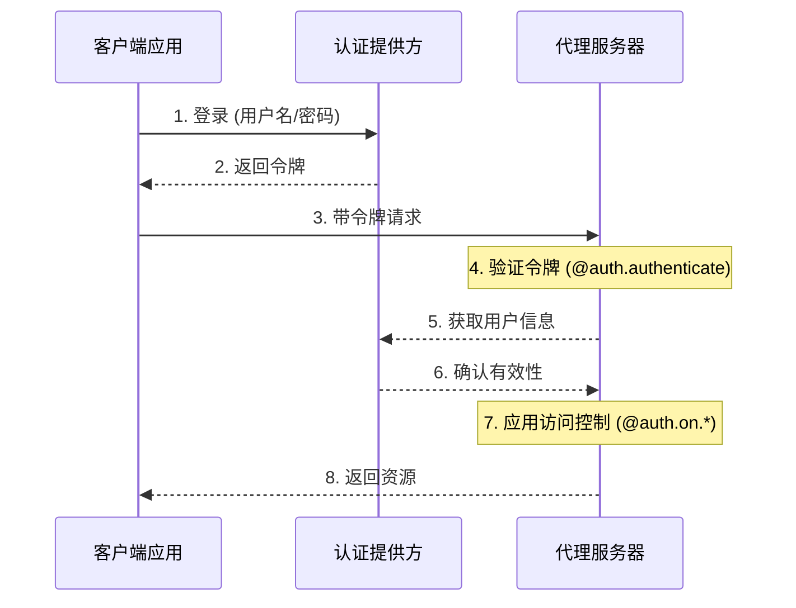
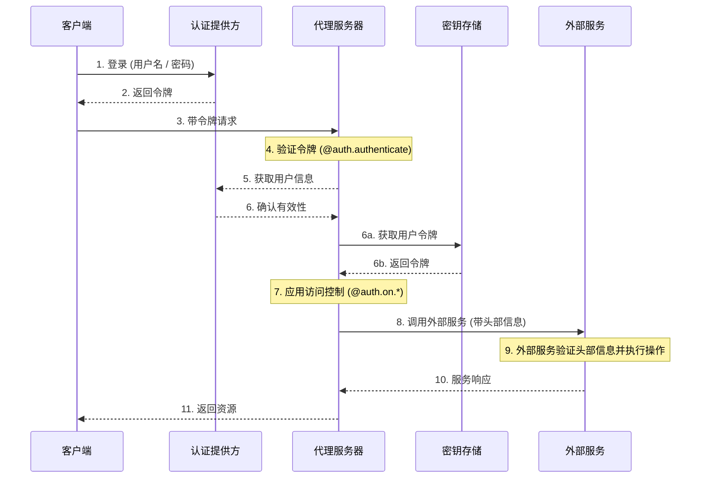

```markdown
---
title: 认证与访问控制
sidebarTitle: 概述
---

LangSmith 提供了一个灵活的认证和授权系统，可以与大多数身份验证方案集成。

## 核心概念

### 认证 (Authentication) 与 授权 (Authorization)

尽管这两个术语经常被互换使用，但它们代表了截然不同的安全概念：

* [**认证 (Authentication)**](#authentication) (简称 "AuthN") 验证**你是谁**。它作为中间件对每个请求运行。
* [**授权 (Authorization)**](#authorization) (简称 "AuthZ") 决定**你能做什么**。它基于每个资源验证用户的权限和角色。

在 LangSmith 中，认证由您的 @[`@auth.authenticate`][Auth.authenticate] 处理器处理，授权由您的 @[`@auth.on`][Auth.on] 处理器处理。

## 默认安全模型

LangSmith 提供不同的安全默认设置：

### LangSmith (云版本)

* 默认使用 LangSmith API 密钥
* 要求 `x-api-key` 头部中包含有效的 API 密钥
* 可以通过自定义认证处理器进行修改

<Note>
**自定义认证**
LangSmith 的所有方案都**支持**自定义认证。
</Note>

### 自托管 (Self-hosted)

* 没有默认认证
* 完全灵活，可以实现您自己的安全模型
* 您控制认证和授权的所有方面

## 系统架构

典型的认证设置涉及三个主要组件：

1. **认证提供方** (Identity Provider/IdP)
  * 一个专门的服务，用于管理用户身份和凭证
  * 处理用户注册、登录、密码重置等
  * 在认证成功后颁发令牌（如 JWT、会话令牌等）
  * 示例：Auth0, Supabase Auth, Okta 或您自己的认证服务器
2. **代理服务器** (Agent Server/Resource Server)
  * 包含业务逻辑和受保护资源的您的 Agent 或 LangGraph 应用程序
  * 使用认证提供方验证令牌
  * 根据用户身份和权限强制执行访问控制
  * 不直接存储用户凭证
3. **客户端应用程序** (Frontend)
  * Web 应用、移动应用或 API 客户端
  * 收集时间敏感的用户凭证并发送给认证提供方
  * 从认证提供方接收令牌
  * 在发送给代理服务器的请求中包含这些令牌

以下是这些组件通常如何交互：



LangGraph 中您的 @[`@auth.authenticate`][Auth.authenticate] 处理器处理步骤 4-6，而您的 @[`@auth.on`][Auth.on] 处理器实现步骤 7。

## 认证（Authentication）

LangGraph 中的认证作为中间件对每个请求运行。您的 @[`@auth.authenticate`][Auth.authenticate] 处理器接收请求信息，并应执行以下操作：

1. 验证凭证
2. 如果有效，返回包含用户身份和信息的 @[用户信息][MinimalUserDict] 字典
3. 如果无效，抛出 @[HTTP 异常][HTTPException] 或 AssertionError

```python
from langgraph_sdk import Auth

auth = Auth()

@auth.authenticate
async def authenticate(headers: dict) -> Auth.types.MinimalUserDict:
    # 验证凭证（例如：API 密钥、JWT 令牌）
    api_key = headers.get(b"x-api-key")
    if not api_key or not is_valid_key(api_key):
        raise Auth.exceptions.HTTPException(
            status_code=401,
            detail="无效的 API 密钥"
        )

    # 返回用户信息——仅 'identity' 和 'is_authenticated' 是必需的
    # 添加您授权所需的任何其他字段
    return {
        "identity": "user-123",        # 必需：唯一的用户标识符
        "is_authenticated": True,      # 可选：默认为 True
        "permissions": ["read", "write"] # 可选：用于基于权限的认证
        # 如果你想实现其他认证模式，可以添加更多自定义字段
        "role": "admin",
        "org_id": "org-456"

    }
```

返回的用户信息可在以下位置获取：

* 授权处理器中通过 @[`ctx.user`][AuthContext]
* 应用中通过 `config["configuration"]["langgraph_auth_user"]`

<Accordion title="支持的参数">
  @[@auth.authenticate`][Auth.authenticate] 处理器可以通过名称接受以下任何参数：

  * request (Request): 原生 ASGI 请求对象
  * path (str): 请求路径，例如 `"/threads/abcd-1234-abcd-1234/runs/abcd-1234-abcd-1234/stream"`
  * method (str): HTTP 方法，例如 `"GET"`
  * path_params (dict[str, str]): URL 路径参数，例如 `{"thread_id": "abcd-1234-abcd-1234", "run_id": "abcd-1234-abcd-1234"}`
  * query_params (dict[str, str]): URL 查询参数，例如 `{"stream": "true"}`
  * headers (dict[bytes, bytes]): 请求头部
  * authorization (str | None): Authorization 头部值（例如 `"Bearer <token>"`）

  在许多教程中，为了简洁，我们只展示 "authorization" 参数，但您可以根据需要接受更多信息来实现自定义认证方案。
</Accordion>

### Agent 认证

自定义认证允许委托访问。您在 `@auth.authenticate` 中返回的值会被添加到运行上下文，为 Agent 提供用户范围的凭证，使其能够代表用户访问资源。



认证后，平台会创建一个特殊的配置对象，该对象会通过可配置的上下文传递给您的图和所有节点。
此对象包含有关当前用户的信息，包括您从 @[`@auth.authenticate`][Auth.authenticate] 处理器返回的任何自定义字段。

要启用 Agent 代表用户执行操作，请使用[自定义认证中间件](/langsmith/custom-auth)。这将允许 Agent 代表用户与外部系统（如 MCP 服务器、外部数据库，甚至其他 Agent）进行交互。

如需更多信息，请参阅[使用自定义认证](/langsmith/custom-auth)指南。

### 使用 MCP 进行 Agent 认证

有关如何对 Agent 进行 MCP 服务器认证的信息，请参阅 [MCP 概念指南](/oss/langchain/mcp)。

## 授权（Authorization）

认证之后，LangGraph 会调用您的 @[`@auth.on`][Auth] 处理器来控制对特定资源的访问（例如：线程、助手、定时任务）。这些处理器可以执行以下操作：

1. 通过直接修改 `value["metadata"]` 字典，向资源创建过程中保存的元数据添加元数据。有关每个操作中 `value` 可以采用的类型的列表，请参阅[支持的操作表](#supported-actions)。
2. 在搜索/列表或读取操作期间，通过返回一个[筛选字典](#filter-operations)来筛选资源。
3. 如果拒绝访问，则抛出 HTTP 异常。

如果您只想实现简单的用户范围访问控制，可以使用单个 @[`@auth.on`][Auth] 处理器来处理所有资源和操作。如果您想根据资源和操作实现不同的控制，可以使用[特定于资源的处理器](#resource-specific-handlers)。有关支持访问控制的资源完整列表，请参阅[支持的资源](#supported-resources)部分。

```python
@auth.on
async def add_owner(
    ctx: Auth.types.AuthContext,
    value: dict  # 发送到此访问方法的有效载荷
) -> dict:  # 返回一个限制对资源访问的筛选字典
    """授权对所有线程、助手、定时任务和运行的访问。

    此处理器执行两项操作：
        - 向资源元数据添加一个值（以便在稍后筛选时保留在资源中）
        - 返回一个筛选器（以限制对现有资源的访问）

    Args:
        ctx: 包含用户信息、权限、路径的认证上下文。
        value: 发送到端点的请求有效载荷。对于创建操作，这包含资源参数。对于读取操作，这包含正在访问的资源。

    Returns:
        一个 LangGraph 用于限制资源访问的筛选字典。
        有关支持的操作符，请参阅 [筛选操作](#filter-operations)。
    """
    # 创建筛选器以将访问限制在此用户的资源上
    filters = {"owner": ctx.user.identity}

    # 获取或在有效载荷中创建元数据字典
    # 这是存储资源的持久化信息的地方
    metadata = value.setdefault("metadata", {})

    # 添加所有者到元数据——如果是创建或更新操作，
    # 此信息将与资源一起保存
    # 这样我们就可以在读取操作中按它进行筛选
    metadata.update(filters)

    # 返回筛选器以限制访问
    # 这些筛选器应用于所有操作（创建、读取、更新、搜索等）
    # 以确保用户只能访问其自己的资源
    return filters
```

<a id="resource-specific-handlers"></a>
### 特定于资源的处理器

您可以将特定于资源和操作的处理器注册为使用 @[`@auth.on`][Auth] 装饰器链式连接资源名称和操作名称。
当发出请求时，最匹配该资源和操作的处理器将被调用。下面是一个如何为特定资源和操作注册处理器的示例。对于以下设置：

1. 已认证用户可以创建线程、读取线程以及在线程上创建运行 (run)。
2. 只有具有 "assistants:create" 权限的用户才能创建新的助手。
3. 所有其他端点（例如：删除助手、定时任务、存储）对所有用户禁用。

<Tip>
**支持的处理器**
有关支持的资源和操作的完整列表，请参阅下面的[支持的资源](#supported-resources)部分。
</Tip>

```python
# 通用/全局处理器捕获未被更具体处理器处理的调用
@auth.on
async def reject_unhandled_requests(ctx: Auth.types.AuthContext, value: Any) -> False:
    print(f"用户 {ctx.user.identity} 对 {ctx.path} 的请求")
    raise Auth.exceptions.HTTPException(
        status_code=403,
        detail="禁止访问"
    )

# 匹配 “thread” 资源和所有操作——创建、读取、更新、删除、搜索
# 由于这比通用的 @auth.on 处理器**更具体**，它将优先于
# 通用处理器处理 “threads” 资源上的所有操作
@auth.on.threads
async def on_thread(
    ctx: Auth.types.AuthContext,
    value: Auth.types.threads.create.value
):
    # 在正在创建的 thread 上设置元数据
    # 将确保资源包含一个 "owner" 字段
    # 这样当用户尝试访问此线程或其内部的运行 (run) 时，
    # 我们可以按所有者进行筛选
    metadata = value.setdefault("metadata", {})
    metadata["owner"] = ctx.user.identity
    return {"owner": ctx.user.identity}


# 线程创建。这仅匹配线程创建操作
# 由于这比通用的 @auth.on 处理器和 @auth.on.threads 处理器**更具体**，
# 它将优先于通用处理器处理 "threads" 资源上的任何 "create" 操作
@auth.on.threads.create
async def on_thread_create(
    ctx: Auth.types.AuthContext,
    value: Auth.types.threads.create.value
):
    # 如果用户没有写入权限，则拒绝
    if "write" not in ctx.permissions:
        raise Auth.exceptions.HTTPException(
            status_code=403,
            detail="用户缺少所需的权限。"
        )
    # 在正在创建的 thread 上设置元数据
    # 将确保资源包含一个 "owner" 字段
    # 这样当用户尝试访问此线程或其内部的运行 (run) 时，
    # 我们可以按所有者进行筛选
    metadata = value.setdefault("metadata", {})
    metadata["owner"] = ctx.user.identity
    return {"owner": ctx.user.identity}

# 读取线程。由于这比通用的 @auth.on 处理器和 @auth.on.threads 处理器更具体，
# 它将优先于它们处理 "threads" 资源上的任何 "read" 操作
@auth.on.threads.read
async def on_thread_read(
    ctx: Auth.types.AuthContext,
    value: Auth.types.threads.read.value
):
    # 由于我们正在读取（而不是创建）线程，
    # 我们不需要设置元数据。我们只需要
    # 返回一个筛选器，以确保用户只能看到他们自己的线程
    return {"owner": ctx.user.identity}

# 运行创建、流式传输、更新等。
# 这将优先于通用的 @auth.on 处理器和 @auth.on.threads 处理器
@auth.on.threads.create_run
async def on_run_create(
    ctx: Auth.types.AuthContext,
    value: Auth.types.threads.create_run.value
):
    metadata = value.setdefault("metadata", {})
    metadata["owner"] = ctx.user.identity
    # 继承线程的访问控制
    return {"owner": ctx.user.identity}

# 助手创建
@auth.on.assistants.create
async def on_assistant_create(
    ctx: Auth.types.AuthContext,
    value: Auth.types.assistants.create.value
):
    if "assistants:create" not in ctx.permissions:
        raise Auth.exceptions.HTTPException(
            status_code=403,
            detail="用户缺少所需的权限。"
        )
```

请注意，我们在上面的示例中混合使用了全局和特定于资源的处理器。由于每个请求都由最具体的处理器处理，对 `thread` 的创建请求将匹配 `on_thread_create` 处理器，但不会匹配 `reject_unhandled_requests` 处理器。然而，对线程的 `update` 请求将由全局处理器处理，因为我们没有为该资源和操作设置更具体的处理器。

<a id="filter-operations"></a>
### 筛选操作

授权处理器可以返回 `None`、布尔值或筛选字典。

* `None` 和 `True` 表示“授权访问所有底层资源”
* `False` 表示“拒绝访问所有底层资源（抛出 403 异常）”
* 元数据筛选字典将限制对资源的访问

筛选字典是一个字典，其键与资源元数据匹配。它支持三种运算符：

* 默认值是精确匹配的简写（即 "$eq"），如下所示。例如，`{"owner": user_id}` 将仅包含元数据包含 `{"owner": user_id}` 的资源
* `$eq`: 精确匹配（例如：`{"owner": {"$eq": user_id}}`）——这等效于上面的简写形式 `{"owner": user_id}`
* `$contains`: 列表成员资格（例如：`{"allowed_users": {"$contains": user_id}}`）或列表包含性（例如：`{"allowed_users": {"$contains": [user_id_1, user_id_2]}}`）。此处的 `value` 必须是列表中的一个元素或这些元素的子集，分别对应上述两种情况。存储在资源中的元数据必须是列表/容器类型。

包含多个键的字典使用逻辑 `AND` 筛选。例如，`{"owner": org_id, "allowed_users": {"$contains": user_id}}` 将只匹配元数据的 "owner" 是 `org_id` 并且 "allowed_users" 列表中包含 `user_id` 的资源。
有关更多信息，请参阅 @[`Auth`](Auth) 引用。

## 常见访问模式

这里有一些典型的授权模式：

### 单一所有者资源

这种常见的模式可以将所有线程、助手、定时任务和运行的范围限定给单个用户。它适用于常见的单用户用例，例如常规聊天机器人应用。

```python
@auth.on
async def owner_only(ctx: Auth.types.AuthContext, value: dict):
    metadata = value.setdefault("metadata", {})
    metadata["owner"] = ctx.user.identity
    return {"owner": ctx.user.identity}
```

### 基于权限的访问

这种模式允许您根据**权限**控制访问。如果您希望某些角色对资源拥有更广泛或更受限制的访问权限，则此模式非常有用。

```python
# 在您的认证处理器中：
@auth.authenticate
async def authenticate(headers: dict) -> Auth.types.MinimalUserDict:
    ...
    return {
        "identity": "user-123",
        "is_authenticated": True,
        "permissions": ["threads:write", "threads:read"]  # 在 auth 中定义权限
    }

def _default(ctx: Auth.types.AuthContext, value: dict):
    metadata = value.setdefault("metadata", {})
    metadata["owner"] = ctx.user.identity
    return {"owner": ctx.user.identity}

@auth.on.threads.create
async def create_thread(ctx: Auth.types.AuthContext, value: dict):
    if "threads:write" not in ctx.permissions:
        raise Auth.exceptions.HTTPException(
            status_code=403,
            detail="未经授权"
        )
    return _default(ctx, value)


@auth.on.threads.read
async def rbac_create(ctx: Auth.types.AuthContext, value: dict):
    if "threads:read" not in ctx.permissions and "threads:write" not in ctx.permissions:
        raise Auth.exceptions.HTTPException(
            status_code=403,
            detail="未经授权"
        )
    return _default(ctx, value)
```

## 支持的资源

LangGraph 提供三个级别的授权处理器，从最通用到最具体：

1. **全局处理器** (`@auth.on`): 匹配所有资源和操作
2. **资源处理器**（例如：`@auth.on.threads`、`@auth.on.assistants`、`@auth.on.crons`）：匹配特定资源的所有操作
3. **操作处理器**（例如：`@auth.on.threads.create`、`@auth.on.threads.read`）：匹配特定资源上的特定操作

将使用最具体匹配的处理器。例如，`@auth.on.threads.create` 优先于 `threads` 创建操作中的 `@auth.on.threads`。
如果注册了更具体的处理器，则对于该资源和操作，更通用的处理器将不会被调用。

<Tip>
"类型安全"
每个处理器都有其 `value` 参数的类型提示，位于 `Auth.types.on.<resource>.<action>.value`。例如：

```python
@auth.on.threads.create
async def on_thread_create(
ctx: Auth.types.AuthContext,
value: Auth.types.on.threads.create.value  # 线程创建的具体类型
):
...

@auth.on.threads
async def on_threads(
ctx: Auth.types.AuthContext,
value: Auth.types.on.threads.value  # 所有线程操作的联合类型
):
...

@auth.on
async def on_all(
ctx: Auth.types.AuthContext,
value: dict  # 所有可能操作的联合类型
):
...
```

更具体的处理器提供更好的类型提示，因为它们处理的操作类型更少。
</Tip>

<a id="supported-actions"></a>
#### 支持的操作和类型

以下是所有支持的操作处理器：

| 资源 | 处理器 | 描述 | 值类型 |
|----------|---------|-------------|------------|
| **Threads** | `@auth.on.threads.create` | 线程创建 | @[`ThreadsCreate`] |
| | `@auth.on.threads.read` | 线程检索 | @[`ThreadsRead`] |
| | `@auth.on.threads.update` | 线程更新 | @[`ThreadsUpdate`] |
| | `@auth.on.threads.delete` | 线程删除 | @[`ThreadsDelete`] |
| | `@auth.on.threads.search` | 列出线程 | @[`ThreadsSearch`] |
| | `@auth.on.threads.create_run` | 创建或更新运行 (run) | @[`RunsCreate`] |
| **Assistants** | `@auth.on.assistants.create` | 助手创建 | @[`AssistantsCreate`] |
| | `@auth.on.assistants.read` | 助手检索 | @[`AssistantsRead`] |
| | `@auth.on.assistants.update` | 助手更新 | @[`AssistantsUpdate`] |
| | `@auth.on.assistants.delete` | 助手删除 | @[`AssistantsDelete`] |
| | `@auth.on.assistants.search` | 列出助手 | @[`AssistantsSearch`] |
| **Crons** | `@auth.on.crons.create` | 定时任务创建 | @[`CronsCreate`] |
| | `@auth.on.crons.read` | 定时任务检索 | @[`CronsRead`] |
| | `@auth.on.crons.update` | 定时任务更新 | @[`CronsUpdate`] |
| | `@auth.on.crons.delete` | 定时任务删除 | @[`CronsDelete`] |
| | `@auth.on.crons.search` | 列出定时任务 | @[`CronsSearch`] |

<Note>
"关于运行 (Runs)"

运行 (Runs) 的访问控制范围限定在其父线程上。这意味着权限通常继承自线程，反映了数据的对话性质。除创建外，所有运行操作（读取、列出）都由线程的处理器控制。
有一个专用的 `create_run` 处理器，因为它有更多您可以在处理器中查看的参数。
</Note>

## 后续步骤

有关实现细节：

* 查看关于[设置认证](/langsmith/set-up-custom-auth)的入门教程
* 查看实现[自定义认证处理器](/langsmith/custom-auth)的操作指南
```