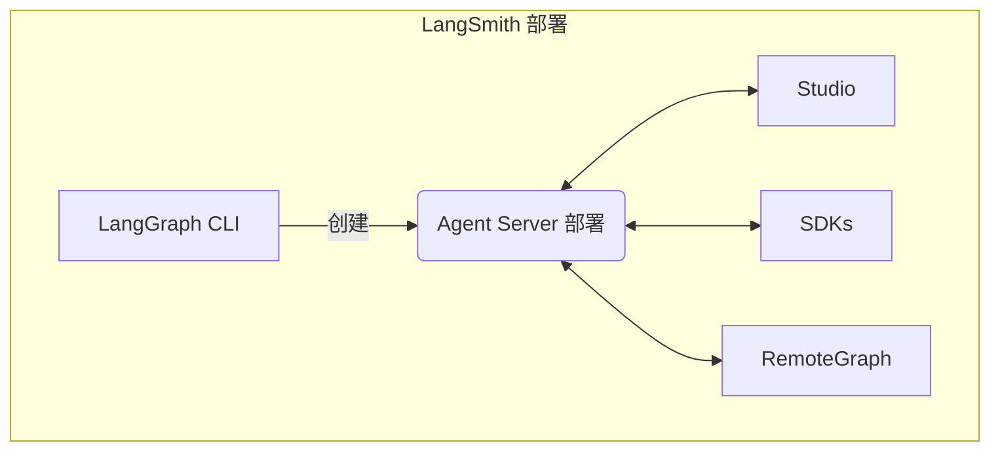

当您运行自托管的 [LangSmith 部署](/langsmith/deploy-self-hosted-full-platform) 时，您的安装会包含几个关键组件。这些工具和服务共同提供了一个完整的解决方案，用于在您自己的基础设施中构建、部署和管理图（包括智能体应用）：

- [Agent Server](/langsmith/agent-server)：定义了一个有主见（opinionated）的 API 和运行时环境，用于部署图和智能体。它负责处理执行、状态管理和持久化，这样您就可以专注于构建逻辑，而不是服务器基础设施。
- [LangGraph CLI](/langsmith/cli)：一个命令行接口（CLI），用于在本地构建、打包和交互图，并为部署做准备。
- [Studio](/langsmith/studio)：一个专用的 IDE，用于可视化、交互和调试。它连接到本地的 Agent Server，以便于开发和测试您的图。
- [Python/JS SDK](/langsmith/sdk)：Python/JS SDK 提供了一种通过代码与已部署的图和智能体进行交互的程序化方式。
- [RemoteGraph](/langsmith/use-remote-graph)：允许您像与本地运行的图进行交互一样，与已部署的图进行交互。
- [Control Plane](/langsmith/control-plane)：用于创建、更新和管理 Agent Server 部署的用户界面（UI）和 API 集合。
- [Data plane](/langsmith/data-plane)：执行您的图的运行时层，包括 Agent Servers、其支持服务（如 PostgreSQL、Redis 等）以及用于协调控制平面状态的监听器。