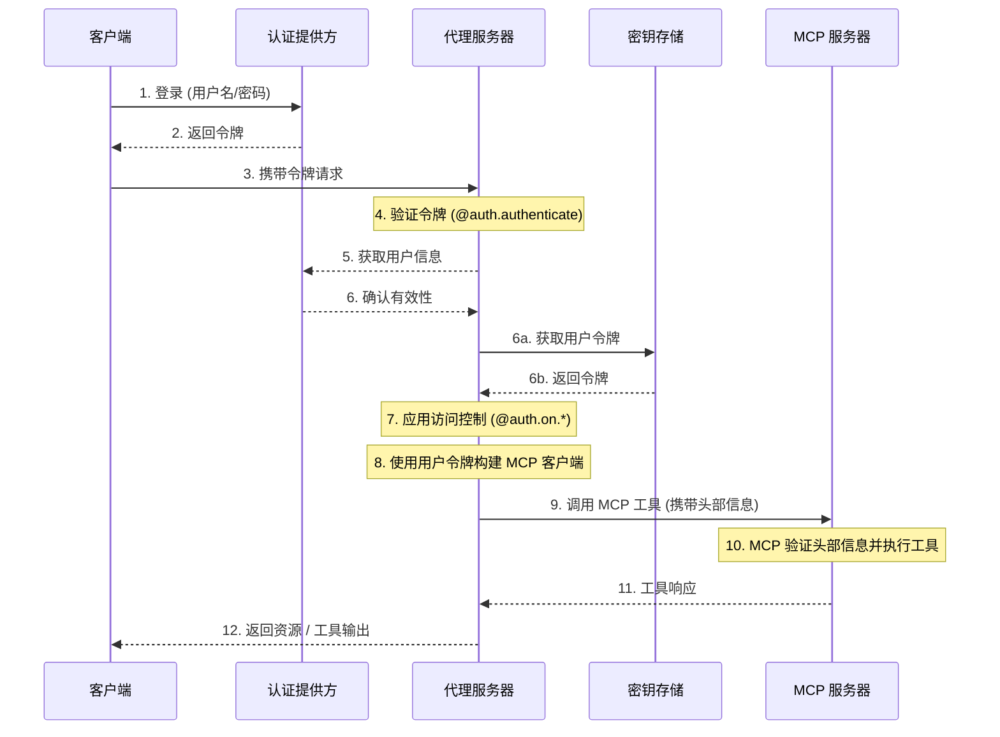

模型上下文协议（Model Context Protocol, MCP）是一种开放协议，用于以模型无关的格式描述工具和数据源，使大型语言模型（LLM）能够通过结构化 API 发现并使用它们。

[代理服务器 (Agent Server)](/langsmith/agent-server) 使用 [Streamable HTTP 传输协议](https://spec.modelcontextprotocol.io/specification/2025-03-26/basic/transports/#streamable-http) 来实现 MCP。这使得 LangGraph **代理**可以作为 **MCP 工具**暴露出来，以便任何支持 Streamable HTTP 的 MCP 兼容客户端都可以使用它们。

MCP 端点位于 [代理服务器 (Agent Server)](/langsmith/agent-server) 的 `/mcp` 路径下。

您可以设置 [自定义认证中间件](/langsmith/custom-auth) 来对 MCP 服务器上的用户进行身份验证，以便在您的 LangSmith 部署中访问用户作用域的工具。

该流程的示例架构如下：



## 要求

要使用 MCP，请确保安装了以下依赖项：

* `langgraph-api >= 0.2.3`
* `langgraph-sdk >= 0.1.61`

使用以下命令进行安装：

<CodeGroup>
```bash pip
pip install "langgraph-api>=0.2.3" "langgraph-sdk>=0.1.61"
```

```bash uv
uv add "langgraph-api>=0.2.3" "langgraph-sdk>=0.1.61"
```
</CodeGroup>

## 用法概览

要启用 MCP：

* 将 `langgraph-api` 升级到 >=0.2.3 版本。如果您正在部署 LangSmith，当您创建新版本时，系统会自动为您完成此操作。
* MCP 工具（即代理）将被自动暴露。
* 连接到任何支持 Streamable HTTP 的 MCP 兼容客户端即可。

### 客户端

使用 MCP 兼容的客户端连接到代理服务器。以下示例展示了如何使用不同编程语言连接。

<Tabs>
    <Tab title="JavaScript/TypeScript">
    ```bash
    npm install @modelcontextprotocol/sdk
    ```

        > **注意**
        > 将 `serverUrl` 替换为您的代理服务器 URL，并根据需要配置认证头部信息。

    ```js
    import { Client } from "@modelcontextprotocol/sdk/client/index.js";
    import { StreamableHTTPClientTransport } from "@modelcontextprotocol/sdk/client/streamableHttp.js";

    // 连接到 LangGraph MCP 端点
    async function connectClient(url) {
        const baseUrl = new URL(url);
        const client = new Client({
            name: 'streamable-http-client',
            version: '1.0.0'
        });

        const transport = new StreamableHTTPClientTransport(baseUrl);
        await client.connect(transport);

        console.log("使用 Streamable HTTP 传输连接成功");
        console.log(JSON.stringify(await client.listTools(), null, 2));
        return client;
    }

    const serverUrl = "http://localhost:2024/mcp";

    connectClient(serverUrl)
        .then(() => {
            console.log("客户端连接成功");
        })
        .catch(error => {
            console.error("客户端连接失败:", error);
        });
    ```
    </Tab>
    <Tab title="Python">
    使用以下命令安装适配器：

    ```bash
    pip install langchain-mcp-adapters
    ```

    以下是如何连接到远程 MCP 端点并将代理用作工具的示例：

    ```python
    # 为标准输入/输出连接创建服务器参数
    from mcp import ClientSession
    from mcp.client.streamable_http import streamablehttp_client
    import asyncio

    from langchain_mcp_adapters.tools import load_mcp_tools
    from langchain.agents import create_agent


    server_params = {
        "url": "https://mcp-finance-agent.xxx.us.langgraph.app/mcp",
        "headers": {
            "X-Api-Key":"lsv2_pt_your_api_key"
        }
    }

    async def main():
        async with streamablehttp_client(**server_params) as (read, write, _):
            async with ClientSession(read, write) as session:
                # 初始化连接
                await session.initialize()

                # 加载远程图，就好像它是一个工具一样
                tools = await load_mcp_tools(session)

                # 使用工具创建并运行一个 ReAct 代理
                agent = create_agent("gpt-4.1", tools)

                # 使用消息调用代理
                agent_response = await agent.ainvoke({"messages": "金融代理能为我做什么？"})
                print(agent_response)

    if __name__ == "__main__":
        asyncio.run(main())
    ```
    </Tab>
</Tabs>

## 将代理暴露为 MCP 工具

部署后，您的代理将以以下配置出现在 MCP 端点中：

* **工具名称 (Tool name)**: 代理的名称。
* **工具描述 (Tool description)**: 代理的描述。
* **工具输入 Schema (Tool input schema)**: 代理的输入 Schema。

### 设置名称和描述

您可以在 `langgraph.json` 中设置代理的名称和描述：

```json
{
    "graphs": {
        "my_agent": {
            "path": "./my_agent/agent.py:graph",
            "description": "A description of what the agent does"
        }
    },
    "env": ".env"
}
```

部署后，您可以使用 LangGraph SDK 更新名称和描述。

### Schema

定义清晰、最小的输入和输出 Schema，以避免向 LLM 暴露不必要的内部复杂性。

默认的 [MessagesState](/oss/langgraph/graph-api#messagesstate) 使用 `AnyMessage`，它支持许多消息类型，但对于直接暴露给 LLM 来说过于通用。

相反，定义使用明确类型的输入和输出结构的**自定义代理或工作流**。

例如，一个回答文档问题的工作流可能如下所示：

```python
from langgraph.graph import StateGraph, START, END
from typing_extensions import TypedDict

# 定义输入 Schema
class InputState(TypedDict):
    question: str

# 定义输出 Schema
class OutputState(TypedDict):
    answer: str

# 组合输入和输出
class OverallState(InputState, OutputState):
    pass

# 定义处理节点
def answer_node(state: InputState):
    # 替换为实际逻辑并执行有用的操作
    return {"answer": "bye", "question": state["question"]}

# 使用显式 Schema 构建图
builder = StateGraph(OverallState, input_schema=InputState, output_schema=OutputState)
builder.add_node(answer_node)
builder.add_edge(START, "answer_node")
builder.add_edge("answer_node", END)
graph = builder.compile()

# 运行图
print(graph.invoke({"question": "hi"}))
```

有关更多详细信息，请参阅[底层概念指南](/oss/langgraph/graph-api#state)。

## 在您的部署中使用用户作用域的 MCP 工具

<Tip>
**先决条件**
您已添加自己的 [自定义认证中间件](/langsmith/custom-auth)，该中间件会填充 `langgraph_auth_user` 对象，使其可供您图中所有节点的配置上下文访问。
</Tip>

要使用户作用域的工具在您的 LangSmith 部署中可用，请从实现如下代码片段开始：

```python
from langchain_mcp_adapters.client import MultiServerMCPClient

def mcp_tools_node(state, config):
    user = config["configurable"].get("langgraph_auth_user")
         , user["github_token"], user["email"], etc.

    client = MultiServerMCPClient({
        "github": {
            "transport": "streamable_http", # (1)
            "url": "https://my-github-mcp-server/mcp", # (2)
            "headers": {
                "Authorization": f"Bearer {user['github_token']}"
            }
        }
    })
    tools = await client.get_tools() # (3)

    # 您的工具调用逻辑在此处

    tool_messages = ...
    return {"messages": tool_messages}
```

1. MCP 只支持向 `streamable_http` 和 `sse` `transport` 服务器发出的请求添加头部信息。
2. 您的 MCP 服务器 URL。
3. 从您的 MCP 服务器获取可用工具。

_这也可以通过[在运行时重建您的图表](/langsmith/graph-rebuild)来实现，以便为新运行具有不同的配置_

## 会话行为

当前的 LangGraph MCP 实现不支持会话。每个 `/mcp` 请求都是无状态且独立的。

## 认证

`/mcp` 端点使用与 LangGraph API 其余部分相同的认证方式。有关设置详情，请参阅[认证指南](/langsmith/auth)。

## 禁用 MCP

要禁用 MCP 端点，请在 `langgraph.json` 配置文件中将 `disable_mcp` 设置为 `true`：

```json
{
  "$schema": "https://langgra.ph/schema.json",
  "http": {
    "disable_mcp": true
  }
}
```

这将阻止服务器暴露 `/mcp` 端点。