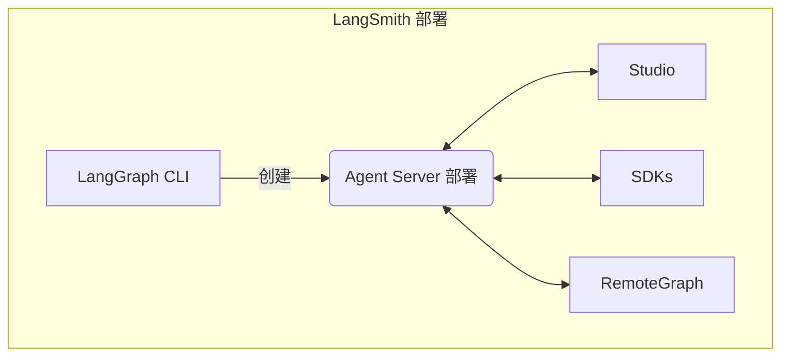

<Info>
**先决条件**
* [LangSmith](/langsmith/home)
* [Agent Server](/langsmith/agent-server)
* [LangGraph CLI](/langsmith/cli)
</Info>

Studio 是一个专用的智能体 IDE（集成开发环境），它支持对实现 Agent Server API 协议的智能体系统进行可视化、交互和调试。Studio 还与 [Tracing（追踪）](/langsmith/observability-concepts)、[Evaluation（评估）](/langsmith/evaluation) 和 [Prompt Engineering（提示工程）](/langsmith/prompt-engineering) 进行了集成。

## 特性

Studio 的主要功能包括：

* 可视化你的图结构（graph architecture）
* [运行和交互你的智能体](/langsmith/use-studio#run-application)
* [管理助手（assistants）](/langsmith/use-studio#manage-assistants)
* [管理会话（threads）](/langsmith/use-studio#manage-threads)
* [迭代提示词](/langsmith/observability-studio)
* [针对数据集运行实验](/langsmith/observability-studio#run-experiments-over-a-dataset)
* 管理 [长期记忆](/oss/concepts/memory)
* 通过 [时间旅行（time travel）](/oss/langgraph/use-time-travel) 调试智能体状态

Studio 适用于部署在 [LangSmith](/langsmith/deployment-quickstart) 上的图，或通过 [Agent Server](/langsmith/local-server) 在本地运行的图。

Studio 支持两种模式：

### 图模式 (Graph mode)

图模式（Graph mode）提供了全部功能集，当你希望尽可能多地了解智能体执行的细节时非常有用，包括遍历的节点、中间状态以及 LangSmith 的集成（例如添加到数据集和 Playground）。

### 聊天模式 (Chat mode)

聊天模式（Chat mode）是用于迭代和测试特定于聊天的智能体的简化 UI。它对业务用户以及希望测试整体智能体行为的用户非常有用。聊天模式仅支持状态包含或扩展了 [`MessagesState`](/oss/langgraph/use-graph-api#messagesstate) 的图。

## 了解更多

* 请参阅本指南，了解如何开始使用 Studio [快速上手](/langsmith/quick-start-studio)。

## 视频指南
<iframe
  className="w-full aspect-video rounded-xl"
  src="https://www.youtube.com/embed/Mi1gSlHwZLM?si=oWCeHQ640zPHoLwn"
  title="YouTube video player"
  frameBorder="0"
  allow="accelerometer; autoplay; clipboard-write; encrypted-media; gyroscope; picture-in-picture"
  allowFullScreen
></iframe>