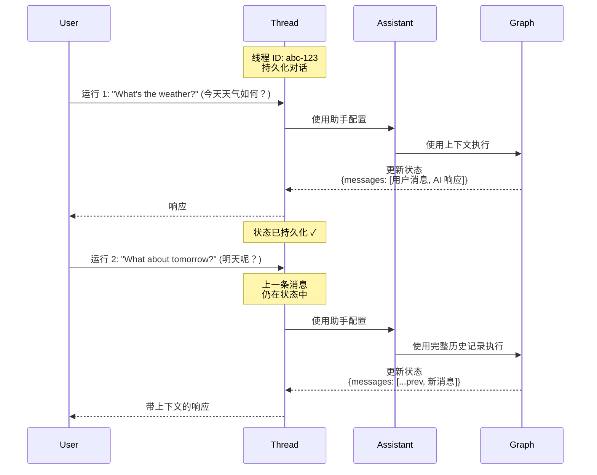

```markdown
---
title: 使用线程 (Threads)
sidebarTitle: 使用线程
---

本指南将向您展示如何创建、查看和检查 _线程_ (threads)。线程与 [助手 (assistants)](/langsmith/assistants) 配合使用，以实现您的 [已部署图 (deployed graphs)](/langsmith/deployments) 的 [有状态 (stateful)](/oss/langgraph/persistence) 执行。

## 理解线程

线程是一个持久化的对话容器，它在多次运行之间维护状态。每次在线程上执行一次运行 (run) 时，图 (graph) 都会利用线程的当前状态来处理输入，并用新信息更新该状态。

线程通过保存对话历史记录和上下文，实现了有状态的交互。如果没有线程，每次运行都将是无状态的，没有关于先前交互的记忆。线程在以下场景中特别有用：

- 需要助手记住讨论内容的**多轮对话**。
- 需要跨多个步骤维护上下文的**长时间运行任务**。
- 需要为每个用户维护独立对话历史记录的**特定用户状态管理**。

下面的图表说明了线程如何在两次运行中维护状态。第二次运行可以访问第一次运行中的消息，使助手能够理解 "What about tomorrow?"（明天怎么样？）的上下文指的是第一次运行中的天气查询：



- 线程使用唯一的线程 ID 维护一个**持久化的对话**。
- 每次运行都会将助手的配置应用于图的执行。
- 状态在每次运行后更新并为后续运行**持久化**。
- 后续运行可以访问**完整的对话历史记录**。

<Note>
- **[助手](/langsmith/assistants)** 定义了图执行方式的配置（模型、提示、工具）。创建运行时，您可以指定 **图 ID**（例如，`"agent"`）来使用默认助手，或者指定 **助手 ID**（UUID）来使用特定配置。
- **线程** 维护状态和对话历史记录。
- **运行** 将助手和线程结合起来，使用特定的配置和状态来执行您的图。
</Note>

## 创建线程

要使用状态持久化运行图，您必须首先创建一个线程：

<Tabs>
<Tab title="SDK">

### 空线程

要创建一个新线程，请使用以下任一方法：

<CodeGroup>
```python Python
from langgraph_sdk import get_client

# 使用您的部署 URL 初始化客户端
client = get_client(url=<DEPLOYMENT_URL>)

# 创建一个空线程
# 这会创建一个没有初始状态的新线程
thread = await client.threads.create()

print(thread)
```

```javascript JavaScript
import { Client } from "@langchain/langgraph-sdk";

// 使用您的部署 URL 初始化客户端
const client = new Client({ apiUrl: <DEPLOYMENT_URL> });

// 创建一个空线程
// 这会创建一个没有初始状态的新线程
const thread = await client.threads.create();

console.log(thread);
```

```bash cURL
curl --request POST \
    --url <DEPLOYMENT_URL>/threads \
    --header 'Content-Type: application/json' \
    --data '{}'
```
</CodeGroup>

有关更多信息，请参阅 @[Python][ThreadsClient.create] 和 @[JS][ThreadsClient.create] SDK 文档，或 [REST API](/langsmith/agent-server-api/threads/create-thread) 参考。

输出：

```json
{
  "thread_id": "123e4567-e89b-12d3-a456-426614174000",
  "created_at": "2025-05-12T14:04:08.268Z",
  "updated_at": "2025-05-12T14:04:08.268Z",
  "metadata": {},
  "status": "idle",
  "values": {}
}
```

### 复制线程

或者，如果您在应用程序中已经有一个希望复制其状态的线程，可以使用 `copy` 方法。这将创建一个独立的新线程，其历史记录在操作时与原始线程相同：

<CodeGroup>
```python Python
# 复制一个现有线程
# 新线程将在复制时具有与原始线程相同的状态
copied_thread = await client.threads.copy(thread["thread_id"])
```

```javascript JavaScript
// 复制一个现有线程
// 新线程将在复制时具有与原始线程相同的状态
const copiedThread = await client.threads.copy(thread["thread_id"]);
```

```bash cURL
curl --request POST --url <DEPLOYMENT_URL>/threads/thread["thread_id"]/copy \
--header 'Content-Type: application/json'
```
</CodeGroup>

有关更多信息，请参阅 @[Python][ThreadsClient.copy] 和 @[JS][ThreadsClient.copy] SDK 文档，或 [REST API](/langsmith/agent-server-api/threads/copy-thread) 参考。

### 预填充状态 (Prepopulated State)

通过向 `create` 方法提供一个 `supersteps` 列表，您可以使用任意预定义的状态来创建线程。`supersteps` 描述了一系列状态更新，用于建立线程的初始状态。当您想要：

- 创建具有现有对话历史记录的线程。
- 从另一个系统迁移对话。
- 设置具有特定初始状态的测试场景。
- 从先前的会话中恢复对话。
时，这很有用。

有关检查点和状态管理的更多信息，请参阅 [LangGraph 持久化文档](/oss/langgraph/persistence)。

<CodeGroup>
```python Python
from langgraph_sdk import get_client

# 初始化客户端
client = get_client(url=<DEPLOYMENT_URL>)

# 创建一个带有预填充对话历史记录的线程
# supersteps 定义了一系列状态更新，用于构建初始状态
thread = await client.threads.create(
  graph_id="agent",  # 指定此线程对应的图
  supersteps=[
    {
      updates: [
        {
          values: {},
          as_node: '__input__',  # 初始输入节点
        },
      ],
    },
    {
      updates: [
        {
          values: {
            messages: [
              {
                type: 'human',
                content: 'hello',
              },
            ],
          },
          as_node: '__start__',  # 用户的第一个消息
        },
      ],
    },
    {
      updates: [
        {
          values: {
            messages: [
              {
                content: 'Hello! How can I assist you today?',
                type: 'ai',
              },
            ],
          },
          as_node: 'call_model',  # 助手的响应
        },
      ],
    },
  ])

print(thread)
```

```javascript JavaScript
import { Client } from "@langchain/langgraph-sdk";

// 初始化客户端
const client = new Client({ apiUrl: <DEPLOYMENT_URL> });

// 创建一个带有预填充对话历史记录的线程
// supersteps 定义了一系列状态更新，用于构建初始状态
const thread = await client.threads.create({
    graphId: 'agent',  // 指定此线程对应的图
    supersteps: [
    {
      updates: [
        {
          values: {},
          asNode: '__input__',  // 初始输入节点
        },
      ],
    },
    {
      updates: [
        {
          values: {
            messages: [
              {
                type: 'human',
                content: 'hello',
              },
            ],
          },
          asNode: '__start__',  // 用户的第一个消息
        },
      ],
    },
    {
      updates: [
        {
          values: {
            messages: [
              {
                content: 'Hello! How can I assist you today?',
                type: 'ai',
              },
            ],
          },
          asNode: 'call_model',  // 助手的响应
        },
      ],
    },
  ],
});

console.log(thread);
```

```bash cURL
curl --request POST \
    --url <DEPLOYMENT_URL>/threads \
    --header 'Content-Type: application/json' \
    --data '{"metadata":{"graph_id":"agent"},"supersteps":[{"updates":[{"values":{},"as_node":"__input__"}]},{"updates":[{"values":{"messages":[{"type":"human","content":"hello"}]},"as_node":"__start__"}]},{"updates":[{"values":{"messages":[{"content":"Hello\u0021 How can I assist you today?","type":"ai"}]},"as_node":"call_model"}]}]}'
```
</CodeGroup>

输出：

```json
{
  "thread_id": "f15d70a1-27d4-4793-a897-de5609920b7d",
  "created_at": "2025-05-12T15:37:08.935038+00:00",
  "updated_at": "2025-05-12T15:37:08.935046+00:00",
  "metadata": {
    "graph_id": "agent"
  },
  "status": "idle",
  "config": {},
  "values": {
    "messages": [
      {
        "content": "hello",
        "additional_kwargs": {},
        "response_metadata": {},
        "type": "human",
        "name": null,
        "id": "8701f3be-959c-4b7c-852f-c2160699b4ab",
        "example": false
      },
      {
        "content": "Hello! How can I assist you today?",
        "additional_kwargs": {},
        "response_metadata": {},
        "type": "ai",
        "name": null,
        "id": "4d8ea561-7ca1-409a-99f7-6b67af3e1aa3",
        "example": false,
        "tool_calls": [],
        "invalid_tool_calls": [],
        "usage_metadata": null
      }
    ]
  }
}
```

</Tab>
<Tab title="UI">

您还可以直接从 [LangSmith UI](https://smith.langchain.com) 创建线程：

1. 导航到您的 [部署 (deployment)](/langsmith/deployments)。
2. 选择 **Threads** 标签页。
3. 点击 **+ New thread** (新建线程)。
4. 可选择为线程提供元数据或初始状态。
5. 点击 **Create thread** (创建线程)。

新创建的线程将出现在线程表中，并可立即用于运行。

</Tab>
</Tabs>

## 列出线程

<Tabs>
<Tab title="SDK">

要列出线程，请使用 `search` 方法。这将列出与提供的过滤器匹配的应用程序中的线程：

### 按线程状态过滤

使用 `status` 字段可根据线程状态进行过滤。支持的值包括 `idle`（空闲）、`busy`（忙碌）、`interrupted`（中断）和 `error`（错误）。例如，要查看 `idle` 线程：

<CodeGroup>
```python Python
# 搜索空闲线程
# status 过滤器接受：idle, busy, interrupted, error
print(await client.threads.search(status="idle", limit=1))
```

```javascript JavaScript
// 搜索空闲线程
// status 过滤器接受：idle, busy, interrupted, error
console.log(await client.threads.search({ status: "idle", limit: 1 }));
```

```bash cURL
curl --request POST \
--url <DEPLOYMENT_URL>/threads/search \
--header 'Content-Type: application/json' \
--data '{"status": "idle", "limit": 1}'
```
</CodeGroup>

有关更多信息，请参阅 @[Python][ThreadsClient.search] 和 @[JS][ThreadsClient.search] SDK 文档，或 [REST API](/langsmith/agent-server-api/threads/search-threads) 参考。

输出：

```json
[
  {
    "thread_id": "cacf79bb-4248-4d01-aabc-938dbd60ed2c",
    "created_at": "2024-08-14T17:36:38.921660+00:00",
    "updated_at": "2024-08-14T17:36:38.921660+00:00",
    "metadata": {
      "graph_id": "agent"
    },
    "status": "idle",
    "config": {
      "configurable": {}
    }
  }
]
```

### 按元数据过滤

`search` 方法允许您根据元数据进行过滤。这对于查找与特定图、用户或您添加到线程的自定义元数据相关的线程非常有用：

<CodeGroup>
```python Python
# 搜索具有特定元数据的线程
# 元数据过滤有助于按图、用户或自定义标签组织线程
print((await client.threads.search(metadata={"graph_id":"agent"}, limit=1)))
```

```javascript JavaScript
// 搜索具有特定元数据的线程
// 元数据过滤有助于按图、用户或自定义标签组织线程
console.log((await client.threads.search({ metadata: { "graph_id": "agent" }, limit: 1 })));
```

```bash cURL
curl --request POST \
--url <DEPLOYMENT_URL>/threads/search \
--header 'Content-Type: application/json' \
--data '{"metadata": {"graph_id":"agent"}, "limit": 1}'
```
</CodeGroup>

输出：

```json
[
  {
    "thread_id": "cacf79bb-4248-4d01-aabc-938dbd60ed2c",
    "created_at": "2024-08-14T17:36:38.921660+00:00",
    "updated_at": "2024-08-14T17:36:38.921660+00:00",
    "metadata": {
      "graph_id": "agent"
    },
    "status": "idle",
    "config": {
      "configurable": {}
    }
  }
]
```

### 排序

SDK 还支持使用 `sort_by` 和 `sort_order` 参数按 `thread_id`、`status`、`created_at` 和 `updated_at` 对线程进行排序。

</Tab>
<Tab title="UI">

您也可以在 [LangSmith UI](https://smith.langchain.com) 中查看和管理部署中的线程：

1. 导航到您的 [部署 (deployment)](/langsmith/deployments)。
2. 选择 **Threads** 标签页。

这将加载部署中所有线程的表格。

**按线程状态过滤：** 在顶部栏选择一个状态以按 `idle`、`busy`、`interrupted` 或 `error` 过滤线程。

**排序线程：** 单击任何列标题旁的箭头图标，按该属性（`thread_id`、`status`、`created_at` 或 `updated_at`）排序。

</Tab>
</Tabs>

## 检查线程

<Tabs>
<Tab title="SDK">

### 获取线程 (Get Thread)

要根据 `thread_id` 查看特定线程，请使用 @[`get`][ThreadsClient.get] 方法：

<CodeGroup>
```python Python
# 通过其 ID 检索特定线程
# 返回线程元数据，包括状态、创建时间和元数据
print((await client.threads.get(thread["thread_id"])))
```

```javascript JavaScript
// 通过其 ID 检索特定线程
// 返回线程元数据，包括状态、创建时间和元数据
console.log((await client.threads.get(thread["thread_id"])));
```

```bash cURL
curl --request GET \
--url <DEPLOYMENT_URL>/threads/thread["thread_id"] \
--header 'Content-Type: application/json'
```
</CodeGroup>

输出：

```json
{
  "thread_id": "cacf79bb-4248-4d01-aabc-938dbd60ed2c",
  "created_at": "2024-08-14T17:36:38.921660+00:00",
  "updated_at": "2024-08-14T17:36:38.921660+00:00",
  "metadata": {
    "graph_id": "agent"
  },
  "status": "idle",
  "config": {
    "configurable": {}
  }
}
```

有关更多信息，请参阅 @[Python][ThreadsClient.get] 和 @[JS][ThreadsClient.get] SDK 文档，或 [REST API](/langsmith/agent-server-api/threads/get-thread) 参考。

### 检查线程状态 (Inspect thread state)

要查看给定线程的当前状态，请使用 @[`get_state`][ThreadsClient.get_state] 方法。它返回当前值、下一个要执行的节点以及检查点信息：

<CodeGroup>
```python Python
# 获取线程的当前状态
# 返回值、下一个节点、任务、检查点信息和元数据
print((await client.threads.get_state(thread["thread_id"])))
```

```javascript JavaScript
// 获取线程的当前状态
// 返回值、下一个节点、任务、检查点信息和元数据
console.log((await client.threads.getState(thread["thread_id"])));
```

```bash cURL
curl --request GET \
--url <DEPLOYMENT_URL>/threads/thread["thread_id"]/state \
--header 'Content-Type: application/json'
```
</CodeGroup>

输出：

```json
{
  "values": {
    "messages": [
      {
        "content": "hello",
        "additional_kwargs": {},
        "response_metadata": {},
        "type": "human",
        "name": null,
        "id": "8701f3be-959c-4b7c-852f-c2160699b4ab",
        "example": false
      },
      {
        "content": "Hello! How can I assist you today?",
        "additional_kwargs": {},
        "response_metadata": {},
        "type": "ai",
        "name": null,
        "id": "4d8ea561-7ca1-409a-99f7-6b67af3e1aa3",
        "example": false,
        "tool_calls": [],
        "invalid_tool_calls": [],
        "usage_metadata": null
      }
    ]
  },
  "next": [],
  "tasks": [],
  "metadata": {
    "thread_id": "f15d70a1-27d4-4793-a897-de5609920b7d",
    "checkpoint_id": "1f02f46f-7308-616c-8000-1b158a9a6955",
    "graph_id": "agent_with_quite_a_long_name",
    "source": "update",
    "step": 1,
    "writes": {
      "call_model": {
        "messages": [
          {
            "content": "Hello! How can I assist you today?",
            "type": "ai"
          }
        ]
      }
    },
    "parents": {}
  },
  "created_at": "2025-05-12T15:37:09.008055+00:00",
  "checkpoint": {
    "checkpoint_id": "1f02f46f-733f-6b58-8001-ea90dcabb1bd",
    "thread_id": "f15d70a1-27d4-4793-a897-de5609920b7d",
    "checkpoint_ns": ""
  },
  "parent_checkpoint": {
    "checkpoint_id": "1f02f46f-7308-616c-8000-1b158a9a6955",
    "thread_id": "f15d70a1-27d4-4793-a897-de5609920b7d",
    "checkpoint_ns": ""
  },
  "checkpoint_id": "1f02f46f-733f-6b58-8001-ea90dcabb1bd",
  "parent_checkpoint_id": "1f02f46f-7308-616c-8000-1b158a9a6955"
}
```

---

可选地，如果传入检查点 ID，您可以查看线程在给定检查点的状态。这对于在执行历史记录中的特定时间点检查线程状态非常有用。

首先，从线程历史记录中获取检查点 ID：

<CodeGroup>
```python Python
# 获取线程历史记录以查找检查点 ID
history = await client.threads.get_history(thread_id=thread["thread_id"])
checkpoint_id = history[0]["checkpoint_id"]  # 获取最近的检查点
```

```javascript JavaScript
// 获取线程历史记录以查找检查点 ID
const history = await client.threads.getHistory(thread["thread_id"]);
const checkpointId = history[0].checkpoint_id;  // 获取最近的检查点
```

```bash cURL
# 获取线程历史记录以查找检查点 ID
curl --request POST \
--url <DEPLOYMENT_URL>/threads/thread["thread_id"]/history \
--header 'Content-Type: application/json' \
--data '{"limit": 1}'
```
</CodeGroup>

然后使用检查点 ID 获取该特定时间点的状态：

<CodeGroup>
```python Python
# 在特定检查点获取线程状态
# 有助于检查历史状态或调试
thread_state = await client.threads.get_state(
  thread_id=thread["thread_id"],
  checkpoint_id=checkpoint_id
)
```

```javascript JavaScript
// 在特定检查点获取线程状态
// 有助于检查历史状态或调试
const threadState = await client.threads.getState(thread["thread_id"], checkpointId);
```

```bash cURL
curl --request GET \
--url <DEPLOYMENT_URL>/threads/thread["thread_id"]/state/<CHECKPOINT_ID> \
--header 'Content-Type: application/json'
```
</CodeGroup>

### 检查完整线程历史记录 (Inspect full thread history)

要查看线程历史记录，请使用 @[`get_history`][ThreadsClient.get_history] 方法。它返回线程经历的**每一个状态**的列表，使您能够追踪完整的执行路径：

<CodeGroup>
```python Python
# 获取线程的完整历史记录
# 返回线程执行中所有状态快照的列表
history = await client.threads.get_history(
  thread_id=thread["thread_id"],
  limit=10  # 可选：限制返回的状态数量
)

for state in history:
    print(f"Checkpoint: {state['checkpoint_id']}")
    print(f"Step: {state['metadata']['step']}")
```

```javascript JavaScript
// 获取线程的完整历史记录
// 返回线程执行中所有状态快照的列表
const history = await client.threads.getHistory(
  thread["thread_id"],
  {
    limit: 10  // 可选：限制返回的状态数量
  }
);

for (const state of history) {
  console.log(`Checkpoint: ${state.checkpoint_id}`);
  console.log(`Step: ${state.metadata.step}`);
}
```

```bash cURL
curl --request POST \
--url <DEPLOYMENT_URL>/threads/thread["thread_id"]/history \
--header 'Content-Type: application/json' \
--data '{"limit": 10}'
```
</CodeGroup>

此方法特别适用于：
- 通过查看状态如何演变来进行**调试**执行流程。
- 理解图中决策点的状态变化。
- **审计**对话历史记录和状态更改。
- 回放或分析过去的交互。

有关更多信息，请参阅 @[Python][ThreadsClient.get_history] 和 @[JS][ThreadsClient.get_history] SDK 文档，或 [REST API](/langsmith/agent-server-api/threads/get-thread-history) 参考。

</Tab>
<Tab title="UI">

您也可以在 [LangSmith UI](https://smith.langchain.com) 中查看和检查线程：

1. 导航到您的 [部署 (deployment)](/langsmith/deployments)。
2. 选择 **Threads** 标签页以查看所有线程。
3. 点击任一线程以检查其当前状态。

要查看完整的线程历史记录并执行详细调试，请点击 **Open in Studio** 在 [Studio](/langsmith/studio) 中打开该线程。Studio 提供了一个可视化的界面来探索线程的执行历史、状态变化和检查点详情。

</Tab>
</Tabs>
```