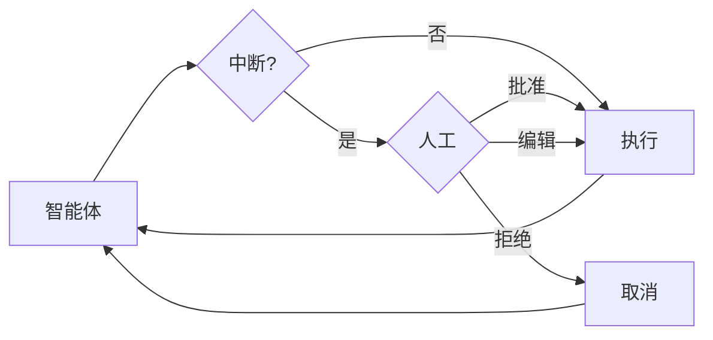

某些工具操作可能很敏感，需要在执行前进行人工审批。Deep Agents 通过 LangGraph 的中断（interrupt）功能支持“人在回路”（Human-in-the-loop, HITL）工作流。您可以使用 `interrupt_on` 参数来配置哪些工具需要审批。



## 基本配置

`interrupt_on` 参数接收一个字典，将工具名称映射到其中断配置。每个工具的配置可以是：

- **`True`**: 启用中断，使用默认行为（允许批准、编辑、拒绝）
- **`False`**: 为该工具禁用中断
- **`{"allowed_decisions": [...]}`**: 带有特定允许决策的自定义配置

:::python
```python
from langchain.tools import tool
from deepagents import create_deep_agent
from langgraph.checkpoint.memory import MemorySaver

@tool
def delete_file(path: str) -> str:
    """从文件系统中删除一个文件。"""
    return f"Deleted {path}"

@tool
def read_file(path: str) -> str:
    """从文件系统中读取一个文件。"""
    return f"Contents of {path}"

@tool
def send_email(to: str, subject: str, body: str) -> str:
    """发送一封电子邮件。"""
    return f"Sent email to {to}"

# 人在回路功能 REQUIRED 使用 Checkpointer（检查点保存器）
checkpointer = MemorySaver()

agent = create_deep_agent(
    model="claude-sonnet-4-5-20250929",
    tools=[delete_file, read_file, send_email],
    interrupt_on={
        "delete_file": True,  # 默认：允许批准、编辑、拒绝
        "read_file": False,   # 不需要中断
        "send_email": {"allowed_decisions": ["approve", "reject"]},  # 不允许编辑
    },
    checkpointer=checkpointer  # 必需！
)
```
:::

:::js
```typescript
import { tool } from "langchain";
import { createDeepAgent } from "deepagents";
import { MemorySaver } from "@langchain/langgraph";
import { z } from "zod";
import { v4 as uuidv4 } from 'uuid'; // 安装 uuid 包: npm install uuid

const deleteFile = tool(
  async ({ path }: { path: string }) => {
    return `Deleted ${path}`;
  },
  {
    name: "delete_file",
    description: "Delete a file from the filesystem.",
    schema: z.object({
      path: z.string(),
    }),
  },
);

const sendEmail = tool(
  async ({ to, subject, body }: { to: string; subject: string; body: string }) => {
    return `Sent email to ${to}`;
  },
  {
    name: "send_email",
    description: "Send an email.",
    schema: z.object({
      to: z.string(),
      subject: z.string(),
      body: z.string(),
    }),
  },
);

// 人在回路功能 REQUIRED 使用 Checkpointer（检查点保存器）
const checkpointer = new MemorySaver();

const agent = createDeepAgent({
  model: "claude-sonnet-4-5-20250929",
  tools: [deleteFile, sendEmail],
  interruptOn: {
    delete_file: true,  // 默认：允许批准、编辑、拒绝
    read_file: false,   // 不需要中断
    send_email: { allowedDecisions: ["approve", "reject"] },  // 不允许编辑
  },
  checkpointer,  // 必需！
});
```
:::

## 决策类型

`allowed_decisions` 列表控制人工在审查工具调用时可以采取的操作：

- **`"approve"`**: 使用智能体提出的原始参数执行工具。
- **`"edit"`**: 在执行前修改工具参数。
- **`"reject"`**: 完全跳过执行此工具调用。

您可以为每个工具自定义可用的决策：

:::python
```python
interrupt_on = {
    # 敏感操作：允许所有选项
    "delete_file": {"allowed_decisions": ["approve", "edit", "reject"]},

    # 中等风险：仅允许批准或拒绝
    "write_file": {"allowed_decisions": ["approve", "reject"]},

    # 必须批准（不允许拒绝）
    "critical_operation": {"allowed_decisions": ["approve"]},
}
```
:::

:::js
```typescript
const interruptOn = {
  // 敏感操作：允许所有选项
  delete_file: { allowedDecisions: ["approve", "edit", "reject"] },

  // 中等风险：仅允许批准或拒绝
  write_file: { allowedDecisions: ["approve", "reject"] },

  // 必须批准（不允许拒绝）
  critical_operation: { allowedDecisions: ["approve"] },
};
```
:::

## 处理中断

当触发中断时，智能体会暂停执行并返回控制权。请在结果中检查中断，并相应地进行处理。

:::python
```python
import uuid
from langgraph.types import Command

# 创建包含 thread_id 的配置，用于状态持久化
config = {"configurable": {"thread_id": str(uuid.uuid4())}}

# 调用智能体
result = agent.invoke({
    "messages": [{"role": "user", "content": "Delete the file temp.txt"}]
}, config=config)

# 检查执行是否被中断
if result.get("__interrupt__"):
    # 提取中断信息
    interrupts = result["__interrupt__"][0].value
    action_requests = interrupts["action_requests"]
    review_configs = interrupts["review_configs"]

    # 创建一个从工具名到审查配置的查找映射
    config_map = {cfg["action_name"]: cfg for cfg in review_configs}

    # 向用户显示待处理的操作
    for action in action_requests:
        review_config = config_map[action["name"]]
        print(f"Tool: {action['name']}")
        print(f"Arguments: {action['args']}")
        print(f"Allowed decisions: {review_config['allowed_decisions']}")

    # 获取用户决策（每个 action_request 一个，按顺序）
    decisions = [
        {"type": "approve"}  # 用户批准了删除操作
    ]

    # 使用决策恢复执行
    result = agent.invoke(
        Command(resume={"decisions": decisions}),
        config=config  # 必须使用相同的配置！
    )

# 处理最终结果
print(result["messages"][-1].content)
```
:::

:::js
```typescript
import { v4 as uuidv4 } from "uuid";
import { Command } from "@langchain/langgraph";

// 创建包含 thread_id 的配置，用于状态持久化
const config = { configurable: { thread_id: uuidv4() } };

// 调用智能体
let result = await agent.invoke({
  messages: [{ role: "user", content: "Delete the file temp.txt" }],
}, config);

// 检查执行是否被中断
if (result.__interrupt__) {
  // 提取中断信息
  const interrupts = result.__interrupt__[0].value;
  const actionRequests = interrupts.actionRequests;
  const reviewConfigs = interrupts.reviewConfigs;

  // 创建一个从工具名到审查配置的查找映射
  const configMap = Object.fromEntries(
    reviewConfigs.map((cfg) => [cfg.actionName, cfg])
  );

  // 向用户显示待处理的操作
  for (const action of actionRequests) {
    const reviewConfig = configMap[action.name];
    console.log(`Tool: ${action.name}`);
    console.log(`Arguments: ${JSON.stringify(action.args)}`);
    console.log(`Allowed decisions: ${reviewConfig.allowedDecisions}`);
  }

  // 获取用户决策（每个 actionRequest 一个，按顺序）
  const decisions = [
    { type: "approve" }  // 用户批准了删除操作
  ];

  // 使用决策恢复执行
  result = await agent.invoke(
    new Command({ resume: { decisions } }),
    config  // 必须使用相同的配置！
  );
}

// 处理最终结果
console.log(result.messages[result.messages.length - 1].content);
```
:::

## 多个工具调用

当智能体调用多个需要审批的工具时，所有中断会被合并到一个中断中。您必须按顺序为每一个中断提供决策。

:::python
```python
config = {"configurable": {"thread_id": str(uuid.uuid4())}}

result = agent.invoke({
    "messages": [{
        "role": "user",
        "content": "Delete temp.txt and send an email to admin@example.com"
    }]
}, config=config)

if result.get("__interrupt__"):
    interrupts = result["__interrupt__"][0].value
    action_requests = interrupts["action_requests"]

    # 需要两个工具的批准
    assert len(action_requests) == 2

    # 按照 action_requests 的顺序提供决策
    decisions = [
        {"type": "approve"},  # 第一个工具：delete_file
        {"type": "reject"}    # 第二个工具：send_email
    ]

    result = agent.invoke(
        Command(resume={"decisions": decisions}),
        config=config
    )
```
:::

:::js
```typescript
const config = { configurable: { thread_id: uuidv4() } };

let result = await agent.invoke({
  messages: [{
    role: "user",
    content: "Delete temp.txt and send an email to admin@example.com"
  }]
}, config);

if (result.__interrupt__) {
  const interrupts = result.__interrupt__[0].value;
  const actionRequests = interrupts.actionRequests;

  // 需要两个工具的批准
  console.assert(actionRequests.length === 2);

  // 按照 actionRequests 的顺序提供决策
  const decisions = [
    { type: "approve" },  // 第一个工具：delete_file
    { type: "reject" }    // 第二个工具：send_email
  ];

  result = await agent.invoke(
    new Command({ resume: { decisions } }),
    config
  );
}
```
:::

## 编辑工具参数

当 `allowed_decisions` 列表中包含 `"edit"` 时，您可以在执行前修改工具参数：

:::python
```python
if result.get("__interrupt__"):
    interrupts = result["__interrupt__"][0].value
    action_request = interrupts["action_requests"][0]

    # 智能体原始参数
    print(action_request["args"])  # {"to": "everyone@company.com", ...}

    # 用户决定编辑收件人
    decisions = [{
        "type": "edit",
        "edited_action": {
            "name": action_request["name"],  # 必须包含工具名称
            "args": {"to": "team@company.com", "subject": "...", "body": "..."}
        }
    }]

    result = agent.invoke(
        Command(resume={"decisions": decisions}),
        config=config
    )
```
:::

:::js
```typescript
if (result.__interrupt__) {
  const interrupts = result.__interrupt__[0].value;
  const actionRequest = interrupts.actionRequests[0];

  // 智能体原始参数
  console.log(actionRequest.args);  // { to: "everyone@company.com", ... }

  // 用户决定编辑收件人
  const decisions = [{
    type: "edit",
    editedAction: {
      name: actionRequest.name,  // 必须包含工具名称
      args: { to: "team@company.com", subject: "...", body: "..." }
    }
  }];

  result = await agent.invoke(
    new Command({ resume: { decisions } }),
    config
  );
}
```
:::

## 子智能体中断

每个子智能体都可以有自己的 `interrupt_on` 配置，它会覆盖主智能体的设置：

:::python
```python
agent = create_deep_agent(
    tools=[delete_file, read_file],
    interrupt_on={
        "delete_file": True,
        "read_file": False,
    },
    subagents=[{
        "name": "file-manager",
        "description": "文件管理助手",
        "system_prompt": "You are a file management assistant.",
        "tools": [delete_file, read_file],
        "interrupt_on": {
            # 覆盖：要求此子智能体对读取操作进行审批
            "delete_file": True,
            "read_file": True,  # 与主智能体不同！
        }
    }],
    checkpointer=checkpointer
)
```
:::

:::js
```typescript
const agent = createDeepAgent({
  tools: [deleteFile, readFile],
  interruptOn: {
    delete_file: true,
    read_file: false,
  },
  subagents: [{
    name: "file-manager",
    description: "Manages file operations",
    systemPrompt: "You are a file management assistant.",
    tools: [deleteFile, readFile],
    interruptOn: {
      // 覆盖：要求此子智能体对读取操作进行审批
      delete_file: true,
      read_file: true,  // 与主智能体不同！
    }
  }],
  checkpointer
});
```
:::

当中断由子智能体触发时，处理方式是相同的——检查 `__interrupt__` 并使用 `Command` 恢复执行。

## 最佳实践

### 始终使用 Checkpointer

人在回路功能需要一个 Checkpointer 来在中断和恢复之间持久化智能体的状态：

:::python
```python
from langgraph.checkpoint.memory import MemorySaver

checkpointer = MemorySaver()
agent = create_deep_agent(
    tools=[...],
    interrupt_on={...},
    checkpointer=checkpointer  # HITL 必需！
)
```
:::

### 恢复时使用相同的 Thread ID

恢复时，您必须使用具有相同 `thread_id` 的相同配置：

:::python
```python
# 第一次调用
config = {"configurable": {"thread_id": "my-thread"}}
result = agent.invoke(input, config=config)

# 恢复（使用相同的配置）
result = agent.invoke(Command(resume={...}), config=config)
```
:::

### 决策顺序与操作顺序匹配

`decisions` 列表的顺序必须与 `action_requests` 的顺序匹配：

:::python
```python
if result.get("__interrupt__"):
    interrupts = result["__interrupt__"][0].value
    action_requests = interrupts["action_requests"]

    # 为每个操作创建一个决策，按顺序
    decisions = []
    for action in action_requests:
        decision = get_user_decision(action)  # 您的逻辑
        decisions.append(decision)

    result = agent.invoke(
        Command(resume={"decisions": decisions}),
        config=config
    )
```
:::

### 根据风险定制配置

根据风险级别配置不同的工具：

:::python
```python
interrupt_on = {
    # 高风险：完全控制（批准、编辑、拒绝）
    "delete_file": {"allowed_decisions": ["approve", "edit", "reject"]},
    "send_email": {"allowed_decisions": ["approve", "edit", "reject"]},

    # 中等风险：不允许编辑
    "write_file": {"allowed_decisions": ["approve", "reject"]},

    # 低风险：无中断
    "read_file": False,
    "list_files": False,
}
```
:::