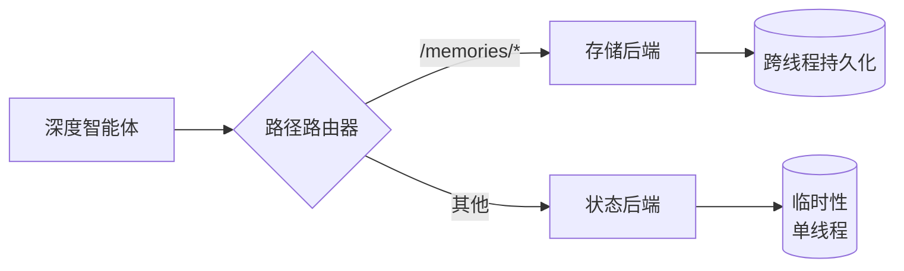

深度智能体（Deep agents）配备了一个本地文件系统用于卸载内存。默认情况下，此文件系统存储在智能体的状态（agent state）中，并且**仅限于单个线程**——当对话结束后，文件就会丢失。

你可以通过使用一个 **`CompositeBackend`** 来扩展深度智能体的**长期记忆**，该后端将特定的路径路由到持久化存储。这实现了混合存储，使得某些文件可以在不同线程间持久存在，而其他文件则保持临时性。



## 设置

通过使用 `CompositeBackend` 来配置长期记忆，将 `/memories/` 路径路由到 `StoreBackend`：

:::python
```python
from deepagents import create_deep_agent
from deepagents.backends import CompositeBackend, StateBackend, StoreBackend
from langgraph.store.memory import InMemoryStore

def make_backend(runtime):
    return CompositeBackend(
        default=StateBackend(runtime),  # 临时存储
        routes={
            "/memories/": StoreBackend(runtime)  # 持久化存储
        }
    )

agent = create_deep_agent(
    store=InMemoryStore(),  # StoreBackend 所需的组件
    backend=make_backend
)
```
:::

:::js
```typescript
import { createDeepAgent } from "deepagents";
import { CompositeBackend, StateBackend, StoreBackend } from "deepagents";
import { InMemoryStore } from "@langchain/langgraph-checkpoint";

const agent = createDeepAgent({
  store: new InMemoryStore(),  // StoreBackend 所需的组件
  backend: (config) => new CompositeBackend(
    new StateBackend(config),  // 临时存储
    { "/memories/": new StoreBackend(config) }  // 持久化存储
  ),
});
```
:::

## 工作原理

当使用 `CompositeBackend` 时，深度智能体维护着**两个独立的文件系统**：

### 1. 短期（临时性）文件系统
- 存储在智能体的状态中（通过 `StateBackend`）
- 仅在单个线程内持久存在
- 当线程结束时，文件丢失
- 通过标准路径访问：`/notes.txt`, `/workspace/draft.md`

### 2. 长期（持久化）文件系统
- 存储在 LangGraph Store 中（通过 `StoreBackend`）
- 在所有线程和对话中持久存在
- 智能体重启后依然存在
- 通过以 `/memories/` 为前缀的路径访问：`/memories/preferences.txt`

### 路径路由

`CompositeBackend` 根据路径前缀路由文件操作：
- 路径以 `/memories/` 开头的文件将被路由到 Store（持久化存储）
- 没有该前缀的文件将保留在临时状态
- 所有文件系统工具（`ls`, `read_file`, `write_file`, `edit_file`）都可用于两者

:::python
```python
# 临时文件（线程结束后丢失）
agent.invoke({
    "messages": [{"role": "user", "content": "将草稿写入 /draft.txt"}]
})

# 持久化文件（跨线程保留）
agent.invoke({
    "messages": [{"role": "user", "content": "将最终报告保存到 /memories/report.txt"}]
})
```
:::

:::js
```typescript
// 临时文件（线程结束后丢失）
await agent.invoke({
  messages: [{ role: "user", content: "将草稿写入 /draft.txt" }],
});

// 持久化文件（跨线程保留）
await agent.invoke({
  messages: [{ role: "user", content: "将最终报告保存到 /memories/report.txt" }],
});
```
:::

## 跨线程持久化

`/memories/` 中的文件可以从任何线程访问：

:::python
```python
import uuid

# 线程 1：写入长期记忆
config1 = {"configurable": {"thread_id": str(uuid.uuid4())}}
agent.invoke({
    "messages": [{"role": "user", "content": "将我的偏好保存到 /memories/preferences.txt"}]
}, config=config1)

# 线程 2：从长期记忆中读取（不同对话！）
config2 = {"configurable": {"thread_id": str(uuid.uuid4())}}
agent.invoke({
    "messages": [{"role": "user", "content": "我的偏好是什么？"}]
}, config=config2)
# 智能体可以从第一个线程中读取 /memories/preferences.txt
```
:::

:::js
```typescript
import { v4 as uuidv4 } from "uuid";

// 线程 1：写入长期记忆
const config1 = { configurable: { thread_id: uuidv4() } };
await agent.invoke({
  messages: [{ role: "user", content: "将我的偏好保存到 /memories/preferences.txt" }],
}, config1);

// 线程 2：从长期记忆中读取（不同对话！）
const config2 = { configurable: { thread_id: uuidv4() } };
await agent.invoke({
  messages: [{ role: "user", content: "我的偏好是什么？" }],
}, config2);
// 智能体可以从第一个线程中读取 /memories/preferences.txt
```
:::

## 用例

### 用户偏好

存储跨会话持久化的用户偏好设置：

:::python
```python
agent = create_deep_agent(
    store=InMemoryStore(),
    backend=lambda rt: CompositeBackend(
        default=StateBackend(rt),
        routes={"/memories/": StoreBackend(rt)}
    ),
    system_prompt="""当用户告知你他们的偏好时，请将它们保存到
    /memories/user_preferences.txt，以便你在未来的对话中记住它们。"""
)
```
:::

:::js
```typescript
const agent = createDeepAgent({
  store: new InMemoryStore(),
  backend: (config) => new CompositeBackend(
    new StateBackend(config),
    { "/memories/": new StoreBackend(config) }
  ),
  systemPrompt: `当用户告知你他们的偏好时，请将它们保存到 /memories/user_preferences.txt，以便你在未来的对话中记住它们。`,
});
```
:::

### 自我改进指令

智能体可以根据反馈来更新其自身的指令：

:::python
```python
agent = create_deep_agent(
    store=InMemoryStore(),
    backend=lambda rt: CompositeBackend(
        default=StateBackend(rt),
        routes={"/memories/": StoreBackend(rt)}
    ),
    system_prompt="""你有一个位于 /memories/instructions.txt 的文件，其中包含附加的指令和偏好。

    在对话开始时读取此文件，以了解用户的偏好。

    当用户提供反馈，例如“请始终执行 X”或“我更喜欢 Y”时，
    使用 edit_file 工具更新 /memories/instructions.txt。"""
)
```
:::

:::js
```typescript
const agent = createDeepAgent({
  store: new InMemoryStore(),
  backend: (config) => new CompositeBackend(
    new StateBackend(config),
    { "/memories/": new StoreBackend(config) }
  ),
  systemPrompt: `你有一个位于 /memories/instructions.txt 的文件，其中包含附加的指令和偏好。

  在对话开始时读取此文件，以了解用户的偏好。

  当用户提供反馈，例如“请始终执行 X”或“我更喜欢 Y”时，使用 edit_file 工具更新 /memories/instructions.txt。`,
});
```
:::

随着时间的推移，指令文件会积累用户偏好，帮助智能体不断改进。

### 知识库

在多轮对话中建立知识：

:::python
```python
# 对话 1：了解一个项目
agent.invoke({
    "messages": [{"role": "user", "content": "我们正在构建一个使用 React 的 Web 应用。保存项目笔记。"}]
})

# 对话 2：利用该知识
agent.invoke({
    "messages": [{"role": "user", "content": "我们正在使用什么框架？"}]
})
# 智能体从前一轮对话中读取 /memories/project_notes.txt
```
:::

:::js
```typescript
// 对话 1：了解一个项目
await agent.invoke({
  messages: [{ role: "user", content: "我们正在构建一个使用 React 的 Web 应用。保存项目笔记。" }],
});

// 对话 2：利用该知识
await agent.invoke({
  messages: [{ role: "user", content: "我们正在使用什么框架？" }],
});
// 智能体从前一轮对话中读取 /memories/project_notes.txt
```
:::

### 研究项目

在不同会话中维护研究状态：

:::python
```python
research_agent = create_deep_agent(
    store=InMemoryStore(),
    backend=lambda rt: CompositeBackend(
        default=StateBackend(rt),
        routes={"/memories/": StoreBackend(rt)}
    ),
    system_prompt="""你是一名研究助理。

    将你的研究进度保存到 /memories/research/：
    - /memories/research/sources.txt - 找到的来源列表
    - /memories/research/notes.txt - 关键发现和笔记
    - /memories/research/report.md - 最终报告草稿

    这样研究就可以在多个会话中继续进行"""
)
```
:::

:::js
```typescript
const researchAgent = createDeepAgent({
  store: new InMemoryStore(),
  backend: (config) => new CompositeBackend(
    new StateBackend(config),
    { "/memories/": new StoreBackend(config) }
  ),
  systemPrompt: `你是一名研究助理。

  将你的研究进度保存到 /memories/research/：
  - /memories/research/sources.txt - 找到的来源列表
  - /memories/research/notes.txt - 关键发现和笔记
  - /memories/research/report.md - 最终报告草稿

  这样研究就可以在多个会话中继续进行`,
});
```
:::

## 存储实现

任何 LangGraph `BaseStore` 实现都适用：

### InMemoryStore（开发用）

适用于测试和开发，但在重启后数据会丢失：

:::python
```python
from langgraph.store.memory import InMemoryStore

store = InMemoryStore()
agent = create_deep_agent(
    store=store,
    backend=lambda rt: CompositeBackend(
        default=StateBackend(rt),
        routes={"/memories/": StoreBackend(rt)}
    )
)
```
:::

:::js
```typescript
import { InMemoryStore } from "@langchain/langgraph-checkpoint";
import { createDeepAgent, CompositeBackend, StateBackend, StoreBackend } from "deepagents";

const store = new InMemoryStore();
const agent = createDeepAgent({
  store,
  backend: (config) => new CompositeBackend(
    new StateBackend(config),
    { "/memories/": new StoreBackend(config) }
  ),
});
```
:::

### PostgresStore（生产用）

对于生产环境，请使用持久性存储：

:::python
```python
from langgraph.store.postgres import PostgresStore
import os

store = PostgresStore(connection_string=os.environ["DATABASE_URL"])
agent = create_deep_agent(
    store=store,
    backend=lambda rt: CompositeBackend(
        default=StateBackend(rt),
        routes={"/memories/": StoreBackend(rt)}
    )
)
```
:::

:::js
```typescript
import { PostgresStore } from "@langchain/langgraph-checkpoint-postgres";
import { createDeepAgent, CompositeBackend, StateBackend, StoreBackend } from "deepagents";

const store = new PostgresStore({
  connectionString: process.env.DATABASE_URL,
});
const agent = createDeepAgent({
  store,
  backend: (config) => new CompositeBackend(
    new StateBackend(config),
    { "/memories/": new StoreBackend(config) }
  ),
});
```
:::

## 最佳实践

### 使用描述性路径

使用清晰的路径来组织持久化文件：

```
/memories/user_preferences.txt
/memories/research/topic_a/sources.txt
/memories/research/topic_a/notes.txt
/memories/project/requirements.md
```

### 记录内存结构

在系统提示中告诉智能体存储的内容：

```
你的持久化内存结构：
- /memories/preferences.txt: 用户偏好和设置
- /memories/context/: 关于用户的长期上下文
- /memories/knowledge/: 随时间学到的事实和信息
```

### 清理旧数据

实施定期间隔的清理机制来移除过时的持久化文件，以保持存储的可管理性。

### 选择正确的存储

- **开发环境**: 使用 `InMemoryStore` 进行快速迭代
- **生产环境**: 使用 `PostgresStore` 或其他持久化存储
- **多租户**: 考虑在使用 Store 时的名称空间中基于 `assistant_id` 进行区分