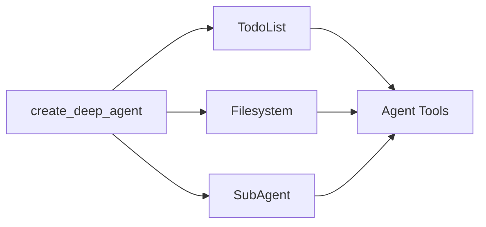

深度智能体（Deep agents）是基于模块化的中间件架构构建的。深度智能体可以访问以下功能：

1. 一个规划工具（planning tool）
2. 用于存储上下文和长期记忆的文件系统
3. 派生子智能体（subagents）的能力

每个功能都被实现为一个独立的中间件。当您使用 `create_deep_agent` 创建深度智能体时，我们会自动为其挂载 `TodoListMiddleware`、`FilesystemMiddleware` 和 `SubAgentMiddleware`。



中间件是可组合的（composable）——您可以根据需要为智能体添加任意数量或任意数量的中间件。您可以独立使用任何中间件。

接下来的部分将解释每个中间件提供了什么功能。

## To-do list 中间件（待办事项列表中间件）

规划对于解决复杂问题至关重要。如果您最近使用过 Claude Code，您会注意到它在处理复杂、多部分任务之前会写下一个待办事项列表。您还会注意到，随着新信息的到来，它可以动态地调整和更新这个待办事项列表。

`TodoListMiddleware` 为您的智能体提供了一个专门用于更新此待办事项列表的工具。在执行多部分任务之前和执行过程中，系统会提示智能体使用 `write_todos` 工具来跟踪它正在做什么以及还需要做什么。

:::python
```python
from langchain.agents import create_agent
from langchain.agents.middleware import TodoListMiddleware

# TodoListMiddleware 默认包含在 create_deep_agent 中
# 如果您构建自定义智能体，可以对其进行自定义
agent = create_agent(
    model="claude-sonnet-4-5-20250929",
    # 可以通过中间件添加自定义规划指令
    middleware=[
        TodoListMiddleware(
            system_prompt="Use the write_todos tool to..."  # 可选：对系统提示的自定义添加
        ),
    ],
)
```
:::

:::js
```typescript
import { createAgent, todoListMiddleware } from "langchain";

// todoListMiddleware 默认包含在 createDeepAgent 中
// 如果您构建自定义智能体，可以对其进行自定义
const agent = createAgent({
  model: "claude-sonnet-4-5-20250929",
  middleware: [
    todoListMiddleware({
      // 可选：对系统提示的自定义添加
      systemPrompt: "Use the write_todos tool to...",
    }),
  ],
});
```
:::

## Filesystem 中间件（文件系统中间件）

上下文工程（Context engineering）是构建有效智能体的核心挑战。当使用返回可变长度结果的工具时（例如 `web_search` 和 `rag`），这尤其困难，因为长的工具结果会很快填满您的上下文窗口。

`FilesystemMiddleware` 提供了四个工具来实现与短期和长期记忆的交互：

- **ls**: 列出文件系统中的文件
- **read\_file**: 读取整个文件或文件中的某几行内容
- **write\_file**: 将新文件写入文件系统
- **edit\_file**: 编辑文件系统中的现有文件

:::python
```python
from langchain.agents import create_agent
from deepagents.middleware.filesystem import FilesystemMiddleware

# FilesystemMiddleware 默认包含在 create_deep_agent 中
# 如果您构建自定义智能体，可以对其进行自定义
agent = create_agent(
    model="claude-sonnet-4-5-20250929",
    middleware=[
        FilesystemMiddleware(
            backend=None,  # 可选：自定义后端 (默认为 StateBackend)
            system_prompt="Write to the filesystem when...",  # 可选的系统提示自定义添加
            custom_tool_descriptions={
                "ls": "Use the ls tool when...",
                "read_file": "Use the read_file tool to..."
            }  # 可选：文件系统的自定义工具描述
        ),
    ],
)
```
:::

:::js
```typescript
import { createAgent } from "langchain";
import { createFilesystemMiddleware } from "deepagents";

// FilesystemMiddleware 默认包含在 createDeepAgent 中
// 如果您构建自定义智能体，可以对其进行自定义
const agent = createAgent({
  model: "claude-sonnet-4-5-20250929",
  middleware: [
    createFilesystemMiddleware({
      backend: undefined,  // 可选：自定义后端 (默认为 StateBackend)
      systemPrompt: "Write to the filesystem when...",  // 可选的系统提示覆盖
      customToolDescriptions: {
        ls: "Use the ls tool when...",
        read_file: "Use the read_file tool to...",
      },  // 可选：文件系统的自定义工具描述
    }),
  ],
});
```
:::

### 短期文件系统与长期文件系统

默认情况下，这些工具写入图状态（graph state）中的本地“文件系统”。要启用跨线程的持久化存储，请配置一个 `CompositeBackend`，将特定路径（如 `/memories/`）路由到一个 `StoreBackend`。

:::python
```python
from langchain.agents import create_agent
from deepagents.middleware import FilesystemMiddleware
from deepagents.backends import CompositeBackend, StateBackend, StoreBackend
from langgraph.store.memory import InMemoryStore

store = InMemoryStore()

agent = create_agent(
    model="claude-sonnet-4-5-20250929",
    store=store,
    middleware=[
        FilesystemMiddleware(
            backend=lambda rt: CompositeBackend(
                default=StateBackend(rt),
                routes={"/memories/": StoreBackend(rt)}
            ),
            custom_tool_descriptions={
                "ls": "Use the ls tool when...",
                "read_file": "Use the read_file tool to..."
            }  # 可选：文件系统的自定义工具描述
        ),
    ],
)
```
:::

:::js
```typescript
import { createAgent } from "langchain";
import { createFilesystemMiddleware, CompositeBackend, StateBackend, StoreBackend } from "deepagents";
import { InMemoryStore } from "@langchain/langgraph-checkpoint";

const store = new InMemoryStore();

const agent = createAgent({
  model: "claude-sonnet-4-5-20250929",
  store,
  middleware: [
    createFilesystemMiddleware({
      backend: (config) => new CompositeBackend(
        new StateBackend(config),
        { "/memories/": new StoreBackend(config) }
      ),
      systemPrompt: "Write to the filesystem when...", // 可选的系统提示覆盖
      customToolDescriptions: {
        ls: "Use the ls tool when...",
        read_file: "Use the read_file tool to...",
      }, // 可选：文件系统的自定义工具描述
    }),
  ],
});
```
:::

当您使用 `StoreBackend` 为 `/memories/` 配置 `CompositeBackend` 时，所有以 `/memories/**` 为前缀的文件都将保存到持久化存储中，并在不同线程间保持下来。没有此前缀的文件则保留在临时状态存储中。

## Subagent 中间件（子智能体中间件）

将任务委托给子智能体可以隔离上下文，使主（监督者）智能体的上下文窗口保持整洁，同时仍能深入处理特定任务。

子智能体中间件允许您通过 `task` 工具提供子智能体。

:::python
```python
from langchain.tools import tool
from langchain.agents import create_agent
from deepagents.middleware.subagents import SubAgentMiddleware


@tool
def get_weather(city: str) -> str:
    """Get the weather in a city."""
    return f"The weather in {city} is sunny."

agent = create_agent(
    model="claude-sonnet-4-5-20250929",
    middleware=[
        SubAgentMiddleware(
            default_model="claude-sonnet-4-5-20250929",
            default_tools=[],
            subagents=[
                {
                    "name": "weather",
                    "description": "This subagent can get weather in cities.",
                    "system_prompt": "Use the get_weather tool to get the weather in a city.",
                    "tools": [get_weather],
                    "model": "gpt-4o",
                    "middleware": [],
                }
            ],
        )
    ],
)
```
:::

:::js
```typescript
import { tool } from "langchain";
import { createAgent } from "langchain";
import { createSubAgentMiddleware } from "deepagents";
import { z } from "zod";

const getWeather = tool(
  async ({ city }: { city: string }) => {
    return `The weather in ${city} is sunny.`;
  },
  {
    name: "get_weather",
    description: "Get the weather in a city.",
    schema: z.object({
      city: z.string(),
    }),
  },
);

const agent = createAgent({
  model: "claude-sonnet-4-5-20250929",
  middleware: [
    createSubAgentMiddleware({
      defaultModel: "claude-sonnet-4-5-20250929",
      defaultTools: [],
      subagents: [
        {
          name: "weather",
          description: "This subagent can get weather in cities.",
          systemPrompt: "Use the get_weather tool to get the weather in a city.",
          tools: [getWeather],
          model: "gpt-4o",
          middleware: [],
        },
      ],
    }),
  ],
});
```
:::

子智能体通过 **名称** (name)、**描述** (description)、**系统提示** (system prompt) 和 **工具** (tools) 来定义。您也可以为子智能体提供自定义的 **模型** (model) 或额外的 **中间件** (middleware)。当您希望为子智能体提供一个额外的状态键（state key）以与主智能体共享时，这一点尤其有用。

对于更复杂的用例，您还可以将自己预先构建好的 LangGraph 图作为子智能体提供。

:::python
```python
from langchain.agents import create_agent
from deepagents.middleware.subagents import SubAgentMiddleware
from deepagents import CompiledSubAgent
from langgraph.graph import StateGraph

# 创建一个自定义的 LangGraph 图
def create_weather_graph():
    workflow = StateGraph(...)
    # 构建您的自定义图
    return workflow.compile()

weather_graph = create_weather_graph()

# 使用 CompiledSubAgent 将其包装起来
weather_subagent = CompiledSubAgent(
    name="weather",
    description="This subagent can get weather in cities.",
    runnable=weather_graph
)

agent = create_agent(
    model="claude-sonnet-4-5-20250929",
    middleware=[
        SubAgentMiddleware(
            default_model="claude-sonnet-4-5-20250929",
            default_tools=[],
            subagents=[weather_subagent],
        )
    ],
)
```
:::

:::js
```typescript
import { tool, createAgent } from "langchain";
import { createSubAgentMiddleware, type SubAgent } from "deepagents";
import { z } from "zod";

const getWeather = tool(
  async ({ city }: { city: string }) => {
    return `The weather in ${city} is sunny.`;
  },
  {
    name: "get_weather",
    description: "Get the weather in a city.",
    schema: z.object({
      city: z.string(),
    }),
  },
);

const weatherSubagent: SubAgent = {
  name: "weather",
  description: "This subagent can get weather in cities.",
  systemPrompt: "Use the get_weather tool to get the weather in a city.",
  tools: [getWeather],
  model: "gpt-4o",
  middleware: [],
};

const agent = createAgent({
  model: "claude-sonnet-4-5-20250929",
  middleware: [
    createSubAgentMiddleware({
      defaultModel: "claude-sonnet-4-5-20250929",
      defaultTools: [],
      subagents: [weatherSubagent],
    }),
  ],
});
```
:::

除了用户定义的任何子智能体外，主智能体始终可以访问一个 `general-purpose`（通用目的）子智能体。该子智能体具有与主智能体相同的指令和可访问的工具。`general-purpose` 子智能体的首要目的是上下文隔离——主智能体可以将一个复杂任务委托给该子智能体，并在不因中间工具调用而导致上下文膨胀的情况下获得简洁的答案。