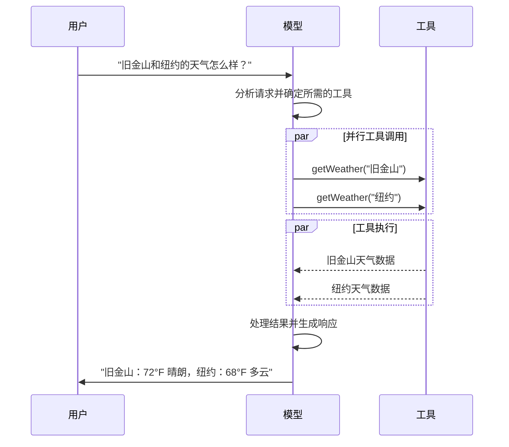
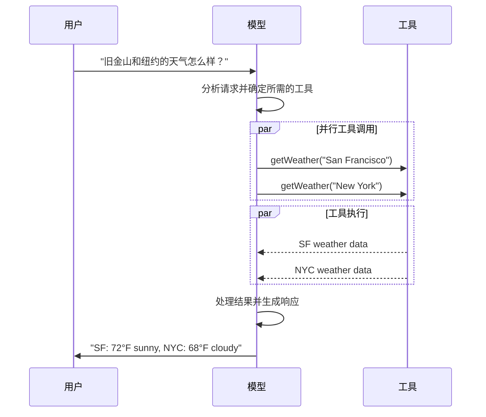

import ChatModelTabsPy from '/snippets/chat-model-tabs.mdx';
import ChatModelTabsJS from '/snippets/chat-model-tabs-js.mdx';

[大型语言模型 (LLMs)](https://en.wikipedia.org/wiki/Large_language_model) 是强大的 AI 工具，它们能够像人类一样解释和生成文本。它们用途广泛，可以编写内容、翻译语言、总结信息和回答问题，而无需针对每项任务进行专门训练。

除了文本生成，许多模型还支持以下功能：

* <Icon icon="hammer" size={16} /> [工具调用](#tool-calling) - 调用外部工具（如数据库查询或 API 调用），并在其响应中使用结果。
* <Icon icon="shapes" size={16} /> [结构化输出](#structured-output) - 模型响应被限制遵循预定义的格式。
* <Icon icon="image" size={16} /> [多模态](#multimodal) - 处理除文本以外的数据，如图像、音频和视频，并返回这些数据。
* <Icon icon="brain" size={16} /> [推理](#reasoning) - 模型执行多步推理以得出结论。

模型是 [代理 (Agents)](/oss/langchain/agents) 的推理引擎。它们驱动着代理的决策过程，决定调用哪些工具、如何解释结果以及何时提供最终答案。

您选择的模型的质量和能力直接影响代理的基线可靠性和性能。不同的模型在不同任务上表现出色——有些更擅长遵循复杂指令，有些更擅长结构化推理，还有些支持更大的上下文窗口来处理更多信息。

LangChain 的标准模型接口使您可以访问许多不同的提供商集成，从而轻松试验和切换模型，以找到最适合您用例的模型。

<Info>
    有关特定于提供商的集成信息和功能，请参阅提供商的 [聊天模型页面](/oss/integrations/chat)。
</Info>

## 基本用法

模型有两种使用方式：

1. **与代理一起使用** - 在创建 [代理](/oss/langchain/agents#model) 时可以动态指定模型。
2. **独立使用** - 模型可以直接调用（在代理循环之外），用于文本生成、分类或提取等任务，而无需代理框架。

相同的模型接口在这两种情况下都适用，这使您可以在需要时从简单开始，并扩展到更复杂的基于代理的工作流程。

### 初始化模型

:::python
在 LangChain 中开始使用独立模型的最简单方法是使用 @[`init_chat_model`] 从您选择的 [聊天模型提供商](/oss/integrations/chat) 初始化一个（示例如下）：

<ChatModelTabsPy />
```python
response = model.invoke("为什么鹦鹉会说话？")
```

有关更多详细信息（包括如何传递模型 [参数](#parameters)），请参阅 @[`init_chat_model`][init_chat_model]。
:::
:::js
在 LangChain 中开始使用独立模型的最简单方法是使用 `initChatModel` 从您选择的 [聊天模型提供商](/oss/integrations/chat) 初始化一个（示例如下）：

<ChatModelTabsJS />
```typescript
const response = await model.invoke("为什么鹦鹉会说话？");
```
有关更多详细信息（包括如何传递模型 [参数](#parameters)），请参阅 @[`initChatModel`][initChatModel]。
:::


### 关键方法

<Card title="Invoke" href="#invoke" icon="paper-plane" arrow="true" horizontal>
    模型接收消息作为输入，并在生成完整响应后输出消息。
</Card>
<Card title="Stream" href="#stream" icon="tower-broadcast" arrow="true" horizontal>
    调用模型，但实时流式传输生成的输出。
</Card>
<Card title="Batch" href="#batch" icon="grip" arrow="true" horizontal>
    批量发送多个请求到模型以实现更高效的处理。
</Card>

<Info>
    除了聊天模型外，LangChain 还支持其他相关技术，例如嵌入模型和向量存储。详情请参阅 [集成页面](/oss/integrations/providers/overview)。
</Info>

## 参数

聊天模型接受可用于配置其行为的参数。支持的参数全集因模型和提供商而异，但标准参数包括：

<ParamField body="model" type="string" required>
   要与提供商一起使用的特定模型的名称或标识符。您也可以使用 `'{model_provider}:{model}'` 格式在单个参数中指定模型及其提供商，例如 `'openai:o1'`。
</ParamField>

:::python
<ParamField body="api_key" type="string">
    通过模型提供商进行身份验证所需的密钥。这通常在您注册访问模型时颁发给您的。通常通过设置一个 <Tooltip tip="一个在程序外部设置其值的变量，通常是通过操作系统或微服务内置的功能。">环境变量</Tooltip> 来访问。
</ParamField>
:::
:::js
<ParamField body="apiKey" type="string">
    通过模型提供商进行身份验证所需的密钥。这通常在您注册访问模型时颁发给您的。通常通过设置一个 <Tooltip tip="一个在程序外部设置其值的变量，通常是通过操作系统或微服务内置的功能。">环境变量</Tooltip> 来访问。
</ParamField>
:::

<ParamField body="temperature" type="number">
    控制模型输出的随机性。较高的数字使响应更具创意；较低的数字使其更具确定性。
</ParamField>

:::python
<ParamField body="max_tokens" type="number">
    限制响应中 <Tooltip tip="模型读取和生成的最小单位。提供商的定义可能不同，但通常可以代表整个单词或单词的一部分。">令牌</Tooltip> 的总数，从而有效地控制输出的长度。
</ParamField>
:::
:::js
<ParamField body="maxTokens" type="number">
    限制响应中 <Tooltip tip="模型读取和生成的最小单位。提供商的定义可能不同，但通常可以代表整个单词或单词的一部分。">令牌</Tooltip> 的总数，从而有效地控制输出的长度。
</ParamField>
:::

<ParamField body="timeout" type="number">
    等待模型响应的最大时间（以秒为单位），超过该时间将取消请求。
</ParamField>

:::python
<ParamField body="max_retries" type="number">
    系统在因网络超时或速率限制等问题导致请求失败时，将尝试重新发送请求的最大次数。
</ParamField>
:::
:::js
<ParamField body="maxRetries" type="number">
    系统在因网络超时或速率限制等问题导致请求失败时，将尝试重新发送请求的最大次数。
</ParamField>
:::

:::python
使用 @[`init_chat_model`]，将这些参数作为内联的 <Tooltip tip="任意关键字参数" cta="了解更多" href="https://www.w3schools.com/python/python_args_kwargs.asp">`**kwargs`</Tooltip> 传递：

```python 使用模型参数进行初始化
model = init_chat_model(
    "claude-sonnet-4-5-20250929",
    # 传递给模型的 Kwargs:
    temperature=0.7,
    timeout=30,
    max_tokens=1000,
)
```
:::
:::js
使用 `initChatModel`，将这些参数作为内联参数传递：

```typescript 使用模型参数进行初始化
const model = await initChatModel(
    "claude-sonnet-4-5-20250929",
    { temperature: 0.7, timeout: 30, max_tokens: 1000 }
)
```
:::

<Info>
    每个聊天模型集成可能有额外的参数用于控制特定于提供商的功能。

    例如，@[ChatOpenAI] 有 `use_responses_api` 用于指定是使用 OpenAI 响应 API 还是完成 API。

    要查找给定聊天模型支持的所有参数，请转到 [聊天模型集成页面](/oss/integrations/chat)。
</Info>

---

## 调用

必须调用聊天模型才能生成输出。有三种主要的调用方法，每种方法都适用于不同的用例。

### Invoke（调用）

调用模型最直接的方法是使用 @[`invoke()`][BaseChatModel.invoke]，传入单个消息或消息列表。

:::python
```python 单条消息
response = model.invoke("为什么鹦鹉有五颜六色的羽毛？")
print(response)
```
:::

:::js
```typescript 单条消息
const response = await model.invoke("为什么鹦鹉有五颜六色的羽毛？");
console.log(response);
```
:::

可以向聊天模型提供消息列表以表示对话历史记录。每条消息都有一个角色，模型使用该角色来指示谁在对话中发送了消息。

有关角色、类型和内容的更多详细信息，请参阅 [消息](/oss/langchain/messages) 指南。

:::python
```python 字典格式
conversation = [
    {"role": "system", "content": "你是一个乐于助人的助手，可以把英语翻译成法语。"},
    {"role": "user", "content": "翻译：我喜欢编程。"},
    {"role": "assistant", "content": "J'adore la programmation."},
    {"role": "user", "content": "翻译：我喜欢构建应用程序。"}
]

response = model.invoke(conversation)
print(response)  # AIMessage("J'adore créer des applications.")
```
```python 消息对象
from langchain.messages import HumanMessage, AIMessage, SystemMessage

conversation = [
    SystemMessage("你是一个乐于助人的助手，可以把英语翻译成法语。"),
    HumanMessage("翻译：我喜欢编程。"),
    AIMessage("J'adore la programmation."),
    HumanMessage("翻译：我喜欢构建应用程序。")
]

response = model.invoke(conversation)
print(response)  # AIMessage("J'adore créer des applications.")
```
:::

:::js
```typescript 对象格式
const conversation = [
  { role: "system", content: "你是一个乐于助人的助手，可以把英语翻译成法语。" },
  { role: "user", content: "翻译：我喜欢编程。" },
  { role: "assistant", content: "J'adore la programmation." },
  { role: "user", content: "翻译：我喜欢构建应用程序。" },
];

const response = await model.invoke(conversation);
console.log(response);  // AIMessage("J'adore créer des applications.")
```
```typescript 消息对象
import { HumanMessage, AIMessage, SystemMessage } from "langchain";

const conversation = [
  new SystemMessage("你是一个乐于助人的助手，可以把英语翻译成法语。"),
  new HumanMessage("翻译：我喜欢编程。"),
  new AIMessage("J'adore la programmation."),
  new HumanMessage("翻译：我喜欢构建应用程序。"),
];

const response = await model.invoke(conversation);
console.log(response);  // AIMessage("J'adore créer des applications.")
```
:::

<Info>
    如果调用的返回类型是字符串，请确保您使用的是聊天模型而不是 LLM。传统、文本补全的 LLM 直接返回字符串。LangChain 聊天模型以 "Chat" 为前缀，例如 @[`ChatOpenAI`](/oss/integrations/chat/openai)。
</Info>

### Stream（流式传输）

大多数模型可以在生成输出内容时对其进行流式传输。通过渐进式显示输出，流式传输可以显著改善用户体验，特别是对于较长的响应。

调用 @[`stream()`][BaseChatModel.stream] 会返回一个 <Tooltip tip="一个对象，它逐步提供对集合中每个项目的按顺序访问。">迭代器</Tooltip>，该迭代器在生成输出块时会产生这些块。您可以使用循环实时处理每个块：

:::python
<CodeGroup>
    ```python 基本文本流式传输
    for chunk in model.stream("为什么鹦鹉有五颜六色的羽毛？"):
        print(chunk.text, end="|", flush=True)
    ```

    ```python 流式传输工具调用、推理和其他内容
    for chunk in model.stream("天空是什么颜色的？"):
        for block in chunk.content_blocks:
            if block["type"] == "reasoning" and (reasoning := block.get("reasoning")):
                print(f"推理: {reasoning}")
            elif block["type"] == "tool_call_chunk":
                print(f"工具调用块: {block}")
            elif block["type"] == "text":
                print(block["text"])
            else:
                ...
    ```
</CodeGroup>
:::
:::js
<CodeGroup>
    ```typescript 基本文本流式传输
    const stream = await model.stream("为什么鹦鹉有五颜六色的羽毛？");
    for await (const chunk of stream) {
      console.log(chunk.text)
    }
    ```

    ```typescript 流式传输工具调用、推理和其他内容
    const stream = await model.stream("天空是什么颜色的？")
    for await (const chunk of stream) {
      for (const block of chunk.contentBlocks) {
        if (block.type === "reasoning") {
          console.log(`推理: ${block.reasoning}`);
        } else if (block.type === "tool_call_chunk") {
          console.log(`工具调用块: ${block}`);
        } else if (block.type === "text") {
          console.log(block.text);
        } else {
          ...
        }
      }
    }
    ```
</CodeGroup>
:::

与 [`invoke()`](#invoke)（它在模型完成生成其完整响应后返回单个 @[`AIMessage`]）不同，`stream()` 返回多个 @[`AIMessageChunk`] 对象，每个对象包含一部分输出文本。重要的是，流中的每个块都设计为通过求和合并成一个完整的消息：

:::python
```python 构造一个 AIMessage
full = None  # None | AIMessageChunk
for chunk in model.stream("天空是什么颜色的？"):
    full = chunk if full is None else full + chunk
    print(full.text)

# 天
# 天空
# 天空是
# 天空是通常的
# 天空是通常的蓝色
# ...

print(full.content_blocks)
# [{"type": "text", "text": "天空通常是蓝色..."}]
```
:::

:::js
```typescript 构造 AIMessage
let full: AIMessageChunk | null = null;
for await (const chunk of stream) {
  full = full ? full.concat(chunk) : chunk;
  console.log(full.text);
}

// 天
// 天空
// 天空是
// 天空是通常的
// 天空是通常的蓝色
// ...

console.log(full.contentBlocks);
// [{"type": "text", "text": "天空通常是蓝色..."}]
```
:::

结果消息可以像使用 [`invoke()`](#invoke) 生成的消息一样处理——例如，它可以被聚合到消息历史记录中，并作为对话上下文传回给模型。

<Warning>
    只有当程序的所有步骤都能处理块流时，流式传输才有效。例如，一个不是流式传输的应用程序需要将整个输出存储在内存中，然后才能对其进行处理。
</Warning>

<Accordion title="高级流式传输主题">
    <Accordion title="流式传输事件">
        :::python
        LangChain 聊天模型也可以使用 `astream_events()` 流式传输语义事件。

        这简化了基于事件类型和其他元数据的过滤，并将在后台聚合完整的消息。请看下面的示例。

        ```python
        async for event in model.astream_events("Hello"):

            if event["event"] == "on_chat_model_start":
                print(f"输入: {event['data']['input']}")

            elif event["event"] == "on_chat_model_stream":
                print(f"令牌: {event['data']['chunk'].text}")

            elif event["event"] == "on_chat_model_end":
                print(f"完整消息: {event['data']['output'].text}")

            else:
                pass
        ```
        ```txt
        输入: Hello
        令牌: 你
        令牌:  好
        令牌: ！
        令牌:  有
        令牌:  什么
        令牌:  可以
        ...
        完整消息: 你好！今天能帮你做些什么？
        ```

        <Tip>
            有关事件类型和其他详细信息，请参阅 @[`astream_events()`][BaseChatModel.astream_events] 参考。
        </Tip>
        :::

        :::js
        LangChain 聊天模型也可以使用
        [`streamEvents()`][BaseChatModel.streamEvents] 流式传输语义事件。

        这简化了基于事件类型和其他元数据的过滤，并将在后台聚合完整的消息。请看下面的示例。

        ```typescript
        const stream = await model.streamEvents("Hello");
        for await (const event of stream) {
            if (event.event === "on_chat_model_start") {
                console.log(`输入: ${event.data.input}`);
            }
            if (event.event === "on_chat_model_stream") {
                console.log(`令牌: ${event.data.chunk.text}`);
            }
            if (event.event === "on_chat_model_end") {
                console.log(`完整消息: ${event.data.output.text}`);
            }
        }
        ```
        ```txt
        输入: Hello
        令牌: 你
        令牌:  好
        令牌: ！
        令牌:  有
        令牌:  什么
        令牌:  可以
        ...
        完整消息: 你好！今天能帮你做些什么？
        ```

        有关事件类型和其他详细信息，请参阅 @[`streamEvents()`][BaseChatModel.streamEvents] 参考。
        :::
    </Accordion>
    <Accordion title='"自动流式传输"聊天模型'>
        LangChain 通过在某些情况下自动启用流式传输模式来简化来自聊天模型的流式传输，即使您没有明确调用流式传输方法。当您使用非流式 `invoke` 方法但仍希望流式传输整个应用程序（包括来自聊天模型的中间结果）时，这尤其有用。

        例如，在 [LangGraph 代理](/oss/langchain/agents) 中，您可以在节点内调用 `model.invoke()`，但如果在流式传输模式下运行，LangChain 将自动委托给流式传输。

        #### 工作原理

        当您 `invoke()` 聊天模型时，如果 LangChain 检测到您正在尝试流式传输整个应用程序，它将自动切换到内部流式传输模式。从使用 `invoke` 的代码角度来看，调用的结果与之前相同；然而，当聊天模型流式传输时，LangChain 会在 LangChain 的回调系统中调用 @[`on_llm_new_token`] 事件。

        :::python
        回调事件允许 LangGraph 的 `stream()` 和 `astream_events()` 实时显示聊天模型的输出。
        :::
        :::js
        回调事件允许 LangGraph 的 `stream()` 和 `streamEvents()` 实时显示聊天模型的输出。
        :::
    </Accordion>
</Accordion>

### Batch（批量处理）

对模型独立请求的集合进行批量处理可以显著提高性能并降低成本，因为处理可以并行进行：

:::python
```python 批量处理
responses = model.batch([
    "为什么鹦鹉有五颜六色的羽毛？",
    "飞机是如何飞行的？",
    "什么是量子计算？"
])
for response in responses:
    print(response)
```

<Note>
    本节介绍了一个聊天模型方法 @[`batch()`][BaseChatModel.batch]，它在客户端并行化模型调用。

    它与推理提供商支持的批量 API **不同**，例如 [OpenAI](https://platform.openai.com/docs/guides/batch) 或 [Anthropic](https://platform.claude.com/docs/en/build-with-claude/batch-processing#message-batches-api)。
</Note>

默认情况下，@[batch()][BaseChatModel.batch] 只返回整个批处理的最终输出。如果您希望在每个单独的输入生成完成后立即接收其输出，可以使用 @[`batch_as_completed()`][BaseChatModel.batch_as_completed] 流式传输结果：

```python 完成时生成批处理响应
for response in model.batch_as_completed([
    "为什么鹦鹉有五颜六色的羽毛？",
    "飞机是如何飞行的？",
    "什么是量子计算？"
]):
    print(response)
```
<Note>
    使用 @[`batch_as_completed()`][BaseChatModel.batch_as_completed] 时，结果可能会乱序到达。每个结果都包含输入索引，以便匹配以根据需要重建原始顺序。
</Note>

<Tip>
    当使用 @[`batch()`][BaseChatModel.batch] 或 @[`batch_as_completed()`][BaseChatModel.batch_as_completed] 处理大量输入时，您可能希望控制最大并行调用数。这可以通过在 @[`RunnableConfig`] 字典中设置 @[`max_concurrency`][RunnableConfig(max_concurrency)] 属性来完成。

    ```python 带有最大并发度的批量处理
    model.batch(
        list_of_inputs,
        config={
            'max_concurrency': 5,  # 限制为 5 个并行调用
        }
    )
    ```

    有关支持的属性的完整列表，请参阅 @[`RunnableConfig`] 参考。
</Tip>

有关批量处理的更多详细信息，请参阅 @[参考资料][BaseChatModel.batch]。
:::

:::js
```typescript 批量处理
const responses = await model.batch([
  "为什么鹦鹉有五颜六色的羽毛？",
  "飞机是如何飞行的？",
  "什么是量子计算？",
  "为什么鹦鹉有五颜六色的羽毛？",
  "飞机是如何飞行的？",
  "什么是量子计算？",
]);
for (const response of responses) {
  console.log(response);
}
```

<Tip>
    当使用 `batch()` 处理大量输入时，您可能希望控制最大并行调用数。这可以通过在 @[`RunnableConfig`] 字典中设置 `maxConcurrency` 属性来完成。

    ```typescript 带有最大并发度的批量处理
    model.batch(
      listOfInputs,
      {
        maxConcurrency: 5,  // 限制为 5 个并行调用
      }
    )
    ```

    有关支持的属性的完整列表，请参阅 @[`RunnableConfig`] 参考。
</Tip>

有关批量处理的更多详细信息，请参阅 @[参考资料][BaseChatModel.batch]。
:::

---

## 工具调用（Tool calling）

模型可以请求调用工具，以执行获取数据库数据、搜索网络或运行代码等任务。工具是以下两者的配对：

1. 模式（schema），包括工具的名称、描述和/或参数定义（通常是 JSON 模式）。
2. 要执行的函数或 <Tooltip tip="可以挂起执行并在以后恢复的方法">协程</Tooltip>。

<Note>
    您可能会听到“函数调用”这个术语。我们将其与“工具调用”互换使用。
</Note>

以下是用户和模型之间基本工具调用流程：

:::python

:::

:::js

:::

:::python
要使您定义的工具可供模型使用，您必须使用 @[`bind_tools`][BaseChatModel.bind_tools] 将它们绑定起来。在后续调用中，模型可以根据需要选择调用任何已绑定的工具。
:::

:::js
要使您定义的工具可供模型使用，您必须使用 @[`bindTools`][BaseChatModel.bindTools] 将它们绑定起来。在后续调用中，模型可以根据需要选择调用任何已绑定的工具。
:::

一些模型提供商提供通过模型或调用参数（例如 [`ChatOpenAI`](/oss/integrations/chat/openai)、[`ChatAnthropic`](/oss/integrations/chat/anthropic)）启用的<Tooltip tip="在服务器端执行的工具，例如网络搜索和代码解释器">内置工具</Tooltip>。请查看相应的 [提供商参考](/oss/integrations/providers/overview) 以了解详细信息。

<Tip>
    有关创建工具的详细信息和其他选项，请参阅 [工具](/oss/langchain/tools) 指南。
</Tip>

:::python
```python 绑定用户工具
from langchain.tools import tool

@tool
def get_weather(location: str) -> str:
    """获取某一地点天气。"""
    return f"{location} 的天气是晴朗的。"


model_with_tools = model.bind_tools([get_weather])  # [!code highlight]

response = model_with_tools.invoke("今天波士顿天气如何？")
for tool_call in response.tool_calls:
    # 查看模型进行的工具调用
    print(f"工具: {tool_call['name']}")
    print(f"参数: {tool_call['args']}")
```
:::

:::js
```typescript 绑定用户工具
import { tool } from "langchain";
import * as z from "zod";
import { ChatOpenAI } from "@langchain/openai";

const getWeather = tool(
  (input) => `It's sunny in ${input.location}.`,
  {
    name: "get_weather",
    description: "获取某一地点天气。",
    schema: z.object({
      location: z.string().describe("获取天气信息的地点"),
    }),
  },
);

const model = new ChatOpenAI({ model: "gpt-4o" });
const modelWithTools = model.bindTools([getWeather]);  // [!code highlight]

const response = await modelWithTools.invoke("今天波士顿天气如何？");
const toolCalls = response.tool_calls || [];
for (const tool_call of toolCalls) {
  // 查看模型进行的工具调用
  console.log(`工具: ${tool_call.name}`);
  console.log(`参数: ${tool_call.args}`);
}
```
:::

当绑定用户定义的工具时，模型的响应包含一个**请求**来执行工具。当单独使用模型时（不使用 [代理](/oss/langchain/agents)），由您来执行请求的工具并将结果返回给模型以供后续推理使用。当使用 [代理](/oss/langchain/agents) 时，代理循环会为您处理工具执行循环。

下面，我们展示了一些使用工具调用的常见方法。

<AccordionGroup>
    <Accordion title="工具执行循环" icon="arrow-rotate-right">
        当模型返回工具调用时，您需要执行这些工具并将结果传回给模型。这会创建一个对话循环，模型可以在其中使用工具结果来生成最终响应。LangChain 包含 [代理](/oss/langchain/agents) 抽象来处理这种编排。

        这是一个如何操作的简单示例：

        :::python

        ```python 工具执行循环
        # 将（可能多个）工具绑定到模型
        model_with_tools = model.bind_tools([get_weather])

        # 步骤 1: 模型生成工具调用
        messages = [{"role": "user", "content": "波士顿天气如何？"}]
        ai_msg = model_with_tools.invoke(messages)
        messages.append(ai_msg)

        # 步骤 2: 执行工具并收集结果
        for tool_call in ai_msg.tool_calls:
            # 使用生成的参数执行工具
            tool_result = get_weather.invoke(tool_call)
            messages.append(tool_result)

        # 步骤 3: 将结果传回给模型以获得最终响应
        final_response = model_with_tools.invoke(messages)
        print(final_response.text)
        # “波士顿当前天气是 72°F 晴朗。”
        ```

        :::
        :::js

        ```typescript 工具执行循环
        // 将（可能多个）工具绑定到模型
        const modelWithTools = model.bindTools([get_weather])

        // 步骤 1: 模型生成工具调用
        const messages = [{"role": "user", "content": "波士顿天气如何？"}]
        const ai_msg = await modelWithTools.invoke(messages)
        messages.push(ai_msg)

        // 步骤 2: 执行工具并收集结果
        for (const tool_call of ai_msg.tool_calls) {
            // 使用生成的参数执行工具
            const tool_result = await get_weather.invoke(tool_call)
            messages.push(tool_result)
        }

        // 步骤 3: 将结果传回给模型以获得最终响应
        const final_response = await modelWithTools.invoke(messages)
        console.log(final_response.text)
        // “波士顿当前天气是 72°F 晴朗。”
        ```

        :::

        由工具返回的每个 @[`ToolMessage`] 都包含一个与原始工具调用匹配的 `tool_call_id`，有助于模型将结果与请求相关联。
    </Accordion>
    <Accordion title="强制工具调用" icon="asterisk">
        默认情况下，模型可以自由地根据用户的输入选择使用的已绑定工具。但是，您可能希望强制选择一个工具，确保模型使用特定的工具或**任何**工具：

        :::python

        <CodeGroup>
            ```python 强制使用任何工具
            model_with_tools = model.bind_tools([tool_1], tool_choice="any")
            ```
            ```python 强制使用特定工具
            model_with_tools = model.bind_tools([tool_1], tool_choice="tool_1")
            ```
        </CodeGroup>

        :::
        :::js

        <CodeGroup>
            ```typescript 强制使用任何工具
            const modelWithTools = model.bindTools([tool_1], { toolChoice: "any" })
            ```
            ```typescript 强制使用特定工具
            const modelWithTools = model.bindTools([tool_1], { toolChoice: "tool_1" })
            ```
        </CodeGroup>
        :::
    </Accordion>
    <Accordion title="并行工具调用" icon="layer-group">
        许多模型支持在适当的时候并行调用多个工具。这允许模型同时从不同来源收集信息。

        :::python

        ```python 并行工具调用
        model_with_tools = model.bind_tools([get_weather])

        response = model_with_tools.invoke(
            "波士顿和东京的天气如何？"
        )


        # 模型可能会生成多个工具调用
        print(response.tool_calls)
        # [
        #   {'name': 'get_weather', 'args': {'location': 'Boston'}, 'id': 'call_1'},
        #   {'name': 'get_weather', 'args': {'location': 'Tokyo'}, 'id': 'call_2'},
        # ]


        # 执行所有工具（可以使用异步并行执行）
        results = []
        for tool_call in response.tool_calls:
            if tool_call['name'] == 'get_weather':
                result = get_weather.invoke(tool_call)
            ...
            results.append(result)
        ```

        :::
        :::js

        ```typescript 并行工具调用
        const modelWithTools = model.bind_tools([get_weather])

        const response = await modelWithTools.invoke(
            "波士顿和东京的天气如何？"
        )


        // 模型可能会生成多个工具调用
        console.log(response.tool_calls)
        // [
        //   { name: 'get_weather', args: { location: 'Boston' }, id: 'call_1' },
        //   { name: 'get_time', args: { location: 'Tokyo' }, id: 'call_2' }
        // ]


        // 执行所有工具（可以使用异步并行执行）
        const results = []
        for (const tool_call of response.tool_calls || []) {
            if (tool_call.name === 'get_weather') {
                const result = await get_weather.invoke(tool_call)
                results.push(result)
            }
        }
        ```

        :::

        模型会根据请求操作的独立性来智能地确定并行执行何时合适。

        <Tip>
        大多数支持工具调用的模型默认启用并行工具调用。一些模型（包括 [OpenAI](/oss/integrations/chat/openai) 和 [Anthropic](/oss/integrations/chat/anthropic)）允许您禁用此功能。要禁用它，请设置 `parallel_tool_calls=False`：
        ```python
        model.bind_tools([get_weather], parallel_tool_calls=False)
        ```
        </Tip>
    </Accordion>
    <Accordion title="流式传输工具调用" icon="rss">
        当流式传输响应时，工具调用会通过 @[`ToolCallChunk`] 逐步构建。这允许您在工具调用生成时看到它们，而不是等到完整响应生成完毕。

        :::python

        ```python 流式传输工具调用
        for chunk in model_with_tools.stream(
            "波士顿和东京的天气如何？"
        ):
            # 工具调用块会逐步到达
            for tool_chunk in chunk.tool_call_chunks:
                if name := tool_chunk.get("name"):
                    print(f"工具: {name}")
                if id_ := tool_chunk.get("id"):
                    print(f"ID: {id_}")
                if args := tool_chunk.get("args"):
                    print(f"参数: {args}")

        # 输出:
        # 工具: get_weather
        # ID: call_SvMlU1TVIZugrFLckFE2ceRE
        # 参数: {"lo
        # 参数: catio
        # 参数: n": "B
        # 参数: osto
        # 参数: n"}
        # 工具: get_weather
        # ID: call_QMZdy6qInx13oWKE7KhuhOLR
        # 参数: {"lo
        # 参数: catio
        # 参数: n": "T
        # 参数: okyo
        # 参数: "}
        ```

        您可以累积块以构建完整的工具调用：

        ```python 累积工具调用
        gathered = None
        for chunk in model_with_tools.stream("波士顿天气如何？"):
            gathered = chunk if gathered is None else gathered + chunk
            print(gathered.tool_calls)
        ```

        :::
        :::js

        ```typescript 流式传输工具调用
        const stream = await modelWithTools.stream(
            "波士顿和东京的天气如何？"
        )
        for await (const chunk of stream) {
            // 工具调用块会逐步到达
            if (chunk.tool_call_chunks) {
                for (const tool_chunk of chunk.tool_call_chunks) {
                console.log(`工具: ${tool_chunk.get('name', '')}`)
                console.log(`参数: ${tool_chunk.get('args', '')}`)
                }
            }
        }

        // 输出:
        // 工具: get_weather
        // 参数:
        // 工具:
        // 参数: {"loc
        // 工具:
        // 参数: ation": "BOS"}
        // 工具: get_time
        // 参数:
        // 工具:
        // 参数: {"timezone": "Tokyo"}
        ```

        您可以累积块以构建完整的工具调用：

        ```typescript 累积工具调用
        let full: AIMessageChunk | null = null
        const stream = await modelWithTools.stream("波士顿天气如何？")
        for await (const chunk of stream) {
            full = full ? full.concat(chunk) : chunk
            console.log(full.contentBlocks)
        }
        ```

        :::
    </Accordion>
</AccordionGroup>

---

## 结构化输出（Structured output）

可以要求模型以与给定模式（schema）匹配的格式提供其响应。这在确保输出易于解析和用于后续处理时非常有用。LangChain 支持多种模式类型和强制结构化输出的方法。

:::python
<Tabs>
    <Tab title="Pydantic">
        [Pydantic 模型](https://docs.pydantic.dev/latest/concepts/models/#basic-model-usage) 提供最丰富的功能集，包括字段验证、描述和嵌套结构。

        ```python
        from pydantic import BaseModel, Field

        class Movie(BaseModel):
            """一部电影及其详细信息。"""
            title: str = Field(..., description="电影的标题")
            year: int = Field(..., description="电影的发行年份")
            director: str = Field(..., description="电影的导演")
            rating: float = Field(..., description="电影评分（满分 10 分）")

        model_with_structure = model.with_structured_output(Movie)
        response = model_with_structure.invoke("提供关于电影《盗梦空间》的详细信息")
        print(response)  # Movie(title="Inception", year=2010, director="Christopher Nolan", rating=8.8)
        ```
    </Tab>
    <Tab title="TypedDict">
        `TypedDict` 使用 Python 的内置类型提供了一种更简单的替代方案，非常适合您不需要运行时验证的场景。

        ```python
        from typing_extensions import TypedDict, Annotated

        class MovieDict(TypedDict):
            """一部电影及其详细信息。"""
            title: Annotated[str, ..., "电影的标题"]
            year: Annotated[int, ..., "电影的发行年份"]
            director: Annotated[str, ..., "电影的导演"]
            rating: Annotated[float, ..., "电影评分（满分 10 分）"]

        model_with_structure = model.with_structured_output(MovieDict)
        response = model_with_structure.invoke("提供关于电影《盗梦空间》的详细信息")
        print(response)  # {'title': 'Inception', 'year': 2010, 'director': 'Christopher Nolan', 'rating': 8.8}
        ```
    </Tab>
    <Tab title="JSON Schema">
        为了获得最大的控制权或可互操作性，您可以提供原始的 JSON Schema。

        ```python
        import json

        json_schema = {
            "title": "Movie",
            "description": "一部电影及其详细信息",
            "type": "object",
            "properties": {
                "title": {
                    "type": "string",
                    "description": "电影的标题"
                },
                "year": {
                    "type": "integer",
                    "description": "电影的发行年份"
                },
                "director": {
                    "type": "string",
                    "description": "电影的导演"
                },
                "rating": {
                    "type": "number",
                    "description": "电影评分（满分 10 分）"
                }
            },
            "required": ["title", "year", "director", "rating"]
        }

        model_with_structure = model.with_structured_output(
            json_schema,
            method="json_schema",
        )
        response = model_with_structure.invoke("提供关于电影《盗梦空间》的详细信息")
        print(response)  # {'title': 'Inception', 'year': 2010, ...}
        ```
    </Tab>
</Tabs>
:::

:::js
<Tabs>
    <Tab title="Zod">
        [Zod 模式](https://zod.dev/) 是定义输出模式的首选方法。请注意，当提供 Zod 模式时，模型输出也将使用 Zod 的 `parse` 方法针对该模式进行验证。

        ```typescript
        import * as z from "zod";

        const Movie = z.object({
          title: z.string().describe("电影的标题"),
          year: z.number().describe("电影的发行年份"),
          director: z.string().describe("电影的导演"),
          rating: z.number().describe("电影评分（满分 10 分）"),
        });

        const modelWithStructure = model.withStructuredOutput(Movie);

        const response = await modelWithStructure.invoke("提供关于电影《盗梦空间》的详细信息");
        console.log(response);
        // {
        //   title: "Inception",
        //   year: 2010,
        //   director: "Christopher Nolan",
        //   rating: 8.8,
        // }
        ```
    </Tab>
    <Tab title="JSON Schema">
        为了获得最大的控制权或可互操作性，您可以提供原始的 JSON Schema。

        ```typescript
        const jsonSchema = {
          "title": "Movie",
          "description": "一部电影及其详细信息",
          "type": "object",
          "properties": {
            "title": {
              "type": "string",
              "description": "电影的标题",
            },
            "year": {
              "type": "integer",
              "description": "电影的发行年份",
            },
            "director": {
              "type": "string",
              "description": "电影的导演",
            },
            "rating": {
              "type": "number",
              "description": "电影评分（满分 10 分）",
            },
          },
          "required": ["title", "year", "director", "rating"],
        }

        const modelWithStructure = model.withStructuredOutput(
          jsonSchema,
          { method: "jsonSchema" },
        )

        const response = await modelWithStructure.invoke("提供关于电影《盗梦空间》的详细信息")
        console.log(response)  // {'title': 'Inception', 'year': 2010, ...}
        ```
    </Tab>
</Tabs>
:::

:::python
<Note>
    **关于结构化输出的关键考虑因素：**

    - **Method 参数**: 一些提供商支持不同的方法（`'json_schema'`、`'function_calling'`、`'json_mode'`）
        - `'json_schema'` 通常指的是提供商提供的专用结构化输出功能
        - `'function_calling'` 通过遵循给定模式（schema）强制执行 [工具调用](#tool-calling) 来派生结构化输出
        - `'json_mode'` 是 `'json_schema'` 的前身，一些提供商提供该功能——它生成有效的 json，但必须在提示中描述 schema
    - **Include raw**: 使用 `include_raw=True` 可以同时获取已解析的输出和原始 AI 消息
    - **Validation**: Pydantic 模型提供自动验证，而 `TypedDict` 和 JSON Schema 需要手动验证
</Note>
:::

:::js
<Note>
    **关于结构化输出的关键考虑因素：**

    - **Method 参数**: 一些提供商支持不同的方法（`'jsonSchema'`、`'functionCalling'`、`'jsonMode'`）
    - **Include raw**: 使用 @[`includeRaw: true`][BaseChatModel.with_structured_output(include_raw)] 可以同时获取已解析的输出和原始 @[`AIMessage`]
    - **Validation**: Zod 模型提供自动验证，而 JSON Schema 需要手动验证
</Note>
:::

<Accordion title="示例：解析结构旁边的消息输出">

返回原始 @[`AIMessage`] 对象以及已解析的表示形式，以访问响应元数据（例如 [令牌计数](#token-usage)）可能很有用。要做到这一点，请在调用 @[`with_structured_output`][BaseChatModel.with_structured_output] 时设置 @[`include_raw=True`][BaseChatModel.with_structured_output(include_raw)]：

    :::python
    ```python
    from pydantic import BaseModel, Field

    class Movie(BaseModel):
        """一部电影及其详细信息。"""
        title: str = Field(..., description="电影的标题")
        year: int = Field(..., description="电影的发行年份")
        director: str = Field(..., description="电影的导演")
        rating: float = Field(..., description="电影评分（满分 10 分）")

    model_with_structure = model.with_structured_output(Movie, include_raw=True)  # [!code highlight]
    response = model_with_structure.invoke("提供关于电影《盗梦空间》的详细信息")
    response
    # {
    #     "raw": AIMessage(...),
    #     "parsed": Movie(title=..., year=..., ...),
    #     "parsing_error": None,
    # }
    ```
    :::

    :::js
    ```typescript
    import * as z from "zod";

    const Movie = z.object({
      title: z.string().describe("电影的标题"),
      year: z.number().describe("电影的发行年份"),
      director: z.string().describe("电影的导演"),
      rating: z.number().describe("电影评分（满分 10 分）"),
      title: z.string().describe("电影的标题"),
      year: z.number().describe("电影的发行年份"),
      director: z.string().describe("电影的导演"),  // [!code highlight]
      rating: z.number().describe("电影评分（满分 10 分）"),
    });

    const modelWithStructure = model.withStructuredOutput(Movie, { includeRaw: true });

    const response = await modelWithStructure.invoke("提供关于电影《盗梦空间》的详细信息");
    console.log(response);
    // {
    //   raw: AIMessage { ... },
    //   parsed: { title: "Inception", ... }
    // }
    ```
    :::
</Accordion>
<Accordion title="示例：嵌套结构">
    模式可以是嵌套的：
    :::python
    <CodeGroup>
        ```python Pydantic BaseModel
        from pydantic import BaseModel, Field

        class Actor(BaseModel):
            name: str
            role: str

        class MovieDetails(BaseModel):
            title: str
            year: int
            cast: list[Actor]
            genres: list[str]
            budget: float | None = Field(None, description="预算（百万美元）")

        model_with_structure = model.with_structured_output(MovieDetails)
        ```

        ```python TypedDict
        from typing_extensions import Annotated, TypedDict

        class Actor(TypedDict):
            name: str
            role: str

        class MovieDetails(TypedDict):
            title: str
            year: int
            cast: list[Actor]
            genres: list[str]
            budget: Annotated[float | None, ..., "预算（百万美元）"]

        model_with_structure = model.with_structured_output(MovieDetails)
        ```
    </CodeGroup>
    :::

    :::js
    ```typescript
    import * as z from "zod";

    const Actor = z.object({
      name: str
      role: z.string(),
    });

    const MovieDetails = z.object({
      title: z.string(),
      year: z.number(),
      cast: z.array(Actor),
      genres: z.array(z.string()),
      budget: z.number().nullable().describe("预算（百万美元）"),
    });

    const modelWithStructure = model.withStructuredOutput(MovieDetails);
    ```
    :::
</Accordion>

---

## 支持的模型

LangChain 支持所有主要的模型提供商，包括 OpenAI、Anthropic、Google、Azure、AWS Bedrock 等。每个提供商都提供具有不同能力的各种模型。有关 LangChain 支持的模型列表，请参阅 [集成页面](/oss/integrations/providers/overview)。

---

## 高级主题

### 模型配置文件

<Warning> 这是 Beta 版功能。模型配置文件的格式可能会有所更改。 </Warning>

<Info> 模型配置文件需要 `langchain>=1.1`。 </Info>

:::python
LangChain 聊天模型可以通过 `.profile` 属性公开一个支持的功能和能力字典：

```python
model.profile
# {
#   "max_input_tokens": 400000,
#   "image_inputs": True,
#   "reasoning_output": True,
#   "tool_calling": True,
#   ...
# }
```

有关完整功能集，请参阅 [API 参考](https://reference.langchain.com/python/langchain_core/language_models/#langchain_core.language_models.BaseChatModel.profile)。

所述的模型配置文件数据大部分由 [models.dev](https://github.com/sst/models.dev) 项目提供支持，这是一个提供模型能力数据的开源计划。这些数据会根据 LangChain 的使用目的进行增强，以提供附加字段。这些增强功能会随着上游项目的演进而保持同步。

模型配置文件数据允许应用程序动态地规避模型能力。例如：

1. [摘要中间件](/oss/langchain/middleware/built-in#summarization) 可以根据模型的上下文窗口大小触发摘要。
2. `create_agent` 中的 [结构化输出](/oss/langchain/structured-output) 策略可以自动推断（例如，通过检查对原生结构化输出功能的支持）。
3. 模型输入可以根据支持的 [模态](#multimodal) 和最大输入令牌进行限制。

<Accordion title="更新或覆盖配置文件数据">
    如果模型配置文件数据缺失、过时或不正确，可以对其进行更改。

    **选项 1（快速修复）**

    您可以使用任何有效的配置文件实例化聊天模型：

    ```python
    custom_profile = {
        "max_input_tokens": 100_000,
        "tool_calling": True,
        "structured_output": True,
        # ...
    }
    model = init_chat_model("...", profile=custom_profile)
    ```

    `profile` 也是一个常规 `dict`，可以就地更新。如果模型实例是共享的，请考虑使用 `model_copy` 以避免修改共享状态。

    ```python
    new_profile = model.profile | {"key": "value"}
    model.model_copy(update={"profile": new_profile})
    ```

    **选项 2（在上游修复数据）**

    数据的主要来源是 [models.dev](https://models.dev/) 项目。这些数据与 LangChain [集成包](/oss/integrations/providers/overview) 中的附加字段和覆盖项合并，并随这些包一起发布。

    可以通过以下流程更新模型配置文件数据：

    1. （如果需要）通过向其 [GitHub 仓库](https://github.com/sst/models.dev) 提交拉取请求，在 [models.dev](https://models.dev/) 更新源数据。
    2. （如果需要）通过向 LangChain [集成包](/oss/integrations/providers/overview) 提交拉取请求，在 `langchain_<package>/data/profile_augmentations.toml` 中更新附加字段和覆盖项。
    3. 使用 [`langchain-model-profiles`](https://pypi.org/project/langchain-model-profiles/) 命令行工具从 [models.dev](https://models.dev/) 拉取最新数据，合并增强内容并更新配置文件数据：

    ```bash
    pip install langchain-model-profiles
    ```

    ```bash
    langchain-profiles refresh --provider <provider> --data-dir <data_dir>
    ```

    此命令：
    - 从 models.dev 下载 `<provider>` 的最新数据
    - 合并 `<data_dir>` 中 `profile_augmentations.toml` 的增强内容
    - 将合并后的配置文件写入 `<data_dir>` 中的 `profiles.py`

    例如：来自 LangChain [单体仓库](https://github.com/langchain-ai/langchain) 中 [`libs/partners/anthropic`](https://github.com/langchain-ai/langchain/tree/master/libs/partners/anthropic)：

    ```bash
    uv run --with langchain-model-profiles --provider anthropic --data-dir langchain_anthropic/data
    ```
</Accordion>

:::

:::js
LangChain 聊天模型可以通过 `.profile` 属性公开一个支持的功能和能力字典：

```typescript
model.profile;
// {
//   maxInputTokens: 400000,
//   imageInputs: true,
//   reasoningOutput: true,
//   toolCalling: true,
//   ...
// }
```

有关完整功能集，请参阅 [API 参考](https://reference.langchain.com/javascript/interfaces/_langchain_core.language_models_profile.ModelProfile.html)。

所述的模型配置文件数据大部分由 [models.dev](https://github.com/sst/models.dev) 项目提供支持，这是一个提供模型能力数据的开源计划。这些数据会根据 LangChain 的使用目的进行增强，以提供附加字段。这些增强功能会随着上游项目的演进而保持同步。

模型配置文件数据允许应用程序动态地规避模型能力。例如：

1. [摘要中间件](/oss/langchain/middleware/built-in#summarization) 可以根据模型的上下文窗口大小触发摘要。
2. `createAgent` 中的 [结构化输出](/oss/langchain/structured-output) 策略可以自动推断（例如，通过检查对原生结构化输出功能的支持）。
3. 模型输入可以根据支持的 [模态](#multimodal) 和最大输入令牌进行限制。

<Accordion title="修改配置文件数据">
    如果模型配置文件数据缺失、过时或不正确，可以对其进行更改。

    **选项 1（快速修复）**

    您可以使用任何有效的配置文件实例化聊天模型：

    ```typescript
    const customProfile = {
    maxInputTokens: 100_000,
    toolCalling: true,
    structuredOutput: true,
    // ...
    };
    const model = initChatModel("...", { profile: customProfile });
    ```

    **选项 2（在上游修复数据）**

    数据的主要来源是 [models.dev](https://models.dev/) 项目。这些数据与 LangChain [集成包](/oss/integrations/providers/overview) 中的附加字段和覆盖项合并，并随这些包一起发布。

    可以通过以下流程更新模型配置文件数据：

    1. （如果需要）通过向其 [GitHub 仓库](https://github.com/sst/models.dev) 提交拉取请求，在 [models.dev](https://models.dev/) 更新源数据。
    2. （如果需要）通过向 LangChain [集成包](/oss/integrations/providers/overview) 提交拉取请求，在 `langchain-<package>/profiles.toml` 中更新附加字段和覆盖项。
</Accordion>

:::

### 多模态（Multimodal）

某些模型可以处理非文本数据（如图像、音频和视频）并返回这些数据。您可以通过提供 [内容块](/oss/langchain/messages#message-content) 向模型传入非文本数据。

<Tip>
    所有具有底层多模态功能的 LangChain 聊天模型都支持：

    1. 跨提供商标准格式的数据（参见 [我们的消息指南](/oss/langchain/messages)）
    2. OpenAI [聊天完成](https://platform.openai.com/docs/api-reference/chat) 格式
    3. 任何特定于该提供商的本机格式（例如，Anthropic 模型接受 Anthropic 原生格式）
</Tip>

有关详细信息，请参阅消息指南的 [多模态部分](/oss/langchain/messages#multimodal)。

<Tooltip tip="并非所有 LLM 都是同等构建的！" cta="查看参考" href="https://models.dev/">一些模型</Tooltip> 可以返回作为其响应一部分的多模态数据。如果被调用执行此操作，结果 @[`AIMessage`] 将包含具有多模态类型的 []内容块](block)。

:::python
```python 多模态输出
response = model.invoke("创建一张猫的图片")
print(response.content_blocks)
# [
#     {"type": "text", "text": "这是一张猫的图片"},
#     {"type": "image", "base64": "...", "mime_type": "image/jpeg"},
# ]
```
:::

:::js
```typescript 多模态输出
const response = await model.invoke("创建一张猫的图片");
console.log(response.contentBlocks);
// [
//   { type: "text", text: "这是一张猫的图片" },
//   { type: "image", data: "...", mimeType: "image/jpeg" },
// ]
```
:::

有关特定提供商的详细信息，请参阅 [集成页面](/oss/integrations/providers/overview)。

### 推理（Reasoning）

许多模型都能够执行多步推理以得出结论。这包括将复杂问题分解成更小、更易于管理的步骤。

**如果底层模型支持，**您可以公开此推理过程，以更好地理解模型如何得出其最终答案。

:::python
<CodeGroup>
    ```python 流式传输推理输出
    for chunk in model.stream("为什么鹦鹉有五颜六色的羽毛？"):
        reasoning_steps = [r for r in chunk.content_blocks if r["type"] == "reasoning"]
        print(reasoning_steps if reasoning_steps else chunk.text)
    ```

    ```python 完整的推理输出
    response = model.invoke("为什么鹦鹉有五颜六色的羽毛？")
    reasoning_steps = [b for b in response.content_blocks if b["type"] == "reasoning"]
    print(" ".join(step["reasoning"] for step in reasoning_steps))
    ```
</CodeGroup>
:::

:::js
<CodeGroup>
    ```typescript 流式传输推理输出
    const stream = model.stream("为什么鹦鹉有五颜六色的羽毛？");
    for await (const chunk of stream) {
        const reasoningSteps = chunk.contentBlocks.filter(b => b.type === "reasoning");
        console.log(reasoningSteps.length > 0 ? reasoningSteps : chunk.text);
    }
    ```

    ```typescript 完整的推理输出
    const response = await model.invoke("为什么鹦鹉有五颜六色的羽毛？");
    const reasoningSteps = response.contentBlocks.filter(b => b.type === "reasoning");
    console.log(reasoningSteps.map(step => step.reasoning).join(" "));
    ```
</CodeGroup>
:::

根据模型，有时可以指定它应该投入多少推理努力。同样，您可以要求模型完全关闭推理。这可能采取分类“级别”的推理形式（例如，`'low'` 或 `'high'`）或整数令牌预算。

有关详细信息，请参阅 [集成页面](/oss/integrations/providers/overview) 或您相应聊天模型的 [参考资料](https://reference.langchain.com/python/integrations/)。


### 本地模型

LangChain 支持在您自己的硬件上本地运行模型。当数据隐私至关重要、您想调用自定义模型或想避免使用云端模型产生的费用时，这很有用。

[Ollama](/oss/integrations/chat/ollama) 是本地运行模型的最简单方法之一。请在 [集成页面](/oss/integrations/providers/overview) 查看本地集成的完整列表。

### 提示缓存

许多提供商提供提示缓存功能，以减少重复处理相同令牌时的延迟和成本。这些功能可以是**隐式**或**显式**的：

- **隐式提示缓存：** 提供商如果请求命中缓存，将自动传递成本节省。示例：[OpenAI](/oss/integrations/chat/openai) 和 [Gemini](/oss/integrations/chat/google_generative_ai)。
- **显式缓存：** 提供商允许您手动指示缓存点，以获得更大的控制权或保证成本节省。示例：
    - @[`ChatOpenAI`]（通过 `prompt_cache_key`）
    - Anthropic 的 [`AnthropicPromptCachingMiddleware`](/oss/integrations/chat/anthropic#prompt-caching)
    - [Gemini](https://python.langchain.com/api_reference/google_genai/chat_models/langchain_google_genai.chat_models.ChatGoogleGenerativeAI.html)。
    - [AWS Bedrock](/oss/integrations/chat/bedrock#prompt-caching)

<Warning>
    提示缓存通常仅在高于最小输入令牌阈值时才启用。有关详细信息，请参阅 [提供商页面](/oss/integrations/chat)。
</Warning>

缓存使用情况将反映在模型响应的 [使用元数据](/oss/langchain/messages#token-usage) 中。

### 服务器端工具使用

一些提供商支持服务器端 [工具调用](#tool-calling) 循环：模型可以在一个对话轮次中与网络搜索、代码解释器和其他工具交互并分析结果。

如果模型调用了服务器端工具，响应消息的内容将包含代表工具调用和结果的内容。访问响应的 [内容块](/oss/langchain/messages#standard-content-blocks) 将以提供商无关的格式返回服务器端工具调用和结果：

:::python
```python 使用服务器端工具调用的调用
from langchain.chat_models import init_chat_model

model = init_chat_model("gpt-4.1-mini")

tool = {"type": "web_search"}
model_with_tools = model.bind_tools([tool])

response = model_with_tools.invoke("今天有什么积极的新闻故事吗？")
response.content_blocks
```
```python 结果可扩展
[
    {
        "type": "server_tool_call",
        "name": "web_search",
        "args": {
            "query": "today's positive news stories",
            "type": "search"
        },
        "id": "ws_abc123"
    },
    {
        "type": "server_tool_result",
        "tool_call_id": "ws_abc123",
        "status": "success"
    },
    {
        "type": "text",
        "text": "这里有一些今天积极的新闻故事...",
        "annotations": [
            {
                "end_index": 410,
                "start_index": 337,
                "title": "文章标题",
                "type": "citation",
                "url": "..."
            }
        ]
    }
]
```
:::
:::js
```typescript
import { initChatModel } from "langchain";

const model = await initChatModel("gpt-4.1-mini");
const modelWithTools = model.bindTools([{ type: "web_search" }])

const message = await modelWithTools.invoke("今天有什么积极的新闻故事吗？");
console.log(message.contentBlocks);
```
:::
这代表一个单一的对话轮次；不需要像客户端 [工具调用](#tool-calling) 那样将相关的 [ToolMessage](/oss/langchain/messages#tool-message) 对象传递进去。

请查看您相应提供商的 [集成页面](/oss/integrations/chat) 以了解可用工具和使用详情。

:::python
### 速率限制

许多聊天模型提供商对在给定时间段内可以进行的调用次数设置了限制。如果您达到速率限制，通常会从提供商那里收到速率限制错误响应，并且需要等待一段时间才能发出更多请求。

为了帮助管理速率限制，聊天模型集成会接受一个 `rate_limiter` 参数，可以在初始化时提供该参数，以控制请求的发送速率。

<Accordion title="初始化和使用速率限制器" icon="gauge-high">
    LangChain 内置了（可选的）内置的 @[`InMemoryRateLimiter`]。此限制器是线程安全的，可以由同一进程中的多个线程共享。

    ```python 定义一个速率限制器
    from langchain_core.rate_limiters import InMemoryRateLimiter

    rate_limiter = InMemoryRateLimiter(
        requests_per_second=0.1,  # 每 10 秒 1 个请求
        check_every_n_seconds=0.1,  # 每 100 毫秒检查一次是否允许发送请求
        max_bucket_size=10,  # 控制最大突发大小。
    )

    model = init_chat_model(
        model="gpt-5",
        model_provider="openai",
        rate_limiter=rate_limiter  # [!code highlight]
    )
    ```

    <Warning>
        提供的速率限制器只能限制每单位时间的请求数量。如果还需要根据请求大小进行限制，它将没有帮助。
    </Warning>
</Accordion>
:::

### 基础 URL 或代理

对于许多聊天模型集成，您可以配置 API 请求的基础 URL，这允许您使用提供 OpenAI 兼容 API 的模型提供商或使用代理服务器。

<Accordion title="基础 URL" icon="link">
    :::python
    许多模型提供商提供 OpenAI 兼容的 API（例如 [Together AI](https://www.together.ai/)、[vLLM](https://github.com/vllm-project/vllm)）。您可以通过指定适当的 `base_url` 参数，使用这些提供商和 @[`init_chat_model`]：

    ```python
    model = init_chat_model(
        model="MODEL_NAME",
        model_provider="openai",
        base_url="BASE_URL",
        api_key="YOUR_API_KEY",
    )
    ```
    :::

    :::js
    许多模型提供商提供 OpenAI 兼容的 API（例如 [Together AI](https://www.together.ai/)、[vLLM](https://github.com/vllm-project/vllm)）。您可以通过指定适当的 `base_url` 参数，使用这些提供商和 `initChatModel`：

    ```python
    model = initChatModel(
        "MODEL_NAME",
        {
            modelProvider: "openai",
            baseUrl: "BASE_URL",
            apiKey: "YOUR_API_KEY",
        }
    )
    ```
    :::

    <Note>
        在使用直接的聊天模型实例化时，参数名称可能因提供商而异。有关详细信息，请查看相应的 [参考](/oss/integrations/providers/overview)。
    </Note>
</Accordion>

:::python
<Accordion title="代理配置" icon="shield">
    对于需要 HTTP 代理的部署，一些模型集成支持代理配置：

    ```python
    from langchain_openai import ChatOpenAI

    model = ChatOpenAI(
        model="gpt-4o",
        openai_proxy="http://proxy.example.com:8080"
    )
    ```

<Note>
    代理支持因集成而异。请查看特定模型提供商的 [参考](/oss/integrations/providers/overview) 了解代理配置选项。
</Note>

</Accordion>
:::


### 日志概率

可以通过在初始化模型时设置 `logprobs` 参数，将某些模型配置为返回代表给定令牌可能性的令牌级日志概率：

:::python
```python
model = init_chat_model(
    model="gpt-4o",
    model_provider="openai"
).bind(logprobs=True)

response = model.invoke("为什么鹦鹉会说话？")
print(response.response_metadata["logprobs"])
```
:::

:::js
```typescript
const model = new ChatOpenAI({
    model: "gpt-4o",
    logprobs: true,
});

const responseMessage = await model.invoke("为什么鹦鹉会说话？");

responseMessage.response_metadata.logprobs.content.slice(0, 5);
```
:::

### 令牌使用情况

许多模型提供商会将其调用响应的一部分返回令牌使用情况信息。如果可用，此信息将包含在相应模型产生的 @[`AIMessage`] 对象中。有关更多详细信息，请参阅 [消息](/oss/langchain/messages) 指南。

<Note>
    一些提供商 API，特别是 OpenAI 和 Azure OpenAI 的聊天完成 API，要求用户选择在流式传输环境中接收令牌使用情况数据。有关详细信息，请参阅集成指南的 [流式传输使用情况元数据](/oss/integrations/chat/openai#streaming-usage-metadata) 部分。
</Note>

:::python
您可以使用回调或上下文管理器跨模型跟踪聚合令牌计数，如下所示：

<Tabs>
    <Tab title="回调处理程序">
        ```python
        from langchain.chat_models import init_chat_model
        from langchain_core.callbacks import UsageMetadataCallbackHandler

        model_1 = init_chat_model(model="gpt-4o-mini")
        model_2 = init_chat_model(model="claude-haiku-4-5-20251001")

        callback = UsageMetadataCallbackHandler()
        result_1 = model_1.invoke("Hello", config={"callbacks": [callback]})
        result_2 = model_2.invoke("Hello", config={"callbacks": [callback]})
        callback.usage_metadata
        ```
        ```python
        {
            'gpt-4o-mini-2024-07-18': {
                'input_tokens': 8,
                'output_tokens': 10,
                'total_tokens': 18,
                'input_token_details': {'audio': 0, 'cache_read': 0},
                'output_token_details': {'audio': 0, 'reasoning': 0}
            },
            'claude-haiku-4-5-20251001': {
                'input_tokens': 8,
                'output_tokens': 21,
                'total_tokens': 29,
                'input_token_details': {'cache_read': 0, 'cache_creation': 0}
            }
        }
        ```
    </Tab>
    <Tab title="上下文管理器">
        ```python
        from langchain.chat_models import init_chat_model
        from langchain_core.callbacks import get_usage_metadata_callback

        model_1 = init_chat_model(model="gpt-4o-mini")
        model_2 = init_chat_model(model="claude-haiku-4-5-20251001")

        with get_usage_metadata_callback() as cb:
            model_1.invoke("Hello")
            model_2.invoke("Hello")
            print(cb.usage_metadata)
        ```
        ```python
        {
            'gpt-4o-mini-2024-07-18': {
                'input_tokens': 8,
                'output_tokens': 10,
                'total_tokens': 18,
                'input_token_details': {'audio': 0, 'cache_read': 0},
                'output_token_details': {'audio': 0, 'reasoning': 0}
            },
            'claude-haiku-4-5-20251001': {
                'input_tokens': 8,
                'output_tokens': 21,
                'total_tokens': 29,
                'input_token_details': {'cache_read': 0, 'cache_creation': 0}
            }
        }
        ```
    </Tab>
</Tabs>
:::

### 调用配置（Invocation config）

:::python
在调用模型时，您可以使用 @[`RunnableConfig`] 字典通过 `config` 参数传递额外配置。这提供了对执行行为、回调和元数据跟踪的运行时控制。
:::

:::js
在调用模型时，您可以使用 @[`RunnableConfig`] 对象通过 `config` 参数传递额外配置。这提供了对执行行为、回调和元数据跟踪的运行时控制。
:::

常见配置选项包括：

:::python
```python 带配置的调用
response = model.invoke(
    "给我讲个笑话",
    config={
        "run_name": "joke_generation",      # 此调用的自定义名称
        "tags": ["humor", "demo"],          # 用于分类的标签
        "metadata": {"user_id": "123"},     # 自定义元数据
        "callbacks": [my_callback_handler], # 回调处理程序
    }
)
```
:::

:::js
```typescript 带配置的调用
const response = await model.invoke(
    "给我讲个笑话",
    {
        runName: "joke_generation",      // 此调用的自定义名称
        tags: ["humor", "demo"],          // 用于分类的标签
        metadata: {"user_id": "123"},     // 自定义元数据
        callbacks: [my_callback_handler], // 回调处理程序
    }
)
```
:::

在以下情况下，这些配置值特别有用：
- 使用 [LangSmith](https://docs.langchain.com/langsmith/home) 跟踪进行调试
- 实现自定义日志记录或监控
- 控制生产中的资源使用
- 跨复杂管道跟踪调用

:::python
<Accordion title="关键配置属性">
    <ParamField body="run_name" type="string">
        在日志和跟踪中标识此特定调用。不继承给子调用。
    </ParamField>

    <ParamField body="tags" type="string[]">
        继承给所有子调用的标签，用于调试工具中的过滤和组织。
    </ParamField>

    <ParamField body="metadata" type="object">
        用于跟踪额外上下文的自定义键值对，继承给所有子调用。
    </ParamField>

    <ParamField body="max_concurrency" type="number">
        使用 @[`batch()`][BaseChatModel.batch] 或 @[`batch_as_completed()`][BaseChatModel.batch_as_completed] 时，控制最大并行调用数。
    </ParamField>

    <ParamField body="callbacks" type="array">
        用于监控和响应执行期间事件的处理程序。
    </ParamField>

    <ParamField body="recursion_limit" type="number">
        防止复杂管道中无限循环的链的最大递归深度。
    </ParamField>
</Accordion>
:::

:::js
<Accordion title="关键配置属性">
    <ParamField body="runName" type="string">
        在日志和跟踪中标识此特定调用。不继承给子调用。
    </ParamField>

    <ParamField body="tags" type="string[]">
        继承给所有子调用的标签，用于调试工具中的过滤和组织。
    </ParamField>

    <ParamField body="metadata" type="object">
        用于跟踪额外上下文的自定义键值对，继承给所有子调用。
    </ParamField>

    <ParamField body="maxConcurrency" type="number">
        使用 `batch()` 时，控制最大并行调用数。
    </ParamField>

    <ParamField body="callbacks" type="CallbackHandler[]">
        用于监控和响应执行期间事件的处理程序。
    </ParamField>

    <ParamField body="recursion_limit" type="number">
        防止复杂管道中无限循环的链的最大递归深度。
    </ParamField>
</Accordion>
:::

<Tip>
    有关所有支持的属性，请参阅完整的 @[`RunnableConfig`] 参考。
</Tip>

:::python
### 可配置模型

您还可以通过指定 @[`configurable_fields`][BaseChatModel.configurable_fields] 来创建运行时可配置的模型。如果您不指定模型值，则 `'model'` 和 `'model_provider'` 默认是可配置的。

```python
from langchain.chat_models import init_chat_model

configurable_model = init_chat_model(temperature=0)

configurable_model.invoke(
    "你叫什么名字",
    config={"configurable": {"model": "gpt-5-nano"}},  # 使用 GPT-5-Nano 运行
)
configurable_model.invoke(
    "你叫什么名字",
    config={"configurable": {"model": "claude-sonnet-4-5-20250929"}},  # 使用 Claude 运行
)
```

<Accordion title="带默认值的可配置模型">
    我们可以使用默认模型值创建可配置模型，指定哪些参数是可配置的，并为可配置参数添加前缀：

    ```python
    first_model = init_chat_model(
            model="gpt-4.1-mini",
            temperature=0,
            configurable_fields=("model", "model_provider", "temperature", "max_tokens"),
            config_prefix="first",  # 当链中有多个模型时很有用
    )

    first_model.invoke("你叫什么名字")
    ```

    ```python
    first_model.invoke(
        "你叫什么名字",
        config={
            "configurable": {
                "first_model": "claude-sonnet-4-5-20250929",
                "first_temperature": 0.5,
                "first_max_tokens": 100,
            }
        },
    )
    ```

    有关 `configurable_fields` 和 `config_prefix` 的更多详细信息，请参阅 @[`init_chat_model`] 参考。
</Accordion>

<Accordion title="声明式使用可配置模型">
    我们可以在可配置模型上调用声明式操作，如 `bind_tools`、`with_structured_output`、`with_configurable` 等，并以与对常规实例化的聊天模型对象相同的方式链接可配置模型。

    ```python
    from pydantic import BaseModel, Field


    class GetWeather(BaseModel):
        """获取给定地点的天气"""

            location: str = Field(..., description="城市和州，例如加利福尼亚州旧金山")


    class GetPopulation(BaseModel):
        """获取给定地点的当前人口"""

            location: str = Field(..., description="城市和州，例如加利福尼亚州旧金山")


    model = init_chat_model(temperature=0)
    model_with_tools = model.bind_tools([GetWeather, GetPopulation])

    model_with_tools.invoke(
        "2024 年洛杉矶和纽约哪个更大", config={"configurable": {"model": "gpt-4.1-mini"}}
    ).tool_calls
    ```
    ```
    [
        {
            'name': 'GetPopulation',
            'args': {'location': 'Los Angeles, CA'},
            'id': 'call_Ga9m8FAArIyEjItHmztPYA22',
            'type': 'tool_call'
        },
        {
            'name': 'GetPopulation',
            'args': {'location': 'New York, NY'},
            'id': 'call_jh2dEvBaAHRaw5JUDthOs7rt',
            'type': 'tool_call'
        }
    ]
    ```
    ```python
    model_with_tools.invoke(
        "2024 年洛杉矶和纽约哪个更大",
        config={"configurable": {"model": "claude-sonnet-4-5-20250929"}},
    ).tool_calls
    ```
    ```
    [
        {
            'name': 'GetPopulation',
            'args': {'location': 'Los Angeles, CA'},
            'id': 'toolu_01JMufPf4F4t2zLj7miFeqXp',
            'type': 'tool_call'
        },
        {
            'name': 'GetPopulation',
            'args': {'location': 'New York City, NY'},
            'id': 'toolu_01RQBHcE8kEEbYTuuS8WqY1u',
            'type': 'tool_call'
        }
    ]
    ```
</Accordion>
:::