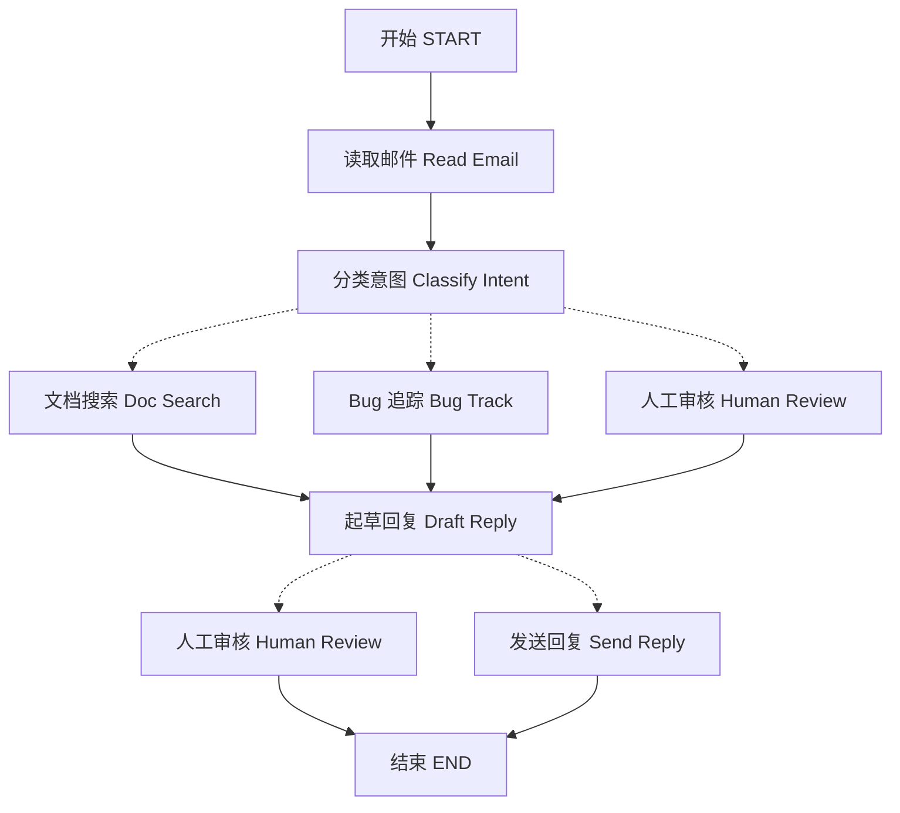

当你使用 LangGraph 构建智能体时，你会首先将其分解为被称为 **节点 (nodes)** 的离散步骤。然后，你将描述从每个节点出发的不同决策和转换（transitions）。最后，你通过一个所有节点都可以读取和写入的共享 **状态 (state)** 将这些节点连接起来。

在本指南中，我们将引导你完成构建一个客户支持电子邮件智能体的思考过程。

## 从你想要自动化的流程开始

想象一下你需要构建一个处理客户支持电子邮件的人工智能智能体。你的产品团队为你设定了以下要求：

```txt
该智能体应：

- 读取收到的客户电子邮件
- 按紧急程度和主题对邮件进行分类
- 搜索相关文档以回答问题
- 起草恰当的回复
- 将复杂问题升级给人工座席
- 在需要时安排后续跟进

需要处理的示例场景：

1. 简单的产品问题：“我如何重置密码？”
2. Bug 报告：“当我选择 PDF 格式时，导出功能崩溃了。”
3. 紧急的账单问题：“我的订阅被重复收费了！”
4. 功能请求：“可以在移动应用中添加黑暗模式吗？”
5. 复杂的技 术问题：“我们的 API 集成间歇性地出现 504 错误。”
```

要在 LangGraph 中实现一个智能体，你通常会遵循相同的五个步骤。

## 步骤 1：将你的工作流程绘制成离散步骤

首先确定流程中的独立步骤。每一步都将成为一个 **节点**（执行一件特定事情的函数）。然后，勾勒出这些步骤之间如何相互连接。



此图中的箭头指示了可能的路径，但实际采取哪条路径的决定发生在每个节点内部。

现在我们已经确定了工作流程中的组成部分，让我们来了解每个节点需要做什么：

- `Read Email`：提取并解析电子邮件内容
- `Classify Intent`：使用 LLM（大语言模型）对紧急程度和主题进行分类，然后路由到适当的操作
- `Doc Search`：查询你的知识库以获取相关信息
- `Bug Track`：在跟踪系统中创建或更新问题（Ticket）
- `Draft Reply`：生成适当的回复
- `Human Review`：升级给人机座席进行批准或处理
- `Send Reply`：分派电子邮件回复

<Tip>
注意，有些节点会决定下一步去哪里（例如：`Classify Intent`、`Draft Reply`、`Human Review`），而其他节点总是转向相同的下一步（例如：`Read Email` 总是转到 `Classify Intent`，`Doc Search` 总是转到 `Draft Reply`）。
</Tip>

## 步骤 2：确定每一步需要做什么

对于图中的每个节点，确定它代表的操作类型以及正常工作所需的上下文。

<CardGroup cols={2}>
    <Card title="LLM 步骤" icon="brain" href="#llm-steps">
        当需要理解、分析、生成文本或进行推理决策时使用。
    </Card>
    <Card title="数据步骤" icon="database" href="#data-steps">
        当需要从外部源检索信息时使用。
    </Card>
    <Card title="操作步骤" icon="bolt" href="#action-steps">
        当需要执行外部操作时使用。
    </Card>
    <Card title="用户输入步骤" icon="user" href="#user-input-steps">
        当需要人工干预时使用。
    </Card>
</CardGroup>

### LLM 步骤

当一个步骤需要理解、分析、生成文本或进行推理决策时：

<AccordionGroup>
    <Accordion title="分类意图 (Classify intent)">
        - 静态上下文（Prompt）：分类类别、紧急程度定义、响应格式
        - 动态上下文（来自状态）：电子邮件内容、发件人信息
        - 期望结果：决定路由的结构化分类
    </Accordion>

    <Accordion title="起草回复 (Draft reply)">
        - 静态上下文（Prompt）：语气指南、公司政策、回复模板
        - 动态上下文（来自状态）：分类结果、搜索结果、客户历史记录
        - 期望结果：准备好供审核的专业电子邮件回复
    </Accordion>
</AccordionGroup>

### 数据步骤

当一个步骤需要从外部源检索信息时：

<AccordionGroup>
    <Accordion title="文档搜索 (Document search)">
        - 参数：根据意图和主题构建的查询
        - 重试策略：是，使用指数退避（exponential backoff）来应对瞬时故障
        - 缓存：可以缓存常见查询以减少 API 调用
    </Accordion>

    <Accordion title="客户历史记录查找 (Customer history lookup)">
        - 参数：来自状态的客户电子邮件或 ID
        - 重试策略：是，但如果信息不可用，则回退到基本信息
        - 缓存：是，设置生存时间（TTL）以平衡新鲜度和性能
    </Accordion>
</AccordionGroup>

### 操作步骤

当一个步骤需要执行外部操作时：

<AccordionGroup>
    <Accordion title="发送回复 (Send reply)">
        - 执行节点的时间：在批准（人工或自动）之后
        - 重试策略：是，使用指数退避来应对网络问题
        - 不应缓存：每次发送都是一个唯一的动作
    </Accordion>

    <Accordion title="Bug 追踪 (Bug track)">
        - 执行节点的时间：当意图是“bug”时始终执行
        - 重试策略：是，不丢失 Bug 报告至关重要
        - 返回值：回复中包含的 Ticket ID
    </Accordion>
</AccordionGroup>

### 用户输入步骤

当一个步骤需要人工干预时：

<AccordionGroup>
    <Accordion title="人工审核节点 (Human review node)">
        - 决策上下文：原始邮件、起草的回复、紧急程度、分类
        - 期望输入格式：布尔值批准，以及可选的编辑后的回复
        - 触发时机：高紧急程度、复杂问题或质量担忧
    </Accordion>
</AccordionGroup>

## 步骤 3：设计你的状态

状态是智能体中所有节点都可以访问的共享[内存](/oss/concepts/memory)。将其视为智能体在处理流程时用来跟踪它所了解和决定的所有内容的一个笔记本。

### 哪些内容应置于状态中？

针对每条数据问自己以下问题：

<CardGroup cols={2}>
    <Card title="包含在状态中" icon="check">
        它需要在步骤间保持存在吗？如果需要，它就进入状态。
    </Card>

    <Card title="不存储" icon="code">
        它可以从其他数据中推导出来吗？如果是，则在需要时计算它，而不是存储在状态中。
    </Card>
</CardGroup>

对于我们的电子邮件智能体，我们需要跟踪：

- 原始邮件和发件人信息（稍后无法重建这些信息）
- 分类结果（多个下游节点需要）
- 搜索结果和客户数据（重新获取成本高昂）
- 起草的回复（需要通过审核）
- 执行元数据（用于调试和恢复）

### 保持状态原始，按需格式化 Prompt

<Tip>
    一个关键原则：你的状态应存储**原始数据**，而不是格式化的文本。在节点内部需要时才格式化 Prompt。
</Tip>

这种分离意味着：

- 不同的节点可以以不同的方式格式化相同的数据以满足其需求
- 你可以在不修改状态模式的情况下更改 Prompt 模板
- 调试更清晰——你可以确切地看到每个节点接收到的数据
- 你的智能体可以在不破坏现有状态的情况下演进

让我们定义我们的状态：

:::python

```python
from typing import TypedDict, Literal

# 定义电子邮件分类的结构
class EmailClassification(TypedDict):
    intent: Literal["question", "bug", "billing", "feature", "complex"]
    urgency: Literal["low", "medium", "high", "critical"]
    topic: str
    summary: str

class EmailAgentState(TypedDict):
    # 原始邮件数据
    email_content: str
    sender_email: str
    email_id: str

    # 分类结果
    classification: EmailClassification | None

    # 原始搜索/API 结果
    search_results: list[str] | None  # 原始文档块列表
    customer_history: dict | None  # CRM 中的原始客户数据

    # 生成的内容
    draft_response: str | None
    messages: list[str] | None
```

:::

:::js

```typescript
import * as z from "zod";

// 定义电子邮件分类的结构
const EmailClassificationSchema = z.object({
  intent: z.enum(["question", "bug", "billing", "feature", "complex"]),
  urgency: z.enum(["low", "medium", "high", "critical"]),
  topic: z.string(),
  summary: z.string(),
});

const EmailAgentState = z.object({
  // 原始邮件数据
  emailContent: z.string(),
  senderEmail: z.string(),
  emailId: z.string(),

  // 分类结果
  classification: EmailClassificationSchema.optional(),

  // 原始搜索/API 结果
  searchResults: z.array(z.string()).optional(),  // 原始文档块列表
  customerHistory: z.record(z.any()).optional(),  // CRM 中的原始客户数据

  // 生成的内容
  responseText: z.string().optional(),
});

type EmailAgentStateType = z.infer<typeof EmailAgentState>;
type EmailClassificationType = z.infer<typeof EmailClassificationSchema>;
```

:::

请注意，状态只包含原始数据——不包含 Prompt 模板、格式化字符串或指令。分类输出被存储为一个字典，直接来自 LLM。

## 步骤 4：构建你的节点

:::python

现在我们实现每个步骤为一个函数。LangGraph 中的一个节点只是一个 Python 函数，它接受当前状态并返回对其的更新。

:::

:::js

现在我们实现每个步骤为一个函数。LangGraph 中的一个节点只是一个 JavaScript 函数，它接受当前状态并返回对其的更新。

:::

### 以适当的方式处理错误

不同的错误需要不同的处理策略：

| 错误类型 | 谁来修复？ | 策略 | 何时使用 |
|---|---|---|---|
| 瞬时错误（网络问题、速率限制） | 系统（自动） | 重试策略 | 通常重试后会解决的临时故障 |
| LLM 可恢复错误（工具失败、解析问题） | LLM | 存储错误于状态并循环返回 | LLM 可以看到错误并调整其方法 |
| 用户可修复错误（信息缺失、指令不明确） | 人工 | 使用 `interrupt()` 暂停 | 需要用户输入才能继续 |
| 意外错误 | 开发者 | 让错误冒泡（Bubble up） | 需要调试的未知问题 |

<Tabs>
    <Tab title="瞬时错误" icon="rotate">
        为自动重试网络问题和速率限制添加重试策略：

    :::python

    ```python
    from langgraph.types import RetryPolicy

    workflow.add_node(
        "search_documentation",
        search_documentation,
        retry_policy=RetryPolicy(max_attempts=3, initial_interval=1.0)
    )
    ```

    :::

    :::js

    ```typescript
    import type { RetryPolicy } from "@langchain/langgraph";

    workflow.addNode(
    "searchDocumentation",
    searchDocumentation,
    {
        retryPolicy: { maxAttempts: 3, initialInterval: 1.0 },
    },
    );
    ```

    :::

    </Tab>

    <Tab title="LLM 可恢复错误" icon="brain">
        将错误存储在状态中并循环返回，以便 LLM 可以看到出了什么问题并重试：

    :::python

    ```python
    from langgraph.types import Command


    def execute_tool(state: State) -> Command[Literal["agent", "execute_tool"]]:
        try:
            result = run_tool(state['tool_call'])
            return Command(update={"tool_result": result}, goto="agent")
        except ToolError as e:
            # 让 LLM 看到哪里出了问题并重试
            return Command(
                update={"tool_result": f"Tool error: {str(e)}"},
                goto="agent"
            )
    ```

    :::

    :::js

    ```typescript
    import { Command } from "@langchain/langgraph";

    async function executeTool(state: State) {
    try {
        const result = await runTool(state.toolCall);
        return new Command({
        update: { toolResult: result },
        goto: "agent",
        });
    } catch (error) {
        // 让 LLM 看到哪里出了问题并重试
        return new Command({
        update: { toolResult: `Tool error: ${error}` },
        goto: "agent"
        });
    }
    }
    ```

    :::

    </Tab>

    <Tab title="用户可修复错误" icon="user">
        在需要时暂停并从用户那里收集信息（例如账号 ID、订单号或澄清信息）：

    :::python

    ```python
    from langgraph.types import Command


    def lookup_customer_history(state: State) -> Command[Literal["draft_response"]]:
        if not state.get('customer_id'):
            user_input = interrupt({
                "message": "需要客户 ID",
                "request": "请提供客户的账号 ID 以查找其订阅历史记录"
            })
            return Command(
                update={"customer_id": user_input['customer_id']},
                goto="lookup_customer_history"
            )
        # 现在继续查找
        customer_data = fetch_customer_history(state['customer_id'])
        return Command(update={"customer_history": customer_data}, goto="draft_response")
    ```

    :::

    :::js

    ```typescript
    import { Command, interrupt } from "@langchain/langgraph";

    async function lookupCustomerHistory(state: State) {
    if (!state.customerId) {
        const userInput = interrupt({
        message: "需要客户 ID",
        request: "请提供客户的账号 ID 以查找其订阅历史记录",
        });
        return new Command({
        update: { customerId: userInput.customerId },
        goto: "lookupCustomerHistory",
        });
    }
    // 现在继续查找
    const customerData = await fetchCustomerHistory(state.customerId);
    return new Command({
        update: { customerHistory: customerData },
        goto: "draftResponse",
    });
    }
    ```

    :::

    </Tab>

    <Tab title="意外错误" icon="triangle-exclamation">
        让它们冒泡，以便进行调试。不要捕获你无法处理的内容：

    :::python

    ```python
    def send_reply(state: EmailAgentState):
        try:
            email_service.send(state["draft_response"])
        except Exception:
            raise  # 暴露意外错误
    ```

    :::

    :::js

    ```typescript
    async function sendReply(state: EmailAgentStateType): Promise<void> {
    try {
        await emailService.send(state.responseText);
    } catch (error) {
        throw error;  // 暴露意外错误
    }
    }
    ```

    :::

    </Tab>
</Tabs>


### 实现我们的邮件智能体节点

我们将每个节点实现为一个简单的函数。记住：节点接受状态，执行工作，并返回更新。

<AccordionGroup>
    <Accordion title="读取和分类节点" icon="brain">

    :::python

    ```python
    from typing import Literal
    from langgraph.graph import StateGraph, START, END
    from langgraph.types import interrupt, Command, RetryPolicy
    from langchain_openai import ChatOpenAI
    from langchain.messages import HumanMessage

    llm = ChatOpenAI(model="gpt-5-nano")

    def read_email(state: EmailAgentState) -> dict:
        """提取并解析邮件内容"""
        # 在生产环境中，这会连接到你的邮件服务
        return {
            "messages": [HumanMessage(content=f"正在处理邮件: {state['email_content']}")]
        }

    def classify_intent(state: EmailAgentState) -> Command[Literal["search_documentation", "human_review", "draft_response", "bug_tracking"]]:
        """使用 LLM 对邮件意图和紧急程度进行分类，然后相应地路由"""

        # 创建返回 EmailClassification 字典的结构化 LLM
        structured_llm = llm.with_structured_output(EmailClassification)

        # 按需格式化 Prompt，不存储在状态中
        classification_prompt = f"""
        分析这封客户邮件并对其进行分类：

        邮件: {state['email_content']}
        来自: {state['sender_email']}

        提供分类，包括意图、紧急程度、主题和摘要。
        """

        # 直接以字典形式获取结构化响应
        classification = structured_llm.invoke(classification_prompt)

        # 根据分类确定下一个节点
        if classification['intent'] == 'billing' or classification['urgency'] == 'critical':
            goto = "human_review"
        elif classification['intent'] in ['question', 'feature']:
            goto = "search_documentation"
        elif classification['intent'] == 'bug':
            goto = "bug_tracking"
        else:
            goto = "draft_response"

        # 将分类作为字典存储在状态中
        return Command(
            update={"classification": classification},
            goto=goto
        )
    ```

    :::

    :::js

    ```typescript
    import { StateGraph, START, END, Command } from "@langchain/langgraph";
    import { HumanMessage } from "@langchain/core/messages";
    import { ChatAnthropic } from "@langchain/anthropic";

    const llm = new ChatAnthropic({ model: "claude-sonnet-4-5-20250929" });

    async function readEmail(state: EmailAgentStateType) {
    // 提取并解析邮件内容
    // 在生产环境中，这会连接到你的邮件服务
    console.log(`正在处理邮件: ${state.emailContent}`);
    return {};
    }

    async function classifyIntent(state: EmailAgentStateType) {
    // 使用 LLM 对邮件意图和紧急程度进行分类，然后相应地路由

    // 创建返回 EmailClassification 对象的结构化 LLM
    const structuredLlm = llm.withStructuredOutput(EmailClassificationSchema);

    // 按需格式化 Prompt，不存储在状态中
    const classificationPrompt = `
    分析这封客户邮件并对其进行分类：

    邮件: ${state.emailContent}
    来自: ${state.senderEmail}

    提供分类，包括意图、紧急程度、主题和摘要。
    `;

    // 直接以对象形式获取结构化响应
    const classification = await structuredLlm.invoke(classificationPrompt);

    // 根据分类确定下一个节点
    let nextNode: "searchDocumentation" | "humanReview" | "draftResponse" | "bugTracking";

    if (classification.intent === "billing" || classification.urgency === "critical") {
        nextNode = "humanReview";
    } else if (classification.intent === "question" || classification.intent === "feature") {
        nextNode = "searchDocumentation";
    } else if (classification.intent === "bug") {
        nextNode = "bugTracking";
    } else {
        nextNode = "draftResponse";
    }

    // 将分类作为对象存储在状态中
    return new Command({
        update: { classification },
        goto: nextNode,
    });
    }
    ```

    :::

    </Accordion>

    <Accordion title="搜索和追踪节点" icon="database">

    :::python

    ```python
    def search_documentation(state: EmailAgentState) -> Command[Literal["draft_response"]]:
        """搜索知识库以获取相关信息"""

        # 从分类中构建搜索查询
        classification = state.get('classification', {})
        query = f"{classification.get('intent', '')} {classification.get('topic', '')}"

        try:
            # 在此处实现你的搜索逻辑
            # 存储原始搜索结果，而不是格式化文本
            search_results = [
                "通过 设置 > 安全 > 更改密码 来重置密码",
                "密码长度必须至少为 12 个字符",
                "包含大写字母、小写字母、数字和符号"
            ]
        except SearchAPIError as e:
            # 对于可恢复的搜索错误，存储错误并继续
            search_results = [f"搜索暂时不可用: {str(e)}"]

        return Command(
            update={"search_results": search_results},  # 存储原始结果或错误
            goto="draft_response"
        )

    def bug_tracking(state: EmailAgentState) -> Command[Literal["draft_response"]]:
        """创建或更新 Bug 追踪票据"""

        # 在你的 Bug 追踪系统中创建票据
        ticket_id = "BUG-12345"  # 将通过 API 创建

        return Command(
            update={
                "search_results": [f"Bug 票据 {ticket_id} 已创建"],
                "current_step": "bug_tracked"
            },
            goto="draft_response"
        )
    ```

    :::

    :::js

    ```typescript
    async function searchDocumentation(state: EmailAgentStateType) {
    // 搜索知识库以获取相关信息

    // 从分类中构建搜索查询
    const classification = state.classification!;
    const query = `${classification.intent} ${classification.topic}`;

    let searchResults: string[];

    try {
        // 在此处实现你的搜索逻辑
        // 存储原始搜索结果，而不是格式化文本
        searchResults = [
        "通过 设置 > 安全 > 更改密码 来重置密码",
        "密码长度必须至少为 12 个字符",
        "包含大写字母、小写字母、数字和符号",
        ];
    } catch (error) {
        // 对于可恢复的搜索错误，存储错误并继续
        searchResults = [`搜索暂时不可用: ${error}`];
    }

    return new Command({
        update: { searchResults },  // 存储原始结果或错误
        goto: "draftResponse",
    });
    }

    async function bugTracking(state: EmailAgentStateType) {
    // 创建或更新 Bug 追踪票据

    // 在你的 Bug 追踪系统中创建票据
    const ticketId = "BUG-12345";  // 将通过 API 创建

    return new Command({
        update: { searchResults: [`Bug 票据 ${ticketId} 已创建`] },
        goto: "draftResponse",
    });
    }
    ```

    :::

    </Accordion>

    <Accordion title="回复节点" icon="pen-to-square">

    :::python

    ```python
    def draft_response(state: EmailAgentState) -> Command[Literal["human_review", "send_reply"]]:
        """使用上下文生成回复并根据质量路由"""

        classification = state.get('classification', {})

        # 按需从原始状态数据格式化上下文
        context_sections = []

        if state.get('search_results'):
            # 为 Prompt 格式化搜索结果
            formatted_docs = "\n".join([f"- {doc}" for doc in state['search_results']])
            context_sections.append(f"相关文档:\n{formatted_docs}")

        if state.get('customer_history'):
            # 为 Prompt 格式化客户数据
            context_sections.append(f"客户等级: {state['customer_history'].get('tier', 'standard')}")

        # 构建带有格式化上下文的 Prompt
        draft_prompt = f"""
        起草对该客户邮件的回复：
        {state['email_content']}

        邮件意图: {classification.get('intent', 'unknown')}
        紧急程度: {classification.get('urgency', 'medium')}

        {chr(10).join(context_sections)}

        指南：
        - 专业且乐于助人
        - 解决他们特定的问题
        - 在相关时使用提供的文档
        """

        response = llm.invoke(draft_prompt)

        # 根据紧急程度和意图决定是否需要人工审核
        needs_review = (
            classification.get('urgency') in ['high', 'critical'] or
            classification.get('intent') == 'complex'
        )

        # 路由到适当的下一个节点
        goto = "human_review" if needs_review else "send_reply"

        return Command(
            update={"draft_response": response.content},  # 仅存储原始回复
            goto=goto
        )

    def human_review(state: EmailAgentState) -> Command[Literal["send_reply", END]]:
        """使用 interrupt 暂停以供人工审核，并根据决策路由"""

        classification = state.get('classification', {})

        # interrupt() 必须放在最前面——它之前的任何代码在恢复时都会重新运行
        human_decision = interrupt({
            "email_id": state.get('email_id',''),
            "original_email": state.get('email_content',''),
            "draft_response": state.get('draft_response',''),
            "urgency": classification.get('urgency'),
            "intent": classification.get('intent'),
            "action": "请审核并批准/编辑此回复"
        })

        # 现在处理人工决策
        if human_decision.get("approved"):
            return Command(
                update={"draft_response": human_decision.get("edited_response", state.get('draft_response',''))},
                goto="send_reply"
            )
        else:
            # 拒绝意味着人工将直接处理
            return Command(update={}, goto=END)

    def send_reply(state: EmailAgentState) -> dict:
        """发送电子邮件回复"""
        # 集成到邮件服务
        print(f"正在发送回复: {state['draft_response'][:100]}...")
        return {}
    ```

    :::

    :::js

    ```typescript
    import { Command, interrupt } from "@langchain/langgraph";

    async function draftResponse(state: EmailAgentStateType) {
    // 使用上下文生成回复并根据质量路由

    const classification = state.classification!;

    // 按需从原始状态数据格式化上下文
    const contextSections: string[] = [];

    if (state.searchResults) {
        // 为 Prompt 格式化搜索结果
        const formattedDocs = state.searchResults.map(doc => `- ${doc}`).join("\n");
        contextSections.push(`相关文档:\n${formattedDocs}`);
    }

    if (state.customerHistory) {
        // 为 Prompt 格式化客户数据
        contextSections.push(`客户等级: ${state.customerHistory.tier ?? "standard"}`);
    }

    // 构建带有格式化上下文的 Prompt
    const draftPrompt = `
    起草对这封客户邮件的回复：
    ${state.emailContent}

    邮件意图: ${classification.intent}
    紧急程度: ${classification.urgency}

    ${contextSections.join("\n\n")}

    指南：
    - 专业且乐于助人
    - 解决他们特定的问题
    - 在相关时使用提供的文档
    `;

    const response = await llm.invoke([new HumanMessage(draftPrompt)]);

    // 根据紧急程度和意图决定是否需要人工审核
    const needsReview = (
        classification.urgency === "high" ||
        classification.urgency === "critical" ||
        classification.intent === "complex"
    );

    // 路由到适当的下一个节点
    const nextNode = needsReview ? "humanReview" : "sendReply";

    return new Command({
        update: { responseText: response.content.toString() },  // 仅存储原始回复
        goto: nextNode,
    });
    }

    async function humanReview(state: EmailAgentStateType) {
    // 使用 interrupt 暂停以供人工审核，并根据决策路由
    const classification = state.classification!;

    // interrupt() 必须放在最前面——它之前的任何代码在恢复时都会重新运行
    const humanDecision = interrupt({
        emailId: state.emailId,
        originalEmail: state.emailContent,
        draftResponse: state.responseText,
        urgency: classification.urgency,
        intent: classification.intent,
        action: "请审核并批准/编辑此回复",
    });

    // 现在处理人工决策
    if (humanDecision.approved) {
        return new Command({
        update: { responseText: humanDecision.editedResponse || state.responseText },
        goto: "sendReply",
        });
    } else {
        // 拒绝意味着人工将直接处理
        return new Command({ update: {}, goto: END });
    }
    }

    async function sendReply(state: EmailAgentStateType): Promise<{}> {
    // 发送电子邮件回复
    // 集成到邮件服务
    console.log(`正在发送回复: ${state.responseText!.substring(0, 100)}...`);
    return {};
    }
    ```

    :::

    </Accordion>
</AccordionGroup>

## 步骤 5：将它们连接起来

现在我们将节点连接成一个可工作的图。由于我们的节点处理自己的路由决策，我们只需要少数几个基本边（edges）。

为了使用 `interrupt()` 实现人工干预（human-in-the-loop），我们需要使用 [检查点 (checkpointer)](/oss/langgraph/persistence) 来编译，以便在运行图时在节点之间保存状态：

<Accordion title="图编译代码" icon="diagram-project" defaultOpen={true}>

:::python

```python
from langgraph.checkpoint.memory import MemorySaver
from langgraph.types import RetryPolicy

# 创建图
workflow = StateGraph(EmailAgentState)

# 添加节点，并配置适当的错误处理
workflow.add_node("read_email", read_email)
workflow.add_node("classify_intent", classify_intent)

# 为可能出现瞬时故障的节点添加重试策略
workflow.add_node(
    "search_documentation",
    search_documentation,
    retry_policy=RetryPolicy(max_attempts=3)
)
workflow.add_node("bug_tracking", bug_tracking)
workflow.add_node("draft_response", draft_response)
workflow.add_node("human_review", human_review)
workflow.add_node("send_reply", send_reply)

# 添加仅必要的边
workflow.add_edge(START, "read_email")
workflow.add_edge("read_email", "classify_intent")
workflow.add_edge("send_reply", END)

# 使用检查点进行编译以实现持久化，以防在带有 Local_Server 的情况下运行图 --> 请在不带检查点的情况下编译
memory = MemorySaver()
app = workflow.compile(checkpointer=memory)
```

:::

:::js

```typescript
import { MemorySaver, RetryPolicy } from "@langchain/langgraph";

// 创建图
const workflow = new StateGraph(EmailAgentState)
  // 添加节点，并配置适当的错误处理
  .addNode("readEmail", readEmail)
  .addNode("classifyIntent", classifyIntent)
  // 为可能出现瞬时故障的节点添加重试策略
  .addNode(
    "searchDocumentation",
    searchDocumentation,
    { retryPolicy: { maxAttempts: 3 } },
  )
  .addNode("bugTracking", bugTracking)
  .addNode("draftResponse", draftResponse)
  .addNode("humanReview", humanReview)
  .addNode("sendReply", sendReply)
  // 添加仅必要的边
  .addEdge(START, "readEmail")
  .addEdge("readEmail", "classifyIntent")
  .addEdge("sendReply", END);

// 使用检查点进行编译以实现持久化
const memory = new MemorySaver();
const app = workflow.compile({ checkpointer: memory });
```
:::

</Accordion>

:::python
图结构是最小化的，因为路由发生在节点内部，通过 @[`Command`] 对象。每个节点使用 `Command[Literal["node1", "node2"]]` 这样的类型提示声明它可以去向哪里，使得流程清晰、可追溯。
:::

:::js
图结构是最小化的，因为路由发生在 `Command` 对象所在的节点内部。每个节点声明它可以去向哪里，使得流程清晰、可追溯。
:::

### 试用你的智能体

让我们用一个需要人工审核的紧急计费问题来运行我们的智能体：

<Accordion title="测试智能体" icon="flask">

:::python

```python
# 用紧急计费问题进行测试
initial_state = {
    "email_content": "我的订阅被重复收费了！这很紧急！",
    "sender_email": "customer@example.com",
    "email_id": "email_123",
    "messages": []
}

# 使用 thread_id 进行持久化运行
config = {"configurable": {"thread_id": "customer_123"}}
result = app.invoke(initial_state, config)
# 图将在 human_review 处暂停
print(f"人工审核中断:{result['__interrupt__']}")

# 准备好后，提供人工输入以恢复
from langgraph.types import Command

human_response = Command(
    resume={
        "approved": True,
        "edited_response": "我们对重复收费深表歉意。我已立即启动退款流程..."
    }
)

# 恢复执行
final_result = app.invoke(human_response, config)
print(f"邮件发送成功！")
```

:::

:::js

```typescript
// 用紧急计费问题进行测试
const initialState: EmailAgentStateType = {
  emailContent: "我的订阅被重复收费了！这很紧急！",
  senderEmail: "customer@example.com",
  emailId: "email_123"
};

// 使用 thread_id 进行持久化运行
const config = { configurable: { thread_id: "customer_123" } };
const result = await app.invoke(initialState, config);
// 图将在 human_review 处暂停
console.log(`草稿准备审核: ${result.responseText?.substring(0, 100)}...`);

// 准备好后，提供人工输入以恢复
import { Command } from "@langchain/langgraph";

const humanResponse = new Command({
  resume: {
    approved: true,
    editedResponse: "我们对重复收费深表歉意。我已立即启动退款流程...",
  }
});

// 恢复执行
const finalResult = await app.invoke(humanResponse, config);
console.log("邮件发送成功！");
```

:::

</Accordion>

当它遇到 `interrupt()` 时，图会暂停，将所有内容保存到检查点，然后等待。它可以在几天后恢复，从它停止的地方准确继续。`thread_id` 确保了此对话的所有状态都被一起保留。

## 总结和后续步骤

### 关键见解

构建此电子邮件智能体向我们展示了 LangGraph 的思考方式：

<CardGroup cols={2}>
    <Card title="分解为离散步骤" icon="sitemap" href="#step-1-map-out-your-workflow-as-discrete-steps">
        每个节点只做好一件事。这种分解支持流式进度更新、可持续执行（可以暂停和恢复）以及清晰的调试（因为你可以在步骤之间检查状态）。
    </Card>

    <Card title="状态是共享内存" icon="database" href="#step-3-design-your-state">
        存储原始数据，而不是格式化文本。这使得不同的节点可以以不同的方式使用相同的信息。
    </Card>

    <Card title="节点就是函数" icon="code" href="#step-4-build-your-nodes">
        它们接受状态，执行工作，并返回更新。当它们需要做出路由决策时，它们指定状态更新和下一个目的地。
    </Card>

    <Card title="错误是流程的一部分" icon="triangle-exclamation" href="#handle-errors-appropriately">
        瞬时故障会得到重试，LLM 可恢复错误会带着上下文循环返回，用户可修复问题会暂停等待输入，而意外错误则会冒泡以供调试。
    </Card>

    <Card title="人工输入是一等公民" icon="user" href="/oss/langgraph/interrupts">
        `interrupt()` 函数会无限期地暂停执行，保存所有状态，并在收到输入时从恰好停止的位置恢复。当与其他操作组合在一个节点中时，它必须放在最前面。
    </Card>

    <Card title="图结构自然涌现" icon="diagram-project" href="#step-5-wire-it-together">
        你定义了必要的连接，而节点处理自己的路由逻辑。这使得控制流程清晰且可追溯——你始终可以通过查看当前节点来理解智能体接下来将做什么。
    </Card>
</CardGroup>

### 高级考虑

<Accordion title="节点粒度的权衡" icon="sliders">
<Info>
本节探讨节点粒度设计中的权衡。大多数应用可以跳过此部分，使用上面展示的模式即可。
</Info>

你可能会想：为什么不将 `Read Email` 和 `Classify Intent` 合并为一个节点呢？

或者为什么将文档搜索与起草回复分开？

答案在于**弹性（resilience）** 和**可观测性（observability）** 的权衡。

**弹性考虑：** LangGraph 的[持久化执行](/oss/langgraph/durable-execution)在节点边界创建检查点。当工作流程从中断或故障中恢复时，它会从停止执行的节点开头开始。节点越小，检查点就越频繁，这意味着如果出现问题，需要重复执行的工作就越少。如果你将多个操作合并到一个大型节点中，靠近末尾的故障将意味着需要从该节点开头重新执行所有操作。

我们为电子邮件智能体选择此细分的原因：

- **外部服务隔离：** 文档搜索和 Bug 追踪是独立的节点，因为它们调用外部 API。如果搜索服务很慢或失败，我们希望将其与 LLM 调用隔离开来。我们可以为这些特定节点添加重试策略而不影响其他节点。

- **中间可见性：** 将 `Classify Intent` 作为一个单独的节点，使我们能够在采取行动之前检查 LLM 的决定。这对于调试和监控非常宝贵——你可以确切地看到何时以及为什么智能体路由到人工审核。

- **不同的故障模式：** LLM 调用、数据库查找和邮件发送具有不同的重试策略。单独的节点允许你独立配置这些。

- **可重用性和测试：** 较小的节点更易于隔离测试，也更容易在其他工作流程中重用。

另一种有效的方法：你可以将 `Read Email` 和 `Classify Intent` 合并为一个节点。你将失去在分类前检查原始邮件的能力，并且在該节点出现任何故障时都需要重新执行这两个操作。对于大多数应用来说，单独节点的**可观测性**和**调试**优势是值得的权衡。

应用层面的考量：步骤 2 中关于缓存的讨论（是否缓存搜索结果）是应用层面的决策，而不是 LangGraph 框架的特性。你应该根据你的具体需求在节点函数内部实现缓存。

性能考量：更多的节点并不意味着执行更慢。LangGraph 默认在后台写入检查点（[异步持久化模式](/oss/langgraph/durable-execution#durability-modes)），因此你的图在等待检查点完成的同时继续运行。这意味着你以最小的性能影响获得了频繁的检查点。如果需要，你可以调整此行为——使用 `"exit"` 模式仅在完成后才检查点，或者使用 `"sync"` 模式阻塞执行直到写入每个检查点。
</Accordion>

### 接下来的方向

这是关于如何使用 LangGraph 构建智能体的思考方式的介绍。你可以基于此基础进行扩展：

<CardGroup cols={2}>
    <Card title="人工干预模式" icon="user-check" href="/oss/langgraph/interrupts">
        学习如何添加在执行前进行工具批准、批量批准和其他模式
    </Card>

    <Card title="子图" icon="diagram-nested" href="/oss/langgraph/use-subgraphs">
        为复杂的多步骤操作创建子图
    </Card>

    <Card title="流式传输 (Streaming)" icon="tower-broadcast" href="/oss/langgraph/streaming">
        添加流式传输以向用户显示实时进度
    </Card>

    <Card title="可观测性" icon="chart-line" href="/oss/langgraph/observability">
        使用 LangSmith 添加可观测性以进行调试和监控
    </Card>

    <Card title="工具集成" icon="wrench" href="/oss/langchain/tools">
        集成更多工具用于网页搜索、数据库查询和 API 调用
    </Card>

    <Card title="重试逻辑" icon="rotate" href="/oss/langgraph/use-graph-api#add-retry-policies">
        为失败的操作实现带有指数退避的重试逻辑
    </Card>
</CardGroup>