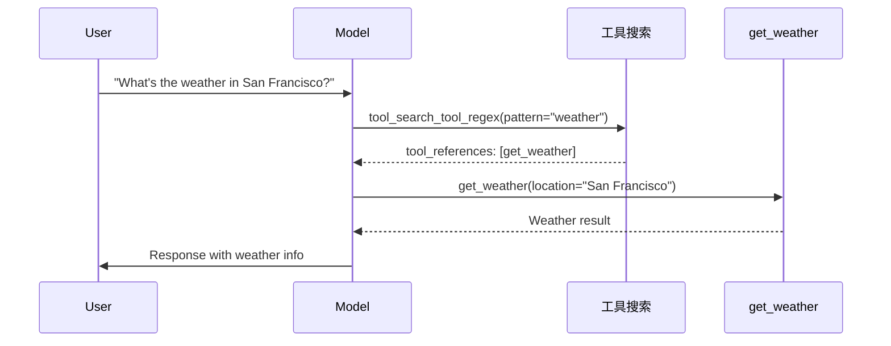

您可以在 [Claude](https://platform.claude.com/docs/en/about-claude/models/overview) 文档中找到有关 Anthropic 最新模型、成本、上下文窗口和支持的输入类型的相关信息。

<Tip>
    **API 参考**

    有关所有功能和配置选项的详细文档，请前往 @[`ChatAnthropic`] API 参考页面。
</Tip>

<Info>
    **AWS Bedrock 和 Google VertexAI**

    请注意，某些 Anthropic 模型也可以通过 AWS Bedrock 和 Google VertexAI 访问。请参阅 [`ChatBedrock`](/oss/integrations/chat/bedrock/) 和 [`ChatVertexAI`](/oss/integrations/chat/google_vertex_ai#anthropic-on-vertex-ai) 集成，以通过这些服务使用 Anthropic 模型。
</Info>

## 概览 (Overview)

### 集成详情 (Integration details)

| 类 (Class) | 包 (Package) | <Tooltip tip="可在本地硬件上运行" cta="了解更多" href="/oss/langchain/models#local-models">本地 (Local)</Tooltip> | 可序列化 (Serializable) | JS/TS 支持 (JS/TS Support) | 下载量 (Downloads) | 最新版本 (Latest Version) |
| :--- | :--- | :---: | :---: |  :---: | :---: | :---: |
| @[`ChatAnthropic`] | @[`langchain-anthropic`] | ❌ | beta | ✅ [(npm)](https://js.langchain.com/docs/integrations/chat/anthropic) | <a href="https://pypi.org/project/langchain-anthropic/" target="_blank"></a> | <a href="https://pypi.org/project/langchain-anthropic/" target="_blank"></a> |

### 模型特性 (Model features)

| [工具调用](/oss/langchain/tools) | [结构化输出](/oss/langchain/structured-output) | JSON 模式 (JSON mode) | [图像输入](/oss/langchain/messages#multimodal) | 音频输入 (Audio input) | 视频输入 (Video input) | [Token 级别流式传输](/oss/langchain/streaming/) | 原生异步 (Native async) | [Token 使用量](/oss/langchain/models#token-usage) | [Logprobs](/oss/langchain/models#log-probabilities) |
| :---: | :---: | :---: | :---: |  :---: | :---: | :---: | :---: | :---: | :---: |
| ✅ | ✅ | ✅ | ✅ | ❌ | ❌ | ✅ | ✅ | ✅ | ❌ |

## 设置 (Setup)

要访问 Anthropic (Claude) 模型，您需要安装 `langchain-anthropic` 集成包并获取 [Claude](https://platform.claude.com/docs/en/get-started#prerequisites) API 密钥。

### 安装 (Installation)

<CodeGroup>
    ```bash pip
    pip install -U langchain-anthropic
    ```
    ```bash uv
    uv add langchain-anthropic
    ```
</CodeGroup>

### 凭证 (Credentials)

前往 [Claude 控制台](https://console.anthropic.com) 注册并生成 Claude API 密钥。生成后，请设置 `ANTHROPIC_API_KEY` 环境变量：

```python
import getpass
import os

if "ANTHROPIC_API_KEY" not in os.environ:
    os.environ["ANTHROPIC_API_KEY"] = getpass.getpass("输入您的 Anthropic API 密钥: ")
```

要启用模型调用的自动跟踪，请设置您的 [LangSmith](https://docs.langchain.com/langsmith/home) API 密钥：

```python
os.environ["LANGSMITH_API_KEY"] = getpass.getpass("输入您的 LangSmith API 密钥: ")
os.environ["LANGSMITH_TRACING"] = "true"
```

## 实例化 (Instantiation)

现在我们可以实例化模型对象并生成聊天补全：

```python
from langchain_anthropic import ChatAnthropic

model = ChatAnthropic(
    model="claude-haiku-4-5-20251001",
    temperature=0,
    max_tokens=1024,
    timeout=None,
    max_retries=2,
    # other params...
)
```

有关所有可用参数的详细信息，请参阅 @[`ChatAnthropic`] API 参考。

## 调用 (Invocation)

```python
messages = [
    (
        "system",
        "You are a helpful assistant that translates English to French. Translate the user sentence.",
    ),
    ("human", "I love programming."),
]
ai_msg = model.invoke(messages)
ai_msg
```

```output
AIMessage(content="J'adore la programmation.", response_metadata={'id': 'msg_018Nnu76krRPq8HvgKLW4F8T', 'model': 'claude-3-5-sonnet-20240620', 'stop_reason': 'end_turn', 'stop_sequence': None, 'usage': {'input_tokens': 29, 'output_tokens': 11}}, id='run-57e9295f-db8a-48dc-9619-babd2bedd891-0', usage_metadata={'input_tokens': 29, 'output_tokens': 11, 'total_tokens': 40})
```

```python
print(ai_msg.text)
```

```output
J'adore la programmation.
```

在我们的 [模型](/oss/langchain/models#invocation) 指南中了解有关支持的调用方法的更多信息。

## Token 计数 (Token counting)

您可以在将消息发送给模型之前，使用 @[`get_num_tokens_from_messages()`][ChatAnthropic.get_num_tokens_from_messages] 来计算消息中的 token 数量。这使用了 Anthropic 的官方 [token 计数 API](https://platform.claude.com/docs/en/build-with-claude/token-counting)。

```python
from langchain_anthropic import ChatAnthropic
from langchain.messages import HumanMessage, SystemMessage

model = ChatAnthropic(model="claude-sonnet-4-5-20250929")

messages = [
    SystemMessage(content="You are a scientist"),
    HumanMessage(content="Hello, Claude"),
]

token_count = model.get_num_tokens_from_messages(messages)
print(token_count)
```

```output
14
```

在使用工具时，您也可以计算 token 数量：

```python
from langchain.tools import tool

@tool(parse_docstring=True)
def get_weather(location: str) -> str:
    """Get the current weather in a given location

    Args:
        location: The city and state, e.g. San Francisco, CA
    """
    return "Sunny"

messages = [
    HumanMessage(content="What's the weather like in San Francisco?"),
]

token_count = model.get_num_tokens_from_messages(messages, tools=[get_weather])
print(token_count)
```

```output
586
```

## 内容块 (Content blocks)

当使用工具、[扩展思考](#extended-thinking) 和其他功能时，来自单个 Anthropic @[`AIMessage`] 的内容可以是一个单独的字符串，也可以是 Anthropic 内容块的列表。

例如，当 Anthropic 模型调用工具时，工具调用是消息内容的一部分（同时也通过标准化的 @[`AIMessage.tool_calls`] 暴露出来）：

```python
from langchain_anthropic import ChatAnthropic
from typing_extensions import Annotated

model = ChatAnthropic(model="claude-haiku-4-5-20251001")


def get_weather(
    location: Annotated[str, ..., "Location as city and state."]
) -> str:
    """Get the weather at a location."""
    return "It's sunny."


model_with_tools = model.bind_tools([get_weather])
response = model_with_tools.invoke("Which city is hotter today: LA or NY?")
response.content
```

```output
[{'text': "I'll help you compare the temperatures of Los Angeles and New York by checking their current weather. I'll retrieve the weather for both cities.",
  'type': 'text'},
 {'id': 'toolu_01CkMaXrgmsNjTso7so94RJq',
  'input': {'location': 'Los Angeles, CA'},
  'name': 'get_weather',
  'type': 'tool_use'},
 {'id': 'toolu_01SKaTBk9wHjsBTw5mrPVSQf',
  'input': {'location': 'New York, NY'},
  'name': 'get_weather',
  'type': 'tool_use'}]
```

使用 `content_blocks` 将会以 LangChain 的标准格式渲染内容，该格式与其他模型提供商保持一致。阅读有关 [内容块](/oss/langchain/messages#standard-content-blocks) 的更多信息。

```python
response.content_blocks
```

您也可以使用 `tool_calls` 属性以标准格式访问工具调用：

```python
response.tool_calls
```

```output
[{'name': 'GetWeather',
  'args': {'location': 'Los Angeles, CA'},
  'id': 'toolu_01Ddzj5PkuZkrjF4tafzu54A'},
 {'name': 'GetWeather',
  'args': {'location': 'New York, NY'},
  'id': 'toolu_012kz4qHZQqD4qg8sFPeKqpP'}]
```

## 工具 (Tools)

Anthropic 的工具使用功能允许您定义外部函数，Claude 可以在对话过程中调用它们。这支持动态信息检索、计算以及与外部系统的交互。

有关如何将工具绑定到模型实例，请参阅 @[`ChatAnthropic.bind_tools`]。

<Note>
    有关 Claude 的内置工具（代码执行、网页浏览、文件 API 等）的信息，请参阅 [内置工具](#built-in-tools) 部分。
</Note>

### 严格工具使用 (Strict tool use)

<Info>
    严格工具使用要求：

    - Claude Sonnet 4.5 或 Opus 4.1。
    - `langchain-anthropic>=1.1.0`
</Info>

Anthropic 支持选择加入的 [严格的工具调用模式](https://platform.claude.com/docs/en/build-with-claude/structured-outputs)，该模式通过受限解码保证工具名称和参数得到验证并具有正确的类型。

如果没有严格模式，Claude 有时会生成导致应用程序中断的无效工具输入：

- **类型不匹配**：`passengers: "2"` 而不是 `passengers: 2`
- **缺少必需字段**：遗漏了函数期望的字段
- **无效枚举值**：超出允许范围的值
- **Schema 违反**：嵌套对象与预期结构不匹配

严格工具使用保证生成的工具调用符合 Schema：

- 工具输入严格遵循您的 `input_schema`
- 保证字段类型和必需字段
- 消除了对格式错误的输入的错误处理
- 使用的工具 `name` 始终来自提供的工具集

| 使用严格工具使用 | 使用标准工具调用 |
|---------------------|---------------------------|
| 构建对可靠性要求较高的代理工作流 | 简单的单轮工具调用 |
| 包含许多参数或嵌套对象的工具 | 原型设计和实验 |
| 需要特定类型（例如 `int` vs `str`）的函数 |  |

要启用严格工具使用，请在调用 @[`bind_tools`][ChatAnthropic.bind_tools] 时指定 `strict=True`。

```python
from langchain_anthropic import ChatAnthropic

model = ChatAnthropic(model="claude-sonnet-4-5-20250929")

def get_weather(location: str) -> str:
    """Get the weather at a location."""
    return "It's sunny."

model_with_tools = model.bind_tools([get_weather], strict=True)  # [!code highlight]
```

<Accordion
    title="示例：类型安全的预订系统"
>
    考虑一个预订系统，其中 `passengers` 必须是整数：

    ```python
    from langchain_anthropic import ChatAnthropic
    from typing import Literal

    model = ChatAnthropic(model="claude-sonnet-4-5-20250929")

    def book_flight(
        destination: str,
        departure_date: str,
        passengers: int, # [!code highlight]
        cabin_class: Literal["economy", "business", "first"]
    ) -> str:
        """预订飞往指定目的地的航班。

        Args:
            destination: 目的地城市
            departure_date: YYYY-MM-DD 格式的日期
            passengers: 乘客数量（必须是整数）
            cabin_class: 航班的舱位等级
        """
        return f"Booked {passengers} passengers to {destination}"

    model_with_tools = model.bind_tools(
        [book_flight],
        strict=True, # [!code highlight]
        tool_choice="any",
    )
    response = model_with_tools.invoke("Book 2 passengers to Tokyo, business class, 2025-01-15")

    # With strict=True, passengers is guaranteed to be int, not "2" or "two"
    print(response.tool_calls[0]["args"]["passengers"])
    ```

    ```output
    2
    ```
</Accordion>

严格工具使用存在一些 JSON Schema 的局限性需要注意。有关更多详细信息，请参阅 [Claude 文档](https://platform.claude.com/docs/en/build-with-claude/structured-outputs#json-schema-limitations)。

如果您的工具 Schema 使用了不受支持的功能，您将收到 400 错误。在这种情况下，请简化 Schema 或使用标准（非严格）工具调用。

### 输入示例 (Input examples)

对于复杂的工具，您可以提供使用示例以帮助 Claude 了解如何正确使用它们。这通过在工具的 `extras` 参数中设置 `input_examples` 来完成。

```python
from langchain_anthropic import ChatAnthropic
from langchain.tools import tool

@tool(
    extras={ # [!code highlight]
        "input_examples": [ # [!code highlight]
            { # [!code highlight]
                "query": "weather report", # [!code highlight]
                "location": "San Francisco", # [!code highlight]
                "format": "detailed" # [!code highlight]
            }, # [!code highlight]
            { # [!code highlight]
                "query": "temperature", # [!code highlight]
                "location": "New York", # [!code highlight]
                "format": "brief" # [!code highlight]
            } # [!code highlight]
        ] # [!code highlight]
    } # [!code highlight]
)
def search_weather_data(query: str, location: str, format: str = "brief") -> str:
    """Search weather database with specific query and format preferences.

    Args:
        query: The type of weather information to retrieve
        location: City or region to search
        format: Output format, either 'brief' or 'detailed'
    """
    return f"{format.title()} {query} for {location}: Data found"

model = ChatAnthropic(model="claude-sonnet-4-5-20250929")
model_with_tools = model.bind_tools([search_weather_data])

response = model_with_tools.invoke(
    "Get me a detailed weather report for Seattle"
)
```

`extras` 参数还支持：
- `defer_loading` (bool): 用于 [工具搜索](#tool-search) 的按需加载工具
- `cache_control` (dict): 为工具启用 [提示缓存](#caching-tools)

### Token 高效的工具使用 (Token-efficient tool use)

Anthropic 支持 [Token 高效的工具使用](https://platform.claude.com/docs/en/agents-and-tools/tool-use/token-efficient-tool-use) 功能。它默认在所有 Claude 4 模型及以上版本中受支持。

<Accordion title="在 Claude 3.7 中启用 Token 高效的工具使用">
    要在 Claude 3.7 中使用 Token 高效的工具使用，请在实例化模型时指定 `token-efficient-tools-2025-02-19` beta 头信息：

    ```python
    from langchain_anthropic import ChatAnthropic
    from langchain.tools import tool

    model = ChatAnthropic(
        model="claude-3-7-sonnet-20250219",
        betas=["token-efficient-tools-2025-02-19"],  # [!code highlight]
    )


    @tool
    def get_weather(location: str) -> str:
        """Get the weather at a location."""
        return "It's sunny."


    model_with_tools = model.bind_tools([get_weather])
    response = model_with_tools.invoke("What's the weather in San Francisco?")
    print(response.tool_calls)
    print(f"\nTotal tokens: {response.usage_metadata['total_tokens']}")
    ```

    ```output
    [{'name': 'get_weather', 'args': {'location': 'San Francisco'}, 'id': 'toolu_01EoeE1qYaePcmNbUvMsWtmA', 'type': 'tool_call'}]

    Total tokens: 408
    ```
</Accordion>

<Tip>
    Anthropic 会自动缓存工具描述，以减少后续调用的 Token 消耗。有关详细信息，请参阅 [缓存工具](#caching-tools)。
</Tip>

### 细粒度工具流式传输 (Fine-grained tool streaming)

Anthropic 支持 [细粒度工具流式传输](https://platform.claude.com/docs/en/agents-and-tools/tool-use/fine-grained-tool-streaming)（一个 Beta 功能），它在流式传输具有大参数的工具调用时减少延迟。

细粒度流式传输不会在传输前缓冲完整的参数值，而是随着参数数据的可用而发送它们。这可以将大型工具参数的初始延迟从大约 15 秒减少到 3 秒左右。

<Warning>
    细粒度流式传输可能会返回无效或不完整的 JSON 输入，特别是如果响应在 `max_tokens` 达到之前完成。请为不完整的 JSON 数据实现适当的错误处理。
</Warning>

要在初始化模型时启用细粒度工具流式传输，请指定 `fine-grained-tool-streaming-2025-05-14` beta 头信息：

```python
from langchain_anthropic import ChatAnthropic

model = ChatAnthropic(
    model="claude-sonnet-4-5-20250929",
    betas=["fine-grained-tool-streaming-2025-05-14"],  # [!code highlight]
)

def write_document(title: str, content: str) -> str:
    """Write a document with the given title and content."""
    return f"Document '{title}' written successfully"

model_with_tools = model.bind_tools([write_document])

# Stream tool calls with reduced latency
for chunk in model_with_tools.stream(
    "Write a detailed technical document about the benefits of streaming APIs"
):
    print(chunk.content)
```

流式数据以 `input_json_delta` 块的形式出现在 `chunk.content` 中。您可以将它们累积起来以构建完整的工具参数：

```python
import json

accumulated_json = ""

for chunk in model_with_tools.stream("Write a document about AI"):
    for block in chunk.content:
        if isinstance(block, dict) and block.get("type") == "input_json_delta":
            accumulated_json += block.get("partial_json", "")
            try:
                # Try to parse accumulated JSON
                parsed = json.loads(accumulated_json)
                print(f"Complete args: {parsed}")
            except json.JSONDecodeError:
                # JSON is still incomplete, continue accumulating
                pass
```

```output
Complete args: {'title': 'Artificial Intelligence: An Overview', 'content': '# Artificial Intelligence: An Overview...
```

## 多模态 (Multimodal)

Claude 支持将图像和 PDF 作为内容块输入，既可以使用 Anthropic 的原生格式（参阅 [Vision](https://platform.claude.com/docs/en/build-with-claude/vision) 和 [PDF 支持](https://platform.claude.com/docs/en/build-with-claude/pdf-support) 文档），也可以使用 LangChain 的 [标准格式](/oss/langchain/messages#multimodal)。

### 支持的输入方法 (Supported input methods)

| 方法 (Method) | 图像 (Image) | PDF |
|--------|:-----:|:---:|
| Base64 内联数据 (Base64 inline data) | ✅ | ✅ |
| HTTP/HTTPS URL | ✅ | ✅ |
| [文件 API (Files API)](https://platform.claude.com/docs/en/build-with-claude/files) | ✅ | ✅ |

<Tip>
    文件 API 还可用于将文件上传到容器中，供 Claude 的内置代码执行工具使用。有关详细信息，请参阅 [代码执行](#code-execution) 部分。
</Tip>

### 图像输入 (Image input)

使用列表内容格式的 @[`HumanMessage`]，与文本一起提供图像输入。

<CodeGroup>
    ```python URL
    from langchain_anthropic import ChatAnthropic
    from langchain.messages import HumanMessage

    model = ChatAnthropic(model="claude-sonnet-4-5-20250929")

    message = HumanMessage(
        content=[
            {"type": "text", "text": "Describe the image at the URL."},
            {
                "type": "image",
                "url": "https://upload.wikimedia.org/wikipedia/commons/thumb/d/dd/Gfp-wisconsin-madison-the-nature-boardwalk.jpg/2560px-Gfp-wisconsin-madison-the-nature-boardwalk.jpg",
            },
        ]
    )
    response = model.invoke([message])
    ```

    ```python Base64 encoded
    import base64
    import httpx
    from langchain_anthropic import ChatAnthropic
    from langchain.messages import HumanMessage

    model = ChatAnthropic(model="claude-sonnet-4-5-20250929")

    image_url = "https://picsum.photos/id/237/200/300"
    image_data = base64.b64encode(httpx.get(image_url, follow_redirects=True).content).decode("utf-8")

    message = HumanMessage(
        content=[
            {"type": "text", "text": "Describe the image."},
            { # [!code highlight]
                "type": "image", # [!code highlight]
                "base64": image_data, # [!code highlight]
                "mime_type": "image/jpeg", # [!code highlight]
            }, # [!code highlight]
        ]
    )
    response = model.invoke([message])
    ```

    ```python Files API
    import anthropic
    from langchain_anthropic import ChatAnthropic
    from langchain.messages import HumanMessage

    client = anthropic.Anthropic()
    file = client.beta.files.upload(
        file=("image.png", open("/path/to/image.png", "rb"), "image/png"),
    )

    model = ChatAnthropic(
        model="claude-sonnet-4-5-20250929",
        betas=["files-api-2025-04-14"], # [!code highlight]
    )

    message = HumanMessage(
        content=[
            {"type": "text", "text": "Describe this image."},
            {
                "type": "image",
                "file_id": file.id, # [!code highlight]
            },
        ]
    )
    response = model.invoke([message])
    ```
</CodeGroup>

### PDF 输入 (PDF input)

提供 PDF 文件输入以及文本。

<CodeGroup>
    ```python URL
    from langchain_anthropic import ChatAnthropic
    from langchain.messages import HumanMessage

    model = ChatAnthropic(model="claude-sonnet-4-5-20250929")

    message = HumanMessage(
        content=[
            {"type": "text", "text": "Summarize this document."},
            {
                "type": "file",
                "url": "https://www.w3.org/WAI/ER/tests/xhtml/testfiles/resources/pdf/dummy.pdf",
                "mime_type": "application/pdf",
            },
        ]
    )
    response = model.invoke([message])
    ```

    ```python Base64 encoded
    import base64
    import httpx
    from langchain_anthropic import ChatAnthropic
    from langchain.messages import HumanMessage

    model = ChatAnthropic(model="claude-sonnet-4-5-20250929")

    pdf_url = "https://www.w3.org/WAI/ER/tests/xhtml/testfiles/resources/pdf/dummy.pdf"
    pdf_data = base64.b64encode(httpx.get(pdf_url).content).decode("utf-8")

    message = HumanMessage(
        content=[
            {"type": "text", "text": "Summarize this document."},
            {
                "type": "file",
                "base64": pdf_data, # [!code highlight]
                "mime_type": "application/pdf", # [!code highlight]
            },
        ]
    )
    response = model.invoke([message])
    ```

    ```python Files API
    import anthropic
    from langchain_anthropic import ChatAnthropic
    from langchain.messages import HumanMessage

    client = anthropic.Anthropic()
    file = client.beta.files.upload(
        file=("document.pdf", open("/path/to/document.pdf", "rb"), "application/pdf"),
    )

    model = ChatAnthropic(
        model="claude-sonnet-4-5-20250929",
        betas=["files-api-2025-04-14"], # [!code highlight]
    )

    message = HumanMessage(
        content=[
            {"type": "text", "text": "Summarize this document."},
            {
                "type": "file",
                "file_id": file.id, # [!code highlight]
            },
        ]
    )
    response = model.invoke([message])
    ```
</CodeGroup>

## 扩展思考 (Extended thinking)

某些 Claude 模型支持 [扩展思考](https://platform.claude.com/docs/en/build-with-claude/extended-thinking) 功能，它将输出导致最终答案的逐步推理过程。

请参阅 Claude 文档中兼容的模型（[Claude documentation](https://platform.claude.com/docs/en/build-with-claude/extended-thinking#supported-models)）。

要使用扩展思考，请在初始化 @[`ChatAnthropic`] 时指定 `thinking` 参数。如果需要，也可以在调用期间将其作为参数传递。

您需要指定一个 Token 预算才能使用此功能。请参阅下面的使用示例：

<CodeGroup>

```python Init param
import json
from langchain_anthropic import ChatAnthropic

model = ChatAnthropic(
    model="claude-sonnet-4-5-20250929",
    max_tokens=5000,
    thinking={"type": "enabled", "budget_tokens": 2000}, # [!code highlight]
)

response = model.invoke("What is the cube root of 50.653?")
print(json.dumps(response.content_blocks, indent=2))
```

```python Invocation param
import json
from langchain_anthropic import ChatAnthropic

model = ChatAnthropic(model="claude-sonnet-4-5-20250929")

response = model.invoke(
    "What is the cube root of 50.653?",
    max_tokens=5000,
    thinking={"type": "enabled", "budget_tokens": 2000} # [!code highlight]
)
print(json.dumps(response.content_blocks, indent=2))
```

</CodeGroup>

```output
[
  {
    "type": "reasoning",
    "reasoning": "To find the cube root of 50.653, I need to find the value of $x$ such that $x^3 = 50.653$.\n\nI can try to estimate this first. \n$3^3 = 27$\n$4^3 = 64$\n\nSo the cube root of 50.653 will be somewhere between 3 and 4, but closer to 4.\n\nLet me try to compute this more precisely. I can use the cube root function:\n\ncube root of 50.653 = 50.653^(1/3)\n\nLet me calculate this:\n50.653^(1/3) \u2248 3.6998\n\nLet me verify:\n3.6998^3 \u2248 50.6533\n\nThat's very close to 50.653, so I'm confident that the cube root of 50.653 is approximately 3.6998.\n\nActually, let me compute this more precisely:\n50.653^(1/3) \u2248 3.69981\n\nLet me verify once more:\n3.69981^3 \u2248 50.652998\n\nThat's extremely close to 50.653, so I'll say that the cube root of 50.653 is approximately 3.69981.",
    "extras": {"signature": "ErUBCkYIBxgCIkB0UjV..."}
  },
  {
    "type": "text"
    "text": "The cube root of 50.653 is approximately 3.6998.\n\nTo verify: 3.6998\u00b3 = 50.6530, which is very close to our original number.",
  }
]
```

## 努力程度 (Effort)

某些 Claude 模型支持 [effort](https://platform.claude.com/docs/en/build-with-claude/effort)（努力程度）功能，它控制 Claude 在响应时使用的 Token 数量。这在平衡响应质量、延迟和成本时非常有用。

```python
from langchain_anthropic import ChatAnthropic

model = ChatAnthropic(
    model="claude-opus-4-5-20251101",
    effort="medium", # [!code highlight]
)

response = model.invoke("Analyze the trade-offs between microservices and monolithic architectures")
```

<Note>
    将 `effort` 设置为 `"high"` 会产生与完全省略该参数完全相同的行为。
</Note>

有关何时使用不同努力级别以及支持的模型，请参阅 [Claude 文档](https://platform.claude.com/docs/en/build-with-claude/effort)。

## 提示缓存 (Prompt caching)

Anthropic 支持缓存提示元素的[缓存](https://platform.claude.com/docs/en/build-with-claude/prompt-caching)（包括消息、工具定义、工具结果、图像和文档）。这允许您重用大型文档、指令、[少样本文档](/langsmith/create-few-shot-evaluators) 和其他数据，以减少延迟和成本。

要启用对提示元素的缓存，请使用 `cache_control` 键标记其关联的内容块。请参阅下面的示例：

<Warning>
    只有某些 Claude 模型支持提示缓存。有关详细信息，请参阅 [Claude 文档](https://platform.claude.com/docs/en/build-with-claude/prompt-caching#supported-models)。
</Warning>

### 消息 (Messages)

```python expandable
import requests
from langchain_anthropic import ChatAnthropic


model = ChatAnthropic(model="claude-sonnet-4-5-20250929")

# Pull LangChain readme
get_response = requests.get(
    "https://raw.githubusercontent.com/langchain-ai/langchain/master/README.md"
)
readme = get_response.text

messages = [
    {
        "role": "system",
        "content": [
            {
                "type": "text",
                "text": "You are a technology expert.",
            },
            {
                "type": "text",
                "text": f"{readme}",
                "cache_control": {"type": "ephemeral"},  # [!code highlight]
            },
        ],
    },
    {
        "role": "user",
        "content": "What's LangChain, according to its README?",
    },
]

response_1 = model.invoke(messages)
response_2 = model.invoke(messages)

usage_1 = response_1.usage_metadata["input_token_details"]
usage_2 = response_2.usage_metadata["input_token_details"]

print(f"First invocation:\n{usage_1}")
print(f"\nSecond:\n{usage_2}")
```

```output
First invocation:
{'cache_read': 0, 'cache_creation': 1458}

Second:
{'cache_read': 1458, 'cache_creation': 0}
```

<Tip>
**扩展缓存 (Extended caching)**

    缓存生命周期默认是 5 分钟。如果时间太短，您可以通过启用 `"extended-cache-ttl-2025-04-11"` beta 头信息，并在消息上指定 `"cache_control": {"type": "ephemeral", "ttl": "1h"}` 来应用一小时缓存：

    ```python
    model = ChatAnthropic(
        model="claude-sonnet-4-5-20250929",
        betas=["extended-cache-ttl-2025-04-11"],  # [!code highlight]
    )

    messages = [
        {
            "role": "user",
            "content": [
                {
                    "type": "text",
                    "text": f"{long_text}",
                    "cache_control": {"type": "ephemeral", "ttl": "1h"}, # [!code highlight]
                },
            ],
        }
    ]
    ```

    缓存的 Token 计数详情将包含在响应的 @[`usage_metadata`][UsageMetadata] 的 @[`InputTokenDetails`] 中：

    ```python
    response = model.invoke(messages)
    response.usage_metadata
    ```
    ```json
    {
        "input_tokens": 1500,
        "output_tokens": 200,
        "total_tokens": 1700,
        "input_token_details": {
            "cache_read": 0,
            "cache_creation": 1000,
            "ephemeral_1h_input_tokens": 750,
            "ephemeral_5m_input_tokens": 250,
        }
    }
    ```

</Tip>

### 缓存工具 (Caching tools)

```python expandable
from langchain_anthropic import ChatAnthropic
from langchain.tools import tool


# For demonstration purposes, we artificially expand the
# tool description.
description = (
    "Get the weather at a location. "
    f"By the way, check out this readme: {readme}"
)


@tool(description=description, extras={"cache_control": {"type": "ephemeral"}})  # [!code highlight]
def get_weather(location: str) -> str:
    return "It's sunny."


model = ChatAnthropic(model="claude-sonnet-4-5-20250929")
model_with_tools = model.bind_tools([get_weather])
query = "What's the weather in San Francisco?"

response_1 = model_with_tools.invoke(query)
response_2 = model_with_tools.invoke(query)

usage_1 = response_1.usage_metadata["input_token_details"]
usage_2 = response_2.usage_metadata["input_token_details"]

print(f"First invocation:\n{usage_1}")
print(f"\nSecond:\n{usage_2}")
```

```output
First invocation:
{'cache_read': 0, 'cache_creation': 1809}

Second:
{'cache_read': 1809, 'cache_creation': 0}
```

### 增量缓存（在对话式应用中）(Incremental caching in conversational applications)

提示缓存可用于[多轮对话](https://platform.claude.com/docs/en/build-with-claude/prompt-caching#continuing-a-multi-turn-conversation)，以在不重复处理早期消息的情况下保持上下文。

通过在最后一条消息上标记 `cache_control`，我们可以启用增量缓存。Claude 会自动使用先前缓存的最长前缀来处理后续消息。

下面，我们实现一个简单的聊天机器人，它纳入了此功能。我们遵循 LangChain 的[聊天机器人教程](/oss/langchain/quickstart)，但添加了一个自定义的[归约器](/oss/langgraph/graph-api#reducers)，该归约器会自动标记每条用户消息中的最后一个内容块，添加 `cache_control`：

<Accordion title="具有增量提示缓存的聊天机器人">
    ```python expandable
    import requests
    from langchain_anthropic import ChatAnthropic
    from langgraph.checkpoint.memory import MemorySaver
    from langgraph.graph import START, StateGraph, add_messages
    from typing_extensions import Annotated, TypedDict


    model = ChatAnthropic(model="claude-sonnet-4-5-20250929")

    # Pull LangChain readme
    get_response = requests.get(
        "https://raw.githubusercontent.com/langchain-ai/langchain/master/README.md"
    )
    readme = get_response.text


    def messages_reducer(left: list, right: list) -> list:
        # Update last user message
        for i in range(len(right) - 1, -1, -1):
            if right[i].type == "human":
                right[i].content[-1]["cache_control"] = {"type": "ephemeral"}
                break

        return add_messages(left, right)


    class State(TypedDict):
        messages: Annotated[list, messages_reducer]


    workflow = StateGraph(state_schema=State)


    # Define the function that calls the model
    def call_model(state: State):
        response = model.invoke(state["messages"])
        return {"messages": [response]}


    # Define the (single) node in the graph
    workflow.add_edge(START, "model")
    workflow.add_node("model", call_model)

    # Add memory
    memory = MemorySaver()
    app = workflow.compile(checkpointer=memory)
    ```

    ```python
    from langchain.messages import HumanMessage

    config = {"configurable": {"thread_id": "abc123"}}

    query = "Hi! I'm Bob."

    input_message = HumanMessage([{"type": "text", "text": query}])
    output = app.invoke({"messages": [input_message]}, config)
    output["messages"][-1].pretty_print()
    print(f"\n{output['messages'][-1].usage_metadata['input_token_details']}")
    ```

    ```output
    ================================== Ai Message ==================================

    Hello, Bob! It's nice to meet you. How are you doing today? Is there something I can help you with?

    {'cache_read': 0, 'cache_creation': 0, 'ephemeral_5m_input_tokens': 0, 'ephemeral_1h_input_tokens': 0}
    ```

    ```python
    query = f"Check out this readme: {readme}"

    input_message = HumanMessage([{"type": "text", "text": query}])
    output = app.invoke({"messages": [input_message]}, config)
    output["messages"][-1].pretty_print()
    print(f"\n{output['messages'][-1].usage_metadata['input_token_details']}")
    ```

    ```output
    ================================== Ai Message ==================================

    I can see you've shared the README from the LangChain GitHub repository. This is the documentation for LangChain, which is a popular framework for building applications powered by Large Language Models (LLMs). Here's a summary of what the README contains:

    LangChain is:
    - A framework for developing LLM-powered applications
    - Helps chain together components and integrations to simplify AI application development
    - Provides a standard interface for models, embeddings, vector stores, etc.

    Key features/benefits:
    - Real-time data augmentation (connect LLMs to diverse data sources)
    - Model interoperability (swap models easily as needed)
    - Large ecosystem of integrations

    The LangChain ecosystem includes:
    - LangSmith - For evaluations and observability
    - LangGraph - For building complex agents with customizable architecture
    - LangSmith - For deployment and scaling of agents

    The README also mentions installation instructions (`pip install -U langchain`) and links to various resources including tutorials, how-to guides, conceptual guides, and API references.

    Is there anything specific about LangChain you'd like to know more about, Bob?

    {'cache_read': 0, 'cache_creation': 1846, 'ephemeral_5m_input_tokens': 1846, 'ephemeral_1h_input_tokens': 0}
    ```

    ```python
    query = "What was my name again?"

    input_message = HumanMessage([{"type": "text", "text": query}])
    output = app.invoke({"messages": [input_message]}, config)
    output["messages"][-1].pretty_print()
    print(f"\n{output['messages'][-1].usage_metadata['input_token_details']}")
    ```

    ```output
    ================================== Ai Message ==================================

    Your name is Bob. You introduced yourself at the beginning of our conversation.

    {'cache_read': 1846, 'cache_creation': 278, 'ephemeral_5m_input_tokens': 278, 'ephemeral_1h_input_tokens': 0}
    ```

    在 [LangSmith 跟踪](https://smith.langchain.com/public/4d0584d8-5f9e-4b91-8704-93ba2ccf416a/r)中，切换“原始输出”将显示确切发送到聊天模型的消息，包括 `cache_control` 键。
</Accordion>

## 引用 (Citations)

Anthropic 支持 [引用](https://platform.claude.com/docs/en/build-with-claude/citations) 功能，允许 Claude 根据用户提供的源文档向其答案附加上下文。

当查询中包含带有 `"citations": {"enabled": True}` 的[文档](https://platform.claude.com/docs/en/build-with-claude/citations#document-types)或 `search_result` 内容块时，Claude 可能会在回复中生成引用。

### 简单示例 (Simple example)

在此示例中，我们传递一个[纯文本文档](https://platform.claude.com/docs/en/build-with-claude/citations#plain-text-documents)。在后台，Claude 会[自动分块](https://platform.claude.com/docs/en/build-with-claude/citations#plain-text-documents)输入的文本成句子，这些句子用于生成引用。

```python
from langchain_anthropic import ChatAnthropic

model = ChatAnthropic(model="claude-haiku-4-5-20251001")

messages = [
    {
        "role": "user",
        "content": [
            {
                "type": "document",
                "source": {
                    "type": "text",
                    "media_type": "text/plain",
                    "data": "The grass is green. The sky is blue.",
                },
                "title": "My Document",
                "context": "This is a trustworthy document.",
                "citations": {"enabled": True},
            },
            {"type": "text", "text": "What color is the grass and sky?"},
        ],
    }
]
response = model.invoke(messages)
response.content
```

```output
[{'text': 'Based on the document, ', 'type': 'text'},
 {'text': 'the grass is green',
  'type': 'text',
  'citations': [{'type': 'char_location',
    'cited_text': 'The grass is green. ',
    'document_index': 0,
    'document_title': 'My Document',
    'start_char_index': 0,
    'end_char_index': 20}]},
 {'text': ', and ', 'type': 'text'},
 {'text': 'the sky is blue',
  'type': 'text',
  'citations': [{'type': 'char_location',
    'cited_text': 'The sky is blue.',
    'document_index': 0,
    'document_title': 'My Document',
    'start_char_index': 20,
    'end_char_index': 36}]},
 {'text': '.', 'type': 'text'}]
```

### 工具结果中的引用（代理 RAG）(In tool results (agentic RAG))

Claude 支持 `search_result`（搜索结果）内容块，它代表从知识库或其他自定义源查询返回的可引用结果。这些内容块可以像上一个示例中那样，作为顶级内容块传递给 Claude，也可以在工具结果中传递。这使得 Claude 可以使用工具调用的结果来引用其响应中的元素。

要以响应工具调用的形式传递搜索结果，请定义一个返回 Anthropic 原生格式的 `search_result` 内容块列表的工具。例如：

```python
def retrieval_tool(query: str) -> list[dict]:
    """Access my knowledge base."""

    # Run a search (e.g., with a LangChain vector store)
    results = vector_store.similarity_search(query=query, k=2)

    # Package results into search_result blocks
    return [
        {
            "type": "search_result",
            # Customize fields as desired, using document metadata or otherwise
            "title": "My Document Title",
            "source": "Source description or provenance",
            "citations": {"enabled": True},
            "content": [{"type": "text", "text": doc.page_content}],
        }
        for doc in results
    ]
```

<Accordion title="使用 LangGraph 的端到端示例">
    在这里，我们以端到端示例演示了如何使用 LangChain [向量存储](/oss/integrations/vectorstores/) 填充样本文档，并为 Claude 配备一个查询这些文档的工具。

    此处的工具接受搜索查询和一个 `category` 字符串字面量，但可以使用任何有效的工具签名。

    此示例需要安装 `langchain-openai` 和 `numpy`：

    ```bash
    pip install langchain-openai numpy
    ```

    ```python
    from typing import Literal

    from langchain.chat_models import init_chat_model
    from langchain.embeddings import init_embeddings
    from langchain_core.documents import Document
    from langchain_core.vectorstores import InMemoryVectorStore
    from langgraph.checkpoint.memory import InMemorySaver
    from langchain.agents import create_agent


    # Set up vector store
    # Ensure you set your OPENAI_API_KEY environment variable
    embeddings = init_embeddings("openai:text-embedding-3-small")
    vector_store = InMemoryVectorStore(embeddings)

    document_1 = Document(
        id="1",
        page_content=(
            "To request vacation days, submit a leave request form through the "
            "HR portal. Approval will be sent by email."
        ),
        metadata={
            "category": "HR Policy",
            "doc_title": "Leave Policy",
            "provenance": "Leave Policy - page 1",
        },
    )
    document_2 = Document(
        id="2",
        page_content="Managers will review vacation requests within 3 business days.",
        metadata={
            "category": "HR Policy",
            "doc_title": "Leave Policy",
            "provenance": "Leave Policy - page 2",
        },
    )
    document_3 = Document(
        id="3",
        page_content=(
            "Employees with over 6 months tenure are eligible for 20 paid vacation days "
            "per year."
        ),
        metadata={
            "category": "Benefits Policy",
            "doc_title": "Benefits Guide 2025",
            "provenance": "Benefits Policy - page 1",
        },
    )

    documents = [document_1, document_2, document_3]
    vector_store.add_documents(documents=documents)


    # Define tool
    async def retrieval_tool(
        query: str, category: Literal["HR Policy", "Benefits Policy"]
    ) -> list[dict]:
        """Access my knowledge base."""

        def _filter_function(doc: Document) -> bool:
            return doc.metadata.get("category") == category

        results = vector_store.similarity_search(
            query=query, k=2, filter=_filter_function
        )

        return [
            {
                "type": "search_result",
                "title": doc.metadata["doc_title"],
                "source": doc.metadata["provenance"],
                "citations": {"enabled": True},
                "content": [{"type": "text", "text": doc.page_content}],
            }
            for doc in results
        ]


    # Create agent
    model = init_chat_model("claude-haiku-4-5-20251001")

    checkpointer = InMemorySaver()
    agent = create_agent(model, [retrieval_tool], checkpointer=checkpointer)


    # Invoke on a query
    config = {"configurable": {"thread_id": "session_1"}}

    input_message = {
        "role": "user",
        "content": "How do I request vacation days?",
    }
    async for step in agent.astream(
        {"messages": [input_message]},
        config,
        stream_mode="values",
    ):
        step["messages"][-1].pretty_print()
    ```
</Accordion>

### 与文本分割器结合使用 (Using with text splitters)

Anthropic 还允许您使用[自定义文档](https://platform.claude.com/docs/en/build-with-claude/citations#custom-content-documents)类型来指定自己的分割。LangChain [文本分割器](/oss/integrations/splitters/) 可用于为此目的生成有意义的分割。请看下面的示例，我们分割了 LangChain 的 `README.md`（一个 Markdown 文档），并将其作为上下文传递给 Claude：

此示例要求安装 @[`langchain-text-splitters`]：

```bash
pip install langchain-text-splitters
```

```python expandable
import requests
from langchain_anthropic import ChatAnthropic
from langchain_text_splitters import MarkdownTextSplitter


def format_to_anthropic_documents(documents: list[str]):
    return {
        "type": "document",
        "source": {
            "type": "content",
            "content": [{"type": "text", "text": document} for document in documents],
        },
        "citations": {"enabled": True},
    }


# Pull readme
get_response = requests.get(
    "https://raw.githubusercontent.com/langchain-ai/langchain/master/README.md"
)
readme = get_response.text

# Split into chunks
splitter = MarkdownTextSplitter(
    chunk_overlap=0,
    chunk_size=50,
)
documents = splitter.split_text(readme)

# Construct message
message = {
    "role": "user",
    "content": [
        format_to_anthropic_documents(documents),
        {"type": "text", "text": "Give me a link to LangChain's tutorials."},
    ],
}

# Query model
model = ChatAnthropic(model="claude-haiku-4-5-20251001")
response = model.invoke([message])
```

## 上下文管理 (Context management)

Anthropic 支持上下文编辑功能，它将自动管理模型的上下文窗口（例如，通过清除工具结果）。

有关更多详细信息和配置选项，请参阅 [Claude 文档](https://platform.claude.com/docs/en/build-with-claude/context-editing)。

<Info>
    **上下文管理自 `langchain-anthropic>=0.3.21` 起受支持**

    您必须指定 `context-management-2025-06-27` beta 头信息才能将上下文管理应用于您的模型调用。
</Info>

```python
from langchain_anthropic import ChatAnthropic


model = ChatAnthropic(
    model="claude-sonnet-4-5-20250929",
    betas=["context-management-2025-06-27"], # [!code highlight]
    context_management={"edits": [{"type": "clear_tool_uses_20250919"}]}, # [!code highlight]
)
model_with_tools = model.bind_tools([{"type": "web_search_20250305", "name": "web_search"}])
response = model_with_tools.invoke("Search for recent developments in AI")
```

## 扩展上下文窗口 (Extended context window)

Claude Sonnet 4 和 4.5 支持 100 万 Token 的上下文窗口，该窗口在达到使用层级 4 的组织和具有自定义速率限制的组织中以 Beta 形式提供。

要启用扩展上下文窗口，请指定 `context-1m-2025-08-07` beta 头信息：

```python
from langchain_anthropic import ChatAnthropic
from langchain.messages import HumanMessage

model = ChatAnthropic(
    model="claude-sonnet-4-5-20250929",
    betas=["context-1m-2025-08-07"],  # [!code highlight]
)

long_document = """
This is a very long document that would benefit from the extended 1M
context window...
[imagine this continues for hundreds of thousands of tokens]
"""

messages = [
    HumanMessage(f"""
Please analyze this document and provide a summary:

{long_document}

What are the key themes and main conclusions?
""")
]

response = model.invoke(messages)
```

有关详细信息，请参阅 [Claude 文档](https://platform.claude.com/docs/en/build-with-claude/context-windows#1-m-token-context-window)。

## 结构化输出 (Structured output)

<Info>
    结构化输出要求：

    - Claude Sonnet 4.5 或 Opus 4.1。
    - `langchain-anthropic>=1.1.0`
</Info>

Anthropic 支持原生的[结构化输出功能](https://platform.claude.com/docs/en/build-with-claude/structured-outputs)，它保证其响应符合给定的 Schema。

您可以在单个模型调用中访问此功能，或者通过指定 LangChain [代理](/oss/langchain/agents)的[响应格式](/oss/langchain/structured-output)来访问。下面看示例。

<Accordion title="单个模型调用">

使用 [`with_structured_output`](/oss/langchain/models#structured-output) 方法生成结构化模型响应。指定 `method="json_schema"` 以启用 Anthropic 的原生结构化输出功能；否则，该方法默认为使用函数调用。

```python
from langchain_anthropic import ChatAnthropic
from pydantic import BaseModel, Field

model = ChatAnthropic(model="claude-sonnet-4-5-20250929")

class Movie(BaseModel):
    """A movie with details."""
    title: str = Field(..., description="The title of the movie")
    year: int = Field(..., description="The year the movie was released")
    director: str = Field(..., description="The director of the movie")
    rating: float = Field(..., description="The movie's rating out of 10")

model_with_structure = model.with_structured_output(Movie, method="json_schema")  # [!code highlight]
response = model_with_structure.invoke("Provide details about the movie Inception")
response
```

```output
Movie(title='Inception', year=2010, director='Christopher Nolan', rating=8.8)
```

</Accordion>

<Accordion title="代理响应格式">

使用 [`ProviderStrategy`](/oss/langchain/agents#providerstrategy) 指定 `response_format` 以在生成最终响应时激活 Anthropic 的结构化输出功能。

```python
from langchain.agents import create_agent
from langchain.agents.structured_output import ProviderStrategy
from pydantic import BaseModel

class Weather(BaseModel):
    temperature: float
    condition: str

def weather_tool(location: str) -> str:
    """Get the weather at a location."""
    return "Sunny and 75 degrees F."

agent = create_agent(
    model="anthropic:claude-sonnet-4-5",
    tools=[weather_tool],
    response_format=ProviderStrategy(Weather),  # [!code highlight]
)

result = agent.invoke({
    "messages": [{"role": "user", "content": "What's the weather in SF?"}]
})

result["structured_response"]
```

```output
Weather(temperature=75.0, condition='Sunny')
```

</Accordion>

## 内置工具 (Built-in tools)

Anthropic 支持各种[内置工具](https://platform.claude.com/docs/en/agents-and-tools/tool-use/text-editor-tool)，可以通过[常规方式](/oss/langchain/tools/)绑定到模型。Claude 将生成符合其内部工具 Schema 的工具调用。

### Bash 工具 (Bash tool)

Claude 支持一个 [bash 工具](https://platform.claude.com/docs/en/agents-and-tools/tool-use/bash-tool)，允许它在一个持久的 bash 会话中执行 shell 命令。这支持系统操作、脚本执行和命令行自动化。

<Note>
    **重要提示：您必须提供执行环境**

    LangChain 负责 API 集成（发送/接收工具调用），但**您需要负责**：

    - 设置沙箱计算环境（Docker、虚拟机等）
    - 实现命令执行和输出捕获
    - 在代理循环中将结果传回给 Claude

    请参阅 [Claude bash 工具文档](https://platform.claude.com/docs/en/agents-and-tools/tool-use/bash-tool) 以获取实现指导。
</Note>

<Info>
    **要求：**

    - Claude 4 模型或 Claude Sonnet 3.7
</Info>

```python
from langchain_anthropic import ChatAnthropic

model = ChatAnthropic(model="claude-sonnet-4-5-20250929")

bash_tool = {
    "type": "bash_20250124",
    "name": "bash",
}

model_with_bash = model.bind_tools([bash_tool])
response = model_with_bash.invoke(
    "List all Python files in the current directory"
)
```

`response.tool_calls` 将包含 Claude 想要执行的 bash 命令。您必须在环境中运行此命令并将结果传回。

```output
[{'type': 'text',
  'text': "I'll list the Python files in the current directory for you."},
 {'type': 'tool_call',
  'name': 'bash',
  'args': {'command': 'ls -la *.py'},
  'id': 'toolu_01ABC123...'}]
```

bash 工具支持两个参数：
- `command`（必需）：要执行的 bash 命令
- `restart`（可选）：设置为 `true` 以重启 bash 会话

### 代码执行 (Code execution)

Claude 可以使用[代码执行工具](https://platform.claude.com/docs/en/agents-and-tools/tool-use/code-execution-tool)在沙箱环境中执行代码。

<Info>
    Anthropic 的 `2025-08-25` 代码执行工具自 `langchain-anthropic>=1.0.3` 起受支持。

    旧版 [`2025-05-22`](https://platform.claude.com/docs/en/agents-and-tools/tool-use/code-execution-tool#upgrade-to-latest-tool-version) 工具自 `langchain-anthropic>=0.3.14` 起受支持。
</Info>

<Note>
    代码沙箱无法访问互联网，因此您只能使用环境中预先安装的包。有关详细信息，请参阅 [Claude 文档](https://platform.claude.com/docs/en/agents-and-tools/tool-use/code-execution-tool#networking-and-security)。
</Note>

```python
from langchain_anthropic import ChatAnthropic

model = ChatAnthropic(
    model="claude-sonnet-4-5-20250929",
)

tool = {"type": "code_execution_20250825", "name": "code_execution"} # [!code highlight]
model_with_tools = model.bind_tools([tool])

response = model_with_tools.invoke(
    "Calculate the mean and standard deviation of [1, 2, 3, 4, 5, 6, 7, 8, 9, 10]"
)
```

<Accordion title="与文件 API 结合使用">

使用文件 API，Claude 可以写入代码以访问文件，用于数据分析和其他目的。请看下面的示例：

```python
import anthropic
from langchain_anthropic import ChatAnthropic


client = anthropic.Anthropic()
file = client.beta.files.upload(
    file=open("/path/to/sample_data.csv", "rb")
)
file_id = file.id


# Run inference
model = ChatAnthropic(
    model="claude-sonnet-4-5-20250929",
)

tool = {"type": "code_execution_20250825", "name": "code_execution"} # [!code highlight]
model_with_tools = model.bind_tools([tool])

input_message = {
    "role": "user",
    "content": [
        {
            "type": "text",
            "text": "Please plot these data and tell me what you see.",
        },
        {
            "type": "container_upload",
            "file_id": file_id,
        },
    ]
}
response = model_with_tools.invoke([input_message])
```

请注意，Claude 可能会在其代码执行过程中生成文件。您可以使用文件 API 访问这些文件：

```python
# Take all file outputs for demonstration purposes
file_ids = []
for block in response.content:
    if block["type"] == "bash_code_execution_tool_result":
        file_ids.extend(
            content["file_id"]
            for content in block.get("content", {}).get("content", [])
            if "file_id" in content
        )

for i, file_id in enumerate(file_ids):
    file_content = client.beta.files.download(file_id)
    file_content.write_to_file(f"/path/to/file_{i}.png")
```

<Note>
    **支持的工具版本：**

    - `code_execution_20250522`（旧版）
    - `code_execution_20250825`（推荐）
</Note>

</Accordion>

### 计算机使用 (Computer use)

Claude 支持[计算机使用工具](https://platform.claude.com/docs/en/agents-and-tools/tool-use/computer-use-tool)功能，允许它通过截屏、鼠标控制和键盘输入与桌面环境进行交互。

<Note>
    **重要提示：您必须提供执行环境**

    LangChain 负责 API 集成（发送/接收工具调用），但**您需要负责**：
    - 设置沙箱计算环境（Linux VM、Docker 容器等）
    - 实现虚拟显示（例如 Xvfb）
    - 执行 Claude 的工具调用（截屏、鼠标点击、键盘输入）
    - 在代理循环中将结果传回给 Claude

    Anthropic 提供了一个[参考实现](https://github.com/anthropics/anthropic-quickstarts/tree/main/computer-use-demo)以帮助您入门。
</Note>

<Info>
    **要求：**

    - Claude Opus 4.5、Claude 4 或 Claude Sonnet 3.7
</Info>

```python
from langchain_anthropic import ChatAnthropic

model = ChatAnthropic(model="claude-sonnet-4-5-20250929")

# LangChain handles the API call and tool binding
computer_tool = {
    "type": "computer_20250124",
    "name": "computer",
    "display_width_px": 1024,
    "display_height_px": 768,
    "display_number": 1,
}

model_with_computer = model.bind_tools([computer_tool])
response = model_with_computer.invoke(
    "Take a screenshot to see what's on the screen"
)
```

`response.tool_calls` 将包含 Claude 想要执行的计算机操作。您必须在环境中执行此操作并将结果传回。

```output
[{'type': 'text',
  'text': "I'll take a screenshot to see what's currently on the screen."},
 {'type': 'tool_call',
  'name': 'computer',
  'args': {'action': 'screenshot'},
  'id': 'toolu_01RNsqAE7dDZujELtacNeYv9'}]
```

<Note>
    **支持的工具版本：**

    - `computer_20250124` (适用于 Claude 4 和 Claude Sonnet 3.7)
    - `computer_20251124` (适用于 Claude Opus 4.5)
</Note>

### 远程 MCP (Remote MCP)

Claude 可以使用 [MCP 连接器工具](https://platform.claude.com/docs/en/agents-and-tools/mcp-connector)（Model-Generated Calls）来调用远程 MCP 服务器。

<Info>
    **远程 MCP 自 `langchain-anthropic>=0.3.14` 起受支持**
</Info>

```python
from langchain_anthropic import ChatAnthropic

mcp_servers = [
    {
        "type": "url",
        "url": "https://docs.langchain.com/mcp",
        "name": "LangChain Docs",
        # "tool_configuration": {  # optional configuration
        #     "enabled": True,
        #     "allowed_tools": ["ask_question"],
        # },
        # "authorization_token": "PLACEHOLDER",  # optional authorization if needed
    }
]

model = ChatAnthropic(
    model="claude-sonnet-4-5-20250929",
    mcp_servers=mcp_servers, # [!code highlight]
)

response = model.invoke(
    "What are LangChain content blocks?",
    tools=[{"type": "mcp_toolset", "mcp_server_name": "LangChain Docs"}], # [!code highlight]
)
response.content_blocks
```

### 文本编辑器 (Text editor)

文本编辑器工具可用于查看和修改文本文件。有关详细信息，请参阅此处的文档 [here](https://platform.claude.com/docs/en/agents-and-tools/tool-use/text-editor-tool)。

```python
from langchain_anthropic import ChatAnthropic

model = ChatAnthropic(model="claude-sonnet-4-5-20250929")

tool = {"type": "text_editor_20250728", "name": "str_replace_based_edit_tool"}
model_with_tools = model.bind_tools([tool])

response = model_with_tools.invoke(
    "There's a syntax error in my primes.py file. Can you help me fix it?"
)
print(response.text)
response.tool_calls
```

```output
I'll help you fix the syntax error in your primes.py file. Let me first take a look at the file to identify the issue.
```

```output
[{'name': 'str_replace_based_edit_tool',
  'args': {'command': 'view', 'path': '/root'},
  'id': 'toolu_011BG5RbqnfBYkD8qQonS9k9',
  'type': 'tool_call'}]
```

<Note>
    **支持的工具版本：**

    - `text_editor_20250124`（旧版）
    - `text_editor_20250728`（推荐）
</Note>

### 网页抓取 (Web fetching)

Claude 可以使用[网页抓取工具](https://platform.claude.com/docs/en/agents-and-tools/tool-use/web-fetch-tool)来检索指定网页和 PDF 文档的完整内容，并用引用来确认其响应。

```python
from langchain_anthropic import ChatAnthropic

model = ChatAnthropic(model="claude-haiku-4-5-20251001")

tool = {"type": "web_fetch_20250910", "name": "web_fetch", "max_uses": 3} # [!code highlight]
model_with_tools = model.bind_tools([tool])

response = model_with_tools.invoke(
    "Please analyze the content at https://docs.langchain.com/"
)
```

### 网页搜索 (Web search)

Claude 可以使用[网页搜索工具](https://platform.claude.com/docs/en/agents-and-tools/tool-use/web-search-tool)来运行搜索，并用引用来确认其响应。

<Info>
    **网页搜索工具自 `langchain-anthropic>=0.3.13` 起受支持**
</Info>

```python
from langchain_anthropic import ChatAnthropic

model = ChatAnthropic(model="claude-sonnet-4-5-20250929")

tool = {"type": "web_search_20250305", "name": "web_search", "max_uses": 3} # [!code highlight]
model_with_tools = model.bind_tools([tool])

response = model_with_tools.invoke("How do I update a web app to TypeScript 5.5?")
```

### 内存工具 (Memory tool)

Claude 支持内存工具，用于在整个对话线程中进行客户端侧存储和上下文检索。有关详细信息，请参阅此处的文档 [here](https://platform.claude.com/docs/en/agents-and-tools/tool-use/memory-tool)。

<Info>
    **Anthropic 的内置内存工具自 `langchain-anthropic>=0.3.21` 起受支持**
</Info>

```python
from langchain_anthropic import ChatAnthropic

model = ChatAnthropic(
    model="claude-sonnet-4-5-20250929",
)
model_with_tools = model.bind_tools([{"type": "memory_20250818", "name": "memory"}]) # [!code highlight]

response = model_with_tools.invoke("What are my interests?")
response.content_blocks
```

```output
[{'type': 'text',
  'text': "I'll check my memory to see what information I have about your interests."},
 {'type': 'tool_call',
  'name': 'memory',
  'args': {'command': 'view', 'path': '/memories'},
  'id': 'toolu_01XeP9sxx44rcZHFNqXSaKqh'}]
```

### 工具搜索 (Tool search)

Claude 支持[工具搜索](https://platform.claude.com/docs/en/agents-and-tools/tool-use/tool-search-tool)功能，它支持动态工具发现和加载。不是将所有工具定义预先加载到上下文窗口中，Claude 可以搜索您的工具目录，只加载它需要的工具。

如果满足以下条件，这很有用：

- 您的系统中提供了 10 个或更多工具
- 工具定义占用了大量 Token
- 您在使用大型工具集时遇到工具选择准确性问题

有两种工具搜索变体：

- **Regex** (`tool_search_tool_regex_20251119`)：Claude 构建正则表达式模式来搜索工具
- **BM25** (`tool_search_tool_bm25_20251119`)：Claude 使用自然语言查询来搜索工具

使用 `extras` 参数在 LangChain 工具上指定 `defer_loading`：

```python
from langchain_anthropic import ChatAnthropic
from langchain.tools import tool

@tool(extras={"defer_loading": True})  # [!code highlight]
def get_weather(location: str, unit: str = "fahrenheit") -> str:
    """Get the current weather for a location.

    Args:
        location: City name
        unit: Temperature unit (celsius or fahrenheit)
    """
    return f"Weather in {location}: Sunny"

@tool(extras={"defer_loading": True})  # [!code highlight]
def search_files(query: str) -> str:
    """Search through files in the workspace.

    Args:
        query: Search query
    """
    return f"Found files matching '{query}'"

model = ChatAnthropic(model="claude-sonnet-4-5-20250929")

model_with_tools = model.bind_tools([
    {"type": "tool_search_tool_regex_20251119", "name": "tool_search_tool_regex"},
    get_weather,
    search_files,
])
response = model_with_tools.invoke("What's the weather in San Francisco?")
```



**关键点：**

- 具有 `defer_loading: True` 的工具仅在 Claude 通过搜索发现它们时才加载
- 为获得最佳性能，请将最常用的 3-5 个工具保留为非延迟加载
- 两种变体都会搜索工具名称、描述、参数名称和参数描述

有关工具搜索的更多详细信息，包括与 MCP 服务器和客户端实现一起使用的情况，请参阅 [Claude 文档](https://platform.claude.com/docs/en/agents-and-tools/tool-use/tool-search-tool)。

---

## API 参考 (API reference)

有关所有功能和配置选项的详细文档，请前往 @[`ChatAnthropic`] API 参考页面。